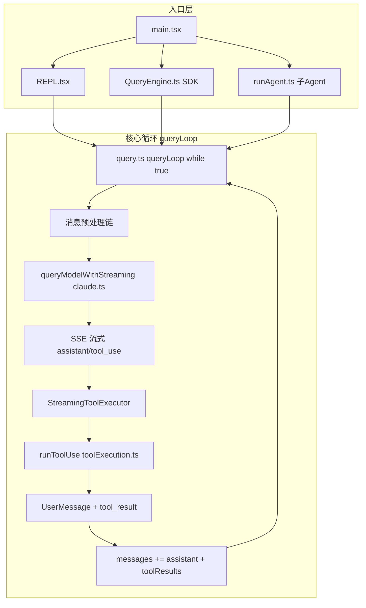
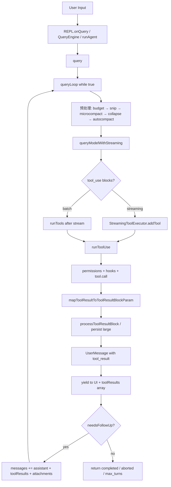

# Claude Code Agent 工具调用与读取机制深度分析

> 源码仓库：`/Users/banxia/app/opencode/claude-code-haha`（Claude Code 泄露源码的本地可运行修复版，Bun + Ink TUI）  
> 对照项目：Rivet / opencode-tui  
> 分析日期：2026-06-17  
> 方法：三路并行子代理探索 + 核心文件精读（queryLoop、StreamingToolExecutor、toolResultStorage、microCompact、Rivet PromptEngine T7）

---

## 目录

1. [仓库定位与架构总览](#1-仓库定位与架构总览)
2. [Agent Loop 每轮迭代](#2-agent-loop-每轮迭代)
3. [工具调用分发与执行链](#3-工具调用分发与执行链)
4. [Tool Result 回灌与读取机制](#4-tool-result-回灌与读取机制)
5. [上下文压缩与 Cache 策略](#5-上下文压缩与-cache-策略)
6. [子 Agent 委派机制](#6-子-agent-委派机制)
7. [与 Rivet/opencode-tui 对照](#7-与-rivetopencode-tui-对照)
8. [关键文件索引](#8-关键文件索引)
9. [后续阅读路径](#9-后续阅读路径)

---

## 1. 仓库定位与架构总览

`claude-code-haha` 基于 Claude Code 官方泄露源码修复，使完整 Ink TUI 可在本地运行，并支持接入任意 Anthropic 兼容 API。README 自带 8 张架构图（`docs/01-overall-architecture.png` 等），核心源码在 `src/` 下约 60+ 工具定义。

### 1.1 整体运行架构



### 1.2 单一循环原语

无论是主 REPL、SDK headless 还是子 Agent，最终都走同一个 `query()` / `queryLoop()`（`src/query.ts` L219–268）。子 Agent 不单独实现 loop，而是 `runAgent()` 递归调用 `query()`。

| 入口 | 文件 | 角色 |
|------|------|------|
| CLI | `src/main.tsx` | 解析参数、`init()`、启动 REPL 或 print/SDK |
| TUI | `src/screens/REPL.tsx` | `onQuery()` → `for await (query(...))` 消费事件 |
| SDK | `src/QueryEngine.ts` | `submitMessage()` → `query()` |
| 子 Agent | `src/tools/AgentTool/runAgent.ts` | 建隔离 context → `query()` |

---

## 2. Agent Loop 每轮迭代

`queryLoop()` 是 `while (true)` 多轮循环，每轮 = **模型调用 → 工具执行 → 消息追加 → 继续或结束**。

### 2.1 每轮 API 前的消息预处理链

对 `getMessagesAfterCompactBoundary(messages)` 切片后的历史，依次执行：

| 步骤 | 文件 | 作用 |
|------|------|------|
| Tool result budget | `src/utils/toolResultStorage.ts` | 单 turn 聚合超 200K 字符 → 落盘 preview |
| Snip compact | `snipCompact.js` | 可选 feature，释放 token 供 autocompact 阈值计算 |
| Microcompact | `src/services/compact/microCompact.ts` | 旧 tool_result 压缩（优先 server-side cache_edits） |
| Context collapse | `services/contextCollapse/` | 读时投影，归档旧探索上下文 |
| Autocompact | `src/services/compact/compact.ts` | 超阈值 LLM 摘要整段对话 |
| prependUserContext | `src/utils/api.ts` | 头部注入 `<system-reminder>` 动态上下文 |

Context collapse 在 autocompact **之前**运行：若 collapse 已把上下文压到阈值以下，autocompact 成为 no-op，保留细粒度历史而非单一摘要。

### 2.2 流式 API 与 tool_use 捕获（query.ts L658–862）

`queryModelWithStreaming()`（`src/services/api/claude.ts`）消费 SSE，逐 chunk yield `StreamEvent` 和完整 `AssistantMessage`。

**Streaming fallback 保护**（L712–740）：流式失败回退非流式时，tombstone 已 yield 的 assistant 碎片、清空 `toolResults`/`toolUseBlocks`，并 `streamingToolExecutor.discard()`，防止 orphan tool_result 泄漏。

**Prompt cache 保护**（L742–746）：yield 给 UI 时可 clone 并 backfill tool input，但**原始 message 不 mutate**——改原始 message 会导致 API 回传时 byte mismatch，破坏 prefix cache。

**tool_use 即时调度**（L826–844）：每个 assistant 消息中的 `tool_use` block 被 push 到 `toolUseBlocks[]`，同时 `streamingToolExecutor.addTool()` **在流尚未结束时就启动执行**。

**边流边 yield 结果**（L847–861）：`getCompletedResults()` 非阻塞 yield 已完成的 tool_result，并同步 push 到 `toolResults`（经 `normalizeMessagesForAPI` 过滤为 user 消息）。

### 2.3 流结束后的 drain 与回灌（query.ts L1380–1727）

```typescript
const toolUpdates = streamingToolExecutor
  ? streamingToolExecutor.getRemainingResults()  // 默认路径
  : runTools(...)                                 // fallback 批处理

for await (const update of toolUpdates) {
  yield update.message
  toolResults.push(...normalizeMessagesForAPI([update.message], tools).filter(m => m.type === 'user'))
}
```

工具全部完成后，才注入 attachment（文件变更、队列命令、memory prefetch、skill prefetch）——**API 不允许 tool_result 与普通 user 消息交错**。

最终递归：

```typescript
state = {
  messages: [...messagesForQuery, ...assistantMessages, ...toolResults],
  ...
}
```

标准 Anthropic 多轮格式：`assistant(tool_use)` → `user(tool_result)` → 再次 `callModel()`。

---

## 3. 工具调用分发与执行链

### 3.1 Tool 接口（`src/Tool.ts`）

每个工具通过 `buildTool()` 定义，关键方法：

| 方法/属性 | 作用 |
|-----------|------|
| `call(input, context, canUseTool, assistantMessage, onProgress)` | 实际执行 |
| `mapToolResultToToolResultBlockParam(output, toolUseId)` | 转为 API `tool_result` block |
| `isConcurrencySafe()` / `isReadOnly()` | 调度策略 |
| `interruptBehavior()` | 中断时 cancel 还是 block |
| `maxResultSizeChars` | 单工具持久化阈值 |
| `inputSchema` (Zod) | 入参校验 |

工具注册：`src/tools.ts` 的 `getTools()` 聚合 Bash、Read、Edit、Agent、MCP 等。

### 3.2 StreamingToolExecutor 并发调度

文件：`src/services/tools/StreamingToolExecutor.ts`

| 类型 | 行为 |
|------|------|
| `isConcurrencySafe() === true`（Read、Grep、Glob 等） | 可与其他 safe 工具并行 |
| 非 safe（Write、Edit 等） | 独占，队列中后续非 safe 工具等待 |
| 结果顺序 | 按 **收到顺序** 缓冲 yield，非完成顺序 |

`isConcurrencySafe` 在 `addTool` 时用 Zod 解析 input 后调用，解析失败则视为非 safe。

**Bash sibling abort**（L356–363）：**仅 Bash 出错**触发 `hasErrored = true` 并 `siblingAbortController.abort('sibling_error')`。Read/WebFetch 等独立工具失败不影响兄弟。被 abort 的兄弟收到 synthetic error：`Cancelled: parallel tool call Bash(...) errored`。

**三级 AbortController 链**：

```
toolUseContext.abortController（query 级）
  └── siblingAbortController（Bash 错误级联）
        └── toolAbortController（单工具，Bash 子进程监听）
```

**中断语义**：
- `interrupt`（用户输入新消息）：仅 `interruptBehavior() === 'cancel'` 的工具被取消
- `user_interrupted`（ESC 拒绝）：REJECT_MESSAGE
- `streaming_fallback`：discard 后 synthetic error

**Streaming fallback discard**：`discard()` 后 queued 工具不启动，in-progress 工具收到 synthetic error，防止 orphan tool_result。

### 3.3 批处理 fallback（`toolOrchestration.ts`）

当 `streamingToolExecution` feature gate 关闭时：

- `partitionToolCalls()` 分批：只读工具并发（`runToolsConcurrently`，上限 `CLAUDE_CODE_MAX_TOOL_USE_CONCURRENCY`，默认 10），写操作串行（`runToolsSerially`）

### 3.4 单工具执行管线（`toolExecution.ts`）

```
runToolUse()
  → Zod inputSchema 校验
  → tool.validateInput?()
  → runPreToolUseHooks
  → canUseTool() 权限决策（弹窗 / yolo classifier / swarm mailbox）
  → tool.call()
  → mapToolResultToToolResultBlockParam()
  → processToolResultBlock()（大结果落盘）
  → runPostToolUseHooks
  → yield UserMessage { content: [{ type: 'tool_result', ... }] }
```

权限入口：`src/hooks/useCanUseTool.tsx` + `src/utils/permissions/permissions.ts`。

---

## 4. Tool Result 回灌与读取机制

### 4.1 双层数据结构

`createUserMessage()`（`src/utils/messages.ts`）生成每条工具结果消息时：

| 字段 | 用途 |
|------|------|
| `message.content[].tool_result` | **发给模型的 API 内容** |
| `toolUseResult` | **原始工具输出**，供 UI/转录/分析，**不直接进 API** |

### 4.2 大结果持久化（`toolResultStorage.ts`）

#### 单工具阈值（`maybePersistLargeToolResult`）

| 参数 | 值 |
|------|-----|
| 默认阈值 | `min(tool.maxResultSizeChars, 50_000)` |
| Read | `maxResultSizeChars: Infinity` → **永不落盘** |
| Grep | 20_000 chars |
| 落盘路径 | `~/.claude/.../tool-results/{tool_use_id}.txt` |
| Preview | 前 2000 字节 + `<persisted-output>` 包裹 |
| 空结果 | 注入 `(toolName completed with no output)` 防模型误停 |
| 图片 block | 跳过持久化，原样发送 |

`writeFile(..., { flag: 'wx' })` 保证同一 tool_use_id 只写一次——microcompact 重放时不重复写盘。

GrowthBook `tengu_satin_quoll` 可 per-tool 覆盖阈值；Read 的 Infinity 在 override 之前检查，不可被强制落盘。

#### 单消息聚合预算（`enforceToolResultBudget`）

- 限制：单 API 级 user 消息内所有 tool_result 合计 ≤ 200K chars（GrowthBook `tengu_hawthorn_window` 可覆盖）
- 策略：选最大的 **fresh** 结果落盘；frozen 结果不可再改
- Read 通过 `skipToolNames` 跳过（`maxResultSizeChars: Infinity` 的工具名集合）
- 分组逻辑与 `normalizeMessagesForAPI` 对齐：连续 user 消息合并为一条 wire 消息，budget 按合并后的组评估

#### ContentReplacementState 冻结机制

```typescript
type ContentReplacementState = {
  seenIds: Set<string>        // 已见过的 tool_use_id，命运冻结
  replacements: Map<string, string>  // 已替换的 exact preview 字符串
}
```

三种分区：

| 分区 | 含义 |
|------|------|
| mustReapply | 已替换 → 每轮 Map lookup 重放相同 preview（零 I/O，byte-identical） |
| frozen | 已见过但未替换 → 永不再替换（改 prefix 会破坏 cache） |
| fresh | 首次出现 → 可决策是否替换 |

Resume 时从 transcript 的 `ContentReplacementRecord` 重建，保证跨 session 决策一致。子 agent fork 可从 parent `replacements` gap-fill。

**设计核心**：同一 tool_use_id 的模型可见内容一旦确定就**永远不变**，这是 Anthropic prompt cache 稳定性的基础。

### 4.3 Read 工具（`FileReadTool.ts`）

- `maxResultSizeChars: Infinity` — 永不落盘（避免 Read→文件→再 Read 循环）
- `isConcurrencySafe() → true` — 可并行读取
- 读取逻辑：`readFileInRange.ts` — offset/limit、256KB 文件上限、25K token 输出上限
- 输出格式：`addLineNumbers` 行号 + 可选 memory freshness 前缀
- 图片 → base64 image block；PDF → metadata + supplemental document block

### 4.4 Grep 工具（`GrepTool.ts`）

- `maxResultSizeChars: 20_000`
- 底层 ripgrep；默认 `head_limit=250`，`--max-columns 500`
- 三种 `output_mode`：content / files_with_matches / count

### 4.5 API 层最终规范化（`claude.ts`）

1. `normalizeMessagesForAPI()` — 过滤 progress/system、合并连续 user 消息、strip 无效 block
2. `ensureToolResultPairing()` — 修复 orphan tool_use/tool_result
3. `addCacheBreakpoints()` — prompt cache marker + cached microcompact cache_edits
4. `userMessageToMessageParam()` — 转 API MessageParam

### 4.6 UI 折叠 vs 模型上下文

`collapseReadSearch.ts` 把连续 Read/Grep 在终端收成 "Read N files / Searched for M patterns"。

**完整 tool_result 仍在消息历史里**，模型仍能看到。UI collapse **不影响** API 上下文。

---

## 5. 上下文压缩与 Cache 策略

### 5.1 Microcompact（`microCompact.ts`）

**可压缩工具**：Read、Bash、Grep、Glob、WebSearch、WebFetch、Edit、Write

**优先级**：

```
time-based MC（cache 冷） → cached MC（cache 热） → no-op（交给 autocompact）
```

#### Cached microcompact（`CACHED_MICROCOMPACT` feature）

**不修改本地 message content**。流程：

1. 注册 compactable tool 的 tool_use_id
2. 超 count 阈值 → 生成 `cache_edits: { type: 'delete', cache_reference: tool_use_id }[]`
3. API 层 `addCacheBreakpoints()`（`claude.ts` L3063+）：
   - 给旧 tool_result 加 `cache_reference: tool_use_id`
   - 在最后一条 user 消息插入 `cache_edits` block
   - pin 到 `cachedMCState.pinnedEdits`，后续请求重放
4. boundary message 延迟到 API 响应后，用实际 `cache_deleted_input_tokens` 而非客户端估算

仅 main thread 运行（`querySource.startsWith('repl_main_thread')`），防 fork agent 污染全局 state。

Legacy 本地 content-clear 路径已移除。非 ant/不支持 cache editing 时 microcompact 为 no-op。

#### Time-based microcompact

距最后 assistant 消息超过 gap 阈值（cache 已冷）→ **直接 mutate content** 为 `[Old tool result content cleared]`，保留最近 N 个 compactable 结果。

会 reset cached MC state（server cache 已失效，cache_edits 无意义）。

### 5.2 Prompt cache breakpoint

`addCacheBreakpoints()` 每请求仅一个 `cache_control` marker（最后一条 message，或 fork 场景倒数第二条 `skipCacheWrite`）。Mycro KV 页管理要求单 marker，双 marker 会导致无效 prefix 页多存活一轮。

---

## 6. 子 Agent 委派机制


| 概念 | 文件 | 说明 |
|------|------|------|
| Agent 工具 | `src/tools/AgentTool/AgentTool.tsx` | wire 名 `Agent`，旧名 `Task` |
| 子 loop | `src/tools/AgentTool/runAgent.ts` | 建隔离 context → 递归 `query()` |
| 上下文隔离 | `src/utils/forkedAgent.ts` | 独立 agentId、可选 fork 消息 |
| 工具池限制 | `src/constants/tools.ts` | 子 agent 默认禁用嵌套 Agent |
| 异步通知 | `src/utils/queueProcessor.ts` | 后台 agent 通过 `<task-notification>` 注入 |

**AgentTool.call() 三条路径**：
1. `team_name` + `name` → `spawnTeammate()`（Agent Teams / swarm）
2. 无 `subagent_type` + fork 实验 → `FORK_AGENT` + `buildForkedMessages()`
3. 有 `subagent_type` → 从 `agentDefinitions` 选内置/自定义 agent

**注意**：`TaskCreateTool` / `TaskUpdateTool` 是 **Todo 看板系统**，与 Agent spawn 是两套独立机制。

**权限分层**：
- Agent spawn 审批：auto 模式需用户/classifier 批准；其他模式默认 allow
- 子 agent 运行时：应用 agent 定义的 `permissionMode`；async 无 UI 时 `shouldAvoidPermissionPrompts: true` 自动 deny ask

---

## 7. 与 Rivet/opencode-tui 对照

### 7.1 架构层对照

| 维度 | Claude Code | Rivet/opencode-tui |
|------|-------------|-------------------|
| 核心 loop | 单一 `queryLoop` | `AgentLoop` + `RuntimeHookPipeline` |
| 工具并行 | `StreamingToolExecutor` + `isConcurrencySafe` | 工具 dispatch 在 loop 内 |
| Hook 管道 | PreToolUse/PostToolUse hooks | preTurn/afterPerception/postTool/postTurn/postSession |
| 子 Agent | `runAgent()` 递归 `query()` | sub-agent coordinator |

### 7.2 上下文压缩对照

| 维度 | Claude Code | Rivet (PromptEngine T7) |
|------|-------------|-------------------------|
| 压缩时机 | 每轮 queryLoop 预处理 | 每次 `buildRequest()` 请求副本 |
| 是否改 session | cached MC **不改**本地 content | T7 **只改 request copy** |
| 旧 tool_result 策略 | server-side `cache_edits` delete | 语义摘要 `[collapsed grep: ...]` |
| 触发阈值 | count-based / 时间 gap | fillRatio：0–85% 轻量，>85% 完整 |
| watermark | autocompact boundary | `collapseWatermark` 每 50K token step 推进 |
| Read 特殊处理 | Infinity 阈值，永不落盘 | 参与 semantic collapse（turnAge≥2） |
| reasoning 处理 | 无等价机制 | boundary 以下 strip `reasoning_content` |
| dedup | 无 request-time dedup | 同 tool+target 旧结果 fold 为 superseded |
| 持久化 | 大结果落盘 + preview | 无磁盘持久化，直接摘要/截断 |
| prefix cache | cache_reference + cache_edits + content replacement 冻结 | watermark 保 byte-stable + 延迟 full pass 到 85% |

### 7.3 Rivet T7 机制摘要（`src/prompt/engine.ts`）

```typescript
const FULL_COLLAPSE_FILL_RATIO = 0.85

// 轻量 pass (0–85%): strip reasoning + dedup fold
// 完整 pass (>85%): semantic collapse via collapseToolResult()
requestTimeCollapse(result, watermark, contextWindow, fillRatio < FULL_COLLAPSE_FILL_RATIO)
```

`FULL_COLLAPSE_FILL_RATIO = 0.85` 是为 DeepSeek exact-prefix cache 做的权衡：0.5 触发时真实 prompt 可能只有 ~27%，却付出整段 prefix 重建的 cache miss 成本（观测：240K tokens 单次请求约 0.71 元）。

Rivet 语义压缩（`src/compact/context-collapse.ts`）示例：
- grep 2000 字符 → `[collapsed grep: 14 matches in 8 files: ...]`（~50 字符）
- read_file → `[collapsed read_file: 500 lines, classes: Foo, functions: bar, ...]`

Claude Code time-based MC 则用 `[Old tool result content cleared]`，信号保留更少，但不改本地 history（cached 路径）或仅在 cache 冷时改。

### 7.4 可借鉴的设计差异

1. **Claude Code cached MC**：API 层 delete 旧 tool_result，本地 history byte-stable——Rivet 无 server-side cache_edits，靠 request copy + watermark 近似
2. **ContentReplacementState 冻结**：比 Rivet watermark 更细粒度（per tool_use_id 而非 per message index）
3. **Rivet semantic collapse**：比 Claude Code time-based MC 的 `[cleared]` 保留更多信号
4. **Rivet reasoning strip**：DeepSeek 特有优化（tool-call turn 需 echo reasoning_content）
5. **Claude Code Read 策略**：token 自限 + 永不落盘，避免 Read→persisted file→Read 循环

### 7.5 Claude Code 核心 insight

优先用 **server-side cache_edits** 压缩旧 tool_result，避免 rewrite 本地 message history 破坏 prefix cache；Read 工具通过 **token 自限** 而非 **磁盘持久化** 控制体积；ContentReplacementState 保证同一 tool_use_id 的模型可见字节跨 turn 不变。

---

## 8. 关键文件索引

### Claude Code（claude-code-haha）

| 主题 | 路径 |
|------|------|
| Agent 主循环 | `src/query.ts` |
| 流式工具执行 | `src/services/tools/StreamingToolExecutor.ts` |
| 单工具执行 | `src/services/tools/toolExecution.ts` |
| 批处理 fallback | `src/services/tools/toolOrchestration.ts` |
| Tool 接口 | `src/Tool.ts` |
| 工具注册 | `src/tools.ts` |
| 结果持久化/冻结 | `src/utils/toolResultStorage.ts` |
| 消息规范化 | `src/utils/messages.ts` |
| API + cache | `src/services/api/claude.ts` |
| Microcompact | `src/services/compact/microCompact.ts` |
| Read 工具 | `src/tools/FileReadTool/FileReadTool.ts` |
| Grep 工具 | `src/tools/GrepTool/GrepTool.ts` |
| UI 折叠 | `src/utils/collapseReadSearch.ts` |
| 子 Agent | `src/tools/AgentTool/runAgent.ts` |
| 权限 | `src/hooks/useCanUseTool.tsx` |
| 阈值常量 | `src/constants/toolLimits.ts` |
| 架构图 | `docs/01-overall-architecture.png` 等 8 张 |

### Rivet（opencode-tui）

| 主题 | 路径 |
|------|------|
| T7 request-time collapse | `src/prompt/engine.ts` |
| 语义压缩 | `src/compact/context-collapse.ts` |
| Micro compact（session 级） | `src/compact/micro.ts` |
| T7 阈值测试 | `src/prompt/__tests__/full-collapse-threshold.test.ts` |

---

## 9. 后续阅读路径

按优先级深入：

1. `claude-code-haha/src/query.ts` L658–862（流式 tool_use）+ L1384–1716（toolResults 回灌）
2. `claude-code-haha/src/services/tools/StreamingToolExecutor.ts` — 并发调度完整逻辑
3. `claude-code-haha/src/utils/toolResultStorage.ts` — 持久化 + 冻结策略
4. `claude-code-haha/src/services/compact/microCompact.ts` — cache_edits 路径
5. `claude-code-haha/src/services/api/claude.ts` L3063+ — `addCacheBreakpoints` 实现
6. `claude-code-haha/src/tools/FileReadTool/FileReadTool.ts` — Read 完整实现
7. `opencode-tui/src/prompt/engine.ts` L488–540 — T7 与 FULL_COLLAPSE_FILL_RATIO

---

## 附录：数据流总览



---

*本文档由 plan「Claude Code Agent机制」及五路精读任务产出，供 Rivet 对标 Claude Code 工具调用与上下文管理时使用。*
