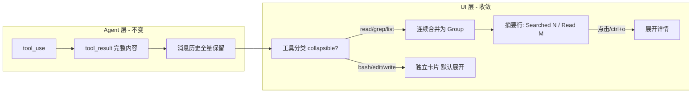
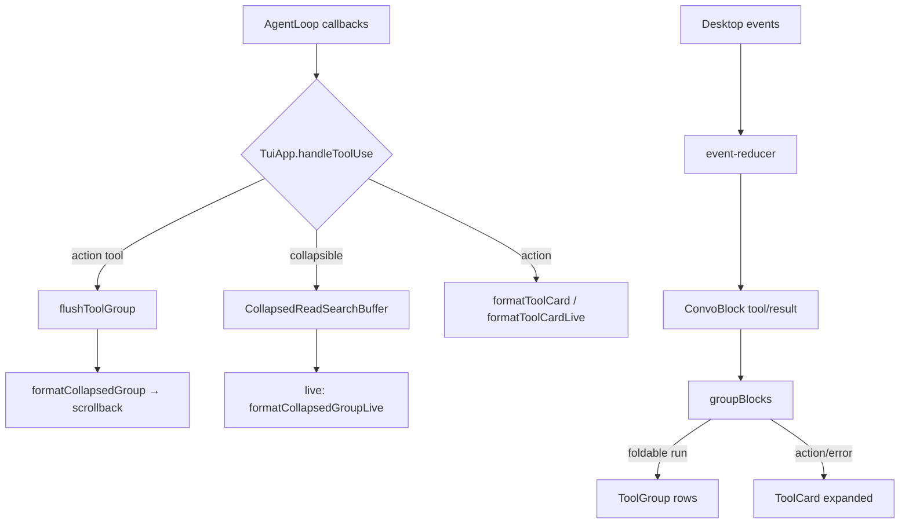

# Cursor 3.0 工具/命令 UI 自动收敛机制解析

> 对照项目：Rivet / opencode-tui、Claude Code（claude-code-haha）  
> 分析日期：2026-06-17  
> 关联文档：[Claude Code Agent 工具调用与读取机制](./2026-06-17-claude-code-agent-tool-mechanism-analysis.md)

---

## 目录

1. [核心结论](#1-核心结论)
2. [Cursor 3.0 产品层机制](#2-cursor-30-产品层机制)
3. [Claude Code 开源对照实现](#3-claude-code-开源对照实现)
4. [Rivet 已有实现与差距](#4-rivet-已有实现与差距)
5. [四层设计模式（可复现 Cursor 行为）](#5-四层设计模式可复现-cursor-行为)
6. [推荐落地路径](#6-推荐落地路径)
7. [与上下文压缩的边界](#7-与上下文压缩的边界)
8. [关键文件索引](#8-关键文件索引)

---

## 1. 核心结论

Cursor 截图里常见的 **「Explored 7 files, 4 searches」**、**「5 of 5 To-dos Completed」**、**「Thought briefly」** 等，**不是**把历史从模型上下文删掉，而是 **UI 渲染层的分组 + 默认折叠 + 摘要文案**。

完整 tool 结果仍在 transcript / 消息历史里；聊天窗口默认只显示一行摘要，用户点击才展开详情。

这与 Claude Code 的 `collapseReadSearch.ts` 设计一致——**UI collapse 不影响 API 上下文**（模型仍能看到完整 tool_result）。



**一句话**：Cursor 的「自动收敛」= **展示层压缩**，不是 **上下文层压缩**。

---

## 2. Cursor 3.0 产品层机制

Cursor 闭源，无法直接读其 React 组件源码。以下根据 [Cursor 3.4 Changelog](https://cursor.com/changelog/3-4)、[1.4 Changelog](https://cursor.com/changelog/1-4) 及社区设置说明归纳 **可观察的 UX 契约**。

### 2.1 用户可调密度设置

| 设置/模式 | 位置 | 效果 |
|-----------|------|------|
| **Tool call density** | Agents 窗口设置 | Compact / Balanced / Detailed 三档，控制每条回复展示多少工具步骤 |
| **Compact chat mode** | Settings（1.4+） | 隐藏工具图标、diff 默认折叠、空闲时收起输入框 |
| **Collapse Auto-Run Commands** | Settings > Agents > Inline Editing & Terminal | 终端/auto-run 命令默认折叠为一行；关闭后显示完整输入输出 |
| **Todo 折叠** | Plan 模式 UI | 任务列表收成 `> N of M To-dos Completed`，chevron 展开详情 |
| **Thought/Reasoning 折叠** | 消息流 | 推理收成 `Thought briefly` / `Thought for 1s`，点击展开 |

#### Tool call density 三档语义

| 档位 | 行为 |
|------|------|
| **Compact** | 最少工具痕迹，以摘要行为主 |
| **Balanced** | 保留重要中间步骤 |
| **Detailed** | 近完整逐步上下文 |

### 2.2 截图行为的组合解释

用户截图中的界面 = 以下机制叠加：

1. **Compact density** — 工具步骤默认不逐条展开
2. **探索型工具组摘要** — 连续 Read/Grep 合并为 `Explored N files, M searches`
3. **Todo 折叠** — Plan 任务列表单行摘要
4. **短 thought 行** — 推理过程不占大段垂直空间
5. **虚拟滚动** — 长会话只渲染视口内 DOM

### 2.3 可观察的 UX 契约（复现目标）

| 工具类型 | UI 行为 |
|----------|---------|
| 探索工具（Read/Grep/List/Search） | 连续调用 **合并为组级单行摘要** |
| 动作工具（Bash/Edit/Write/Terminal） | **打断分组**，单独展示（可配置是否折叠） |
| 进行中（live） | 只显示 **当前组摘要 + 最后一项进度**，不刷满屏卡片 |
| 完成后（scrollback） | 默认 **折叠**；chevron 点击展开 |
| 长会话 | 虚拟滚动，DOM 规模 O(viewport) |

---

## 3. Claude Code 开源对照实现

Claude Code（`claude-code-haha`）是与 Cursor 同类 Agent TUI 的最佳开源对照。

### 3.1 三步流水线

**Step 1 — 分类**（`isSearchOrReadCommand`，`collapseReadSearch.ts`）

| 类别 | 工具示例 |
|------|----------|
| 可折叠 | Read、Grep、Glob、List、部分 Bash 搜索、MCP 查询 |
| 不可折叠 / 打断组 | Write、Edit、普通 Bash、Agent spawn |

**Step 2 — 分组**（消息流 transform）

- 连续 collapsible 的 tool_use + tool_result → `CollapsedReadSearchGroup`
- 遇到 action tool → **flush 当前组**，action 单独渲染
- 组内消息仍保留在 transcript，UI 渲染时替换为一个 group widget

**Step 3 — 摘要文案**（`collapseReadSearch.ts` L1022–1056）

```
Searched for 4 patterns, Read 7 files · 1.2s
```

- read/search/list/memory/repl 分别计数
- 进行中：现在进行时（Reading…）
- 完成后：过去式（Read）

**Step 4 — 展开策略**

| 条件 | 行为 |
|------|------|
| ≤3 条 | 每条显示路径 + 最多 3 行 preview |
| >3 条 | 紧凑路径串 + `ctrl+o to expand` |
| verbose 模式 | 组内每条 tool 完整展示 |
| 防闪烁 | `useMinDisplayTime(700ms)` 保证快速 read 可读 |

渲染组件：`CollapsedReadSearchContent.tsx`（Ink widget）。

### 3.2 与模型上下文的关系

| 层 | Claude Code 模块 | 是否改模型可见内容 |
|----|-----------------|-------------------|
| UI 折叠 | `collapseReadSearch.ts` | **否** |
| 请求层压缩 | cached microcompact / cache_edits | 是（API 层） |
| Session 压缩 | autocompact | 是（LLM 摘要） |

---

## 4. Rivet 已有实现与差距

Rivet 已在 TUI 和 Desktop 各有一套工具展示压缩逻辑，核心策略与 Cursor/Claude Code 一致：**探索型 read/search 折叠成组，动作型工具单独展开**。

### 4.1 TUI 引擎（最接近 Cursor「Explored N files」）

| 文件 | 职责 |
|------|------|
| `src/tui/format/collapsed-read-search.ts` | 分类、`CollapsedReadSearchBuffer`、摘要渲染 |
| `src/tui/engine/tool-group-controller.ts` | pending/flush/ctrl+o 状态 |
| `src/tui/engine/app.ts` | onToolUse/onToolResult 接线 |
| `src/tui/format/tool-card.ts` | 非折叠工具 CC 风格 `● Verb(arg)` 卡片 |

**TUI 摘要示例**：`● Searched 2 patterns, Read 3 files · 1.2s`

**Live 区**：`formatCollapsedGroupLive` 把多路 read/grep 聚合成 **1 行摘要 + 最近 entry 末 2 行**。

**Flush 时机**：动作工具打断、turn 结束、abort。

**Scrollback 展开**：`ctrl+o` 把最近一组以 `expanded: true` **追加**到 scrollback（非原地 toggle）。

### 4.2 Desktop（Cursor 3.0 风格边框组）

| 文件 | 职责 |
|------|------|
| `desktop/src/components/ToolGroup.tsx` | 注释写明 Cursor 3.0-style；status dot + chevron + preview |
| `desktop/src/surfaces/ThreadView.tsx` | `groupBlocks()` 合并连续 collapsible block |
| `desktop/src/surfaces/ThreadView.tsx` | reasoning 流式自动折叠（T1） |

**Reasoning 折叠**（ThreadView T1）：流式默认展开，完成后自动收束为一行 peek + chevron。

**虚拟滚动**：`@tanstack/react-virtual`，长会话 DOM O(viewport)。

### 4.3 其它屏幕空间控制

| 机制 | 文件 | 作用 |
|------|------|------|
| Live tail cap | `src/tui/live-tail-cap.ts` | 流式 assistant 回复按终端行预算截尾 |
| Tool accumulator | `src/tui/engine/tool-accumulator.ts` | 流式工具输出 64KB 尾部保留 |
| Turn summary | `formatTurnSummary` | 回合级「读 N 改 M」摘要（非工具组） |

### 4.4 与 Cursor 截图的差距

| Cursor 行为 | Rivet 现状 | 优先级 |
|-------------|-----------|--------|
| 组级单行 `Explored 7 files, 4 searches` | TUI 有；**Desktop 缺组级摘要头** | P0 |
| tool+result 合并为一行 `Read foo.ts ✓` | Desktop 仍 **tool / ↳ result 两行** | P1 |
| 点击同一 widget toggle 展开 | TUI ctrl+o **追加**展开副本 | P3 |
| Compact/Balanced/Detailed 密度设置 | `/verbose` 在 T9 引擎 **未接线** | P2 |
| Todo 折叠 | Plan 模式有，工具流无统一 widget | — |
| Terminal 命令折叠 | 无 `Collapse Auto-Run Commands` 等价设置 | P4 |
| Explored files 侧边栏/chips | 未实现 | — |
| web_fetch / recall 等 | 不在 collapsible 集合，探索期占满卡片 | — |

### 4.5 数据流简图



---

## 5. 四层设计模式（可复现 Cursor 行为）

不依赖 Cursor 闭源代码，用以下四层即可复现截图效果。

### 模式 A：工具分类器（Classifier）

```typescript
type ToolDisplayClass = 'explore' | 'action' | 'meta'

function classifyTool(name: string): ToolDisplayClass {
  // explore: read_file, grep, glob, semantic_search, ls, ...
  // action: bash, edit_file, write_file, delegate, ...
}
```

Rivet 已有：`isCollapsibleTool()`（`collapsed-read-search.ts`）。Desktop/TUI 各一份，需保持同步。

### 模式 B：流式分组器（Grouper）

状态机：

```
idle → collecting(explore tools) → flush on action tool / turn end / abort
```

| 事件 | 行为 |
|------|------|
| `onToolUse(explore)` | push to buffer，**不立即 commit scrollback** |
| `onToolResult(explore)` | attach to buffer entry by tool_use_id |
| `onToolUse(action)` | **flush group** → render summary → render action card |

Rivet 已有：`ToolGroupController` + `CollapsedReadSearchBuffer`。

### 模式 C：摘要生成器（Summarizer）

从 buffer entries 统计：

```
explore.read   → "Read N files"
explore.search → "Searched M patterns"
explore.list   → "Listed K directories"
→ 合并: "Explored: Read 7 files, 4 searches"（Cursor 文案风格）
```

参考：Claude Code `collapseReadSearch.ts` L1022+。  
Rivet TUI 已有 `buildSummaryText`；Desktop 需复用为 `ToolGroup` 头部。

### 模式 D：渲染策略（Renderer + Density）

| 密度 | 行为 |
|------|------|
| **compact** | 仅组摘要行；action 工具一行标题；reasoning 一行 peek |
| **balanced** | 摘要 + ≤3 条路径 preview |
| **detailed** | verbose：组内每条 tool 完整输出 |

**Live 区与 scrollback 区用不同 formatter**：

| 区域 | 策略 |
|------|------|
| Live | 永远 1 行摘要（防刷屏） |
| Scrollback | 完成后写入折叠 widget（可点击展开） |

Rivet 已有：`formatCollapsedGroup` vs `formatCollapsedGroupLive`。

---

## 6. 推荐落地路径

按投入/收益排序。

### P0 — Desktop 组级摘要头（1–2 天）

在 `desktop/src/components/ToolGroup.tsx` 增加组级摘要按钮：

```tsx
<div className="tool-group">
  <button className="tool-group-summary" onClick={toggleAll}>
    Explored {readCount} files, {searchCount} searches · {duration}
  </button>
  {open && items.map(...)}
</div>
```

摘要逻辑抽取共享模块：`src/tui/format/tool-group-summary.ts`（从 `buildSummaryText` 提取），TUI/Desktop 共用。

### P1 — 合并 tool+result 为单行（Desktop）

在 reducer 或 `groupBlocks` 层把配对的 tool_use + tool_result 合成一个 `ConvoBlock`：

```
read_file  src/foo.ts  ✓  (142 lines)
```

替代当前 `read_file` + `↳ read_file` 两行。

### P2 — 密度设置 + `/verbose` 接线

- config: `toolDisplayDensity: 'compact' | 'balanced' | 'detailed'`
- T9 `formatToolCard` / `formatCollapsedGroup` 读该配置
- 对齐 Cursor Settings > Agents > tool density

### P3 — 可交互折叠 widget（TUI）

当前 TUI scrollback 写死 ANSI 字符串，ctrl+o 追加展开副本。若要 Cursor 式 toggle：

- **方案 A**：scrollback 存结构化 `ToolGroupRecord`，渲染 pass 决定 expanded 状态
- **方案 B**：overlay pager 按组展开（扩展 `src/tui/format/overlay.ts`）

### P4 — Bash/Terminal 折叠开关

对标 Cursor `Collapse Auto-Run Commands`：

- bash 工具卡片 compact 模式：1 行标题 + ctrl+o
- 设置项：`collapseAutoRunCommands: boolean`

---

## 7. 与上下文压缩的边界

三层机制 **正交**，不可混淆：

| 层 | 目的 | Rivet 模块 | Claude Code 模块 | 是否改模型上下文 |
|----|------|-----------|-----------------|----------------|
| **UI 收敛** | 少占窗口 | `collapsed-read-search`, `ToolGroup` | `collapseReadSearch` | **否** |
| **请求副本压缩** | 少发 token、保 cache | PromptEngine T7 | cached microcompact | 是（request copy / cache_edits） |
| **Session 压缩** | 防 overflow | `microCompactOai`, autocompact | autocompact | 是（LLM 摘要） |

Cursor 截图主要是 **第一层**。  
Claude Code 分析文档（`2026-06-17-claude-code-agent-tool-mechanism-analysis.md`）重点在第二、三层。

**Rivet T7 `FULL_COLLAPSE_FILL_RATIO = 0.85`** 属于请求副本压缩，与 UI 收敛无关——T7 在 `buildRequest()` 时改 request copy，session messages 不动；UI 折叠在 TUI/Desktop 渲染 pass 发生。

---

## 8. 关键文件索引

### Cursor（产品文档）

| 资源 | 链接 |
|------|------|
| 3.4 Changelog — Compact chat / tool density | https://cursor.com/changelog/3-4 |
| 1.4 Changelog — Compact chat mode | https://cursor.com/changelog/1-4 |
| Forum — Collapse Auto-Run Commands | https://forum.cursor.com/t/condensed-vs-full-view-of-terminal-activity/155641 |

### Claude Code（claude-code-haha）

| 主题 | 路径 |
|------|------|
| 分类 + 摘要生成 | `src/utils/collapseReadSearch.ts` |
| Ink 折叠 widget | `src/components/messages/CollapsedReadSearchContent.tsx` |
| 消息流 transform | `src/utils/streamlinedTransform.ts` |
| 并行 tool group | `src/utils/groupToolUses.ts` |

### Rivet（opencode-tui）

| 主题 | 路径 |
|------|------|
| TUI 折叠核心 | `src/tui/format/collapsed-read-search.ts` |
| TUI 控制器 | `src/tui/engine/tool-group-controller.ts` |
| TUI 接线 | `src/tui/engine/app.ts` |
| TUI 动作卡片 | `src/tui/format/tool-card.ts` |
| Desktop 工具组 | `desktop/src/components/ToolGroup.tsx` |
| Desktop 分组 + reasoning | `desktop/src/surfaces/ThreadView.tsx` |
| 集成测试 | `src/tui/__tests__/app-tool-group.test.ts` |
| 单测 | `src/tui/__tests__/collapsed-read-search.test.ts` |
| 上下文压缩（非 UI） | `src/prompt/engine.ts`（T7） |
| 语义压缩（非 UI） | `src/compact/context-collapse.ts` |

### 关联研究文档

| 文档 | 路径 |
|------|------|
| Claude Code Agent 机制 | `docs/research/2026-06-17-claude-code-agent-tool-mechanism-analysis.md` |
| Claude Code 工作流对比 | `docs/research/2026-06-06-claude-code-workflow-comparison.md` |
| 三维对标 | `docs/天枢-vs-MiMoCode-vs-ClaudeCode-三维对标.md` |

---

*本文档说明 Cursor 3.0 Agent 窗口工具/命令 UI 收敛机制，并对照 Claude Code 开源实现与 Rivet 现状，供后续 Desktop/TUI 对齐 Cursor 交互时参考。*
