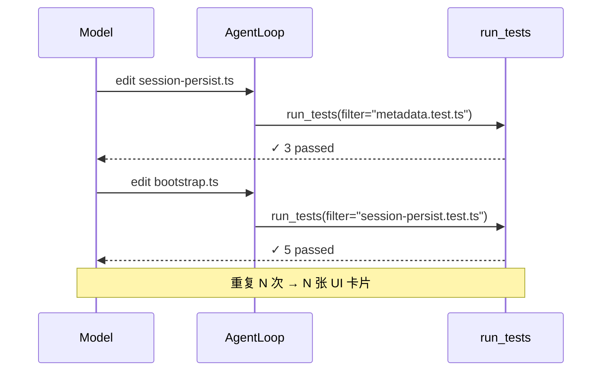

# run_tests 多次调用与 UI 收敛分析

> 对照项目：Rivet / opencode-tui、Cursor 3.0、Claude Code  
> 分析日期：2026-06-17  
> 关联文档：  
> - [Cursor 工具 UI 收敛机制](./2026-06-17-cursor-tool-ui-collapse-mechanism.md)  
> - [Claude Code Agent 工具调用与读取机制](./2026-06-17-claude-code-agent-tool-mechanism-analysis.md)

---

## 目录

1. [现象解读](#1-现象解读)
2. [根因一：Agent 为什么会反复调用 run_tests](#2-根因一agent-为什么会反复调用-run_tests)
3. [根因二：Rivet UI 为什么每张卡都占满屏](#3-根因二rivet-ui-为什么每张卡都占满屏)
4. [竞品怎么处理测试/命令输出](#4-竞品怎么处理测试命令输出)
5. [Rivet 与竞品差距](#5-rivet-与竞品差距)
6. [推荐改进方向](#6-推荐改进方向)
7. [关键文件索引](#7-关键文件索引)

---

## 1. 现象解读

界面里出现 **多个独立的 `run_tests` 灰色卡片**，每个卡片内往往只有一行类似：

```
✓ updateMetadata merges partial fields (1.305958ms)
✓ listSessionsWithMetadata returns sorted results (5.189708ms)
```

这是 **多次独立的 `run_tests` 工具调用**，不是一次测试里多个 case 被 UI 拆开展示。

成功时 `run_tests` 工具（`src/tools/run-tests.ts`）返回的是 `✓ N passed` 汇总行，不会按单个 case 拆成多张卡片。因此每张卡片对应 **Agent 在某一轮 turn 里单独发起的一次 run_tests**。

典型场景：Agent 采用 **「改一点 → 跑一个测试文件/范围 → 再改」** 的验证节奏，工具历史里就会堆叠多次 `run_tests`。

---

## 2. 根因一：Agent 为什么会反复调用 run_tests

### 2.1 工具设计鼓励「定向验证」

`run_tests` 支持 `filter` 参数，可跑单个 `.test.ts` 或 pytest 路径。工具描述中的示例：

```
Good: run_tests(filter="loop.test.ts") — run specific test file
```

模型在修某个模块（如 session-persist）时，会 **按文件/模块逐个验证**，而不是等到全部改完再 `run_tests()` 全量跑。

### 2.2 系统 prompt 明确 run_tests 必须串行

`src/prompt/static.ts`：

> bash/git/edit_file/write_file/hash_edit/**run_tests 是串行工具**，批起来引擎也只能逐个跑……这些一律单个发、逐个看结果再走下一步

模型 **不会** 在一轮里并行发 7 个 run_tests，而是 **7 轮 turn × 每轮 1 个 run_tests**——行为符合 prompt，但 UI 上就是 7 张卡。

### 2.3 交付门禁推动「有改动就要有验证证据」

`delivery-gate-v2.ts` 要求 modified files 有 verification metadata。Agent 倾向于 **每改一组文件就跑一次 targeted test**，而不是等到全部改完。

### 2.4 run_tests 不可并行

`run-tests.ts`：`isConcurrencySafe: () => false`——即使模型想并行，引擎也会串行执行。

### 2.5 典型调用链



---

## 3. 根因二：Rivet UI 为什么每张卡都占满屏

### 3.1 run_tests 被归类为「动作工具」，不参与折叠

`src/tui/format/collapsed-read-search.ts` 明确列出 **不可折叠**：

```
write_file, edit_file, bash, run_tests, delegate_*, team_*, todo, ...
```

Desktop `ThreadView.isFoldable` 只对 read/search/list 探索工具折叠；**run_tests 走独立 ToolCard，且默认展开**（`desktop/src/components/ToolGroup.tsx`）。

### 3.2 探索 vs 动作：UI 待遇完全不同

| 工具 | 连续 7 次调用 UI |
|------|-----------------|
| read_file / grep | 收成 **1 行**：`Searched 2 patterns, Read 7 files` |
| run_tests / bash | **7 张独立卡片**，每张默认展开 |

`src/tui/tool-family.ts` 里的 `getGroupSummary()` 已能生成 `7 tool calls: run_tests x7`，但 **生产 UI 未接入**。

### 3.3 与 UI 收敛文档的关系

Read/Grep 的折叠机制见 [Cursor 工具 UI 收敛机制](./2026-06-17-cursor-tool-ui-collapse-mechanism.md)。  
**run_tests 落在「动作工具」分支**，当前不在折叠集合内——这是截图刷屏的直接 UI 原因。

---

## 4. 竞品怎么处理测试/命令输出

### 4.1 Cursor 3.0

| 机制 | 行为 |
|------|------|
| **Collapse Auto-Run Commands** | Settings > Agents：终端/auto-run 命令 **默认折叠成一行**，点开看完整输出 |
| **Tool call density: Compact** | 工具步骤以 **最少痕迹** 展示 |
| **Compact chat mode** | 长会话隐藏工具图标、diff 默认折叠 |

测试在 Cursor 里通常走 **Bash/Terminal 工具**，受「Collapse Auto-Run Commands」约束——**成功运行的命令默认不占大段垂直空间**。

参考：[Cursor Forum — Collapse Auto-Run Commands](https://forum.cursor.com/t/condensed-vs-full-view-of-terminal-activity/155641)

### 4.2 Claude Code

Claude Code **没有独立的 run_tests 工具**，验证一般走 **Bash**（`npm test` / `pytest`）。

| 机制 | 对测试/命令的处理 |
|------|------------------|
| **collapseReadSearch** | Read/Grep 折叠；**非 search 的 Bash 在 fullscreen 模式下可收入组**，摘要 `Ran N bash commands` |
| **groupToolUses** | 同一 API 响应里 **并行、同类型** 且工具声明了 `renderGroupedToolUse` 的可合并渲染 |
| **verbose 模式** | 关闭分组，逐条展示 |
| **UI ≠ 上下文** | 折叠只影响终端，模型仍看到完整 tool_result |

Claude Code 策略：**探索只读工具大力折叠；动作类（含 test bash）要么收成「Ran N commands」，要么默认单行 + 展开**。

### 4.3 共同原则

1. **探索**（read/grep）→ 组级摘要，默认折叠  
2. **验证/执行**（test/bash）→ 默认 **紧凑一行**（命令 + 结果摘要），失败才展开  
3. **成功路径占最少行数**；细节按需展开  
4. **Agent 层**仍可在上下文里保留完整输出；UI 层单独压缩  

---

## 5. Rivet 与竞品差距

| 维度 | Cursor | Claude Code | Rivet 现状 |
|------|--------|-------------|-----------|
| 连续测试调用 UI | 折叠/一行 | Bash → `Ran N commands` | 每张 ToolCard 独立展开 |
| 成功测试默认态 | 紧凑 | 紧凑 | 展开 + 多行 body |
| 探索 vs 验证分类 | 有 | 有 | 只折叠 explore，**run 族未分组** |
| Prompt 引导 | — | — | 鼓励 filter 定向跑 → 更易多次调用 |
| 验证去重（delivery gate） | — | — | 有 supersession，**但 UI 仍显示全部历史卡片** |

---

## 6. 推荐改进方向

### 方案 A：UI 层 — Action Run Group（推荐，与 Cursor/Claude Code 对齐）

新增 **`run` 族折叠组**（与现有 read+search 组并列）：

- **可折叠**：连续成功的 `run_tests`、`bash`（可选 `git`）
- **摘要**：`Ran 7 tests · all passed · 12.3s` 或 `Tests: 6 passed, 1 failed`
- **打断组**：失败 run_tests、edit/write 到达时 flush
- **默认折叠**；点击展开列表（Desktop chevron / TUI ctrl+o）

改动点：

- `src/tui/format/collapsed-read-search.ts` 扩展，或新增 `collapsed-run-group.ts`
- `desktop/src/components/ToolGroup.tsx` + `desktop/src/surfaces/ThreadView.tsx` 的 `groupBlocks`
- 接入已有 `getGroupSummary`（`src/tui/tool-family.ts`）

### 方案 B：Desktop 成功 run_tests 默认折叠（最小改动）

仅改 `ToolGroup.tsx` / `ToolCard`：`run_tests` + `!isError` → `defaultOpen={false}`，标题行显示 `Test(session-persist.test.ts) ✓ 5 passed`。

对标 Cursor **Collapse Auto-Run Commands**。

### 方案 C：Prompt 层 — 减少调用次数

在 static/volatile prompt 补充：

- 同一任务 **优先最后 `run_tests()` 全量或相关 glob 一次**
- `filter` 仅用于 **定位失败后的二次缩小**，不要每改一个函数就跑一个文件
- 多文件改动完成后用 **一条 bash** 跑相关 test glob

注意：与 delivery-gate「有验证证据」存在张力，需在 prompt 里写清优先级（大改后至少 1 次 full/targeted suite）。

### 方案 D：工具层 — 批量验证

扩展 `run_tests` 支持 `filters: string[]` 或 `pattern` 一次跑多个文件，减少 tool call 次数。

### 建议优先级

| 优先级 | 方案 | 收益 | 工作量 |
|--------|------|------|--------|
| P0 | B — 成功 run_tests 默认折叠 | 立刻减少刷屏 | 小 |
| P1 | A — Action Run Group | 对齐 Cursor「7 次 → 1 行摘要」 | 中 |
| P2 | C — Prompt 引导 | 减少 Agent 重复调用 | 小 |
| P3 | D — 批量 run_tests | 结构性减少 turn 数 | 中 |

---

## 7. 关键文件索引

### Rivet（opencode-tui）

| 主题 | 路径 |
|------|------|
| run_tests 工具实现 | `src/tools/run-tests.ts` |
| 探索工具折叠（run_tests 不在此列） | `src/tui/format/collapsed-read-search.ts` |
| TUI 工具卡片 | `src/tui/format/tool-card.ts` |
| 工具族 / getGroupSummary | `src/tui/tool-family.ts` |
| Desktop 工具组 | `desktop/src/components/ToolGroup.tsx` |
| Desktop 分组逻辑 | `desktop/src/surfaces/ThreadView.tsx` |
| 串行工具 prompt | `src/prompt/static.ts` |
| 交付门禁 / 验证 supersession | `src/agent/delivery-gate-v2.ts` |

### Claude Code（claude-code-haha）

| 主题 | 路径 |
|------|------|
| Read/Grep/Bash 折叠 | `src/utils/collapseReadSearch.ts` |
| 并行同类型工具分组 | `src/utils/groupToolUses.ts` |

### 关联研究文档

| 文档 | 路径 |
|------|------|
| Cursor 工具 UI 收敛 | `docs/research/2026-06-17-cursor-tool-ui-collapse-mechanism.md` |
| Claude Code Agent 机制 | `docs/research/2026-06-17-claude-code-agent-tool-mechanism-analysis.md` |

---

*本文档解释 run_tests 多次调用占满窗口的根因（Agent 行为 + UI 分类），并对照 Cursor/Claude Code 的测试输出收敛策略，供后续 Action Run Group 等改进参考。*
