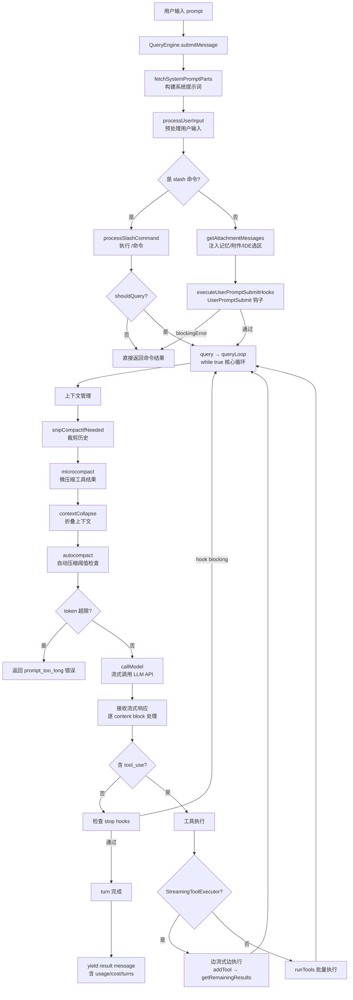

# Claude Code Agent 工作流：从「接到任务」到「执行规划」

> 分析对象：`/Users/banxia/app/opencode/claude-code-haha`（反编译 TypeScript 源码）
> 分析范围：用户提交 prompt → agent 循环执行 → 子 agent 委派的完整数据流
> 所有结论基于源码文件:行号引用，非推测。

## 一、总览：三层递归架构

Claude Code 的 agent 是一个 **递归的 query 循环**。核心设计是：

```
QueryEngine.submitMessage()  ← 会话入口（每对话一个实例）
  └─ query()                 ← agent 主循环（while true）
       └─ callModel()         ← 调 LLM，流式接收响应
       └─ runTools()          ← 批量执行工具（或流式执行）
            └─ AgentTool      ← 工具之一：递归调用 query() 启动子 agent
```

同一套 `query()` 循环驱动主 agent 和子 agent——子 agent 不是特殊机制，而是 AgentTool 工具内部再跑一遍 `query()`。

## 二、完整工作流（Mermaid）



## 三、各阶段详解

### 阶段 0：会话入口 — `QueryEngine.submitMessage()`

**文件**：`src/QueryEngine.ts:78-330`

`QueryEngine` 是会话级单例，每个对话一个实例。`submitMessage()` 接收一个 prompt，启动一轮 turn：

1. **构建系统提示词**（`:140-160`）：调用 `fetchSystemPromptParts()` 组装默认系统提示词、用户上下文（`userContext`：含 CLAUDE.md、git 信息等）、系统上下文（`systemContext`：含 gitStatus、目录结构等）
2. **`processUserInput()`**（`:167-195`）：预处理用户输入（详见阶段 1）
3. **构建 `ToolUseContext`**（`:270-310`）：工具执行上下文——包含工具列表、权限模式、abort controller、文件历史等
4. **进入 `query()` 循环**（`:370`）：将组装好的 messages、systemPrompt、tools 等传入

关键设计：QueryEngine 持有 `mutableMessages`（完整对话历史）跨 turn 持久化，每次 `submitMessage` 在其上追加。

### 阶段 1：输入预处理 — `processUserInput()`

**文件**：`src/utils/processUserInput/processUserInput.ts:42-140`

用户输入并非直接进 LLM，而是经过一条预处理流水线：

1. **图片处理**（`:150-190`）：resize/downsample 图片到 API 限制内
2. **Slash 命令检测**（`:210-240`）：如果输入以 `/` 开头，走 `processSlashCommand()`——内置命令（如 `/compact`、`/model`）直接执行不进 LLM；skill 类命令注入 prompt 后继续
3. **Ultraplan 关键词检测**（`:200-215`）：如果输入含特定关键词，路由到 `/ultraplan` 特殊路径
4. **附件注入**（`:245-255`）：`getAttachmentMessages()` 异步加载相关记忆文件（基于输入内容的 RAG 检索）、IDE 选区、agent mention（`@agent-name` 语法）
5. **UserPromptSubmit hooks**（`:80-120`）：执行用户配置的 `UserPromptSubmit` 钩子——可注入额外上下文、可阻断（`blockingError`）、可阻止继续（`preventContinuation`）
6. **输出**：`{ messages, shouldQuery, allowedTools, model }`——`shouldQuery=false` 时不进 LLM（纯本地命令）

### 阶段 2：核心 Agent 循环 — `queryLoop()`

**文件**：`src/query.ts:101-250`（循环骨架），`:103-1080`（循环体）

这是一个 `while(true)` 异步 generator 循环，每轮迭代代表一次「LLM 调用 + 工具执行」的完整周期。

#### 2a. 上下文管理（每轮迭代开头）

**文件**：`src/query.ts:180-290`，按顺序执行四级压缩：

| 顺序 | 机制 | 文件 | 作用 |
|------|------|------|------|
| 1 | snipCompact | `services/compact/snipCompact.js` | 裁剪历史中的冗余片段 |
| 2 | microcompact | `services/compact/microcompact.js` | 压缩工具结果（按 tool_use_id 缓存编辑） |
| 3 | contextCollapse | `services/contextCollapse/` | 折叠连续的上下文窗口 |
| 4 | autocompact | `services/compact/autoCompact.js` | 达到阈值时全量压缩为 summary |

四级压缩是串行的——snip 先跑，省的 token 数传入 microcompact，后者再传入 autocompact 的阈值判断。

#### 2b. 阻塞检查

**文件**：`src/query.ts:290-310`

压缩完成后，检查 token 是否仍在硬阻塞限。如果是，直接返回 `prompt_too_long` 错误（保留空间让用户手动 `/compact`）。跳过条件：刚压缩完、reactive compact 启用、context collapse 启用。

#### 2c. 调用 LLM（流式）

**文件**：`src/query.ts:340-580`

`deps.callModel()` 发起 API 请求，**流式接收**响应。关键行为：

- **逐 block 处理**：Claude 的响应是 content blocks 数组——text blocks、thinking blocks、tool_use blocks 交替到达
- **tool_use 检测**：每当流中到达一个 `tool_use` block，推入 `toolUseBlocks[]` 并设 `needsFollowUp = true`
- **StreamingToolExecutor 并行执行**（`:560-575`）：如果启用流式工具执行（config gate），在 LLM 仍在流式输出时就开始执行已到达的并发安全工具——**边接收边执行**，不等模型输出完毕
- **错误恢复**：
  - `max_output_tokens`：先尝试升级到 64k（`:1190-1215`），再尝试注入 recovery message 让模型续写（`:1220-1260`，最多 3 次）
  - `prompt_too_long`（413）：先 drain context collapse（`:1060-1090`），再尝试 reactive compact（`:1095-1155`）
  - `FallbackTriggeredError`：切换到 fallback model 重试（`:510-560`）

#### 2d. 工具执行

**文件**：`src/query.ts:1370-1450`（调度），`src/services/tools/toolOrchestration.ts`（批量执行），`src/services/tools/StreamingToolExecutor.ts`（流式执行）

当 `needsFollowUp = true`（模型本轮输出了 tool_use），循环进入工具执行阶段：

**两种执行模式（config gate 二选一）**：

1. **StreamingToolExecutor**（`:30-530`）：在 LLM 流式输出期间就开始执行——`addTool(block, message)` 随每个 tool_use block 到达时入队，并发安全的工具立即并行执行。循环结束后调 `getRemainingResults()` 消费未完成的工具结果。

2. **runTools**（`toolOrchestration.ts:19-55`）：在 LLM 完整输出后批量执行。核心是 `partitionToolCalls()`（`:55-80`）：
   - 遍历所有 tool_use blocks
   - 调 `tool.isConcurrencySafe(parsedInput)` 判断是否可并行
   - 连续的并发安全工具合并为一个并行批次（最多 10 个并发，`CLAUDE_CODE_MAX_TOOL_USE_CONCURRENCY`）
   - 非并发安全的工具各自独占一个串行批次
   - 并行批次用 `all(generators, maxConcurrency)` 执行；串行批次逐个执行，前一个的 context 修改传入后一个

两者都委托 `runToolUse()`（`toolExecution.js`）做实际执行：权限检查（`canUseTool`）→ 输入校验（`inputSchema.safeParse`）→ 调 `tool.call()` → 返回 `{message, contextModifier}`。

#### 2e. 循环终止判断

**文件**：`src/query.ts:1040-1370`

`needsFollowUp = false`（模型本轮没有输出 tool_use）时，进入终止判断：

1. **错误恢复检查**：是否是 withheld 的 413 / max_output_tokens / media error → 触发对应恢复路径
2. **stop hooks**（`:1300-1355`）：`handleStopHooks()` 执行用户配置的 Stop 钩子——可阻断（`blockingErrors`）、可阻止继续
3. **token budget 检查**（`:1360-1395`）：如果启用了 TOKEN_BUDGET 特性，检查本轮 output token 是否达到预算，决定继续还是停止
4. **返回 `{ reason: 'completed' }`**：循环结束

### 阶段 3：子 Agent 委派 — `runAgent()`

**文件**：`src/tools/AgentTool/runAgent.ts:130-400`

当 LLM 输出 `AgentTool` 的 tool_use 时，工具执行阶段会调到 `runAgent()`。这是 **递归调用 `query()`** 的入口：

1. **构建子 agent 上下文**（`:150-220`）：
   - 解析 agent 模型（`getAgentModel`，支持 frontmatter 指定）
   - 解析工具集（`resolveAgentTools`，子 agent 可用工具子集）
   - 构建系统提示词（`getAgentSystemPrompt`，用 agent definition 的 prompt + 环境详情增强）
   - 合并父级 MCP 客户端 + agent 专属 MCP（`initializeAgentMcpServers`）
   - Explore/Plan 等只读 agent 会省略 CLAUDE.md 和 gitStatus（省 token）

2. **隔离控制**（`:220-280`）：
   - 同步子 agent 共享父级的 `abortController` 和 `setAppState`
   - 异步子 agent 获得独立的 `AbortController`（不因父级中断而终止）
   - 子 agent 的权限模式可被 frontmatter 覆盖

3. **创建 `agentToolUseContext`**（`:310-330`）：`createSubagentContext()` 克隆父级上下文，替换 agentId、tools、model、messages

4. **递归调用 `query()`**（`:340-360`）：
   ```typescript
   for await (const message of query({
     messages: initialMessages,
     systemPrompt: agentSystemPrompt,
     userContext: resolvedUserContext,
     systemContext: resolvedSystemContext,
     canUseTool,
     toolUseContext: agentToolUseContext,
     querySource,                    // 'agent:builtin:explore' 等
     maxTurns: maxTurns ?? agentDefinition.maxTurns,
   })) { ... }
   ```
   子 agent 跑的是 **完全相同的 `queryLoop` 循环**——只是 systemPrompt、tools、model 不同。

5. **清理**（`:380-430`）：MCP 断开、session hooks 清除、prompt cache tracking 清理、shell tasks 清理、perfetto 注销

### 阶段 4：结果收集 — `QueryEngine` 层

**文件**：`src/QueryEngine.ts:370-550`

`query()` 的 yield 流被 `QueryEngine.submitMessage()` 消费，按 message 类型处理：

| 消息类型 | 处理 |
|---------|------|
| `assistant` | push 到 mutableMessages，yield 给 SDK 调用方 |
| `user`（tool result） | push 到 mutableMessages，turnCount++ |
| `stream_event` | 累积 usage，捕获 stop_reason |
| `system/compact_boundary` | 释放压缩前消息供 GC |
| `attachment/max_turns_reached` | 提前返回 error result |
| `progress` | push 并 fire-and-forget 记录 |

循环结束后，提取最终文本结果（`messages.findLast(assistant|user)`），yield 一个 `result` 消息（含 `duration_ms`、`total_cost_usd`、`usage`、`stop_reason`、`permission_denials`）。

## 四、关键设计洞察

### 1. 递归同构：没有「子 agent 机制」，只有递归的 `query()`

子 agent 不是通过特殊协议或消息传递实现的——它就是 AgentTool 工具的 `call()` 方法内部调用了 `runAgent()`，后者以子 agent 自己的 prompt/tools/model 启动一个新的 `query()` 循环。主 agent 和子 agent 跑的是**完全相同的代码路径**（`query.ts` 的 `queryLoop`）。

### 2. 流式工具执行：不等模型说完就开始干活

`StreamingToolExecutor` 是性能关键设计——LLM 流式输出一个 tool_use block，agent 立即开始执行该工具，而不是等整个 assistant 消息接收完毕。对于并发的只读工具（如多个 Read），这意味着工具执行时间被「藏」在了模型输出时间下面。

### 3. 四级压缩是串行管线，不是互斥选项

snip → microcompact → contextCollapse → autocompact 顺序执行，前一级释放的 token 数传入后一级的阈值判断。这让上下文管理可以在多个粒度上工作：snip 处理冗余文本片段，microcompact 处理缓存工具结果，collapse 处理连续窗口，autocompact 做全量 summary。

### 4. 错误恢复是状态机，不是异常处理

`queryLoop` 的 `State` 对象记录了 `transition`（上一轮为什么 continue）、`hasAttemptedReactiveCompact`、`maxOutputTokensRecoveryCount` 等。每次恢复路径（collapse drain、reactive compact、max_output_tokens escalate）都是一个 continue 分支，设新的 state 后重跑循环——而不是 try/catch 重试。这避免了恢复机制之间的互相干扰。

### 5. 权限是每工具级别的，不是会话级别的

`canUseTool` 回调在每个工具执行前被调用（`toolExecution.js` 的 `runToolUse`），返回 `{behavior: 'allow'|'deny', message}`。子 agent 的权限可以被 frontmatter 的 `permissionMode` 覆盖，且 `allowedTools` 参数会**替换**（而非追加）session 级权限规则——防止父级权限泄漏到子 agent。

## 五、与天枢（本项目）的架构对照

| 维度 | Claude Code | 天枢 (opencode-tui) |
|------|-------------|---------------------|
| 主循环 | `query.ts: queryLoop`（while true generator） | `src/agent/loop-factory.ts`（类似 generator 循环） |
| 子 agent | `AgentTool → runAgent → query()`（递归） | `delegate_task → worker session`（独立会话） |
| 工具执行 | `StreamingToolExecutor` / `runTools` | `src/tools/` pipeline |
| 上下文压缩 | snip + microcompact + collapse + autocompact | `src/compact/`（trim + micro-compact + threshold） |
| 系统提示词 | `fetchSystemPromptParts` | `src/prompt/`（static + volatile + engine） |
| 权限 | `canUseTool` 回调 per-tool | approval mode + tool validation |

核心差异：天枢的子 agent（worker）是**独立会话**（有独立的 JSONL/memory/pheromone），而 Claude Code 的子 agent 是**同进程递归调用**（共享文件状态缓存，同步子 agent 共享 abortController）。

---

*文档生成：2025-06-25，基于 claude-code-haha 源码静态分析。*
