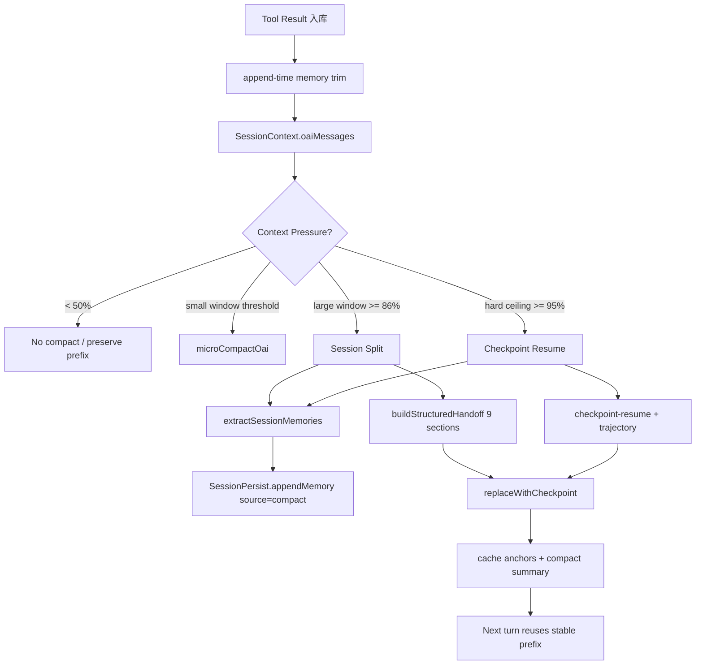
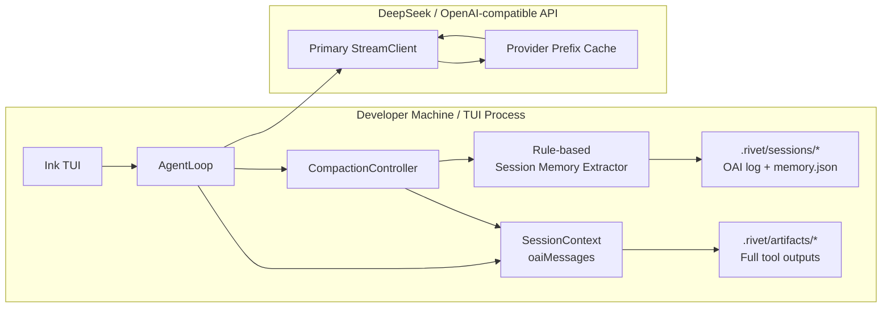

# Compact Hygiene P：技术路线与部署图

> 用途：为后续迭代提供架构定位、部署路径、观测指标与回滚边界。本文档对应 `docs/superpowers/plans/2026-05-27-compact-hygiene-implementation.md` 的 Phase 1–4 收束实现。

## 1. 背景与目标

长会话在 1M context window 下此前存在两类治理矛盾：

1. **内存安全**：`SessionContext.oaiMessages` 会长期保留完整 tool result 字符串，长会话/大文件读取可导致 JS heap 持续膨胀。
2. **Prefix cache 稳定性**：传统 micro compact / stale prune 若直接改写历史消息，会破坏 DeepSeek prefix cache 的字节级稳定前缀。

本 P 的技术目标是把“压缩”从单一历史裁剪升级为四层治理链：

- append-time 内存裁剪：先保证进程 heap 有上界。
- Forked Agent LLM compact：复用主模型 client 与 cache anchors，避免额外 compact client 破坏缓存收益。
- structured handoff：session split 时保留可恢复的任务语义。
- session memory extraction：在上下文丢失前把关键经验写入 session memory。

## 2. 技术路线

### 2.1 路线总览



### 2.2 Phase 分层

| Phase | 核心机制 | 关键文件 | 作用 |
|---|---|---|---|
| Phase 1 | append-time tool result trim | `src/agent/context.ts`, `src/compact/constants.ts` | 限制单条 tool result 常驻内存，保留 artifact marker |
| Phase 2 | primary model Forked Agent compact | `src/agent/compaction-controller.ts`, `src/agent/loop.ts` | 用主模型 client 生成 compact summary，减少 prefix cache 破坏 |
| Phase 3 | 9-section structured handoff | `src/agent/compaction-controller.ts` | split 后保留用户目标、决策、文件、错误、工具轨迹和下一步 |
| Phase 4 | rule-based session memory extraction | `src/agent/session-memory-extract.ts`, `src/context/session-memory.ts` | split/ceiling 前提取跨会话记忆，并按 text+source 去重 |

### 2.3 数据流边界

```mermaid
sequenceDiagram
  participant User
  participant Loop as AgentLoop
  participant Ctx as SessionContext
  participant Comp as CompactionController
  participant Extract as session-memory-extract
  participant Persist as SessionPersist
  participant Model as Primary StreamClient

  User->>Loop: user input
  Loop->>Comp: trySessionSplit before/inside turn
  Comp->>Ctx: getMessages/getEstimatedTokens
  alt ratio >= 0.86
    Comp->>Extract: extractSessionMemories(messages, trajectory targets)
    Extract-->>Comp: ExtractedMemory[]
    Comp->>Persist: appendMemory([kind] text, source=compact)
    Comp->>Comp: buildStructuredHandoff(9 sections)
    Comp->>Ctx: replaceMessages(cache anchors + handoff)
  else normal turn
    Loop->>Model: stream request with stable prefix
  end
```

## 3. 部署图

### 3.1 运行时部署拓扑



### 3.2 部署单元与开关

| 单元 | 部署方式 | 默认行为 | 回滚边界 |
|---|---|---|---|
| append-time memory trim | 代码内置 | 超过 `INLINE_TOOL_RESULT_MAX_CHARS` 自动裁剪 | 回滚 `SessionContext.addToolResults` trim 调用 |
| request-time prune | 代码内置 | 只作为 API request mask，不改写存储 | 保持不可变历史；勿恢复 storage mutation |
| Forked Agent compact | `primaryClient` 可选依赖 | primaryClient 可用且消息足够时启用 | `primaryClient` 缺失/失败返回 `null`，回退 rule-based handoff |
| structured handoff | 代码内置 | session split 统一使用 9-section 模板 | 可回退到 `fallbackText` |
| session memory extraction | `persistMemories` 可选回调 | split/ceiling 前机会性写入 | 回调不存在或异常时吞掉错误，不阻断 compact |

## 4. 后续迭代路线

### 4.1 P+1：观测与指标闭环

- 在 compact event 中补充：
  - extracted memory count
  - handoff section completeness
  - pre/post split token count
  - prefix cache hit rate after split
- 在 `.rivet/sessions/{id}/cache-log.jsonl` 关联 split event，形成 cache hit 对比曲线。

### 4.2 P+2：记忆质量治理

- 为 `ExtractedMemory` 增加 confidence / evidence 字段。
- 将同类 decision/failure 做更细粒度归并，降低重复写入。
- 把 `task_state` 与 `ContextLedger` / `TaskContract` 对齐，形成可恢复的任务账本。

### 4.3 P+3：可配置策略

- 将 86% split threshold、95% hard ceiling、memory extraction cap 暴露为 provider-profile 或 config 策略。
- 对 200K/1M 窗口分别设置不同 handoff 预算。
- 增加“只记忆错误/只记忆用户偏好”等运行模式。

### 4.4 P+4：集成验证场景

- 构造长会话 fixture：大 tool result + 多轮 edit/test + failure/retry。
- 断言：
  - heap 增长受限；
  - 1M window 下普通 micro compact 不触发；
  - split 后只保留 cache anchors + handoff；
  - memory.json 中包含 compact source 记忆且无重复 text+source；
  - split 后下一轮 cache hit rate 不显著下降。

## 5. 验收与发布步骤

1. **单元验证**
   - `src/agent/__tests__/compaction-handoff.test.ts`
   - `src/agent/__tests__/session-memory-extract.test.ts`
   - `src/context/__tests__/session-memory.test.ts`
   - `src/agent/__tests__/compaction-controller.test.ts`
   - `src/agent/__tests__/compaction-primary-model.test.ts`

2. **类型验证**
   - `npx tsc --noEmit`

3. **全量回归**
   - `./node_modules/.bin/tsx --test $(find src -name '*.test.ts')`
   - 当前已知外部失败：`src/config/__tests__/schema.test.ts` 中 repo summarization worker 默认路由期望 `mimo`，实际为 `cheap`，与本 P 改动无直接关联。

4. **部署观察**
   - 长会话触发 split 后检查 `.rivet/sessions/{sessionId}.memory.json`。
   - 检查 compact event 的 tier/reason。
   - 对比 split 后首轮 provider cache read tokens。

## 6. 设计约束

- 不在 1M+ window 中恢复常规 micro compact，以免破坏 prefix cache。
- request-time prune 不得重新变成 storage mutation。
- memory extraction 必须是非阻塞、可失败、无 LLM 依赖。
- session split handoff 必须保持 cache anchors 不变。
- 新增记忆写入统一使用 `source: 'compact'`，避免扩展 `SessionMemoryEntry['source']` 带来迁移成本。
