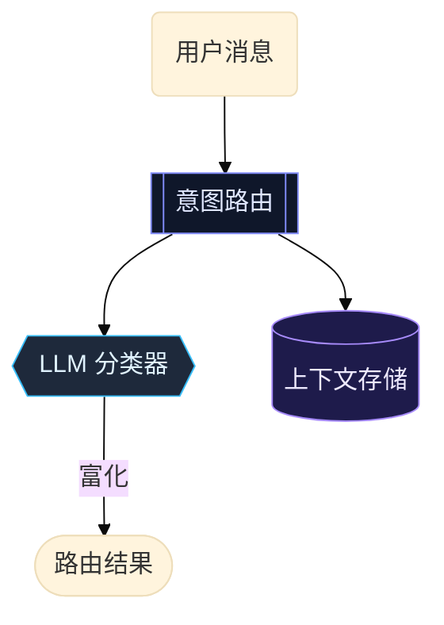

# 天枢图表模板库 — Mermaid 语义词汇 + 风格约束

> 灵感：fireworks-tech-graph（自然语言 → SVG/PNG 技术图，语义词汇 + 8 风格模板）
> 决策（2026-06-07，用户）：**观看面 = Mermaid + 外部查看器**（VSCode/GitHub/Obsidian 渲染）；**一致性 = 风格模板库约束**（移植 fireworks 的"模板护城河"，非自由生成）
> 目标：用户说"画个架构图"，agent 调 write_file 输出**风格一致、语义规范**的 mermaid，落进文档，外部查看器渲染成图

---

## 承重事实（对码已确认，定边界）

| 事实 | 证据 | 对设计的约束 |
|------|------|------------|
| TUI 把 mermaid 当**纯文本**显示，不渲染成图 | `markdown-render.tsx:464 renderCodeBlock` 对所有代码块（含 mermaid）只做带语言标签的文本渲染 | 图的观看面**只能在外部**（VSCode/GitHub），终端里是可读源码。这是已接受的取舍 |
| 无终端图像协议（kitty/sixel/iterm） | `grep` 无命中 | 终端内渲图不在本计划范围 |
| `write_file` 通用、无格式限制 | `write-file.ts:13` | 生成图**不缺能力**，缺的是**一致性约束** |
| `plan_submit` 已教 agent 用 mermaid | `plan-submit.ts:24-30` | 已有起点，本计划是**强化+规范化**，非从零 |
| 无 skills 目录 / 模板库 | `grep` 无命中 | 模板库是净新增 |

### 诚实边界：mermaid ≠ SVG，不承诺做不到的事

fireworks 输出 inline SVG，能做玻璃拟态、渐变、3D、自定义字体。**mermaid 是线条图 + 扁平填充，classDef 只能控 `fill`/`stroke`/`color`/`stroke-width`。** 因此：

- ✅ **可移植（真价值）**：语义词汇——用 mermaid 节点形状编码语义角色。这跨所有渲染器一致。
- ✅ **可做**：3-4 套扁平风格调色板（Light / Dark Terminal / Blueprint / Notion-clean），靠 `classDef` + `%%{init:theme}%%`。
- ❌ **不承诺**：fireworks 的玻璃拟态/渐变/3D/Dark Luxury。mermaid 表达不了，**不在计划里假装能做**（便利≠正确）。

> 若未来确需 fireworks 级视觉，那是另一条路（SVG 交付物 + 浏览器观看面），与本计划正交，不混谈。

---

## 设计方案：三层

### 第 1 层 · 语义词汇（核心护城河，跨渲染器可移植）

用 mermaid 原生形状编码语义角色，让"形状即含义"——这是 fireworks 真正的价值，且 mermaid 完全做得到：

| 语义角色 | mermaid 形状 | 写法 |
|---------|-------------|------|
| LLM / 模型 | 六边形 | `A{{LLM 分类器}}` |
| Agent / 处理器 | 子程序框 | `B[[意图路由]]` |
| 数据存储 / DB | 圆柱 | `C[(MeridianDB)]` |
| 决策 / 分支 | 菱形 | `D{HEAD 变了?}` |
| 外部输入 / 用户 | 圆角 | `E(用户消息)` |
| 普通模块 | 矩形 | `F[write_file]` |
| 入口 / 终点 | 体育场形 | `G([CLI 入口])` |

边的语义（流类型）：

| 流类型 | mermaid 写法 |
|--------|-------------|
| 同步调用 / 读 | `A --> B` |
| 写 / 强流 | `A ==> B` |
| 异步 / 事件 | `A -.-> B` |
| 带标签 | `A --富化--> B` |

### 第 2 层 · 风格调色板（classDef，扁平真实可做）

每套风格 = 一组 `classDef`。agent 套用，输出一致：



提供 3-4 套：`light`（Notion-clean）/ `dark`（Dark Terminal）/ `blueprint`（蓝图）/ `mono`（极简黑白）。**不超出 classDef 能力**。

### 第 3 层 · 图型骨架模板

按图型提供填空骨架，agent 填语义节点，不从零编排：

- `architecture` — 分层 `subgraph`（入口层/逻辑层/存储层）
- `dataflow` — 左→右数据流
- `sequence` — `sequenceDiagram` 时序
- `flowchart` — 决策流（最常用）
- `comparison` — 并列 `subgraph` 对比

---

## Agent 怎么用（两条路，建议并存）

### A. Prompt 注入（主路，零新工具）

把"语义词汇 + 风格调色板"作为一段参考，注入到 `plan_submit` 描述 / 一份 `docs/` 模板参考。agent 写 mermaid 时**填模板**而非自由画。这是最低成本，强化现有路径。

### B. `/diagram` slash 命令（脚手架，可选）

`/diagram <type> <style>` → 输出选定图型+风格的 mermaid 骨架到当前文档，agent/用户填节点。复用 `slash-commands.ts` 现有机制。

---

## 与现有的关系

- **不改 TUI 渲染**：终端里 mermaid 仍是可读源码，符合已定观看面。
- **强化 `plan_submit`**：现有"用 mermaid"升级为"用**带语义词汇的** mermaid"。
- **复用 write_file**：图就是文档里的 mermaid 块，无新文件类型。

---

## 风险与应对

| 风险 | 概率 | 应对 |
|------|------|------|
| 把 mermaid 当 SVG 用，承诺玻璃拟态/渐变 | 中 | 已划诚实边界：只做扁平风格，视觉华丽度走 SVG 另条路 |
| classDef 跨渲染器支持不一（GitHub vs VSCode vs Obsidian） | 中 | 调色板只用三方都支持的 `fill`/`stroke`/`color`；`%%{init}%%` theme 做降级基线。**实现前先在三个查看器实测一张样图**（不假设兼容） |
| 语义词汇 agent 记不住/用不一致 | 中 | 形状-语义映射做成**注入的速查表**而非散文，每次在场；`/diagram` 骨架预埋正确形状 |
| 模板库变模板枷锁（复杂图被骨架限死） | 低 | 骨架是起点不是牢笼，prompt 明确"可偏离" |

---

## 成功标准

1. 用户说"画个 X 架构图"，agent 输出的 mermaid **形状语义一致**（LLM 必六边形、DB 必圆柱），不再每次随机形状。
2. 同一项目多张图**风格统一**（同一套 classDef 调色板）。
3. 三个主流查看器（VSCode/GitHub/Obsidian）实测渲染一致，无破图。
4. 不承诺、也不出现 mermaid 表达不了的视觉效果——边界诚实。

---

## 落地顺序

1. **先实测兼容性**（半天）：一张样图（含 classDef + `%%{init}%%`）在 VSCode/GitHub/Obsidian 三处渲染，确认调色板可移植基线。**这步定第 2 层能做多少**，不可跳。
2. **写语义词汇 + 调色板参考**（第 1、2 层）→ 注入 `plan_submit`。
3. **图型骨架模板**（第 3 层）。
4. **`/diagram` 命令**（可选，B 路）。

---

## 附录 · plan_submit 注入草案（词汇已定稿，调色板待实测回填）

> 状态：第 1 层（形状词汇）跨渲染器可移植，**现已定稿**，等兼容性测试一回来即可应用到 `plan-submit.ts:24` 的 Mermaid 段。第 2 层（调色板）留占位符，由 `mermaid-compat-test.md` 实测结果回填——三处都 ✅ 的才进。

拟在 `plan-submit.ts` 描述里，把现有 "Use Mermaid diagrams" 段升级为：

```text
### 画图：用语义形状，不要随机形状

节点形状编码语义角色（跨 VSCode/GitHub/Obsidian 一致）：
- LLM / 模型     → {{六边形}}      A{{LLM 分类器}}
- Agent / 处理器 → [[子程序框]]    B[[意图路由]]
- 数据存储 / DB  → [(圆柱)]        C[(MeridianDB)]
- 决策 / 分支    → {菱形}          D{HEAD 变了?}
- 外部输入 / 用户 → (圆角)          E(用户消息)
- 普通模块       → [矩形]          F[write_file]
- 入口 / 终点    → ([体育场形])    G([CLI 入口])

边编码流类型：
- 同步/读  A --> B
- 写/强流  A ==> B
- 异步/事件 A -.-> B
- 带标签   A --富化--> B

[调色板：待 mermaid-compat-test.md 实测确认后填入三处都支持的 classDef]
```

回填规则：实测表里"图1 classDef 着色生效"三列全 ✅ → dark 调色板进；若 GitHub ⚠️（已知 GitHub mermaid 对 classDef 支持有限）→ 调色板降级为"可选增强"，形状词汇仍是强制基线（形状不依赖 classDef）。
