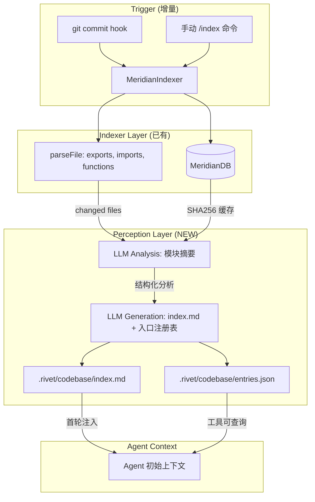

# 天枢项目感知层 — 自维护代码知识库

> 灵感：LLM Wiki (nashsu/llm_wiki) — 增量构建、持久化、知识图谱
> 痛点：Agent 每次进入项目从零开始 grep 探索。例如 Agent 在 `main.tsx` 中不确定是否有 `--print` 入口时（其实 `main.tsx:998` 早已完全接线 `-p/--print`，`headless.ts` 提供了 `parseCliArgs()` + `runHeadless()`），那一瞬间是断裂的——需要对比多个文件才能确认接线状态，不是心流。
> 目标：Agent 第一轮就能从持久化的项目索引中获取全貌，心流不中断

---

## 问题描述

当前天枢 Agent 的项目感知完全依赖运行时探索：

```
Agent 收到任务 → repo_map（文件树）→ grep（找符号）→ read_file（理解代码）
```

这个流程的问题：

1. **入口点不可见**：`main.tsx` 中 `--print`、`--goal`、`serve` 等 CLI 入口分散在几千行代码中，Agent 不知道哪些已接线、哪些是死代码
2. **重复探索**：每个新会话都会重复 `grep headless`、`grep --print`，消耗 token 和时间
3. **模块职责不透明**：`src/repo/` 下有 12 个文件形成 Meridian 索引系统，但 Agent 需要逐个读才能理解
4. **接线状态断裂**：`headless.ts` 实现了 `runHeadless()` 和 `parseCliArgs()`，`main.tsx:998` 已将 `-p/--print` 完整接线（含 `--json`/`--stream-json`）——但 Agent 不 grep 就无法知道这个事实，每次都会走一遍"不确定→探索→确认"的认知路径

**本质**：天枢缺少 LLM Wiki 的核心能力——**增量构建并持久维护一个结构化的项目知识索引**。

---

## 现状盘点

### 已有基础设施

| 模块 | 能力 | 差距 |
|------|------|------|
| `src/repo/meridian-indexer.ts` | 文件解析、导入图、SHA256 增量 | 不产出人类可读的模块摘要 |
| `src/repo/meridian-db.ts` | 持久化索引数据库 | 无入口点/接线状态字段 |
| `src/repo/meridian-graph.ts` | repo_map 文件树 | 只有文件树，无职责标注 |
| `repo_graph` 工具 | 文件关联图 | 粒度是文件级，不是模块级 |
| `remember` / `recall` | 项目记忆 | 依赖 Agent 主动记录，不自动 |
| `project-instructions` | 静态架构图 | 手动维护，易过时 |
| `docs/superpowers/` | 设计文档 | 分散，无统一索引 |

### 关键缺失

1. **模块职责索引**：没有 `模块 → 一句话职责 → 关键入口函数 → 接线状态` 的映射
2. **CLI 入口注册表**：没有自动发现的 `--flag → 处理代码位置 → 是否活跃` 的信息
3. **增量更新**：改代码后索引不同步（Meridian indexer 有 SHA256 增量但只做解析不做摘要）
4. **Agent 首轮注入**：索引数据没有进入 Agent 的初始上下文

---

## 设计方案

### 核心思路：借鉴 LLM Wiki 的"两阶段摄取"

LLM Wiki 的独特之处：
- **Phase 1 (Analysis)**: LLM 分析源文档 → 结构化分析（实体、概念、连接）
- **Phase 2 (Generation)**: 基于分析生成 wiki 页面
- **SHA256 增量缓存**：未变更的文件不重新处理
- **index.md** 作为导航入口

映射到代码库：
- **Phase 1**: MeridianIndexer 解析文件 → 提取 exports、imports、函数签名
- **Phase 2**: LLM 读取解析结果 → 生成模块摘要、入口点注册表、接线状态
- **index.md**: `.rivet/codebase/index.md` 作为 Agent 首轮注入的入口
- **SHA256 缓存**: 复用 MeridianDB 的文件 hash，避免重复 LLM 调用

### 架构



### 产出物

#### 1. `.rivet/codebase/index.md` — 代码库导航入口

```markdown
# 天枢 Codebase Index

> 自动生成，基于 MeridianIndexer 解析 + LLM 摘要
> 最后更新: 2026-06-07 19:30 (commit a5e154b)

## 模块职责

| 目录 | 职责 | 关键入口 | 状态 |
|------|------|---------|------|
| src/agent/ | 核心智能体循环、工具流水线、子智能体 | loop.ts:runTurn() | active |
| src/tools/ | 工具实现 + 注册 (49 tools) | default-registry.ts | active |
| src/api/ | API 客户端 (OpenAI/Codex/流式) | factory.ts:createProviderClient() | active |
| src/repo/ | 代码仓库索引 (Meridian) | meridian-indexer.ts | active |
| src/headless.ts | Headless/CI-CD 模式 | parseCliArgs(), runHeadless() | ✅ 已接线 |
| src/main.tsx | TUI 入口 + TTY/TUI/headless 路由 | App 组件 + CLI args 解析 | active |
...

## CLI 入口注册表

| Flag | 处理位置 | 状态 |
|------|---------|------|
| --goal "text" | main.tsx:893 | ✅ 已接线 |
| -p / --print "text" | main.tsx:998 | ✅ 已接线 (含 --json / --stream-json) |
| --json | headless.ts:parseCliArgs | ✅ 随 -p 生效 |
| --stream-json | headless.ts:parseCliArgs | ✅ 随 -p 生效 |
| serve | main.tsx:762 | ✅ 已接线 |

## 最近变更 (10 commits)

| Commit | 影响模块 | 摘要 |
|--------|---------|------|
| a5e154b | guard | checkedAt/checked 工具 |
| 0a3a0df | guard, tui | type guard + live token counter |
```

#### 2. `.rivet/codebase/entries.json` — 结构化入口注册表

```json
{
  "cliFlags": [
    {"flag": "--goal", "handler": "main.tsx:893", "wired": true},
    {"flag": "-p", "handler": "main.tsx:996", "wired": true},
    {"flag": "--print", "handler": "main.tsx:996", "wired": true}
  ],
  "tools": [
    {"name": "plan_submit", "file": "src/tools/plan-submit.ts", "registered": true},
    {"name": "web_search", "file": "src/tools/web-search.ts", "registered": true}
  ]
}
```

### Agent 上下文注入

在 `prompt/engine.ts` 的 volatile context 中注入索引摘要：

```xml
<project-index>
从 .rivet/codebase/index.md 注入前 2000 token 的模块职责表和入口注册表。
Agent 可以在不 grep 的情况下知道:
- 49 个工具中有 plan_submit 和 web_search
- CLI 入口 --print 已在 main.tsx:996 接线
- headless.ts 有 runHeadless() 但需要 createAgent 工厂
</project-index>
```

---

## 实施路径

### Phase 1: 索引生成（核心）

| 任务 | 产出 | 工作量 |
|------|------|--------|
| 1.1 扩展 MeridianDB schema | 增加 `module_summary` 表 | 小 |
| 1.2 实现 LLM 模块摘要生成 | 基于 parseFile 结果 + LLM 一句话摘要 | 中 |
| 1.3 实现 CLI 入口自动发现 | grep main.tsx 中的 `args.includes` / `args[0] ===` 模式 | 小 |
| 1.4 生成 index.md | 模板 + 数据库查询 → Markdown | 小 |
| 1.5 SHA256 增量更新 | 复用现有 DB hash，变更文件才重新摘要 | 已有基础 |

### Phase 2: Agent 集成

| 任务 | 产出 | 工作量 |
|------|------|--------|
| 2.1 volatile context 注入 | 首轮自动注入 index.md 摘要 | 小 |
| 2.2 `/index` slash command | 手动触发全量重建 | 小 |
| 2.3 git post-commit hook | 自动增量更新 | 小 |

### Phase 3: 知识图谱（远期）

| 任务 | 产出 | 工作量 |
|------|------|--------|
| 3.1 模块依赖图 | 基于 Meridian imports 构建 D3/Mermaid 图 | 中 |
| 3.2 "惊喜连接"发现 | 跨模块的意外依赖关系 | 中 |
| 3.3 死代码检测 | 实现但未接线的函数/工具标记 | 小 |

---

## 风险与应对

| 风险 | 概率 | 应对 |
|------|------|------|
| LLM 摘要质量不稳定 | 中 | 用结构化模板约束输出格式；fallback 到纯静态解析 |
| 大项目索引 token 超预算 | 低 | 2000 token 截断 + 按模块折叠 |
| 索引过时 | 中 | SHA256 增量 + git hook 自动触发 |
| 与现有 project-instructions 冲突 | 低 | index.md 只做事实索引（what/where），project-instructions 做设计意图（why） |

---

## 成功标准

1. Agent 在处理新任务时，首轮就能从 volatile context 获知相关模块和入口，不再需要 3+ 轮 grep 探索
2. "headless.ts 有 runHeadless() 且已在 main.tsx:998 接线"这类信息被持久化记录，Agent 无需 grep 即可确认
3. 新增工具/CLI 入口后，一次 `/index` 即可更新索引

---

## 审查校准（2026-06-07 天权域对码验证）

以下事实已通过实际代码对照确认，修正了计划初稿中的描述偏差：

| 事实 | 初稿描述 | 校准结果 | 证据 |
|------|---------|---------|------|
| `--print`/`-p` 接线状态 | "已实现但未接线" | **完全接线**：`main.tsx:998` 动态 `import('./headless.js')`，含 `--json`/`--stream-json` | `src/main.tsx:998` |
| `headless.ts` 状态 | "部分接线" | `parseCliArgs()` + `runHeadless()` 均已实现并被 main.tsx 调用 | `src/headless.ts:38,57` |
| 工具数量 | "49 tools" | **52 tools**（plan_submit 等近期新增） | `grep -rn "name:" src/tools/ \| wc -l` = 52 |
| `src/repo/` 文件数 | "12 个文件" | **12 个**（meridian-db, meridian-indexer, meridian-graph, meridian-parser, meridian-impact, meridian-behavior, meridian-types, physarum-engine 等） | `ls src/repo/*.ts \| wc -l` = 12 |
| MeridianIndexer SHA256 增量 | "已有基础" | `MeridianIndexer` + `MeridianDB` 均存在，SHA256 文件哈希增量解析已实现 | `src/repo/meridian-indexer.ts:18` |

### 补充的关键洞察

1. **问题不是"实现未接线"，而是"接线状态不可知"**。`--print` 从实现到接线全程完成，但 Agent 在 `main.tsx` 几千行代码中无法一眼确认这一点——必须有 grep 探索环节。codebase wiki 的价值不在于修复断裂，而在于**消解认知滞后**。

2. **MeridianIndexer 是天然的解析层**。不需要从零构建文件解析——Meridian 已有 SHA256 哈希、导入图、函数签名提取。Phase 2 的 LLM 摘要生成只需要增量读取 MeridianDB 的变更文件列表。

3. **索引粒度建议**：模块级（`src/agent/`）做职责摘要 → Agent 首轮注入（~2000 token）；文件级（`loop.ts`）做入口函数注册表 → 工具查询。避免按函数/类做索引（token 爆炸且 Agent 有 grep 能力）。

4. **与 `project-instructions` 的分工**：
   - `project-instructions`：静态设计意图（`src/agent/` = 核心智能体循环）— **why**
   - `codebase index`：动态接线事实（`main.tsx:998` = `--print` 接线点）— **what/where**
   - 两者互补不重复：一个解释职责，一个记录状态
