# better-sqlite3 生产打包方案

> **面向 AI 代理：** 使用 subagent-driven-development（推荐）或 executing-plans 逐任务实现。

**目标：** 桌面端 Tauri 生产包（`tauri:build` → `天枢.app`）内自带 better-sqlite3 原生二进制，使 SessionRegistry 和 MeridianDb 在桌面端全功能运行，不再回退 nullDb。

**架构：** 在 `npm run build` 之后、`tauri:build` 之前，用 `scripts/pack-native.sh` 从 `node_modules/better-sqlite3/build/Release/` 拷贝 `.node` 文件到 `dist/native/` 目录。Tauri 的 `bundle.resources` 已将 `dist/` 整个映射为 `rivet-runtime/`，原生二进制随之进入 `.app/Contents/Resources/rivet-runtime/native/`。运行时通过新增的 `src/repo/native-resolver.ts` 统一拦截 `require('better-sqlite3')`，优先从 `import.meta.url` 旁的 `native/` 目录加载 `.node` 文件。tsup esbuild 插件改为调用 `native-resolver` 而非裸 `createRequire`。

**技术栈：** Node.js `process.dlopen` + `createRequire` 路径解析 / Tauri 2.x `bundle.resources` / prebuild-install 预编译二进制 / tsup esbuild 插件

---

## 问题根因

### 当前数据流（生产包，断裂）

```
tauri:build
  ├─ beforeBuildCommand: npm run build → tsup → dist/main.js + dist/chunk-*.js（纯 JS）
  └─ bundle.resources: { "../../dist": "rivet-runtime" }
     └─ 复制 dist/ → .app/Contents/Resources/rivet-runtime/
        └─ 只有 JS chunk，没有 .node 原生二进制

运行时：
  .app 启动 → lib.rs detect_node() 找到系统 node → spawn node rivet-runtime/main.js serve
  → main.js 执行 → createRequire(import.meta.url)("better-sqlite3")
  → import.meta.url 指向 .app/Contents/Resources/rivet-runtime/main.js
  → createRequire 从该位置向上搜索 node_modules/better-sqlite3
  → 找不到（.app 内无 node_modules）→ throw → catch → createNullDb()
  → SessionRegistry / MeridianDb 全部静默失效
```

### 两个消费者的加载点

| 消费者 | 文件 | 加载方式 | nullDb fallback |
|--------|------|----------|-----------------|
| SessionRegistry | `src/agent/session-registry.ts:122` | `nodeModule.createRequire(import.meta.url)('better-sqlite3')` | `createNullDb()` — **已修复**（run() 返回 `{changes:0}`） |
| MeridianDb | `src/repo/meridian-db.ts:158` | `createRequire(import.meta.url)('better-sqlite3')` | `createNullDb()` — **同一 bug 未修**（run() 返回 undefined） |
| tsup 虚拟模块 | `tsup.config.ts:25-50` | 运行时 `createRequire(import.meta.url)("better-sqlite3")` → 失败则 NullDatabase 类 | `NullDatabase` class |

三处各自独立加载 better-sqlite3，各有各的 nullDb 实现，不一致。需要统一。

### 附带发现：MeridianDb 的 nullDb 同 bug

`src/repo/meridian-db.ts:670` 的 `createNullDb()` 中 `noopStmt.run()` 返回 `undefined`，与 `a5603084` 修复前 SessionRegistry 的 bug 完全相同。任何调用 `.run(...).changes` 的代码会抛 TypeError。

### 安全不变量

1. **不破坏开发模式**：`npm run dev`（tsx）路径不经过 tsup 打包，现有 `createRequire` 从 `node_modules/` 加载，必须继续正常工作
2. **不破坏 CLI 直跑**：`node dist/main.js`（仓库根目录有 node_modules）必须继续正常工作
3. **ABI 安全**：打包的 `.node` 文件 ABI 版本必须与运行时 Node.js 的 `process.versions.modules` 匹配，否则 `process.dlopen` 抛 `NODE_MODULE_VERSION mismatch`
4. **跨平台**：CI 需为 darwin-arm64、darwin-x64、linux-x64、win32-x64 各打一个 `.node` 文件
5. **nullDb 不可消除**：graceful degradation 语义保留——极端情况（.node 损坏、ABI 不匹配）仍 fallback 到 nullDb，不崩溃

---

## 触发路径清单

| 路径 | 当前行为 | 改后行为 |
|------|----------|----------|
| `npm run dev`（tsx 直跑源码） | createRequire 从 node_modules 加载 → 真实 DB | **不变** |
| `node dist/main.js`（仓库根，有 node_modules） | createRequire 从 node_modules 加载 → 真实 DB | **不变** |
| `node dist/main.js serve`（仓库根，有 node_modules） | 同上 → 真实 DB | **不变** |
| Tauri dev（`tauri:dev`，dev 模式用仓库 dist/） | createRequire 从 node_modules 加载 → 真实 DB | **不变** |
| Tauri 生产包（`tauri:build`，无 node_modules） | createRequire 失败 → nullDb | **新路径**：native-resolver 从 rivet-runtime/native/ 加载 → 真实 DB |
| pack-slim.sh 精简包（无 node_modules） | createRequire 失败 → nullDb | **新路径**：native-resolver 从 dist/native/ 加载 → 真实 DB（如果 dist/native/ 存在） |
| .node ABI 不匹配 / 文件损坏 | 无此场景（当前不会打包 .node） | native-resolver 捕获 dlopen 错误 → fallback nullDb |

---

## 数据流图（改后）

```mermaid
flowchart TD
    subgraph Build
        NPM[npm run build] --> TSUP[tsup bundle]
        TSUP --> DIST[dist/main.js + chunk-*.js]
        PACK[scripts/pack-native.sh] --> COPY[拷贝 .node → dist/native/]
        DIST --> COPY
        COPY --> TAURI[tauri:build]
        TAURI --> APP[天枢.app]
        APP --> RES[Resources/rivet-runtime/native/better_sqlite3.node]
    end

    subgraph Runtime
        START[.app 启动] --> LIBRS[detect_node + sidecar_entry]
        LIBRS --> SPAWN[spawn node main.js serve]
        SPAWN --> INIT[SessionRegistry.create / MeridianDb init]
        INIT --> RESOLVE[native-resolver resolveBetterSqlite3]
        RESOLVE --> CHECK{dist/native/ 存在?}
        CHECK -- 是 --> DLOADER[process.dlopen 加载 .node]
        DLOADER --> REAL[真实 better-sqlite3 Database]
        CHECK -- 否 --> FALLBACK[createRequire node_modules]
        FALLBACK --> FOUND{找到?}
        FOUND -- 是 --> REAL
        FOUND -- 否 --> NULL[createNullDb]
        DLOADER -. ABI 不匹配 .-> NULL
    end
```



---

## 任务列表

### Task 1: 创建 `scripts/pack-native.sh` — 拷贝原生二进制到 dist/native/

**文件：**
- 创建：`scripts/pack-native.sh`

**前置条件：** `node_modules/better-sqlite3/build/Release/better_sqlite3.node` 存在（已验证：1.8MB Mach-O arm64，ABI 137）

**脚本行为：**
1. 检查 `node_modules/better-sqlite3/build/Release/better_sqlite3.node` 是否存在，不存在则 `echo "WARN: better-sqlite3 native not found, skipping" >&2; exit 0`（不阻塞构建）
2. 创建 `dist/native/` 目录
3. 拷贝 `node_modules/better-sqlite3/build/Release/better_sqlite3.node` → `dist/native/better_sqlite3.node`
4. 打印 `✅ Packed better_sqlite3.node (1.8M) → dist/native/`

**验证命令：**
```bash
npm run build && bash scripts/pack-native.sh && ls -la dist/native/better_sqlite3.node
```
**预期结果：** `dist/native/better_sqlite3.node` 存在，大小约 1.8MB

**commit：** `feat(build): pack-native.sh 拷贝 better-sqlite3 原生二进制到 dist/native/`

---

### Task 2: 创建 `src/repo/native-resolver.ts` — 统一原生模块加载器

**文件：**
- 创建：`src/repo/native-resolver.ts`
- 测试：`src/repo/__tests__/native-resolver.test.ts`

**函数签名：**
```typescript
/**
 * 解析 better-sqlite3 原生模块。
 * 尝试顺序：
 *   1. 从 import.meta.url 旁的 native/ 目录加载 .node 文件
 *   2. createRequire 从 node_modules 加载
 *   3. 返回 null（调用方走 nullDb）
 */
export function resolveBetterSqlite3(moduleUrl: string): any | null
```

**实现逻辑（精确描述）：**
1. `const { dirname } = await import('node:path')` 和 `const { existsSync } = await import('node:fs')`
2. 从 `moduleUrl`（即 `import.meta.url`）解析出目录路径 `baseDir`
3. 将 `file://` URL 转换为文件系统路径（`import.meta.url` 在 ESM 中是 `file:///path/to/main.js`）
4. 尝试路径 `${dir}/native/better_sqlite3.node`
5. 如果存在：`const Database = createRequireFromPath(nativePath)` —— 但不是直接 `require`，而是用 `process.dlopen` 语义。实际做法：创建一个临时 require 函数指向 native 目录，然后 `require('./better_sqlite3.node')`。更精确的方式：
   ```typescript
   import { createRequire } from 'node:module'
   const nativeRequire = createRequire(nativePath + '/')  // 以 native/ 目录为基
   return nativeRequire('./better_sqlite3.node')
   ```
   **关键**：better-sqlite3 的 `.node` 文件是一个 Node.js addon，`require()` 它时 Node.js 内部调用 `process.dlopen`。所以 `nativeRequire('./better_sqlite3.node')` 会返回 Database 构造器。但需要验证：better-sqlite3 的 `.node` 是自包含的（不需要同目录的 `package.json` 或 `index.js`）。
6. 如果 native 路径不存在或加载失败（catch）：尝试 `createRequire(moduleUrl)('better-sqlite3')`（现有逻辑，从 node_modules 加载）
7. 如果也失败：return null

**测试用例（TDD）：**

```typescript
// src/repo/__tests__/native-resolver.test.ts
import { describe, it } from 'node:test'
import assert from 'node:assert/strict'
import { resolveBetterSqlite3 } from '../native-resolver.js'
import { createRequire } from 'node:module'
import { existsSync } from 'node:fs'

const require = createRequire(import.meta.url)

describe('native-resolver', () => {
  it('returns Database constructor when node_modules has better-sqlite3 (dev mode)', () => {
    // 开发环境：node_modules 存在
    const db = resolveBetterSqlite3(import.meta.url)
    assert.ok(db, 'should return a truthy constructor')
    // 验证它是真实的 Database：能创建内存数据库
    const instance = new db(':memory:')
    instance.exec('CREATE TABLE t (x INTEGER)')
    instance.prepare('INSERT INTO t VALUES (?)').run(42)
    const row = instance.prepare('SELECT x FROM t').get()
    assert.equal(row.x, 42)
    instance.close()
  })

  it('returns null when neither native/ nor node_modules has better-sqlite3', () => {
    // 模拟一个不存在的 URL
    const fakeUrl = 'file:///nonexistent/path/main.js'
    const db = resolveBetterSqlite3(fakeUrl)
    assert.equal(db, null, 'should return null when not found')
  })

  it('loads from native/ directory when node_modules is absent', () => {
    // 使用真实 dist/native/ 路径（如果 pack-native.sh 已执行）
    const distMainUrl = require('url').pathToFileURL(process.cwd() + '/dist/main.js').href
    if (!existsSync(process.cwd() + '/dist/native/better_sqlite3.node')) {
      // 跳过：pack-native.sh 未执行
      return
    }
    const db = resolveBetterSqlite3(distMainUrl)
    assert.ok(db, 'should load from dist/native/')
    const instance = new db(':memory:')
    instance.close()
  })
})
```

**验证命令：**
```bash
npx tsc --noEmit && npm exec -- tsx --test src/repo/__tests__/native-resolver.test.ts
```
**预期结果：** 3 tests passed

**commit：** `feat(repo): native-resolver 统一 better-sqlite3 加载路径`

---

### Task 3: SessionRegistry 和 MeridianDb 切换到 native-resolver

**文件：**
- 修改：`src/agent/session-registry.ts`（第 120-122 行）
- 修改：`src/repo/meridian-db.ts`（第 156-158 行）

**当前 SessionRegistry 代码（`src/agent/session-registry.ts:120-123`）：**
```typescript
try {
  const nodeModule = await import('node:module')
  const Database = nodeModule.createRequire(import.meta.url)('better-sqlite3')
  if (!Database) throw new Error('better-sqlite3 not installed')
```

**改后行为：**
```typescript
try {
  const { resolveBetterSqlite3 } = await import('../repo/native-resolver.js')
  const Database = resolveBetterSqlite3(import.meta.url)
  if (!Database) throw new Error('better-sqlite3 not installed')
```

**当前 MeridianDb 代码（`src/repo/meridian-db.ts:156-159`）：**
```typescript
try {
  const require = createRequire(import.meta.url)
  const Database = require('better-sqlite3')
  if (!Database) throw new Error('better-sqlite3 not installed')
```

**改后行为：**
```typescript
try {
  const { resolveBetterSqlite3 } = require('./native-resolver.js')
  const Database = resolveBetterSqlite3(import.meta.url)
  if (!Database) throw new Error('better-sqlite3 not installed')
```

**为什么安全：** `resolveBetterSqlite3` 的 fallback 路径就是现有的 `createRequire(url)('better-sqlite3')` 逻辑。开发模式行为不变。只是新增了一条优先从 `native/` 加载的路径。

**验证命令：**
```bash
npx tsc --noEmit && npm exec -- tsx --test src/agent/__tests__/session-registry.test.ts && npm exec -- tsx --test src/repo/__tests__/meridian-db.test.ts
```
**预期结果：** 所有现有测试通过（行为不变，只是加载路径多了 native/ 优先）

**commit：** `refactor(agent,repo): SessionRegistry + MeridianDb 切换到 native-resolver`

---

### Task 4: tsup esbuild 插件改为引用 native-resolver

**文件：**
- 修改：`tsup.config.ts`（`optionalNativeModulePlugin` 的 `onLoad` contents）

**当前虚拟模块行为（`tsup.config.ts:25-50`）：**
虚拟模块在运行时执行 `createRequire(import.meta.url)("better-sqlite3")`，失败则返回 `NullDatabase` 类。

**改后行为：**
虚拟模块改为 `import { resolveBetterSqlite3 } from './native-resolver'` —— 但 esbuild 虚拟模块不能直接 import 外部文件（namespace 隔离）。

**实际方案：** 保持虚拟模块自包含，但把 native/ 路径尝试逻辑内联进去。虚拟模块的 contents 改为：

```javascript
// Runtime loader for optional native module better-sqlite3
var NativeDB = null;
try {
  var { createRequire } = require("node:module");
  var { fileURLToPath } = require("node:url");
  var { dirname, join } = require("node:path");
  var { existsSync } = require("node:fs");

  // 1. Try native/ directory adjacent to this module
  var selfPath = fileURLToPath(import.meta.url);
  var selfDir = dirname(selfPath);
  var nativePath = join(selfDir, "native", "better_sqlite3.node");
  if (existsSync(nativePath)) {
    var nativeRequire = createRequire(nativePath + "/");
    NativeDB = nativeRequire("./better_sqlite3.node");
  }

  // 2. Fallback: try node_modules
  if (!NativeDB) {
    NativeDB = createRequire(import.meta.url)("better-sqlite3");
  }
} catch (e) {
  // better-sqlite3 not installed — NullDatabase will be used
}

// No-op statement that mimics better-sqlite3 Statement API
var noopStmt = {
  run: function() { return { changes: 0, lastInsertRowid: 0 }; },
  all: function() { return []; },
  get: function() { return undefined; },
};

// NullDatabase: drop-in replacement when better-sqlite3 is unavailable.
function NullDatabase() {}
NullDatabase.prototype.prepare = function() { return noopStmt; };
NullDatabase.prototype.exec = function() {};
NullDatabase.prototype.pragma = function() {};
NullDatabase.prototype.close = function() {};
NullDatabase.prototype.transaction = function(fn) { return fn; };

// Export the real constructor if available, otherwise the null proxy
var Database = NativeDB || NullDatabase;
export default Database;
```

**关键变化：**
1. 新增 `native/` 目录优先尝试
2. `noopStmt.run()` 返回 `{ changes: 0, lastInsertRowid: 0 }`（与 `a5603084` 一致，修复了原虚拟模块的同一 bug）

**验证命令：**
```bash
npm run build && node -e "
const D = (await import('file://' + process.cwd() + '/dist/chunk-Z3YZFXFW.js')).default;
// 验证：开发环境有 node_modules，应返回真实 Database
const db = new D(':memory:');
db.exec('CREATE TABLE t (x INTEGER)');
db.prepare('INSERT INTO t VALUES (?)').run(1);
console.log(db.prepare('SELECT COUNT(*) as c FROM t').get());
db.close();
"
```
**预期结果：** `{ c: 1 }`

**commit：** `fix(build): tsup 虚拟模块新增 native/ 优先路径 + noopStmt.run 返回值修复`

---

### Task 5: 修复 MeridianDb nullDb 的同一 bug

**文件：**
- 修改：`src/repo/meridian-db.ts`（`createNullDb` 函数，约第 668 行）

**当前代码（`src/repo/meridian-db.ts:670`）：**
```typescript
function createNullDb(): any {
  const noopStmt = { run: () => {}, all: () => [] as any[], get: () => undefined }
```

**改后行为：**
```typescript
function createNullDb(): any {
  const noopStmt = { run: () => ({ changes: 0, lastInsertRowid: 0 }), all: () => [] as any[], get: () => undefined }
```

**为什么安全：** 与 `a5603084` 对 SessionRegistry 的修复完全对称。MeridianDb 的 `db()` getter 里所有 `.run(...).changes` 访问在 nullDb 模式下不再抛 TypeError。

**验证命令：**
```bash
npx tsc --noEmit && npm exec -- tsx --test src/repo/__tests__/meridian-db.test.ts
```
**预期结果：** 所有测试通过

**commit：** `fix(repo): MeridianDb createNullDb run() 返回 { changes: 0 } — 与 SessionRegistry 对齐`

---

### Task 6: 集成到 Tauri 构建流程

**文件：**
- 修改：`desktop/src-tauri/tauri.conf.json`（`bundle.resources` 或 `beforeBuildCommand`）
- 修改：`desktop/package.json`（如果 `tauri:build` script 存在）

**当前 `tauri.conf.json`：**
```json
"build": {
  "beforeBuildCommand": "npm run build",
  ...
},
"bundle": {
  "resources": {
    "../../dist": "rivet-runtime"
  },
}
```

**改后行为：**
```json
"build": {
  "beforeBuildCommand": "npm run build && bash scripts/pack-native.sh",
  ...
}
```

`bundle.resources` 不需要改——`../../dist` 已经包含了 `dist/native/`（因为 Task 1 把 `.node` 拷贝到了 `dist/native/`）。

**为什么安全：** `pack-native.sh` 在 `node_modules/better-sqlite3` 不存在时 exit 0 不阻塞。有则拷贝，无则跳过。现有 `bundle.resources` 的 glob 会自动把 `dist/native/better_sqlite3.node` 包含进去。

**验证命令：**
```bash
cd desktop && npm run tauri:build 2>&1 | tail -20
# 检查产物
ls -la ~/Library/Application\ Support/app.tianshu.desktop/ 2>/dev/null || true
# 更直接：检查 .app 内是否包含 .node
find *.app -name 'better_sqlite3.node' 2>/dev/null || find desktop/src-tauri/target/release -name '*.app' -exec find {} -name 'better_sqlite3.node' \; 2>/dev/null
```
**预期结果：** `.app/Contents/Resources/rivet-runtime/native/better_sqlite3.node` 存在

**commit：** `feat(desktop): tauri:build 集成 pack-native.sh — 生产包含 better-sqlite3 原生二进制`

---

### Task 7: 端到端验证 — 生产包内 SessionRegistry 可用

**文件：**
- 创建：`scripts/verify-native.sh`

**脚本行为：**
1. 检查 `dist/native/better_sqlite3.node` 存在
2. 模拟生产环境（无 node_modules）：在 `/tmp/` 下创建一个目录，只拷贝 `dist/` 进去
3. 从该目录运行 `node main.js serve --port 0` 并检查日志中**没有** `better-sqlite3 not available` 警告
4. 或者更简单：从 `/tmp/` 目录直接 `node /path/to/dist/main.js -e "const {resolveBetterSqlite3} = require('./chunk-xxx.js'); ..."`

**更实际的验证方式：** 因为 Tauri 打包需要 Rust 工具链且较重，端到端验证聚焦在 **native-resolver 能从 dist/native/ 加载** 而非 node_modules：

```bash
#!/usr/bin/env bash
# scripts/verify-native.sh
set -euo pipefail
cd "$(dirname "$0")/.."

if [ ! -f dist/native/better_sqlite3.node ]; then
  echo "❌ dist/native/better_sqlite3.node not found. Run: bash scripts/pack-native.sh"
  exit 1
fi

# 模拟生产环境：从 /tmp 运行 dist/main.js（无 node_modules 在搜索路径上）
# 用 node -e 测试 resolveBetterSqlite3 能否从 dist/native/ 加载
node --input-type=module -e "
import { resolveBetterSqlite3 } from './dist/repo/native-resolver.js';
const distUrl = 'file://' + process.cwd() + '/dist/main.js';
const D = resolveBetterSqlite3(distUrl);
if (!D) { console.error('❌ FAIL: resolveBetterSqlite3 returned null'); process.exit(1); }
const db = new D(':memory:');
db.exec('CREATE TABLE t (x INTEGER)');
db.prepare('INSERT INTO t VALUES (?)').run(42);
const row = db.prepare('SELECT x FROM t').get();
if (row.x !== 42) { console.error('❌ FAIL: row.x =', row.x); process.exit(1); }
db.close();
console.log('✅ native-resolver loads from dist/native/ — Database works');
"
```

**注意：** 此脚本依赖 Task 2 的 `native-resolver.ts` 被正确打包为 `dist/repo/native-resolver.js`。如果 tsup 将其内联到 chunk 中，需要调整 import 路径。实际实现时验证。

**验证命令：**
```bash
npm run build && bash scripts/pack-native.sh && bash scripts/verify-native.sh
```
**预期结果：** `✅ native-resolver loads from dist/native/ — Database works`

**commit：** `test(build): verify-native.sh 端到端验证 dist/native/ 加载路径`

---

### Task 8: 跨平台 CI 预编译二进制（可选，Windows/Linux 支持前置）

**文件：**
- 修改：`scripts/pack-native.sh`（增加 prebuild-install 下载逻辑）

**当前限制：** `pack-native.sh` 只拷贝本机编译的 `.node`。在 macOS arm64 上构建的 `.node` 无法在 Windows/Linux 上使用。

**改后 pack-native.sh 逻辑：**
1. 检测目标平台（`TARGET` 环境变量或 `process.platform`）
2. 如果目标平台 = 当前平台：直接从 `node_modules/` 拷贝（现有逻辑）
3. 如果目标平台 ≠ 当前平台：从 GitHub Releases 下载预编译二进制
   ```bash
   # URL pattern: https://github.com/WiseLibs/better-sqlite3/releases/download/v${VERSION}/better-sqlite3-v${VERSION}-node-v${ABI}-${PLATFORM}-${ARCH}.tar.gz
   # 已验证 darwin-arm64 ABI 137 可下载（HTTP 302 → 有产物）
   ```
4. 解压 tarball，提取 `build/Release/better_sqlite3.node` → `dist/native/`

**此任务标记为可选**——当前优先 macOS arm64（开发机 + 内测分发）。Windows/Linux 在 CI 矩阵建立后处理。

**验证命令：**
```bash
TARGET=linux-x64 bash scripts/pack-native.sh && file dist/native/better_sqlite3.node
```
**预期结果：** `ELF 64-bit LSB shared object, x86-64`（非 Mach-O）

**commit：** `feat(build): pack-native.sh 支持跨平台 prebuild-install`

---

## 反证测试表

| 场景 | 如果只做 checklist（错误实现）会怎样 | 哪条测试会红 |
|------|--------------------------------------|-------------|
| native-resolver 返回 null 时调用方崩溃 | `resolveBetterSqlite3` 返回 null 但调用方没判空 | Task 2 test: "returns null when neither native/ nor node_modules has better-sqlite3" |
| 虚拟模块 noopStmt.run() 返回 undefined | 与 SessionRegistry 同 bug | Task 4 验证：`run()` 返回值 `.changes` 访问 TypeError |
| MeridianDb nullDb 未修 | 生产包 MeridianDb 写操作刷 TypeError 日志 | Task 5 后：grep dist/chunk-MYECHCAS.js 确认 `run: function() { return { changes: 0` |
| pack-native.sh 在无 node_modules 时阻塞构建 | CI/精简环境构建失败 | Task 1: exit 0 + WARN 前缀 |
| native-resolver 从错误路径加载 .node | ABI 不匹配 → dlopen 崩溃 | Task 2 test: 虚构 URL 返回 null（不尝试加载不存在的 .node） |
| beforeBuildCommand 改了但 pack-native.sh 不可执行 | tauri:build 报 permission denied | Task 6 验证：`bash scripts/pack-native.sh` 明确用 bash 调用 |

---

## 风险与缓解

| 风险 | 概率 | 影响 | 缓解 |
|------|------|------|------|
| better-sqlite3 版本升级后 ABI 不兼容 | 中 | 生产包 DB 无法加载 → nullDb | pack-native.sh 记录 ABI 版本到 `dist/native/ABI_VERSION`，native-resolver 校验 |
| `.app` 体积增加 1.8MB | 低 | 下载变大 | 可接受（当前 .app 已 ~15MB+ Rust runtime） |
| GitHub Releases 下载失败（跨平台 CI） | 中 | 跨平台构建失败 | fallback 到 `node-gyp rebuild`（需要编译工具链）或跳过 + nullDb |
| Tauri resource 路径在不同平台不同 | 低 | macOS .app 能找到，Windows .exe 找不到 | native-resolver 遍历多个候选路径（import.meta.url → process.resourcesPath → CWD） |
| tsup chunk 文件名 hash 变化 | 低 | virtual module 的 selfPath 解析到错误的 chunk | native-resolver 使用 `import.meta.url` 而非硬编码文件名 |

---

## 执行顺序依赖

```
Task 1 (pack-native.sh) ──────────────────────┐
                                               ▼
Task 2 (native-resolver.ts) ──→ Task 3 (切换调用方)
                       │
                       ▼
Task 4 (tsup 插件)     Task 5 (MeridianDb nullDb fix)
                       │              │
                       ▼              ▼
              Task 6 (Tauri 集成) ──→ Task 7 (端到端验证)
                                               │
                                               ▼
                                    Task 8 (跨平台 CI, 可选)
```

Task 1 和 Task 2 可并行。Task 4 和 Task 5 可并行。Task 3 依赖 Task 2。Task 6 依赖 Task 1。Task 7 依赖 Task 1+2+6。
