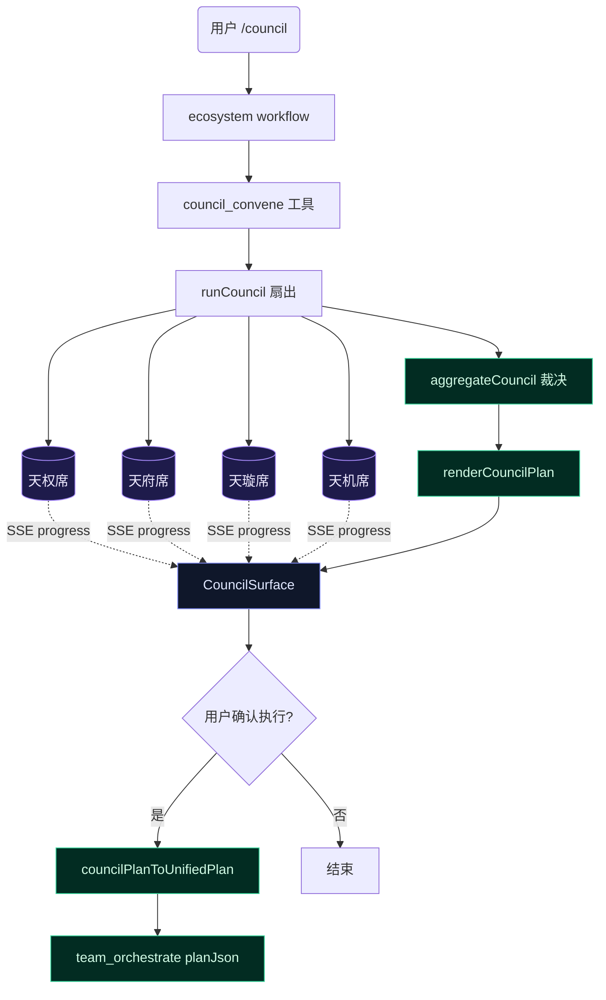

# 星图议事会·下一阶段设计方案

> 日期：2026-06-19
> 状态：设计已定稿，待执行
> 基于：当前代码快照（7 源文件 + 工具 + workflow + 27 绿测试）

## 0. 当前快照

后端议事会内核已超预期交付——计划 3 文件，实际 7 源文件 + 工具 + `/council` slash command + ecosystem workflow，全部 27 测试绿，team 测试零改动。

```
src/agent/council/
├── council-plan.ts          — schema + aggregateCouncil + resolveConflictsWithRebuttals
├── council-render.ts        — renderCouncilPlan + summarizeCouncilPlan
├── council-orchestrator.ts  — runCouncil + runCouncilDebate + buildSeatObjective + parseSeatContribution
├── council-routing.ts       — CouncilSeat + routeCouncilSeat + routing shadow
├── council-gate.ts          — isCouncilEnabled (COUNCIL=0 kill switch)
├── council-telemetry.ts     — CouncilSessionEvent + recordCouncilSession
├── council-to-plan.ts       — councilPlanToUnifiedPlan (纯函数桥)

连接面:
├── src/tools/council-convene.ts        — 工具定义 (已注册 bootstrap.ts)
├── src/workflows/ecosystem-workflows.ts — /council 命令解析 + workflow prompt
├── src/tui/slash-commands.ts           — /council help + resolve
├── src/tui/command-palette.tsx         — /council entry
├── src/agent/profile-registry.ts       — council_expert profile (line 90)
```

### 上一轮审查发现的三处缺陷

1. **P0-1 模型 tier 陷阱**：`recommendModelTier` 中 `isExploration` 因 `kind === 'plan'` 把 `council_expert` profile 捕获为 cheap。天权领航席（无 authority 硬地板）用 cheap 模型，评审质量不可接受。

2. **P0-2 默认席位缺天机**：`DEFAULT_COUNCIL_SEATS` 只有天权/天府/天璇 3 席，缺「前提质疑」天机席。I1 设计文档和原始计划都写 4 席。

3. **P0-3 `isConcurrencySafe: () => false`**：纯只读咨询工具不应阻塞与其他只读工具的并发。

---

## 1. 三波计划

```
P0 修复 (今天能做)          P1 闭环 (本周)              P2 提质 (后续)
─────────────────────────────────────────────────────────────────
模型 tier 陷阱              CouncilSurface TUI           工具负向描述
默认席位补天机              端到端 council→team 流        LoopGain 收敛检测
isConcurrencySafe 修正      planJson 交接验证             checkpoint 注入
                           /stars API + 名册 (可选)      proactive tool routing
```

---

## 2. P0 — 修复致命缺陷

三处改动互不依赖，可并行。

### P0-1：模型 tier 陷阱修复

**问题**：`council_expert` profile 无 tierLock，但 `recommendModelTier` 的 `isExploration` 检查 `kind === 'plan'` → 返回 cheap。天权（tianquan）在 policy 中无 authority 硬地板 → 直接掉进 cheap 兜底。

**修复**：在 `recommendModelTier`（`src/agent/model-tier-policy.ts`）中为 `council_expert` profile 加显式分支——最低 balanced，authority 升级路径叠加。

```mermaid
flowchart TD
    INPUT[profile=council_expert] --> CHECK{profile === council_expert?}
    CHECK -->|是| BAL[最低 balanced, authority 升级叠加]
    CHECK -->|否| NORMAL[走原有 policy 链]
    BAL --> AUTH{authority?}
    AUTH -->|tianfu + high risk| STRONG_A[strong + hardFloor]
    AUTH -->|tianfu / tianxuan| BALANCED[balanced + hardFloor]
    AUTH -->|tianquan / tianji / 其他| BALANCED
    BALANCED --> GATE{瑶光门 noDowngrade?}
    GATE -->|是| MAX[max(balanced, tierHint)]
    GATE -->|否| DONE[balanced]
    MAX --> DONE
    classDef critical fill:#7f1d1d,stroke:#f87171,color:#fecaca
    class CHECK,BAL critical
```

**涉及文件**：`src/agent/model-tier-policy.ts`
**测试**：`src/agent/__tests__/model-tier-policy.test.ts`（新增 `council_expert` 路由断言）
**验证**：
```bash
npx tsc --noEmit
npm exec -- tsx --test src/agent/__tests__/model-tier-policy.test.ts
npm exec -- tsx --test src/agent/council/__tests__/council-routing.test.ts
```

### P0-2：默认席位补天机

**修复**：`src/agent/council/council-routing.ts` 的 `DEFAULT_COUNCIL_SEATS` 加天机。
```typescript
{ authority: 'tianji', charter: '质疑：前提条件与边界假设' }
```

**涉及文件**：`src/agent/council/council-routing.ts`
**测试**：更新 `council-routing.test.ts` 覆盖天机→balanced 路径
**验证**：
```bash
npm exec -- tsx --test src/agent/council/__tests__/council-routing.test.ts
npm exec -- tsx --test src/tools/__tests__/council-convene.test.ts
```

### P0-3：isConcurrencySafe 修正

**修复**：`src/tools/council-convene.ts` 中 `isConcurrencySafe: () => true`。

**涉及文件**：`src/tools/council-convene.ts`（1 行改动）
**验证**：
```bash
npm exec -- tsx --test src/tools/__tests__/council-convene.test.ts
```

---

## 3. P1 — 闭环

P1-1 和 P1-2 互依赖（先做 P1-1 再做 P1-2），P1-3 独立。

### P1-1：CouncilSurface TUI

当前议事会结果仅通过模型 echo markdown 呈现——用户看到的是 LLM 转述，不是系统原生的评审界面。最小可行版本：

- `<CouncilSurface>` 组件：四席卡片并排
- 通过 SSE delegation 事件接收各席实时进度
- 全席完成后渲染裁决面板（接受/拒绝/暂缓 + 冲突表 + 最终任务表）
- 用户确认后通过 `councilPlanToUnifiedPlan` → `team_orchestrate` planJson 执行



**涉及文件**（新建）：
| 文件 | 职责 |
|------|------|
| `src/tui/CouncilSurface.tsx` | 四席卡片 + 裁决面板 |
| `src/tui/__tests__/CouncilSurface.test.tsx` | 渲染 + 进度 + 裁决断言 |

**阻塞点**：SSE delegation 进度回调当前只传 `completed/total` 计数（不含具体 workOrderId）。需要确认现有事件字段是否够用，或扩展 `onDelegationActivity` 携带席位信息。

### P1-2：端到端 council→team 流程验证

`councilPlanToUnifiedPlan` 纯函数已有完整测试，但从未在真实 session 中走通完整链路。需要集成测试：

- mock 四席 worker 返回 → council 裁决 → 产出 planJson → feed 给 `team_orchestrate` → 断言分波正确、files 字段驱动同文件串行

**涉及文件**（新建）：
| 文件 | 职责 |
|------|------|
| `src/agent/council/__tests__/council-e2e.test.ts` | 端到端集成测试 |

### P1-3：/stars API + 星域名册（可选）

如果要做 TUI 星域可见，`GET /stars` 返回全量星域列表是最小代价入口。名册页面可作为独立 tab 或 Settings 子页。

**涉及文件**（新建）：
| 文件 | 职责 |
|------|------|
| `src/server/star-routes.ts` | GET /stars API |
| `src/tui/StarRosterSurface.tsx` | 星域卡片网格 |

---

## 4. P2 — 提质（来自头脑风暴低挂果实）

四个改动彼此独立，可在 P1 完成后分批推进。

### P2-1：工具负向描述

在工具 schema description 中加 "Do NOT use for" —— Anthropic 研究表明显著减少工具误选。

- `read_file`：Do NOT use for checking if a file exists (use file_info)
- `write_file`：Do NOT use for editing existing files (use edit_file or hash_edit)
- `grep`：Do NOT use for reading file contents (use read_file)

纯 prompt 层改动，不碰工具逻辑。

### P2-2：LoopGain 收敛检测

控制论思路：`E(n)/E(n-1)` —— 连续 N 轮同类操作 → 收敛增益 < 阈值 → advisory。

**涉及文件**（新建）：`src/agent/hooks/loopgain-hook.ts`

### P2-3：Checkpoint 注入

每 N 轮自动插入 checkpoint prompt：「当前已完成 X，剩余 Y，下一步 Z」。减少长任务中 agent 丢失上下文。

**涉及文件**（新建）：`src/agent/hooks/checkpoint-hook.ts`

### P2-4：Proactive tool routing

在 tool context 中注入「当前任务阶段 → 推荐工具集」映射：
- 探索期 → grep / glob / read_file / repo_map
- 编辑期 → edit_file / hash_edit / write_file
- 验证期 → run_tests / bash / typecheck

不强制，只是 prompt 提示。纯 tool-context 层改动。

---

## 5. 执行次序

```
P0-1 → P0-2 → P0-3  (并行)
    ↓
P1-1 → P1-2          (串行，P1-1 先)
    ↓
P1-3 (可选)
    ↓
P2-1 / P2-2 / P2-3 / P2-4  (任意顺序，彼此独立)
```

---

## 6. 安全不变量

- **解耦硬约束维持**：不碰 `team-orchestrator.ts` / `team-perspectives.ts` / `expert-router.ts`
- **council → team 唯一接口**：`councilPlanToUnifiedPlan` 纯函数桥，council 绝不直接调用 team 执行函数
- **裁决确定性**：`aggregateCouncil` / `resolveConflictsWithRebuttals` 保持纯函数（零 I/O、零 Date）
- **遥测旁路**：shadow/telemetry 始终 try-catch 包裹，失败不影响主流程

## 7. 不做的事

- 不碰 team-orchestrator / team-perspectives —— 解耦硬约束
- 不引入第三轮辩论 —— 两轮（出稿 + 反驳收敛）收敛收益已递减，更多轮 worker 成本线性增长
- 不做 I1 的 NewSessionDialog 星域选择器、Agent Manager 星符 —— 日常会话体验，与议事会核心价值无关
