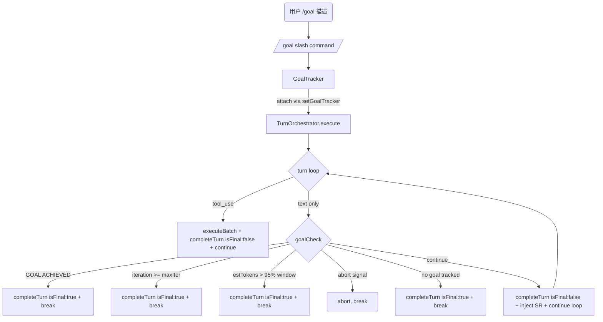

# Goal 自动继续实现计划

> **面向 AI 代理：** 使用 subagent-driven-development（推荐）或 executing-plans 逐任务实现。

**目标：** 在交互式 TUI 中实现 Ralph 式目标驱动循环——agent 设定目标后，如果 turn 结束时目标未达成，自动注入 continuation prompt 继续执行，无需用户手动发"继续"。

**架构：** 在 `TurnOrchestrator.execute()` 的 text-only turn 路径上，在 `completeTurn({ isFinal: true })` **之前**插入 goal completion check。如果存在活跃 goal 且未达成且未超迭代上限，调 `completeTurn({ isFinal: false })` 做非终态完结，注入 continuation system-reminder，然后 `continue` 循环；只有真正终止时才走 `isFinal: true`。goal 状态存储在内存中的 `GoalTracker` 对象（不落盘——goal 生命周期与单次 run() 绑定）。`GoalTracker` 作为 `TurnOrchestrator` 的可选字段，通过 `AgentLoop.setGoalTracker()` → `TurnOrchestrator.setGoalTracker()` 设置。`/goal <description>` slash command 激活 tracker 并将其附加到当前 run。

**技术栈：** TypeScript strict, node:test + assert/strict, 零新依赖

---

## 背景分析

### 现有代码

- **`src/goal-loop.ts`**：独立的 headless goal 循环。`runGoalLoop(config)` 接收 goal 文本 + budget + checkGoalAchieved 回调，每次迭代创建新 agent 并发送新 prompt。**未被 main.ts 接入**——`parseCliArgs` 解析了 `--goal` 但 `main()` 只消费了 `-p/--print` 路径。
- **`src/agent/turn-orchestrator.ts`**：turn 循环核心。当模型输出纯文本（无 tool_use）时，走到 L715 `isFinal: true` → `finalTurnCompleted = true` → `break`，把控制权交还用户。**这是 goal continuation 的精确拦截点。**
- **`src/context/task-contract.ts`**：`TaskContract` 接口含 `objective` / `successCriteria: string[]` / `status` 字段。`extractTaskContract()` 从用户消息提取契约。
- **`src/agent/turn-completion.ts:60`**：`runBeforeComplete` 在 `isFinal: true` 时调用——但这是 post-completion hook，turn 已标记为 final，不适合做"不 break 继续循环"的决策。

### Ralph (oh-my-claudecode) 机制对照

Ralph 用 Claude Code 的 Stop Hook 拦截 session 退出：检测 `prd.json` 中所有 story 的 `passes` 是否为 true，未完成则返回 `continue: false` 阻止退出并注入 continuation prompt。天枢不需要外部 hook——我们是 loop 本身，直接在 `execute()` 的 break 之前检查即可。

### 关键设计决策

1. **内存态 vs 落盘**：Ralph 用 `ralph-state.json` 落盘。天枢的 goal 生命周期与单次 `run()` 调用绑定（用户发 `/goal` → agent 执行 → 完成/取消），不需要跨 run 持久化。用内存对象 `GoalTracker` 足够，避免落盘文件的清理问题和多会话冲突。
2. **完成检测**：双信号——（a）agent 输出包含 `GOAL ACHIEVED`（显式信号，简单可靠）；（b）`GoalTracker.checkSuccess(streamedText)` 自定义回调（未来可接 deliver_task 门禁）。
3. **Bypass 条件**：user abort（`signal?.aborted`）、context limit（`estTokens > contextWindow * 0.95`）、max iterations 达上限。
4. **不修改 turn loop 结构**：在 `completeTurn` 调用前插入 goal check，根据 check 结果决定 `isFinal: true`（break）还是 `isFinal: false`（continue），不改变 for 循环的迭代逻辑。

---

## 安全不变量

1. **User abort 永远生效**：即使用户按 Esc，goal tracker 不能阻止 abort 路径。abort 检查（L300 `signal?.aborted`）在 goal check 之前。
2. **maxTurns 不被绕过**：goal continuation 消耗 maxTurns 预算——每个 continuation 迭代仍是一个 turn。当 `turn >= getMaxTurns()` 时 for 循环自然结束。
3. **context limit 不被绕过**：每次 continuation 前，如果 `estTokens` 超过窗口 95%，放行 break（让 compaction 或 session split 在下一轮处理）。
4. **Goal 可随时取消**：用户发任意非空消息都会终止当前 run（TUI onSubmit 调新 `agent.run()`），goal tracker 随 run 结束销毁。

## 数据流



---

## 任务清单

### 任务 1：GoalTracker 核心模块

**创建文件：**
- `src/agent/goal-tracker.ts` — GoalTracker 类
- `src/agent/__tests__/goal-tracker.test.ts` — 单元测试

**GoalTracker 接口定义（`src/agent/goal-tracker.ts`）：**

```typescript
export interface GoalTrackerConfig {
  goal: string
  maxIterations: number
  contextWindow: number
}

export interface GoalCheckResult {
  shouldContinue: boolean
  reason: 'achieved' | 'budget_exhausted' | 'context_limit' | 'continue' | 'no_goal'
  iteration: number
}

export class GoalTracker {
  private active = false
  private iteration = 0
  private readonly goal: string
  private readonly maxIterations: number
  private readonly contextWindow: number

  constructor(config: GoalTrackerConfig)
  isActive(): boolean
  getGoal(): string
  getIteration(): number
  getMaxIterations(): number
  /** Check if the goal is achieved or limits are hit. Does NOT mutate state. */
  check(streamedText: string, estimatedTokens: number, aborted: boolean): GoalCheckResult
  /** Advance iteration counter. Called when a continuation is decided. */
  advanceIteration(): void
  /** Deactivate the tracker (goal done or cancelled). */
  deactivate(): void
}
```

**完成检测逻辑（`check` 方法内部）：**
- 如果 `!this.active` → 返回 `{ shouldContinue: false, reason: 'no_goal' }`
- 如果 `aborted` → 返回 `{ shouldContinue: false, reason: 'no_goal' }`（让 abort 路径正常走）
- 如果 `streamedText` 包含 `"GOAL ACHIEVED"`（不区分大小写）→ 返回 `{ shouldContinue: false, reason: 'achieved' }`
- 如果 `this.iteration >= this.maxIterations` → 返回 `{ shouldContinue: false, reason: 'budget_exhausted' }`
- 如果 `estimatedTokens > this.contextWindow * 0.95` → 返回 `{ shouldContinue: false, reason: 'context_limit' }`
- 否则 → 返回 `{ shouldContinue: true, reason: 'continue' }`

**测试用例（`src/agent/__tests__/goal-tracker.test.ts`）：**

```
describe('GoalTracker')
  it('isActive returns false before activation')
  it('check returns no_goal when inactive')
  it('check returns achieved when streamedText contains GOAL ACHIEVED')
  it('check returns achieved for case-insensitive goal achieved')
  it('check returns budget_exhausted when iteration >= maxIterations')
  it('check returns context_limit when estTokens > 95% of contextWindow')
  it('check returns continue when goal not yet achieved')
  it('check returns no_goal when aborted is true')
  it('advanceIteration increments the counter')
  it('deactivate sets active to false')
```

**验证命令：**
```bash
npx tsc --noEmit
node --import tsx --test src/agent/__tests__/goal-tracker.test.ts
```

**预期结果：** 10/10 pass, typecheck 通过

**Commit：** `feat(agent): add GoalTracker for turn-loop goal continuation`

---

### 任务 2：TurnOrchestrator 接入 GoalTracker

**修改文件：**
- `src/agent/turn-orchestrator.ts` — TurnOrchestrator 加 goalTracker 字段 + setGoalTracker 方法；在 text-only break 前插入 goal check
- `src/agent/__tests__/turn-orchestrator-goal.test.ts` — 新建，测试 goal continuation 逻辑

**`TurnOrchestrator` 新增字段与方法（`turn-orchestrator.ts`）：**

```typescript
export class TurnOrchestrator {
  goalTracker: GoalTracker | null = null

  setGoalTracker(tracker: GoalTracker | null): void {
    this.goalTracker = tracker
  }

  constructor(private deps: TurnOrchestratorDeps) {}
  // ...
}
```

**turn loop 修改点（`execute()` 方法内）：**

当前代码（L705-716，`consecutiveNoToolTurns` 递增后的 text-only turn 终结路径）：
```typescript
        this.deps.setConsecutiveNoToolTurns(this.deps.getConsecutiveNoToolTurns() + 1)

        this.deps.flushMeridianTurn()
        await rejectOnAbort(
          this.deps.completeTurn({
            turn,
            isFinal: true,
            emitBadge: true,
            callbacks,
          }),
          signal!,
          'final-complete',
        )
        finalTurnCompleted = true
        this.deps.resetEvidence()
        break
```

修改为（goal check 在 completeTurn **之前**，根据结果决定 isFinal）：

```typescript
        this.deps.setConsecutiveNoToolTurns(this.deps.getConsecutiveNoToolTurns() + 1)

        // ── Goal continuation check ──
        // Must run BEFORE completeTurn so we can choose isFinal:true vs isFinal:false.
        const tracker = this.goalTracker
        let shouldContinueGoal = false
        if (tracker?.isActive()) {
          const goalResult = tracker.check(
            this.deps.getStreamedText(),
            this.deps.getEstimatedTokens(),
            signal?.aborted === true,
          )
          if (goalResult.shouldContinue) {
            shouldContinueGoal = true
            tracker.advanceIteration()
          } else {
            // Any terminal reason: deactivate the tracker so subsequent turns
            // aren't checked. Emit a closing message for achievement.
            if (goalResult.reason === 'achieved') {
              this.deps.appendSystemReminder(
                `[GOAL] 目标已达成（${tracker.getIteration()} 次迭代）。Goal tracker 已关闭。`
              )
            }
            tracker.deactivate()
          }
        }

        this.deps.flushMeridianTurn()
        if (shouldContinueGoal) {
          // Non-final completion: archive this turn's output and inject continuation.
          await rejectOnAbort(
            this.deps.completeTurn({ turn, isFinal: false, callbacks }),
            signal!,
            'goal-continue-complete',
          )
          const iter = tracker!.getIteration()
          const maxIter = tracker!.getMaxIterations()
          this.deps.appendSystemReminder(
            `[GOAL CONTINUATION ${iter}/${maxIter}] 目标尚未达成。继续执行。\n` +
            `目标: ${tracker!.getGoal()}\n` +
            `上轮输出摘要: ${this.deps.getStreamedText().slice(-500)}\n` +
            `完成后输出 "GOAL ACHIEVED" 声明完成。`
          )
          continue  // re-enter the for loop for the next iteration
        }

        // Final completion: goal inactive / achieved / budget exhausted / context limit.
        await rejectOnAbort(
          this.deps.completeTurn({
            turn,
            isFinal: true,
            emitBadge: true,
            callbacks,
          }),
          signal!,
          'final-complete',
        )
        finalTurnCompleted = true
        this.deps.resetEvidence()
        break
```

**关键变化 vs 原计划：**
- goal check 移到 `completeTurn` **之前**，避免先发 `isFinal: true` 再推翻的矛盾状态。
- continuation 路径调用 `completeTurn({ isFinal: false })` 做非终态完结，与 tool_use 路径一致。
- 所有非 continue 结果统一调 `tracker.deactivate()`，不遗漏 budget_exhausted / context_limit / no_goal 分支。
- `GoalTracker` 直接挂在 `TurnOrchestrator` 上，不经过 deps 间接层。`AgentLoop.setGoalTracker()` 转发到 `this.turnOrchestrator.setGoalTracker(tracker)`。

**测试用例（`src/agent/__tests__/turn-orchestrator-goal.test.ts`）：**

此测试需要 mock TurnOrchestratorDeps 并构造一个最小化的 TurnOrchestrator 实例。测试聚焦于：goal check 在 completeTurn 之前，且 isFinal 取决于 check 结果。

```
describe('TurnOrchestrator goal continuation')
  it('calls completeTurn with isFinal=false and continues when goal not achieved')
  it('calls completeTurn with isFinal=true and breaks when GOAL ACHIEVED')
  it('breaks without appending continuation SR when budget exhausted')
  it('breaks when context limit hit, tracker deactivated')
  it('no goal tracker — normal isFinal=true break preserved')
  it('deactivates tracker after terminal condition (not left dangling)')
```

**反证测试表：**
| 错误实现 | 哪条测试会红 |
|----------|------------|
| goal check 在 completeTurn(true) 之后（原计划顺序） | "isFinal=false when goal not achieved" 失败（isFinal 在一次 run 中先 true 后 false） |
| 不调 tracker.deactivate() 在 budget_exhausted 路径 | "deactivates tracker after terminal" 失败（tracker.isActive() 仍为 true） |
| 不调 advanceIteration | iteration 不增长，budget 测试不会正确触发 |
| 用 `tracker.maxIterations` 而非 `tracker.getMaxIterations()` | TypeScript 编译失败 |

**验证命令：**
```bash
npx tsc --noEmit
node --import tsx --test src/agent/__tests__/turn-orchestrator-goal.test.ts
```

**预期结果：** 6/6 pass, typecheck 通过

**Commit：** `feat(agent): wire GoalTracker into TurnOrchestrator for auto-continue`

---

### 任务 3：AgentLoop 转发 GoalTracker 到 TurnOrchestrator

**修改文件：**
- `src/agent/loop.ts` — AgentLoop.setGoalTracker() 转发到 turnOrchestrator
- `src/agent/__tests__/loop-factory-goal.test.ts` — 新建，验证 setGoalTracker 连线

**`AgentLoop` 新增方法（`loop.ts`，在 `run()` 方法附近）：**

```typescript
  /** Attach a GoalTracker to the current run. The tracker is consumed by
   *  TurnOrchestrator.execute() which reads this.turnOrchestrator.goalTracker. */
  setGoalTracker(tracker: GoalTracker | null): void {
    this.turnOrchestrator.setGoalTracker(tracker)
  }
```

**注：** 不需要在 `TurnOrchestratorDeps` 中添加 `getGoalTracker`。`TurnOrchestrator.execute()` 直接读 `this.goalTracker`（任务 2 已定义该字段）。`AgentLoop.setGoalTracker()` 只是把 tracker 转发到 orchestrator 实例上——这是最小侵入的连线方式。

**测试用例（`src/agent/__tests__/loop-factory-goal.test.ts`）：**

```
describe('AgentLoop setGoalTracker wiring')
  it('setGoalTracker(null) clears the orchestrator tracker')
  it('setGoalTracker(tracker) sets tracker on orchestrator')
  it('no tracker set — orchestrator.goalTracker is null')
```

**验证命令：**
```bash
npx tsc --noEmit
node --import tsx --test src/agent/__tests__/loop-factory-goal.test.ts
```

**预期结果：** 3/3 pass, typecheck 通过

**Commit：** `feat(agent): wire AgentLoop.setGoalTracker to TurnOrchestrator`

---

### 任务 4：/goal slash command + headless --goal 接入

**修改文件：**
- `src/tui/slash-commands.ts` — `/goal` 命令处理
- `src/main.ts` — `--goal` CLI 路径消费 `runGoalLoop`
- `src/tui/command-palette.ts` — 注册 `/goal` 命令
- `src/tui/__tests__/slash-commands-goal.test.ts` — 新建

**`/goal` slash command 行为（`slash-commands.ts`）：**

在 `handleSlashCommand` 的 switch 中添加 `case '/goal':` 分支。
注意：返回 `false` 会导致原始输入（含 `/goal` 前缀）被透传给 agent——不可接受。
改为在 handler 内直接提交纯目标 prompt，返回 `true`（已处理）。
为此，`SlashHandlerContext` 需新增一个可选方法 `submitToAgent(prompt: string): void`，
由 `SlashRouter` 在构建 context 时注入，其实现为 `this.app.submitText(prompt)`（绕过 slash 路由）。

```typescript
    case '/goal': {
      const goalText = parts.slice(1).join(' ').trim()
      if (!goalText) {
        pushStatic(createLogEntry({ type: 'system', content: 'Usage: /goal <task description>\nSets a persistent goal. The agent will auto-continue until the goal is achieved or the iteration budget is exhausted.\nCancel with /cancel-goal.' }))
        setIsStreaming(false)
        return true
      }
      const tracker = new GoalTracker({
        goal: goalText,
        maxIterations: 50,
        contextWindow: ctx.maxTokens,
      })
      ctx.agent.setGoalTracker(tracker)
      pushStatic(createLogEntry({ type: 'system', content: `🎯 Goal activated: ${goalText}\nMax iterations: 50. Output "GOAL ACHIEVED" to complete, or /cancel-goal to abort.` }))
      setIsStreaming(false)
      // Submit the goal prompt directly to agent pipeline (bypassing raw slash input).
      const prompt = `[GOAL MODE] ${goalText}\n\nYou are now in goal-driven mode. Work toward this goal continuously. When fully complete, output "GOAL ACHIEVED" on its own line.`
      ctx.submitToAgent?.(prompt)
      return true
    }
```

**`SlashHandlerContext` 新增字段（`slash-commands.ts`）：**

```typescript
export interface SlashHandlerContext {
  // ... existing fields ...
  /** Submit a prompt directly to the agent pipeline, bypassing slash routing.
   *  Used by commands that need to transform the input before sending. */
  submitToAgent?: (prompt: string) => void
}
```

**`SlashRouter` 适配（`slash-router.ts`）：**

在 `handlerCtx` 构造中添加：

```typescript
      submitToAgent: (prompt: string) => {
        this.app.submitText(prompt)
      },
```

此模式已存在于现有代码——`SlashRouter.route()` 的 `resolveAppPromptInput` 分支同样调用 `this.app.submitText(resolved)`（L57），复用同一出口。

**`/cancel-goal` slash command：**

```typescript
    case '/cancel-goal': {
      ctx.agent.setGoalTracker(null)
      pushStatic(createLogEntry({ type: 'system', content: '🚫 Goal cancelled.' }))
      setIsStreaming(false)
      return true
    }
```

**command-palette.ts 注册：**

在 `getPaletteCommands()` 的命令列表中添加：

```typescript
  { name: '/goal', description: 'Set a persistent goal — agent auto-continues until achieved' },
  { name: '/cancel-goal', description: 'Cancel the active goal' },
```

**`--goal` headless 路径（`main.ts`）：**

在 `main()` 函数的 headless 分支中（L150 `isHeadless` 检查之前），添加 `--goal` 路径：

```typescript
  // rivet --goal "task description" [--budget N]
  const parsed = parseCliArgs(args)
  if (parsed.goal) {
    const { runGoalLoop } = await import('./goal-loop.js')
    const { AgentLoop } = await import('./agent/loop.js')
    // ... (same agent construction as headless -p path, extracted to shared factory)
    const budget = parsed.budget ?? 50
    const result = await runGoalLoop({
      goal: parsed.goal,
      budget,
      createAgent: () => { /* same as headless createAgent */ },
      checkGoalAchieved: (text) => /GOAL ACHIEVED/i.test(text),
      streamJson: parsed.streamJson,
    })
    process.stdout.write(JSON.stringify({
      achieved: result.achieved,
      iterations: result.iterations,
      exitReason: result.exitReason,
      totalUsage: result.totalUsage,
    }) + '\n')
    process.exit(result.achieved ? 0 : 1)
  }
```

**测试用例（`src/tui/__tests__/slash-commands-goal.test.ts`）：**

```
describe('/goal slash command')
  it('sets GoalTracker on agent and shows activation message')
  it('shows usage when no goal text provided')
  it('/cancel-goal clears the tracker')
```

**验证命令：**
```bash
npx tsc --noEmit
node --import tsx --test src/tui/__tests__/slash-commands-goal.test.ts
```

**预期结果：** 3/3 pass, typecheck 通过

**Commit：** `feat(tui): add /goal and /cancel-goal commands + wire --goal CLI`

---

### 任务 5：端到端验证 + 已有 goal-loop 测试回归

**修改文件：** 无新文件

**验证步骤：**

1. 运行已有的 goal-loop 测试确保无回归：
```bash
node --import tsx --test src/__tests__/goal-loop.test.ts src/__tests__/goal-loop-integration.test.ts
```
预期：全部 pass（goal-loop.ts 未被修改）

2. 运行本次新建的 goal 相关测试确保全部通过：
```bash
node --import tsx --test src/agent/__tests__/goal-tracker.test.ts
node --import tsx --test src/agent/__tests__/turn-orchestrator-goal.test.ts
node --import tsx --test src/agent/__tests__/loop-factory-goal.test.ts
node --import tsx --test src/tui/__tests__/slash-commands-goal.test.ts
```
预期：全部 pass

3. 全量 typecheck：
```bash
npx tsc --noEmit
```
预期：0 errors

4. 手动验收（需要 TTY，不在自动化测试范围）：
```bash
node dist/main.js
# 在 TUI 中输入: /goal 检查 src/agent/loop.ts 中所有 TODO 注释并清理
# 观察 agent 是否自动继续直到输出 "GOAL ACHIEVED"
```

**Commit：** `test(agent): verify goal continuation e2e + regression check`

---

## 规格覆盖检查

| 需求 | 任务 |
|------|------|
| `/goal` 创建目标 | 任务 4 |
| agent 自动继续直到目标达成 | 任务 2（turn loop check） |
| 迭代上限防无限循环 | 任务 1（maxIterations） |
| user abort 永远生效 | 任务 1（check 的 aborted 参数） |
| context limit bypass | 任务 1（95% 检查） |
| `/cancel-goal` 取消 | 任务 4 |
| `--goal` CLI headless | 任务 4 |
| 完成检测（GOAL ACHIEVED） | 任务 1（check 方法） |
| GlanceBar 显示 goal 状态 | 后续增强（不在 MVP 范围） |
| goal-state 落盘 | 不做（内存态足够，见设计决策 1） |

## 占位符扫描

无 TODO / TBD / 待定 / 后续实现 / 补充细节。所有接口、方法签名、测试用例均已定义。

## 类型一致性

- `GoalTracker` 类名跨任务 1-4 一致
- `GoalTrackerConfig` / `GoalCheckResult` 接口在任务 1 定义，任务 2-4 引用
- `goalTracker` 字段挂在 `TurnOrchestrator` 上（任务 2 定义，任务 3 通过 AgentLoop 转发设置，任务 4 通过 slash-commands 调用 AgentLoop.setGoalTracker）
- `setGoalTracker()` 方法在 TurnOrchestrator（任务 2）、AgentLoop（任务 3）、slash-commands（任务 4）中签名一致：接收 `GoalTracker | null`
- `/goal` 和 `/cancel-goal` 命令名在 slash-commands、command-palette、测试中一致
- `SlashHandlerContext.submitToAgent?` 可选方法在 slash-commands.ts（接口）、slash-router.ts（适配器）中类型一致

---

## 审查修正记录（2026-06-19）

以下问题已在本次修订中修正：

| # | 问题 | 修正 |
|---|------|------|
| 1 | goal check 在 `completeTurn({ isFinal: true })` **之后**执行，导致 TUI 状态机在 continuation 时收到错误 isFinal 信号 | 将 goal check 移到 completeTurn **之前**，continuation 路径用 `isFinal: false` |
| 2 | `/goal` handler 返回 `false` 导致原始 `/goal <text>` 前缀送入 agent | 新增 `SlashHandlerContext.submitToAgent()` 方法，handler 内直接提交纯目标 prompt 并返回 `true` |
| 3 | `GoalTracker` 接口缺少 `getMaxIterations()` 但任务 2 引用它 | 在任务 1 接口定义中加入 `getMaxIterations(): number` |
| 4 | `budget_exhausted` / `context_limit` 路径未调 `tracker.deactivate()` | 所有非 continue 结果统一调 `deactivate()`，不遗漏任何分支 |
| 5 | `GoalTracker` 通过 `TurnOrchestratorDeps` 间接注入（增加 70+ 字段接口的负担） | 改为 `TurnOrchestrator` 直接持有 `goalTracker` 字段，`AgentLoop.setGoalTracker()` 转发到 `this.turnOrchestrator.setGoalTracker()` |

### 可选增强（建议纳入迭代计划）

1. **GlanceBar 目标状态指示器**：显示 `🎯 3/50` 计数器，只需读 `turnOrchestrator.goalTracker` 的状态，~5 行 UI 代码。建议纳入 MVP 而非推迟。
2. **`completeTurn({ isFinal: false })` 的 continuation 路径**：当前 plan 已修正——continuation 前调非终态 completeTurn，与 tool_use 路径一致。
3. **`--goal` headless 与 TUI goal 共享 GoalTracker**：当前两者使用不同机制（`runGoalLoop` vs `GoalTracker`），后续可考虑统一——headless 模式也复用 `TurnOrchestrator.execute()` + `GoalTracker`。
