# 子代理星名透传 实现计划

> **面向 AI 代理：** 使用 subagent-driven-development（推荐）或 executing-plans 逐任务实现。

**目标：** 把 `authority`（星域 id）从 coordinator 透传到 TUI 显示层，让子代理面板显示星名（"破军"）而非 profile 中文名（"侦察·代码"）。

**架构：** authority 已经存在于 `WorkOrder` 上（`delegate_task authority='pojun'` 传入），但在 `WorkerActivityEvent → DelegationActivity → FleetRegistry → FleetWorkerView` 这条事件链里丢失了。方案是在链路每一层加一个 `authority?: string` 字段，渲染层优先用星名、回退到 profile 中文名。改动是纯加法——每个结构体加一个可选字段，每个发射点多传一个值，渲染层加一个 if 分支。不改任何已有字段的语义。

**技术栈：** TypeScript strict + node:test + assert/strict

---

## 数据流图（当前断裂 vs 修复后）

```mermaid
flowchart TD
  subgraph 当前断裂
    D1["delegate_task authority='pojun'"] --> C1["coordinator order.authority='pojun'"]
    C1 -->|"❌ 不传 authority"| WAE1["WorkerActivityEvent\n{workOrderId, profile, kind, detail}"]
    WAE1 -->|"❌ 不传 authority"| DA1["DelegationActivity\n{workOrderId, profile, status, progressLine}"]
    DA1 --> FR1["FleetRegistry\n→ FleetWorkerView"]
    FR1 --> WF1["worker-fleet.ts\n显示 profileLabel('code_scout')\n= '侦察·代码'"]
  end

  subgraph 修复后
    D2["delegate_task authority='pojun'"] --> C2["coordinator order.authority='pojun'"]
    C2 -->|"✅ authority: order.authority"| WAE2["WorkerActivityEvent\n{+ authority?}"]
    WAE2 -->|"✅ authority: ev.authority"| DA2["DelegationActivity\n{+ authority?}"]
    DA2 --> FR2["FleetRegistry\n→ FleetWorkerView\n{+ authority?}"]
    FR2 --> WF2["worker-fleet.ts\nauthority ? starName : profileLabel\n= '破军'"]
  end
```



## 事实流图

| 字段 | 上游来源 | 中间结构 | 消费者 | 断裂? |
|------|---------|---------|--------|------|
| `order.authority` | delegate_task/batch input | WorkOrder.authority | coordinator.ts:641/654/670/880/940 | 否，coordinator 内可用 |
| `WorkerActivityEvent.authority` | coordinator.ts:940 发射 | — | delegate-*.ts streamActivity | **是** — 不在 event 里 |
| `DelegationActivity.authority` | delegate-*.ts streamActivity | — | FleetRegistry.apply | **是** — 不在 activity 里 |
| `FleetWorkerView.authority` | FleetRegistry.toView | — | worker-fleet.ts assignLabels | **是** — 不在 view 里 |
| 终态回调 authority | delegate-*.ts 终态 for-loop | — | FleetRegistry.apply | 否 — FleetRegistry.apply 已有守卫：终态事件缺字段时保留 running 阶段写入的值 |

## 条件矩阵

| authority | profile | 显示标签 | 序号? |
|-----------|---------|---------|------|
| `'pojun'` | `'code_scout'` | `破军` | 同 authority 多 worker 时加 #N |
| `'tianxuan'` | `'code_scout'` | `天璇` | 同上 |
| `undefined` | `'code_scout'` | `侦察·代码` | 同 profile 多 worker 时加 #N（当前行为不变） |
| `undefined` | `'reviewer'` | `审查` | 同上 |
| `'pojun'`（终态回调） | — | 不变 — FleetRegistry 守卫保留 running 阶段写入的 authority | — |

## 安全不变量

- `authority` 是可选字段——不传 authority 的 delegate_task 保持当前行为（profile 中文名）
- 终态回调（`delegate-*.ts` 终态 for-loop）**不需要**补 authority——FleetRegistry.apply 已有守卫逻辑（`if (activity.profile) existing.profile = activity.profile`），authority 同理处理
- `starDomainRegistry.get(id)?.name` 对未知 id 返回 undefined——渲染层回退到 profileLabel

---

## 任务 1：给 WorkerActivityEvent 加 authority 字段

**修改文件：** `src/agent/coordinator.ts`

### 步骤 1.1：写失败测试

**创建测试：** `src/agent/__tests__/worker-activity-authority.test.ts`

```typescript
import { test } from 'node:test'
import assert from 'node:assert/strict'

test('WorkerActivityEvent 类型包含可选 authority 字段', () => {
  // 类型级断言：编译通过即证明字段存在
  const ev = {
    workOrderId: 'wo_test',
    profile: 'code_scout',
    kind: 'text' as const,
    detail: 'hello',
    authority: 'pojun',
  }
  assert.equal(ev.authority, 'pojun')
})
```

### 步骤 1.2：修改 WorkerActivityEvent 接口

**文件：** `src/agent/coordinator.ts`，约第 78 行

在 `WorkerActivityEvent` 接口加 `authority?: string`：

```typescript
export interface WorkerActivityEvent {
  workOrderId: string
  profile: string
  kind: 'text' | 'thinking' | 'tool_use' | 'tool_result'
  detail?: string
  authority?: string  // ← 新增
}
```

### 步骤 1.3：coordinator 发射 activity 时传入 authority

**文件：** `src/agent/coordinator.ts`，约第 940 行

当前代码：
```typescript
requestUpstream?.({ workOrderId: order.id, profile: order.profile, kind, detail })
```

改为：
```typescript
requestUpstream?.({ workOrderId: order.id, profile: order.profile, kind, detail, authority: order.authority })
```

同时在升级重试路径（约第 1134 行）的 `upgradedConfig.onActivity` 也补上 authority：

当前：
```typescript
upgradedConfig.onActivity = (kind, detail) => {
  this.liveness.tick(order.id)
  upstreamActivity?.(kind, detail)
}
```

改为：
```typescript
upgradedConfig.onActivity = (kind, detail) => {
  this.liveness.tick(order.id)
  upstreamActivity?.(kind, detail)
  try {
    requestUpstream?.({ workOrderId: order.id, profile: order.profile, kind, detail, authority: order.authority })
  } catch { /* UI upstream must never break dispatch */ }
}
```

注意：当前升级路径的 `onActivity` 只调了 `upstreamActivity` 但漏掉了 `requestUpstream`（与第 936 行的初始路径不一致）。这是一个已有 bug——初始路径同时调两个，升级路径只调一个。本步骤同时修复。

### 步骤 1.4：验证

```bash
npx tsc --noEmit 2>&1 | grep -c "coordinator"
# 预期：0
```

```bash
TMPDIR=/tmp node --import tsx --test src/agent/__tests__/worker-activity-authority.test.ts
# 预期：1 pass
```

```bash
git add src/agent/coordinator.ts src/agent/__tests__/worker-activity-authority.test.ts
git commit -m "feat(agent): WorkerActivityEvent 透传 authority 字段"
```

---

## 任务 2：给 DelegationActivity 加 authority 字段

**修改文件：** `src/tools/types.ts`

### 步骤 2.1：修改 DelegationActivity 接口

**文件：** `src/tools/types.ts`，约第 11 行

当前：
```typescript
export interface DelegationActivity {
  workOrderId: string
  parentToolId: string
  profile?: string
  status: 'running' | 'passed' | 'failed' | 'blocked' | 'escalated'
  progressLine?: string
}
```

改为：
```typescript
export interface DelegationActivity {
  workOrderId: string
  parentToolId: string
  profile?: string
  status: 'running' | 'passed' | 'failed' | 'blocked' | 'escalated'
  progressLine?: string
  authority?: string
}
```

### 步骤 2.2：验证

```bash
npx tsc --noEmit 2>&1 | grep -c "types.ts"
# 预期：0
```

```bash
TMPDIR=/tmp node --import tsx --test src/tui/__tests__/fleet-registry.test.ts
# 预期：8 pass（现有测试不应回归——新字段可选）
```

```bash
git add src/tools/types.ts
git commit -m "feat(types): DelegationActivity 加 authority 可选字段"
```

---

## 任务 3：三个委派工具的 streamActivity 透传 authority

**修改文件：** `src/tools/delegate-task.ts`、`src/tools/delegate-batch.ts`、`src/tools/team-orchestrate.ts`

三个文件的 streamActivity 闭包结构完全一致，改动也一样。

### 步骤 3.1：delegate-task.ts 透传

**文件：** `src/tools/delegate-task.ts`，约第 107-112 行

当前：
```typescript
params.onWorkerActivity?.({
  workOrderId: ev.workOrderId,
  parentToolId: params.toolUseId,
  profile: ev.profile,
  status: 'running',
  progressLine: activityProgressLine(ev),
})
```

改为（加一行 `authority: ev.authority`）：
```typescript
params.onWorkerActivity?.({
  workOrderId: ev.workOrderId,
  parentToolId: params.toolUseId,
  profile: ev.profile,
  authority: ev.authority,
  status: 'running',
  progressLine: activityProgressLine(ev),
})
```

### 步骤 3.2：delegate-batch.ts 透传

**文件：** `src/tools/delegate-batch.ts`，约第 170-175 行

同样加 `authority: ev.authority` 到 `params.onWorkerActivity?.({...})` 调用中。

### 步骤 3.3：team-orchestrate.ts 透传

**文件：** `src/tools/team-orchestrate.ts`，约第 135-141 行

同样加 `authority: ev.authority` 到 `params.onWorkerActivity?.({...})` 调用中。

### 步骤 3.4：验证

```bash
npx tsc --noEmit 2>&1 | grep -E "delegate-task|delegate-batch|team-orchestrate"
# 预期：0（无匹配行）
```

```bash
TMPDIR=/tmp node --import tsx --test src/tools/__tests__/worker-activity-stream.test.ts src/tools/__tests__/delegate-task.test.ts
# 预期：全部 pass
```

```bash
git add src/tools/delegate-task.ts src/tools/delegate-batch.ts src/tools/team-orchestrate.ts
git commit -m "feat(tools): 委派工具 streamActivity 透传 authority 到 DelegationActivity"
```

---

## 任务 4：FleetRegistry 存储 authority

**修改文件：** `src/tui/fleet-registry.ts`

### 步骤 4.1：写失败测试

**修改测试：** `src/tui/__tests__/fleet-registry.test.ts`

在文件末尾追加：

```typescript
test('FleetRegistry: authority 在 running 事件中写入，终态保留', () => {
  const fleet = new FleetRegistry()
  fleet.apply({
    workOrderId: 'wo_x',
    parentToolId: 'tool_a',
    profile: 'code_scout',
    authority: 'pojun',
    status: 'running',
    progressLine: '搜索中',
  }, 1000)
  const active = fleet.getActiveWorkers(2000)
  assert.equal(active[0]!.authority, 'pojun')

  // 终态事件不传 authority → 保留 running 阶段写入的值
  fleet.apply({
    workOrderId: 'wo_x',
    parentToolId: 'tool_a',
    status: 'passed',
    progressLine: 'done',
  }, 3000)
  const all = fleet.getWorkers(4000)
  assert.equal(all[0]!.authority, 'pojun')
})

test('FleetRegistry: 无 authority 时字段为 undefined', () => {
  const fleet = new FleetRegistry()
  fleet.apply(running('wo_y', 'tool_b'), 0)
  const active = fleet.getActiveWorkers()
  assert.equal(active[0]!.authority, undefined)
})
```

运行确认失败（FleetWorkerView 没有 authority 字段）：

```bash
TMPDIR=/tmp node --import tsx --test src/tui/__tests__/fleet-registry.test.ts
# 预期：新测试 fail（tsc 报错或运行时 undefined !== 'pojun'）
```

### 步骤 4.2：给 FleetRecord 加 authority

**文件：** `src/tui/fleet-registry.ts`，FleetRecord 接口（约第 36 行）

加字段 `authority?: string`。

### 步骤 4.3：FleetWorkerView 加 authority

**文件：** `src/tui/fleet-registry.ts`，FleetWorkerView 接口（约第 17 行）

加字段 `authority?: string`。

### 步骤 4.4：apply 方法存储 authority

**文件：** `src/tui/fleet-registry.ts`，apply 方法（约第 80 行）

在新建记录时加 `authority: activity.authority`。在已存在记录的更新分支中加守卫 `if (activity.authority) existing.authority = activity.authority`（与 profile 的守卫模式一致）。

### 步骤 4.5：toView 方法暴露 authority

**文件：** `src/tui/fleet-registry.ts`，toView 方法（约第 100 行）

在返回对象中加 `authority: r.authority`。

### 步骤 4.6：验证

```bash
TMPDIR=/tmp node --import tsx --test src/tui/__tests__/fleet-registry.test.ts
# 预期：10 pass（原 8 + 新 2）
```

```bash
git add src/tui/fleet-registry.ts src/tui/__tests__/fleet-registry.test.ts
git commit -m "feat(tui): FleetRegistry 存储并暴露 authority 字段"
```

---

## 任务 5：profile-labels 加 authority→星名查询

**修改文件：** `src/tui/format/profile-labels.ts`

### 步骤 5.1：加星名查询函数

**文件：** `src/tui/format/profile-labels.ts`

在文件末尾追加：

```typescript
import { starDomainRegistry } from '../../agent/star-domain-registry.js'

/**
 * 返回 authority 对应的中文星名（如 'pojun' → '破军'）。
 * 未知 authority 返回 null（调用方回退到 profileLabel）。
 */
export function authorityStarName(authority: string | undefined): string | null {
  if (!authority) return null
  const domain = starDomainRegistry.get(authority)
  return domain?.name ?? null
}
```

### 步骤 5.2：验证

```bash
npx tsc --noEmit 2>&1 | grep "profile-labels"
# 预期：0
```

```bash
git add src/tui/format/profile-labels.ts
git commit -m "feat(tui): profile-labels 加 authorityStarName 星名查询"
```

---

## 任务 6：worker-fleet 渲染层优先用星名

**修改文件：** `src/tui/format/worker-fleet.ts`、`src/tui/format/__tests__/worker-fleet.test.ts`

### 步骤 6.1：写失败测试

**修改测试：** `src/tui/format/__tests__/worker-fleet.test.ts`

追加测试用例：

```typescript
describe('buildWorkerFleetLines — authority 星名', () => {
  it('有 authority 时显示星名替代 profile 中文名', () => {
    const w = worker({ authority: 'pojun', profile: 'code_scout' })
    const lines = buildWorkerFleetLines([w], { done: 0, total: 1, running: 1 }, 80)
    assert.ok(lines[1]!.includes('破军'), `应包含星名"破军"，实际: ${lines[1]}`)
    assert.ok(!lines[1]!.includes('侦察'), `不应包含 profile 中文名`)
  })

  it('无 authority 时保持 profile 中文名回退', () => {
    const w = worker({ authority: undefined, profile: 'code_scout' })
    const lines = buildWorkerFleetLines([w], { done: 0, total: 1, running: 1 }, 80)
    assert.ok(lines[1]!.includes('侦察'), `应包含 profile 中文名"侦察"`)
  })

  it('同 authority 多 worker 时加序号', () => {
    const w1 = worker({ workerId: 'w1', shortLabel: 'W1', authority: 'pojun', profile: 'code_scout' })
    const w2 = worker({ workerId: 'w2', shortLabel: 'W2', authority: 'pojun', profile: 'patcher' })
    const lines = buildWorkerFleetLines([w1, w2], { done: 0, total: 2, running: 2 }, 80)
    assert.ok(lines[1]!.includes('破军 #1'), `应有序号 #1`)
    assert.ok(lines[2]!.includes('破军 #2'), `应有序号 #2`)
  })
})
```

### 步骤 6.2：FleetWorkerView 类型加 authority（已在任务 4 完成，此步确认 worker-fleet 已 import）

### 步骤 6.3：assignLabels 优先用 authority

**文件：** `src/tui/format/worker-fleet.ts`

当前 `assignLabels` 函数用 `profileLabel(w.profile)` 生成标签。改为优先用 `authorityStarName(w.authority)`：

在文件顶部加 import：
```typescript
import { profileLabel, authorityStarName } from './profile-labels.js'
```

修改 `assignLabels` 函数中的标签生成逻辑：

当前：
```typescript
return workers.map(w => {
  const label = profileLabel(w.profile)
  const count = profileCount.get(w.profile) ?? 1
  if (count <= 1) return label
  ...
})
```

改为：
```typescript
return workers.map(w => {
  const starName = authorityStarName(w.authority)
  const label = starName ?? profileLabel(w.profile)
  // 序号按 label 去重（星名或 profile 名），而非 profile 字段
  const groupKey = starName ?? w.profile
  const count = profileCount.get(groupKey) ?? 1
  // profileCount 需改为按 groupKey 统计
  ...
})
```

注意：`assignLabels` 的第一遍统计也要改——从按 `w.profile` 统计改为按 `groupKey`（星名或 profile）统计：

当前第一遍：
```typescript
for (const w of workers) {
  profileCount.set(w.profile, (profileCount.get(w.profile) ?? 0) + 1)
}
```

改为：
```typescript
for (const w of workers) {
  const starName = authorityStarName(w.authority)
  const key = starName ?? w.profile
  profileCount.set(key, (profileCount.get(key) ?? 0) + 1)
}
```

第二遍也用同样的 key 逻辑。

### 步骤 6.4：验证

```bash
TMPDIR=/tmp node --import tsx --test src/tui/format/__tests__/worker-fleet.test.ts
# 预期：全部 pass（含新增 authority 测试）
```

```bash
npx tsc --noEmit 2>&1 | grep -E "worker-fleet|profile-labels"
# 预期：0
```

```bash
git add src/tui/format/worker-fleet.ts src/tui/format/__tests__/worker-fleet.test.ts
git commit -m "feat(tui): 子代理面板优先显示星名——有 authority 显示星名，否则回退 profile 中文名"
```

---

## 任务 7：TasksWorkerRow（/tasks overlay）加 authority

**修改文件：** `src/tui/format/overlay.ts`、`src/tui/engine/app.ts`

### 步骤 7.1：TasksWorkerRow 加 authority 字段

**文件：** `src/tui/format/overlay.ts`，约第 334 行

```typescript
export interface TasksWorkerRow {
  shortLabel: string
  profile: string
  authority?: string  // ← 新增
  status: TasksWorkerStatus
  activity?: string
  elapsedMs: number
}
```

### 步骤 7.2：app.ts getRunningWorkers 透传 authority

**文件：** `src/tui/engine/app.ts`，约第 828-835 行

在构造 `TasksWorkerRow` 时加 `authority: w.authority`：

当前：
```typescript
arr.push({
  shortLabel: w.shortLabel,
  profile: w.profile,
  status: w.status,
  activity: w.activity,
  elapsedMs: w.elapsedMs,
})
```

改为：
```typescript
arr.push({
  shortLabel: w.shortLabel,
  profile: w.profile,
  authority: w.authority,
  status: w.status,
  activity: w.activity,
  elapsedMs: w.elapsedMs,
})
```

### 步骤 7.3：验证

```bash
npx tsc --noEmit 2>&1 | grep -E "overlay|app.ts"
# 预期：0（新改动）
```

```bash
TMPDIR=/tmp node --import tsx --test src/tui/format/__tests__/*.test.ts src/tui/__tests__/fleet-registry.test.ts
# 预期：全部 pass
```

```bash
git add src/tui/format/overlay.ts src/tui/engine/app.ts
git commit -m "feat(tui): /tasks overlay 透传 authority 到 TasksWorkerRow"
```

---

## 全量验证

```bash
# typecheck
npx tsc --noEmit 2>&1 | grep -vE "tmpdir|mkdtempSync" | grep "error TS"
# 预期：无输出（排除预先存在的 tmpdir 错误）

# 相关测试全量
TMPDIR=/tmp node --import tsx --test \
  src/agent/__tests__/worker-activity-authority.test.ts \
  src/tui/__tests__/fleet-registry.test.ts \
  src/tui/format/__tests__/worker-fleet.test.ts \
  src/tools/__tests__/worker-activity-stream.test.ts \
  src/tools/__tests__/delegate-task.test.ts
# 预期：全部 pass
```

## 风险与缓解

| 风险 | 缓解 |
|------|------|
| 终态回调不带 authority 导致显示闪烁 | FleetRegistry.apply 已有守卫模式——终态事件缺字段时保留 running 阶段写入值（与 profile 完全一致） |
| star-domain-registry 在 TUI 层引入 agent 层依赖 | profile-labels.ts 已在 TUI 层，import 路径 `../../agent/star-domain-registry.js` 不跨包，TS 层面无循环依赖（registry 只读 STAR_DOMAINS 静态表） |
| 未知 authority（用户自定义域拼写错误） | authorityStarName 返回 null → 渲染回退到 profileLabel |

## 反证测试表

| 实现缺陷 | 哪条测试会红 |
|---------|------------|
| 漏改 coordinator 升级路径（1134 行）的 requestUpstream | worker-activity-authority.test.ts（如果补充升级路径测试）|
| FleetRegistry.apply 终态守卫遗漏 authority | "authority 在 running 事件中写入，终态保留" 测试 |
| assignLabels 第一遍统计仍按 profile 而非 groupKey | "同 authority 多 worker 时加序号" 测试（两个不同 profile 但同 authority 的 worker 序号不对） |
| authorityStarName 对 undefined 返回非 null | "无 authority 时保持 profile 中文名回退" 测试 |
