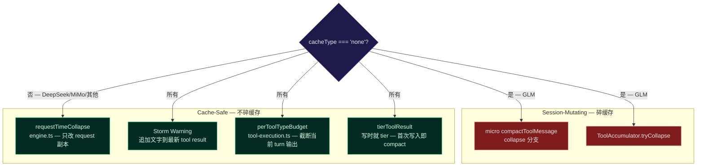

# Session-Mutating Collapse Cache-Aware Gate 实现计划

> **面向 AI 代理：** 使用 subagent-driven-development（推荐）或 executing-plans 逐任务实现。

**目标：** 将 exact-prefix/partial-prefix provider 上会碎前缀缓存的 session-mutating collapse 路径（micro-compact collapse + ToolAccumulator tryCollapse）从"意外保护"替换为显式 provider-aware 门控，同时修复 extractToolNameFromId 推断 bug 和 ToolAccumulator 跨 turn 残留。

**架构：** 核心原则是 `allowSessionMutation = cacheType === 'none'`——只有无前缀缓存的 provider（当前仅 GLM）才允许 session-level collapse，其余全部走 request-time collapse（engine.ts，只改 API request 副本，cache-safe）。storm warning（追加文字到最后一个 tool result，不修改旧消息）对所有 provider 保留。ProviderProfile.cacheType 已存在于 AgentConfig（loop-types.ts:33），传递链完整，无需新增字段。

**技术栈：** TypeScript strict mode, node:test + assert/strict

---

## 背景：为什么需要这个改动

两组提交引入了多层 tool output 治理机制：

- **Session-mutating 路径**（改写 session 中的消息内容）：micro-compact 的 `compactToolMessage` collapse 分支（micro.ts:23-29）、ToolAccumulator 的 `tryCollapse`（tool-execution.ts:381）
- **Request-time 路径**（只改 API request 副本）：engine.ts 的 `requestTimeCollapse`（engine.ts:1016），cache-safe
- **Append-only 路径**（只追加不改写）：storm warning（tool-execution.ts:388-397），cache-safe

当前 exact-prefix provider（DeepSeek、MiMo）上，session-mutating 路径靠两重意外不触发：① 1M 窗口下 `microCompactOai` 的 token 门控（micro.ts:132 `currentTokens <= contextWindow`）几乎永远满足；② `extractToolNameFromId` 的正则 bug 让 toolName 永远 undefined，collapse 分支被跳过。GLM（cacheType: 'none'）现在也是 1M 窗口，同样被门控保护。

这双重意外一旦被打破（比如修复了 extractToolNameFromId、或 GLM 降到 200K 窗口），session-mutating collapse 会立即在 exact-prefix provider 上碎缓存。

## 安全不变量

- **INV-1**：`cacheType !== 'none'` 时，`compactToolMessage` 的 collapse 分支和 `ToolAccumulator.tryCollapse` 永远不执行
- **INV-2**：storm warning（追加 `⚠️ [tool-storm-detected]` 文字到最后一个 tool result）不受门控影响——它只修改当前 turn 刚创建的消息，不碰旧消息
- **INV-3**：request-time collapse（engine.ts:1016）不受门控影响——它只操作 request 副本
- **INV-4**：`cacheType === 'none'` 时，session-mutating collapse 正常工作，不受影响

## 条件矩阵

| cacheType | micro collapse 分支 | tryCollapse | storm warning | request-time collapse |
|-----------|-------------------|-------------|---------------|----------------------|
| exact-prefix (DeepSeek/MiMo) | 跳过 | 跳过 | 保留 | 保留 |
| partial-prefix (OpenAI/Codex) | 跳过 | 跳过 | 保留 | 保留 |
| explicit-breakpoint (Anthropic) | 跳过 | 跳过 | 保留 | 保留 |
| none (GLM) | **允许** | **允许** | 保留 | 保留 |
| block-kv (vLLM) | 跳过 | 跳过 | 保留 | 保留 |

## 现有代码路径（执行前必读）

| 文件 | 关键行 | 函数 | 当前签名 |
|------|--------|------|---------|
| `src/compact/micro.ts:17-40` | compactToolMessage | `(msg, contextWindow, turnAge?)` | 无 cacheType 参数 |
| `src/compact/micro.ts:105-107` | microCompactOai | `(messages, contextWindow, estimatedTokens)` | 无 cacheType 参数 |
| `src/compact/micro.ts:39-41` | extractToolNameFromId | `(toolCallId: string)` | 用 `^([\w-]+)_` 正则，几乎永远失败 |
| `src/agent/compaction-controller.ts:649-653` | compactMessages | 调用 `microCompactOai(messages, this.deps.contextWindow, tokenCount)` | 有 `this.deps.providerProfile` 可用 |
| `src/agent/tool-execution.ts:375-381` | ToolAccumulator | `this.accumulator.record(...)` + `this.accumulator.tryCollapse(lastToolName)` | 无 cacheType 门控 |
| `src/agent/tool-execution.ts:131` | accumulator 实例字段 | `private accumulator = new ToolAccumulator()` | 无 turn reset |
| `src/api/provider-profile.ts:1` | ProviderProfile | `{ cacheType: CacheType, ... }` | cacheType 已存在 |
| `src/agent/loop-types.ts:33` | AgentConfig | `providerProfile?: ProviderProfile` | 已传递到 config |

## 数据流图



---

## Task 1: microCompactOai 加 cacheType 参数 + 门控

**文件：** `src/compact/micro.ts`（修改）、`src/compact/__tests__/micro.test.ts`（修改）

**为什么改：** `compactToolMessage` 的 collapse 分支（行 23-29）会改写 session 中的旧 tool result 内容。在 exact-prefix provider 上这会碎前缀缓存。当前靠 extractToolNameFromId bug 意外跳过。需要显式门控。

**RED — 先写失败测试：**

在 `src/compact/__tests__/micro.test.ts` 的 `describe('microCompactOai')` 块内追加：

```typescript
describe('cache-aware collapse gating', () => {
  // 构造一条 turnAge >= 4 的 tool 消息（内容 > 200 chars）
  const makeOldToolMessages = (): OaiMessage[] => {
    const msgs: OaiMessage[] = [
      { role: 'user', content: 'anchor user' },
      { role: 'assistant', content: 'anchor reply' },
    ]
    // 4 轮 user/assistant/tool 循环，让 tool 消息 turnAge >= 4
    for (let i = 0; i < 5; i++) {
      msgs.push({ role: 'user', content: `turn ${i} question` })
      msgs.push({
        role: 'assistant',
        content: `answer ${i}`,
        tool_calls: [{ id: `call_${i}`, type: 'function', function: { name: 'grep', arguments: '{}' } }],
      })
      msgs.push({
        role: 'tool',
        tool_call_id: `call_${i}`,
        content: `src/a.ts:${i}: const x = ${'y'.repeat(300)}`,
      })
    }
    // recent messages
    msgs.push({ role: 'user', content: 'recent question' })
    msgs.push({ role: 'assistant', content: 'recent answer' })
    return msgs
  }

  it('skips collapse when cacheType is exact-prefix (DeepSeek)', () => {
    const msgs = makeOldToolMessages()
    const { messages } = microCompactOai(msgs, 128_000, 900_000, 'exact-prefix')
    // tool 消息内容不应被 collapse 替换
    const toolMsg = messages.find(m => m.role === 'tool' && m.tool_call_id === 'call_0')
    assert.ok(toolMsg, 'tool message must exist')
    assert.ok(!toolMsg!.content.startsWith('[collapsed '), 'exact-prefix must not collapse session messages')
  })

  it('allows collapse when cacheType is none (GLM)', () => {
    const msgs = makeOldToolMessages()
    const { messages } = microCompactOai(msgs, 128_000, 900_000, 'none')
    const toolMsg = messages.find(m => m.role === 'tool' && m.tool_call_id === 'call_0')
    assert.ok(toolMsg, 'tool message must exist')
    assert.ok(toolMsg!.content.startsWith('[collapsed '), 'none-cacheType should collapse old tool results')
  })
})
```

**确认 RED：** `npx tsx --test src/compact/__tests__/micro.test.ts` — 预期编译失败（第 4 参数不存在）或类型错误。

**GREEN — 最小实现：**

1. `compactToolMessage` 签名加 `cacheType?: CacheType` 参数（import from `../api/provider-profile.js`）

2. 在 collapse 分支入口加门控，修改 micro.ts 第 23 行附近：

将：
```typescript
  if (turnAge != null && turnAge >= 4 && toolName) {
    const collapsed = collapseToolResult(toolName, msg.content, turnAge, contextWindow)
```
改为：
```typescript
  if (turnAge != null && turnAge >= 4 && toolName && cacheType === 'none') {
    const collapsed = collapseToolResult(toolName, msg.content, turnAge, contextWindow)
```

3. `microCompactOai` 签名加 `cacheType?: CacheType` 参数，透传给 `compactToolMessage`：

将 micro.ts 第 105 行：
```typescript
export function microCompactOai(
  messages: OaiMessage[],
  contextWindow: number,
  estimatedTokens: number,
): { messages: OaiMessage[]; truncated: number } {
```
改为：
```typescript
export function microCompactOai(
  messages: OaiMessage[],
  contextWindow: number,
  estimatedTokens: number,
  cacheType?: CacheType,
): { messages: OaiMessage[]; truncated: number } {
```

在 `compactToolMessage(msg, contextWindow, turnAge)` 调用处加 `cacheType`（micro.ts 第 119 行附近）。

4. 在文件顶部加 import：
```typescript
import type { CacheType } from '../api/provider-profile.js'
```

**确认 GREEN：** `npx tsx --test src/compact/__tests__/micro.test.ts` — 两个新测试通过。

**commit：** `fix(compact): gate session-mutating collapse by cacheType — exact-prefix providers skip collapse to preserve prefix cache`

---

## Task 2: 修复 extractToolNameFromId — 用 tool_calls 回溯替代正则猜测

**文件：** `src/compact/micro.ts`（修改）、`src/compact/__tests__/micro.test.ts`（修改）

**为什么改：** 当前 `extractToolNameFromId` 用 `^([\w-]+)_` 从 tool_call_id 前缀提取工具名。API 生成的 tool_call_id 是 UUID 格式（如 `call_abc123`），不以工具名开头。导致 toolName 几乎永远 undefined，collapse 分支被跳过。虽然 Task 1 的门控在 exact-prefix 上跳过了 collapse，但 GLM（cacheType: 'none'）需要这个功能正常工作。

**RED — 先写失败测试：**

在 micro.test.ts 追加：

```typescript
describe('toolName inference from tool_calls', () => {
  it('infers tool name from preceding assistant tool_calls', () => {
    const msgs: OaiMessage[] = [
      { role: 'user', content: 'q1' },
      { role: 'user', content: 'q2' },
      { role: 'user', content: 'q3' },
      { role: 'user', content: 'q4' },
      { role: 'user', content: 'q5' },
      {
        role: 'assistant',
        content: '',
        tool_calls: [{ id: 'call_xyz789', type: 'function', function: { name: 'bash', arguments: '{}' } }],
      },
      { role: 'tool', tool_call_id: 'call_xyz789', content: 'output line\n' + 'x'.repeat(300) },
      { role: 'user', content: 'recent' },
      { role: 'assistant', content: 'recent answer' },
    ]
    // cacheType='none' 允许 collapse，toolName 必须正确推断为 'bash'
    const { messages } = microCompactOai(msgs, 128_000, 900_000, 'none')
    const toolMsg = messages.find(m => m.role === 'tool' && m.tool_call_id === 'call_xyz789')
    assert.ok(toolMsg, 'tool message must exist')
    assert.ok(toolMsg!.content.includes('bash'), 'collapsed content should contain tool name "bash" from tool_calls lookup')
  })
})
```

**确认 RED：** 当前 extractToolNameFromId 返回 undefined（`call_xyz789` 不匹配 `^([\w-]+)_`），collapse 不触发，toolMsg.content 保持原文不含 'bash'。

**GREEN — 最小实现：**

1. 删除 `extractToolNameFromId` 函数（micro.ts 第 39-42 行）。

2. 在 `microCompactOai` 内部构建 `tool_call_id → toolName` 映射，传给 `compactToolMessage`：

在 `microCompactOai` 函数体开头（`recentStart` 声明后），加：
```typescript
  // Build tool_call_id → toolName map from assistant tool_calls
  const toolNameMap = new Map<string, string>()
  for (const m of messages) {
    if (m.role === 'assistant' && Array.isArray((m as Record<string, unknown>).tool_calls)) {
      const calls = (m as { tool_calls?: Array<{ id: string; function?: { name?: string } }> }).tool_calls
      if (calls) {
        for (const tc of calls) {
          if (tc.id && tc.function?.name) toolNameMap.set(tc.id, tc.function.name)
        }
      }
    }
  }
```

3. `compactToolMessage` 改为接收 `toolName?: string` 而非自己推断。在 `microCompactOai` 的 map 循环中（第 119 行附近），改：

将：
```typescript
    const toolResult = compactToolMessage(msg, contextWindow, turnAge)
```
改为：
```typescript
    const toolName = (msg as { tool_call_id?: string }).tool_call_id
      ? toolNameMap.get((msg as { tool_call_id?: string }).tool_call_id!)
      : undefined
    const toolResult = compactToolMessage(msg, contextWindow, turnAge, cacheType, toolName)
```

4. `compactToolMessage` 签名改为 `(msg, contextWindow, turnAge?, cacheType?, toolName?)`。删除函数体内对 `extractToolNameFromId` 的调用。

**确认 GREEN：** `npx tsx --test src/compact/__tests__/micro.test.ts` — 新测试通过。

**commit：** `fix(compact): infer toolName from assistant tool_calls instead of broken id-prefix regex`

---

## Task 3: compaction-controller 传递 cacheType

**文件：** `src/agent/compaction-controller.ts`（修改）

**为什么改：** `compactMessages` 方法（行 649-653）调用 `microCompactOai` 时只传 contextWindow，不传 cacheType。需要从 `this.deps.providerProfile?.cacheType` 获取并透传。

**实现（无测试——纯透传，由 Task 1 的测试覆盖）：**

修改 `compaction-controller.ts` 第 651 行：

将：
```typescript
    return microCompactOai(messages, this.deps.contextWindow, tokenCount)
```
改为：
```typescript
    return microCompactOai(messages, this.deps.contextWindow, tokenCount, this.deps.providerProfile?.cacheType)
```

**验证：** `npx tsc --noEmit` 通过。

**commit：** `fix(agent): pass cacheType to microCompactOai for provider-aware collapse gating`

---

## Task 4: ToolAccumulator tryCollapse 加 cacheType 门控

**文件：** `src/agent/tool-execution.ts`（修改）、`src/agent/__tests__/tool-accumulator.test.ts`（不修改——单元测试不涉及 provider）

**为什么改：** `tryCollapse` 改写旧 tool result 的 content，在 exact-prefix provider 上碎缓存。需要门控。

**RED — 先写集成级测试（在 tool-execution 的行为层面验证）：**

在 `src/agent/__tests__/tool-accumulator.test.ts` 追加一个 describe 块，验证 ToolExecutionController 在 exact-prefix provider 下不调用 tryCollapse。由于 ToolExecutionController 需要完整 deps，改为在 `tool-execution.ts` 的调用点加门控，用现有 tool-accumulator 单元测试保证 ToolAccumulator 本身行为不变。

**GREEN — 实现：**

修改 `tool-execution.ts` 第 381 行附近（`tryCollapse` 调用块）：

将：
```typescript
    if (input.toolUses.length > 0) {
      const lastToolName = input.toolUses[input.toolUses.length - 1]!.name
      const collapse = this.accumulator.tryCollapse(lastToolName)
      if (collapse) {
```
改为：
```typescript
    if (input.toolUses.length > 0) {
      const lastToolName = input.toolUses[input.toolUses.length - 1]!.name
      const cacheType = this.deps.config.providerProfile?.cacheType
      const collapse = cacheType === 'none' ? this.accumulator.tryCollapse(lastToolName) : null
      if (collapse) {
```

注意：storm warning 块（行 388-397，`getToolStormLevel` + 追加 `⚠️ [tool-storm-detected]`）不受影响——它是 cache-safe 的 append-only 操作，保留原有逻辑。

**验证：**
```bash
npx tsc --noEmit
npm exec -- tsx --test src/agent/__tests__/tool-accumulator.test.ts
```

**commit：** `fix(agent): gate ToolAccumulator tryCollapse by cacheType — preserve prefix cache on exact-prefix providers`

---

## Task 5: ToolAccumulator turn 边界 reset

**文件：** `src/agent/tool-execution.ts`（修改）、`src/agent/__tests__/tool-accumulator.test.ts`（修改）

**为什么改：** `ToolAccumulator` 是 `ToolExecutionController` 的实例字段，entries 跨 turn 累积。`reset()` 定义了但从未调用。导致跨 turn 的 storm 检测污染（turn 1 的 grep 连续调用会让 turn 2 的首次 grep 触发 collapse）。虽然 Task 4 的门控在 exact-prefix 上跳过了 tryCollapse，但 GLM（cacheType: 'none'）仍需要这个功能正确工作。

**RED — 先写失败测试：**

在 `src/agent/__tests__/tool-accumulator.test.ts` 追加：

```typescript
  it('cross-turn entries do not pollute consecutive detection after reset on turn change', () => {
    // Turn 1: 3 bash calls (below threshold)
    acc.record({ toolName: 'bash', toolUseId: '1', content: 'a', turn: 1 })
    acc.record({ toolName: 'bash', toolUseId: '2', content: 'b', turn: 1 })
    acc.record({ toolName: 'bash', toolUseId: '3', content: 'c', turn: 1 })
    assert.equal(acc.consecutiveCount('bash'), 3)

    // Turn change → reset
    acc.reset()

    // Turn 2: 1 bash call — should NOT be treated as 4th consecutive
    acc.record({ toolName: 'bash', toolUseId: '4', content: 'd', turn: 2 })
    assert.equal(acc.consecutiveCount('bash'), 1)
    assert.equal(acc.tryCollapse('bash'), null)
  })
```

**确认 GREEN（此测试在现有代码上已通过——reset() 本身正确，问题是没人调用它）。**

**实际实现——在 tool-execution.ts 的 record 块加 turn 边界检测：**

修改 tool-execution.ts 第 370-375 行附近（storm guard record 块），在 record 前检测 turn 跳变：

将：
```typescript
    for (let i = 0; i < input.toolUses.length; i++) {
      const tu = input.toolUses[i]!
      const tr = toolResults[i]
      if (tr && tr.type === 'tool_result') {
        const content = typeof tr.content === 'string' ? tr.content : ''
        this.accumulator.record({ toolName: tu.name, toolUseId: tu.id, content, turn: input.turn })
```
改为：
```typescript
    if (this._lastAccumulatorTurn !== undefined && this._lastAccumulatorTurn !== input.turn) {
      this.accumulator.reset()
    }
    this._lastAccumulatorTurn = input.turn

    for (let i = 0; i < input.toolUses.length; i++) {
      const tu = input.toolUses[i]!
      const tr = toolResults[i]
      if (tr && tr.type === 'tool_result') {
        const content = typeof tr.content === 'string' ? tr.content : ''
        this.accumulator.record({ toolName: tu.name, toolUseId: tu.id, content, turn: input.turn })
```

在 `ToolExecutionController` 类中（第 131 行 `private accumulator` 旁边）加：
```typescript
  private _lastAccumulatorTurn: number | undefined = undefined
```

**验证：**
```bash
npx tsc --noEmit
npm exec -- tsx --test src/agent/__tests__/tool-accumulator.test.ts
npm exec -- tsx --test src/compact/__tests__/micro.test.ts
```

**commit：** `fix(agent): reset ToolAccumulator on turn boundary — prevent cross-turn storm detection pollution`

---

## 全量验证

```bash
npx tsc --noEmit
npm exec -- tsx --test src/compact/__tests__/*.test.ts
npm exec -- tsx --test src/agent/__tests__/tool-accumulator.test.ts
```

## 不做的事

- **不删除 session-mutating collapse 代码**：GLM（cacheType: 'none'）仍需要它。只是门控让 exact-prefix 不走。
- **不修改 request-time collapse（T7，engine.ts）**：它已经是 cache-safe 的，不需要门控。
- **不修改 storm warning（tool-execution.ts:388-397）**：它是 append-only 的，cache-safe。
- **不接线 T3 attentionQuality / T5 attentionProfile 两个字段**：这些是有意停用的 cache-preservation tradeoff，不属于本计划范围。
