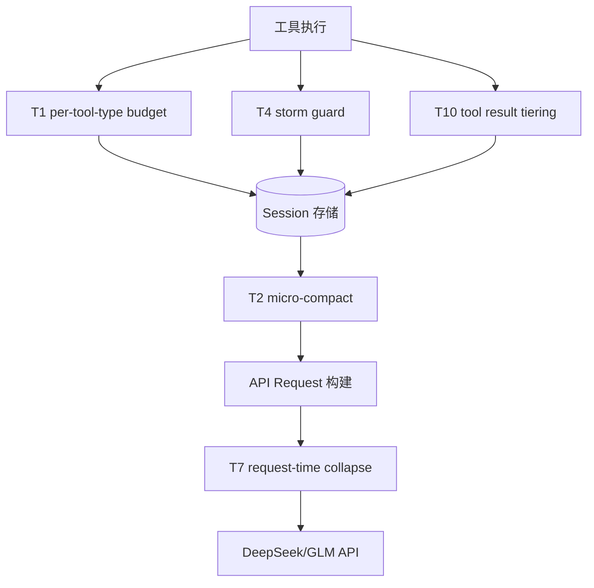

# T1-T10 注意力治理子系统代码蒸馏

> 从 11 个提交（e5f9a09..5482542，2026-06-11）蒸馏的工程方法论。
> 这组提交围绕"1M 窗口下工具输出淹没注意力"问题，构建了多层 tool output 治理机制。

---

## 系统全貌：四层防御

工具输出进入 session 后，经过四层处理：写入时（T1 budget + T4 storm + T10 tiering）→ session 内压缩（T2 micro-compact）→ request 构建时（T7 request-time collapse）→ 到达 API。每一层有不同的 cache 安全性等级。

---

## 五条方法论

### 原则一：分清 cache-safe 与 cache-killer，别混用

这是整个子系统最重要的判断。代码中存在三类操作 session 消息的路径：

- **Session-mutating**（改写已有消息内容）：T2 micro-compact 的 `compactToolMessage` collapse 分支、T4 ToolAccumulator 的 `tryCollapse`。在 exact-prefix provider 上，任何对已有消息的改写都会让前缀缓存从改写点开始全部失效。
- **Request-time only**（只改 API request 副本）：T7 的 `requestTimeCollapse`。session 存储不变，DeepSeek 的前缀缓存零成本。
- **Append-only**（只追加不改写）：T4 的 storm warning（追加 `⚠️` 文字到最后一个 tool result）。因为追加的是当前 turn 刚创建的消息，不碰旧消息，cache-safe。

教训：**新机制上线时必须先问"这个操作改不改 session 中的旧消息"。** 如果改，在 exact-prefix provider 上就是 cache-killer。T7 的设计者用"只改 request 副本"绕过了整个问题——这是最优雅的解法。T2/T4 的 session-mutating 路径后来靠"1M 门控 + bug"双重意外不触发，这不是设计，是运气。

### 原则二：bug 有时是隐性的安全阀——别盲目修

T2 的 `extractToolNameFromId`（micro.ts:39）用正则 `^([\w-]+)_` 从 tool_call_id 前缀猜工具名。API 生成的 tool_call_id 不保证以工具名开头，所以这个正则几乎永远返回 undefined，导致 `collapseToolResult` 拿不到 toolName 就跳过。表面看这是个 bug，但它在 exact-prefix provider 上恰好阻止了 session-mutating collapse 的执行——成了一个隐性的缓存安全阀。

修复这个 bug（让它正确推断工具名）而不加 provider-aware 门控，会让 session-mutating collapse 在 DeepSeek 上突然开始执行，碎掉前缀缓存。教训：**发现 bug 时先问"这个 bug 是否在保护某种不变量"。** 如果 bug 的效果恰好是正确的（阻止 cache-killer 执行），修复前必须先建立显式门控替代 bug 的保护效果。

### 原则三：测试覆盖函数内部行为 ≠ 验证函数被接线

T3 的 `computeAttentionQuality`（sensorium.ts:291）有完整的测试（96 行，全绿），测试了 toolDensity/uniqueToolRatio/toolStormLevel 各种组合。但在整个代码库里，除了测试文件没有任何地方调用这个函数——它从未接入 compaction 触发逻辑。

教训：**单元测试验证了"给定正确输入，函数产出正确输出"，但没验证"函数会被正确的调用方以正确的参数调用"。** T3 是典型的"写了函数、写了测试、但忘了接线"——绿测试反而掩盖了接线缺失。区分两种情况的方法：写一个集成测试，驱动真实调用链到达这个函数。如果集成测试写不出来（因为上层调用方不存在），函数就是死接线。

### 原则四：provider 差异化要传递到末端消费方

T5 的 `attentionProfile`（provider-profile.ts）给 DeepSeek/GLM/MiMo 配了不同的 `collapseAgeTurns`（8/4/6）。但这个值存在 ProviderProfile 里，没有传递到 PromptEngine.config——engine.ts:544 永远 fallback 到 `?? 8`。传递链断裂在"ProviderProfile → PromptEngineConfig"这一环。

教训：**配置值从定义到消费的每一跳都需要显式接线。** 中间断一跳，末端消费方就永远用 fallback 值，provider 差异化形同虚设。验证传递链完整的方法：grep 配置字段名，确认从定义处到使用处的每一跳都有赋值。

### 原则五："有意停用"和"忘了接线"要显式标注

T3 的 attentionQuality 和 T5 的两个字段当前是零消费方。但结合用户反馈（"为了不碎缓存有些机制停掉了"），这些可能是 cache-preservation tradeoff 下的有意停用——exact-prefix 成为核心策略后，session-level 的 attention-quality-driven compaction 会碎缓存，所以用 request-time collapse（T7）替代。

问题是：代码里没有任何注释标注这些是"有意停用"。下一个开发者看到零消费方的函数，可能以为"忘了接线"然后去接线——结果碎缓存。

教训：**有意停用的代码必须有显式标注（`@deprecated`/`@halted`/注释说明原因）。** 没有标注的零消费方 = 隐患——要么被误接线碎缓存，要么作为死代码累积膨胀。

---

## 死接线审计方法

从这组代码蒸馏出的审计流程：

1. **grep 函数名/字段名，排除测试文件和定义文件** → 剩下的命中就是生产消费方
2. **零命中 = 死接线** → 但需要第三步区分"从没接过线"和"接过线又断开"
3. **git log -p 追踪消费方是否曾经存在后被删除** → 区分"有意停用"和"忘了接线"
4. **对每个接线点，验证传递链完整性** → 从定义到消费的每一跳是否有显式赋值

这个审计的核心洞察是：**"有测试"不是"已接线"的证据。** T3 有 96 行全绿的测试，但生产路径上零调用。只有集成测试（驱动真实调用链）才能验证接线。

---

## 适用边界

这套方法论适用于"已有大量已建成子系统、需要审计和收口"的成熟项目。不适用于从零新建的项目。它的前提是项目已经有了多层重叠的治理机制（有些接线、有些没接线、有些有意停用），需要系统性的审计来区分状态。

对于天枢这个具体项目，核心约束是 DeepSeek 的 exact-prefix cache 策略——它让"不改写 session 旧消息"成为硬约束，所有 session-mutating 路径都是潜在 cache-killer。这个约束驱动了整个"T7 request-time collapse 替代 T2 session-level collapse"的架构演进。
