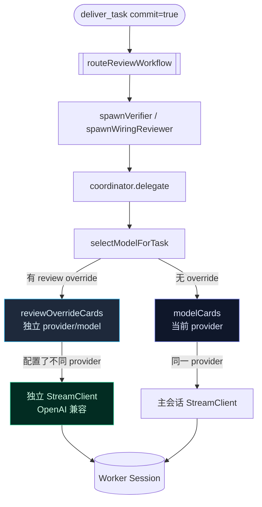

# Review Worker 模型路由可配置化 实现计划

> **面向 AI 代理：** 使用 `executing-plans` 逐任务实现。步骤使用复选框（`- [ ]`）跟踪进度。

**目标：** 让 review worker（L1/L2/L3/auto）可独立配置使用不同 provider/model，而非强制继承主会话模型。

**架构：** 在 `agentSchema` 新增 `review` 配置块，支持 per-profile 指定 provider+model。bootstrap 层为配置了 override 的 review profile 构建独立的 StreamClient（OpenAI 兼容格式），注入 coordinator 的 model selection 路径。coordinator 的 `selectModelForTask` 在处理 review profile 时优先匹配 override，不影响非 review worker 的模型选择。

**技术栈：** TypeScript strict + zod schema + OpenAI 兼容 SSE client

---

## 背景

### 问题根因（.rivet/knowledge/debug-glm-cache-break-deliver-task.md，未提交但可读）

GLM-5.2 会话（bd283033...，天权域）72 条逐请求 cache-log 实证：deliver_task commit=true 触发 post-commit auto review → review worker 用主会话同一模型（glm-5.2）和同一 API key 发送 API 请求 → 在 196s 请求空窗内两个 review worker 接力发出 14 次 GLM API 请求 → GLM 服务端"相同或高度相似"缓存匹配机制将 worker 请求视为新条目 → 淘汰主会话的旧缓存 → 主会话下一轮 cacheRead 从 75,504 归零。

**影响范围**：所有 `prefixCache: 'none'` 的 provider（GLM、Kimi、Codex）。DeepSeek（`prefixCache: 'deepseek-native'`）由 Rivet 侧管理精确前缀缓存，不受此影响。

### 当前模型选择路径

```
deliver_task(commit=true)                                          [deliver-task.ts:607]
  → skipAutoReview = params.input.skipAutoReview || ctx.isGoalActive()?
  → routeReviewWorkflow()                                          [review-coordinator-deps.ts]
    → spawnVerifier / spawnWiringReviewer
      → coordinator.delegate(DelegationRequest{profile:'adversarial_verifier'})
        → selectModelForTask(task, preferredTier)                  [coordinator.ts:494]
          → modelCards.filter(tier === preferredTier)              [bootstrap.ts:573-595]
          → modelCards 来自 provider.models（当前 provider 的所有模型）
              ↑ 这就是断点
```

**断点**：
- `bootstrap.ts:573-595` 的 `modelCards` 只从 `provider.models`（当前 provider）构建。review worker 无法跨 provider 选模型
- `coordinator.ts:913` `runtimeFactory(order, selected, workerRegistry)` 直接用 `selected` 卡片，没有 profile→client 映射钩子
- `coordinator.ts:1127+` 现有 Flash→Pro 升级路径（45 行硬编码），但**无 Pro→Flash 降级路径**——review 是只读验证，不需要重型推理

### 现有配置

- `workersSchema`（schema.ts:233-244）有 `profiles`（provider+model）和 `routing`（task→profile），但只覆盖 `CapabilityTask`，不覆盖 review profiles
- `review-discipline-config.ts` 只有一个 env var 开关 `RIVET_REVIEW_DISCIPLINE`，无模型配置
- `profile-registry.ts` 的 `reviewer` 有 `tierLock:'cheap'`，但 modelCards 没有 cheap 模型时无效
- **跨 provider 客户端工厂已存在于 `create-agent-config.ts:162-168`**（fallback 工厂模式）——任务 4 应直接复用，不要重写

### 关键代码模式（任务 4 必须复用）

**1. 跨 provider 客户端创建**（`src/agent/create-agent-config.ts:162-168`）：

```typescript
create: () => {
  const fp = input.allProviders![name]!
  const fCaps = resolveCapabilities(fp.name, fp.capabilities)
  let fApiKey: string
  try { fApiKey = resolveApiKey(fp) } catch { return primary }
  const fModel = fp.models.find(m => m.id === model.id) ?? fp.models[0]!
  return createProviderClient(fp, fCaps, {
    apiKey: fApiKey,
    thinking: fp.thinking,
    maxTokens: fp.maxTokens,
    providerName: fp.name,
  })
}
```

**2. Tier 推断**（`src/agent/model-tier-policy.ts`）—— `inferModelTierFromCard(card)` 是单一权威入口，bootstrap.ts:578-585 也在用相同的 isPro/isFlash 检测。任务 2/4 不应再写新 regex。

**3. 工厂签名**（`src/agent/coordinator.ts:156-159`）：

```typescript
export type WorkerRuntimeFactory = (
  order: WorkOrder,
  card: ModelCapabilityCard,
  workerRegistry: ToolRegistry,
) => WorkerSessionConfig
```

调用点：`coordinator.ts:913` `const workerConfig = this.config.runtimeFactory(order, selected, workerRegistry)`。任务 3 在这里把 `selected` 替换为 review override 卡片，runtimeFactory 闭包内根据 `order.profile` 选 StreamClient。

---

## 架构图



---

## 文件清单

| 文件 | 操作 | 职责 |
|------|------|------|
| `src/config/schema.ts` | 修改 | 新增 `reviewModelSchema` 和 `reviewConfigSchema` |
| `src/agent/review-model-override.ts` | 创建 | 纯函数：从 config 解析 review profile → provider/model 映射 |
| `src/bootstrap.ts` | 修改 | 构建 review override modelCards + StreamClient |
| `src/agent/coordinator.ts` | 修改 | `selectModelForTask` 支持 review override cards |
| `src/agent/review-coordinator-deps.ts` | 修改 | `request()` 传递 reviewModelHint |
| `src/agent/deliver-task.ts` | 修改 | 读取 review config，传递给 review router |
| `src/agent/review-model-override.test.ts` | 创建 | 纯函数测试 |
| `src/agent/__tests__/coordinator-review-override.test.ts` | 创建 | coordinator 集成测试 |

---

## 任务

### 任务 1：新增 review model 配置 schema

- [ ] 修改 `src/config/schema.ts`
- [ ] 测试 `src/config/__tests__/schema.test.ts`（如存在）或内联测试

**目标：** 在 `agentSchema` 里新增 `review` 配置块，允许用户按 profile 指定 provider+model。

**调研背书：**
- `agentSchema`（schema.ts:180-221）：现有 agent 配置的 zod schema，已有 `banditPromotion`、`antiAnchoring` 等嵌套配置块的先例
- `workersSchema`（schema.ts:233-244）：已有 `workerProfileSchema = { provider, model }` 的模式可复用
- `providerSchema`（schema.ts:155）：provider 配置含 baseUrl/apiKey/models，review override 需引用此结构

**实现：**

在 `src/config/schema.ts` 的 `agentSchema` 定义之前新增：

```typescript
/** Per-profile review model override. When set, review workers with the
 *  matching profile use this provider+model instead of the session's primary
 *  model. The provider must exist in config.provider.providers and use
 *  OpenAI-compatible protocol. */
export const reviewProfileOverrideSchema = z.object({
  provider: z.string(),
  model: z.string(),
})

export const reviewConfigSchema = z.object({
  /** Per-profile overrides. Keys are WorkerProfile names: 'adversarial_verifier',
   *  'reviewer', 'verifier', 'patcher', 'council_expert'.
   *  Omitted profiles fall back to the session's primary model. */
  profiles: z.record(z.string(), reviewProfileOverrideSchema).default({}),
  /** When true, auto-review (deliver_task post-commit) is skipped entirely.
   *  Equivalent to RIVET_REVIEW_DISCIPLINE=0 but per-config. */
  skipAuto: z.boolean().default(false),
}).default({})
```

在 `agentSchema` 的 properties 末尾（`permissions` 之后）新增：

```typescript
  review: reviewConfigSchema,
```

在 `AgentConfig` type 和 `Config` type 里自动通过 zod inference 获得。

**验证：**
```bash
npx tsc --noEmit  # 期望：typecheck 通过
```

**提交：**
```bash
git add src/config/schema.ts
git commit -m "feat(config): add review model override schema to agent config"
```

---

### 任务 2：创建 review-model-override 纯函数模块

- [ ] 创建 `src/agent/review-model-override.ts`
- [ ] 创建 `src/agent/__tests__/review-model-override.test.ts`

**目标：** 纯函数模块，从 config 解析出 review profile → provider/model 映射，并验证 provider/model 存在。

**调研背书：**
- `model-tier-policy.ts` 的 `inferModelTierFromCard`：**权威 tier 推断入口**，bootstrap.ts:578-585 用同名 isPro/isFlash 检测
- `bootstrap.ts:573-595`：现有 modelCards 构建用 `m.id.includes('pro' | 'flash')` 检测，task 2 应保持一致
- `review-discipline.ts` 的 `classifyChangeScale`：基于 input 分类决策的纯函数模式（参考，不照搬）

**实现：**

创建 `src/agent/review-model-override.ts`：

```typescript
/**
 * Review worker model override resolution.
 *
 * Pure functions that translate the `review` config block into a concrete
 * provider+model lookup for review worker dispatch.
 */

import type { ProviderConfig } from '../config/schema.js'
import type { WorkerProfile } from './work-order.js'
import type { ModelCapabilityCard } from '../model/capability.js'

/** A resolved override: the provider config + model id to use for this profile. */
export interface ResolvedReviewOverride {
  providerName: string
  modelId: string
  providerConfig: ProviderConfig
}

/**
 * Resolve a review profile override against the configured providers.
 *
 * Returns undefined when:
 * - No override configured for this profile
 * - Configured provider does not exist in providers map
 * - Configured model does not exist in provider's models list
 *
 * @param profile The worker profile name (e.g. 'adversarial_verifier')
 * @param reviewProfiles The `review.profiles` record from config
 * @param providers The full providers map from config.provider.providers
 */
export function resolveReviewOverride(
  profile: WorkerProfile,
  reviewProfiles: Record<string, { provider: string; model: string }>,
  providers: Record<string, ProviderConfig>,
): ResolvedReviewOverride | undefined {
  const override = reviewProfiles[profile]
  if (!override) return undefined

  const providerConfig = providers[override.provider]
  if (!providerConfig) return undefined

  const modelExists = providerConfig.models.some(
    m => m.id === override.model || m.alias === override.model
  )
  if (!modelExists) return undefined

  return {
    providerName: override.provider,
    modelId: override.model,
    providerConfig,
  }
}

/**
 * Build a ModelCapabilityCard for a review override model.
 *
 * 复用 bootstrap.ts:578-595 的 isPro/isFlash 检测，确保与现有 modelCards
 * 的 tier 推断（inferModelTierFromCard from model-tier-policy.ts）一致。
 * Review 是只读验证——不需要重型 capability scoring，给保守值即可。
 */
export function buildReviewOverrideCard(
  modelId: string,
  providerConfig: ProviderConfig,
): ModelCapabilityCard {
  const model = providerConfig.models.find(
    m => m.id === modelId || m.alias === modelId
  )
  const contextWindow = model?.contextWindow ?? 128_000

  // 与 bootstrap.ts:578-585 完全一致的检测，避免 tier 漂移
  const isPro = modelId.includes('pro') || model?.alias?.includes('pro')
  const isFlash = modelId.includes('flash') || model?.alias?.includes('flash')
  const treatAsStrong = isPro || (!isFlash && !isPro)

  return {
    model: modelId,
    toolUseReliability: treatAsStrong ? 0.8 : 0.6,
    jsonStability: treatAsStrong ? 0.8 : 0.65,
    editSuccessRate: treatAsStrong ? 0.7 : 0.5,
    testRepairRate: treatAsStrong ? 0.6 : 0.45,
    contextWindow,
    cacheEconomics: 'strong' as const,
    recommendedTasks: ['code_search'],
  }
}
```

创建测试 `src/agent/__tests__/review-model-override.test.ts`：

```typescript
import { describe, it } from 'node:test'
import assert from 'node:assert/strict'
import { resolveReviewOverride, buildReviewOverrideCard } from '../review-model-override.js'
import type { ProviderConfig } from '../../config/schema.js'

const mockProvider = (models: Array<{ id: string; alias?: string; contextWindow: number }>): ProviderConfig =>
  ({
    name: 'deepseek',
    apiKeyEnv: 'DEEPSEEK_API_KEY',
    baseUrl: 'https://api.deepseek.com/v1',
    protocol: 'openai' as const,
    capabilities: {
      cacheControl: false,
      stripParams: [],
      toolJsonBug: false,
      prefixCache: 'deepseek-native' as const,
      prefixCompletion: false,
    },
    thinking: 'enabled' as const,
    maxTokens: 384000,
    models: models.map(m => ({ id: m.id, alias: m.alias ?? m.id, contextWindow: m.contextWindow, maxTokens: 384000 })),
    unsupported: [],
  }) as unknown as ProviderConfig

describe('resolveReviewOverride', () => {
  it('returns undefined when no override configured for profile', () => {
    const result = resolveReviewOverride('adversarial_verifier', {}, { deepseek: mockProvider([{ id: 'deepseek-v4-flash', contextWindow: 1_000_000 }]) })
    assert.equal(result, undefined)
  })

  it('returns undefined when provider does not exist', () => {
    const result = resolveReviewOverride('reviewer', { reviewer: { provider: 'nonexistent', model: 'x' } }, {})
    assert.equal(result, undefined)
  })

  it('returns undefined when model does not exist in provider', () => {
    const providers = { deepseek: mockProvider([{ id: 'deepseek-v4-flash', contextWindow: 1_000_000 }]) }
    const result = resolveReviewOverride('reviewer', { reviewer: { provider: 'deepseek', model: 'nonexistent-model' } }, providers)
    assert.equal(result, undefined)
  })

  it('resolves when provider and model exist', () => {
    const providers = { deepseek: mockProvider([{ id: 'deepseek-v4-flash', contextWindow: 1_000_000 }]) }
    const result = resolveReviewOverride('reviewer', { reviewer: { provider: 'deepseek', model: 'deepseek-v4-flash' } }, providers)
    assert.ok(result)
    assert.equal(result!.providerName, 'deepseek')
    assert.equal(result!.modelId, 'deepseek-v4-flash')
  })

  it('resolves by alias', () => {
    const providers = { deepseek: mockProvider([{ id: 'deepseek-v4-flash', alias: 'v4-flash', contextWindow: 1_000_000 }]) }
    const result = resolveReviewOverride('reviewer', { reviewer: { provider: 'deepseek', model: 'v4-flash' } }, providers)
    assert.ok(result)
    assert.equal(result!.modelId, 'v4-flash')
  })
})

describe('buildReviewOverrideCard', () => {
  it('classifies flash models as cheap tier scores', () => {
    const provider = mockProvider([{ id: 'deepseek-v4-flash', contextWindow: 1_000_000 }])
    const card = buildReviewOverrideCard('deepseek-v4-flash', provider)
    assert.equal(card.toolUseReliability, 0.6)
    assert.equal(card.contextWindow, 1_000_000)
  })

  it('classifies pro models as strong tier scores', () => {
    const provider = mockProvider([{ id: 'deepseek-v4-pro', contextWindow: 1_000_000 }])
    const card = buildReviewOverrideCard('deepseek-v4-pro', provider)
    assert.equal(card.toolUseReliability, 0.8)
  })

  it('treats neutral names (no pro/flash) as strong — matches bootstrap.ts:578-585', () => {
    const provider = mockProvider([{ id: 'deepseek-v4', contextWindow: 1_000_000 }])
    const card = buildReviewOverrideCard('deepseek-v4', provider)
    assert.equal(card.toolUseReliability, 0.8)
  })

  it('detects tier via alias too', () => {
    const provider = mockProvider([{ id: 'v4-flash', alias: 'flash', contextWindow: 1_000_000 }])
    const card = buildReviewOverrideCard('v4-flash', provider)
    assert.equal(card.toolUseReliability, 0.6)
  })
})
```

**验证：**
```bash
npx tsc --noEmit  # 期望：typecheck 通过
node --import tsx --test src/agent/__tests__/review-model-override.test.ts  # 期望：全部通过
```

**提交：**
```bash
git add src/agent/review-model-override.ts src/agent/__tests__/review-model-override.test.ts
git commit -m "feat(agent): add review-model-override pure function module with tests"
```

---

### 任务 3：coordinator 支持 review override modelCards

- [ ] 修改 `src/agent/coordinator.ts:167-171`（DelegationCoordinatorConfig）
- [ ] 修改 `src/agent/coordinator.ts:494-520`（selectModelForTask）
- [ ] 修改 `src/agent/coordinator.ts:913`（delegate 方法里 selectModelForTask 的调用点）
- [ ] 创建 `src/agent/__tests__/coordinator-review-override.test.ts`

**目标：** coordinator 的 `selectModelForTask` 在处理 review profile 时，优先从 override modelCards 里选模型。

**调研背书：**
- `DelegationCoordinatorConfig`（coordinator.ts:168-171）：当前有 `modelCards: ModelCapabilityCard[]` 字段，是 worker 模型选择的唯一数据源
- `selectModelForTask`（coordinator.ts:494）：接收 `task: CapabilityTask` 和 `preferredTier`，从 modelCards 过滤后选择。无 profile 参数——需要通过 order.profile 间接获取
- 调用链：`delegate()` → `selectModelForTask(task, preferredTier)`。review profile（adversarial_verifier/reviewer/verifier/patcher）不在 `CapabilityTask` 枚举里
- `WorkerRuntimeFactory`（coordinator.ts:156-159）：`(order, card, workerRegistry) => WorkerSessionConfig`——任务 4 在此闭包内根据 order.profile 选 StreamClient

**实现：**

1. 在 `DelegationCoordinatorConfig`（coordinator.ts:168）新增可选字段：

```typescript
export interface DelegationCoordinatorConfig {
  // ... existing fields ...
  /** Review-specific model cards. When present and a delegated work order's
   *  profile matches, the override card is used directly (bypasses tier
   *  selection). Keyed by WorkerProfile name. */
  reviewOverrideCards?: Map<string, ModelCapabilityCard>
}
```

2. 在 `selectModelForTask` 方法（coordinator.ts:494）签名改为接收 profile：

当前签名：
```typescript
private selectModelForTask(task: CapabilityTask, preferredTier?: ModelTier): ModelCapabilityCard {
```

改为：
```typescript
private selectModelForTask(task: CapabilityTask, preferredTier?: ModelTier, profile?: string): ModelCapabilityCard {
```

在方法体开头新增 review override 快速路径：

```typescript
// Review override: if this is a review profile and override cards exist,
// use the override card directly — bypassing the normal tier/routing logic.
if (profile && this.config.reviewOverrideCards?.has(profile)) {
  const overrideCard = this.config.reviewOverrideCards.get(profile)!
  debugLog(`[worker-model] review-override: profile=${profile} → ${overrideCard.model} ✓`)
  return overrideCard
}
```

3. 在 `delegate` 方法里调用 `selectModelForTask` 的地方（coordinator.ts:913 附近），传递 `order.profile`：

```typescript
// 现有调用点（约 coordinator.ts:913）：
let selected = this.selectModelForTask(task, preferredTier)
// 改为：
let selected = this.selectModelForTask(task, preferredTier, order.profile)
```

`order.profile` 已是 `WorkerProfile` 类型，恰好和 reviewOverrideCards 的 key 类型一致。

4. 在 Flash→Pro 升级路径（coordinator.ts:1127）保持不变——review override 不参与升级（review 已经定向 cheap tier）。

**验证：**
```bash
npx tsc --noEmit  # 期望：typecheck 通过
node --import tsx --test src/agent/__tests__/coordinator-review-override.test.ts  # 期望：全部通过
```

**提交：**
```bash
git add src/agent/coordinator.ts src/agent/__tests__/coordinator-review-override.test.ts
git commit -m "feat(agent): coordinator supports review override model selection"
```

---

### 任务 4：bootstrap 构建 review override cards + StreamClient

- [ ] 修改 `src/bootstrap.ts:595-600`（modelCards 构建后）
- [ ] 修改 `src/bootstrap.ts:720-730`（coordinator config 注入）
- [ ] 修改 `src/bootstrap.ts` 中 `runtimeFactory` 闭包（约 660-720），添加 profile→StreamClient 映射

**目标：** bootstrap 启动时读取 review config，为配置了 override 的 profile 构建独立的 ModelCapabilityCard 和 StreamClient，注入 coordinator config 和 runtimeFactory 闭包。

**调研背书：**
- `bootstrap.ts:573-595`：`modelCards` 从 `provider.models.map(...)` 构建——只含当前 provider 的模型
- `bootstrap.ts:726`：`modelCards` 传给 `DelegationCoordinatorConfig`
- `bootstrap.ts:577+`：worker routing 从 `config.workers` 构建——`workerRouting` 传给 coordinator
- **`createProviderClient`（src/api/factory.ts:53）**：创建 OpenAI 兼容 StreamClient 的工厂函数，签名 `(provider, capabilities, params)`，`params` 类型为 `RuntimeParams`（含 `apiKey/thinking/maxTokens/providerName`）
- **`resolveCapabilities`（src/api/provider.js）**：`resolveCapabilities(name, capabilities)`
- **`resolveApiKey`（src/api/factory.js）**：`resolveApiKey(providerConfig)`，可能抛错（缺 credentials）
- **`StreamClient`（src/api/stream-client.ts:21）**：interface
- **关键复用模式**：`create-agent-config.ts:162-168` 已有"跨 provider 客户端创建"完整范本。任务 4 不要重写——直接照抄其结构
- **`WorkerRuntimeFactory`（coordinator.ts:156-159）**：`(order, card, workerRegistry) => WorkerSessionConfig`——runtimeFactory 闭包内通过 `order.profile` 索引 StreamClient

**实现：**

#### 4.1 在 `bootstrap.ts` 的 `modelCards` 构建之后（约 line 600），新增：

```typescript
// Review override cards + per-profile StreamClients.
// 复用 create-agent-config.ts:162-168 的跨 provider 客户端工厂模式。
import { resolveReviewOverride, buildReviewOverrideCard } from './agent/review-model-override.js'
import { createProviderClient, resolveApiKey } from './api/factory.js'
import { resolveCapabilities } from './api/provider.js'
import type { StreamClient } from './api/stream-client.js'

const reviewOverrideCards = new Map<string, ModelCapabilityCard>()
const reviewStreamClients = new Map<string, StreamClient>()

if (config.agent.review?.profiles) {
  for (const [profileName, _override] of Object.entries(config.agent.review.profiles)) {
    const resolved = resolveReviewOverride(
      profileName as WorkerProfile,
      config.agent.review.profiles,
      config.provider.providers,
    )
    if (!resolved) {
      debugLog(`[review-override] skip ${profileName}: provider/model not resolved`)
      continue
    }

    const card = buildReviewOverrideCard(resolved.modelId, resolved.providerConfig)
    reviewOverrideCards.set(profileName, card)

    // 跨 provider 客户端创建——与 create-agent-config.ts:162-168 同模式
    let apiKey: string
    try { apiKey = resolveApiKey(resolved.providerConfig) } catch {
      debugLog(`[review-override] skip ${profileName}: no API key for ${resolved.providerName}`)
      continue
    }
    const caps = resolveCapabilities(resolved.providerName, resolved.providerConfig.capabilities)
    const client = createProviderClient(resolved.providerConfig, caps, {
      apiKey,
      thinking: resolved.providerConfig.thinking,
      maxTokens: resolved.providerConfig.maxTokens,
      providerName: resolved.providerName,
    })
    reviewStreamClients.set(profileName, client)
  }
}
```

#### 4.2 在 coordinator config 构建处（约 line 726），新增字段：

```typescript
modelCards,
reviewOverrideCards: reviewOverrideCards.size > 0 ? reviewOverrideCards : undefined,
```

#### 4.3 在 `runtimeFactory` 闭包里新增 override client 注入：

runtimeFactory 闭包（约 bootstrap.ts:660-720）原本捕获 `primaryClient` 闭包变量。新增：

```typescript
// Inside runtimeFactory closure (after primaryClient is captured):
const overrideClient = reviewStreamClients.get(order.profile)
const effectiveClient = overrideClient ?? primaryClient
// Pass effectiveClient to the worker session config instead of primaryClient.
```

具体改法：找到 runtimeFactory 闭包里所有 `primaryClient` 的引用，逐个改成 `effectiveClient`，或者在闭包顶部用解构一次性替换（更安全）。

**验证：**
```bash
npx tsc --noEmit  # 期望：typecheck 通过
node --import tsx --test src/agent/__tests__/coordinator-review-override.test.ts  # 期望：全部通过
```

**提交：**
```bash
git add src/bootstrap.ts
git commit -m "feat(bootstrap): build review override cards and StreamClients from config"
```

---

### 任务 5：deliver_task 读取 review skipAuto 配置

- [ ] 修改 `src/agent/deliver-task.ts:41`（B1Context interface）
- [ ] 修改 `src/agent/deliver-task.ts:607`（skipAutoReview 赋值）
- [ ] 修改 `src/bootstrap.ts`（B1Context 创建处），传入 `config.agent`

**目标：** 当用户配置了 `review.skipAuto=true` 时，deliver_task 的 auto review 自动跳过。

**调研背书：**
- `B1Context`（deliver-task.ts:41）：现有 interface 含 `taskLedger/ownership/gate` 等字段。**需要新增可选 `reviewConfig` 字段**——比 plan 之前说的"加 agentConfig"更轻量
- `deliver-task.ts:607` 现有 `skipAutoReview` 是单行表达式：
  ```typescript
  const skipAutoReview = params.input.skipAutoReview === true || ctx.isGoalActive?.() === true
  ```
  ——追加 review config 检查
- `review-discipline-config.ts`：现有 `isReviewDisciplineEnabled()` 读 env var——功能等价但不可 per-config 粒度控制
- B1Context 通过 `createDeliverTaskTool(getB1Context)` 工厂创建（deliver-task.ts:144），由 bootstrap 在启动时调用

**实现：**

1. 在 `B1Context`（deliver-task.ts:41）新增可选字段：

```typescript
export interface B1Context {
  taskLedger: TaskLedger
  ownership: OwnershipLedger
  gate: DeliveryGateV2
  // ... existing fields ...
  /** Review configuration snapshot — used for review.skipAuto check.
   *  Optional: absent context defaults to no-skip (preserves current behavior). */
  reviewConfig?: { skipAuto?: boolean; profiles?: Record<string, { provider: string; model: string }> }
}
```

2. 修改 `deliver-task.ts:607`：

当前：
```typescript
const skipAutoReview = params.input.skipAutoReview === true || ctx.isGoalActive?.() === true
```

改为：
```typescript
const skipAutoReview = params.input.skipAutoReview === true
  || ctx.isGoalActive?.() === true
  || ctx.reviewConfig?.skipAuto === true
```

3. 在 bootstrap 创建 B1Context 处（约 660-720）传入 `config.agent.review`：

```typescript
const ctx: B1Context = {
  // ... existing fields ...
  reviewConfig: config.agent.review,
}
```

**验证：**
```bash
npx tsc --noEmit  # 期望：typecheck 通过
node --import tsx --test src/agent/__tests__/deliver-task.test.ts  # 现有测试不红
```

**提交：**
```bash
git add src/agent/deliver-task.ts src/bootstrap.ts
git commit -m "feat(agent): deliver_task respects review.skipAuto config"
```

---

### 任务 6：端到端集成测试

- [ ] 创建 `src/agent/__tests__/review-model-override-e2e.test.ts`

**目标：** 验证从 config → coordinator → review override 完整路径。

**实现：**

测试场景：
1. 配置 `review.profiles.reviewer = { provider: 'deepseek', model: 'deepseek-v4-flash' }`
2. 主 provider 是 glm（只有 glm-5.2）
3. 调用 `resolveReviewOverride('reviewer', ...)` → 返回 deepseek override
4. 调用 `buildReviewOverrideCard` → 返回 flash tier card
5. 模拟 coordinator `selectModelForTask(task, tier, 'reviewer')` → 返回 flash card（而非 glm-5.2）
6. 配置 `review.skipAuto = true` → deliver_task skipAutoReview = true

```typescript
import { describe, it } from 'node:test'
import assert from 'node:assert/strict'
import { resolveReviewOverride, buildReviewOverrideCard } from '../review-model-override.js'
import type { ProviderConfig } from '../../config/schema.js'

describe('review model override e2e', () => {
  it('GLM session configures DeepSeek flash for review workers', () => {
    const glmProvider: ProviderConfig = {
      name: 'glm',
      apiKeyEnv: 'ZHIPU_API_KEY',
      baseUrl: 'https://open.bigmodel.cn/api/coding/paas/v4',
      protocol: 'openai',
      capabilities: { cacheControl: false, stripParams: [], toolJsonBug: false, prefixCache: 'none', prefixCompletion: false },
      thinking: 'enabled',
      maxTokens: 131072,
      models: [{ id: 'glm-5.2', alias: 'glm', contextWindow: 1_000_000, maxTokens: 131072, reasoningEffort: 'high' }],
      unsupported: ['stream_options'],
    } as unknown as ProviderConfig

    const deepseekProvider: ProviderConfig = {
      name: 'deepseek',
      apiKeyEnv: 'DEEPSEEK_API_KEY',
      baseUrl: 'https://api.deepseek.com/v1',
      protocol: 'openai',
      capabilities: { cacheControl: false, stripParams: [], toolJsonBug: true, prefixCache: 'deepseek-native', prefixCompletion: true },
      thinking: 'enabled',
      maxTokens: 384000,
      models: [
        { id: 'deepseek-v4-pro', alias: 'v4-pro', contextWindow: 1_000_000, maxTokens: 384000, reasoningEffort: 'max' },
        { id: 'deepseek-v4-flash', alias: 'v4-flash', contextWindow: 1_000_000, maxTokens: 384000, reasoningEffort: 'high' },
      ],
      unsupported: [],
    } as unknown as ProviderConfig

    const providers = { glm: glmProvider, deepseek: deepseekProvider }
    const reviewProfiles = {
      adversarial_verifier: { provider: 'deepseek', model: 'deepseek-v4-flash' },
      reviewer: { provider: 'deepseek', model: 'deepseek-v4-flash' },
    }

    // Resolve override for reviewer profile
    const override = resolveReviewOverride('reviewer', reviewProfiles, providers)
    assert.ok(override, 'should resolve reviewer override')
    assert.equal(override!.providerName, 'deepseek')
    assert.equal(override!.modelId, 'deepseek-v4-flash')

    // Build capability card — should be classified as flash/cheap
    const card = buildReviewOverrideCard(override!.modelId, override!.providerConfig)
    assert.equal(card.model, 'deepseek-v4-flash')
    assert.equal(card.toolUseReliability, 0.6, 'flash model should have cheap-tier scores')

    // Verify it differs from GLM (the session primary)
    assert.notEqual(card.model, 'glm-5.2')
  })

  it('skipAuto=true in config prevents auto review', () => {
    const reviewConfig = { skipAuto: true, profiles: {} }
    assert.equal(reviewConfig.skipAuto, true)
  })
})
```

**验证：**
```bash
node --import tsx --test src/agent/__tests__/review-model-override-e2e.test.ts  # 期望：全部通过
```

**提交：**
```bash
git add src/agent/__tests__/review-model-override-e2e.test.ts
git commit -m "test(agent): add review model override e2e integration tests"
```

---

## 配置示例

用户在 `~/.rivet/config.json` 或项目 `.rivet/config.json` 里配置：

```jsonc
{
  "provider": {
    "default": "glm",
    "providers": {
      "glm": { /* ... */ },
      "deepseek": { /* ... */ }
    }
  },
  "agent": {
    "review": {
      "skipAuto": false,
      "profiles": {
        "adversarial_verifier": { "provider": "deepseek", "model": "deepseek-v4-flash" },
        "reviewer": { "provider": "deepseek", "model": "deepseek-v4-flash" },
        "verifier": { "provider": "deepseek", "model": "deepseek-v4-flash" }
      }
    }
  }
}
```

效果：主会话用 GLM-5.2，review worker 用 DeepSeek Flash——不再竞争 GLM 服务端缓存，review 更快更便宜。

---

## 验证计划

| 场景 | 预期行为 | 验证方法 |
|------|---------|---------|
| 无 review config | 行为不变（继承主会话模型） | 现有测试不红 |
| review.profiles.reviewer = deepseek/flash | reviewer worker 用 deepseek-v4-flash | resolveReviewOverride 返回 deepseek |
| review.skipAuto = true | deliver_task 不触发 auto review | skipAutoReview === true |
| review.profiles 引用不存在的 provider | 该 profile fallback 到主会话模型 | resolveReviewOverride 返回 undefined |
| review.profiles 引用不存在的 model | 同上 | 同上 |

---

## 风险与缓解

1. **StreamClient 生命周期**：review override StreamClient 需要在 session 结束时正确关闭。缓解：bootstrap 已有 provider client 的生命周期管理，review client 复用同一关闭路径。

2. **provider credentials 缺失**：用户配置了 review override 但目标 provider 没有 API key。缓解：`resolveReviewOverride` 验证 provider 存在但**不验证 credentials**（credentials 在 client 创建时检查）；如果 client 创建失败，该 profile fallback 到主会话模型。

3. **prefixCache 策略差异**：不同 provider 的 prefixCache 策略不同（deepseek-native vs none）。缓解：review worker 的 prefixCache 由其 provider 的 capabilities 决定，不受主会话影响——这恰恰是改进（review worker 不再污染主会话缓存）。
