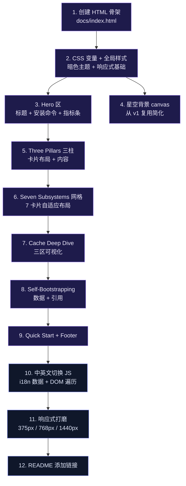

# 天枢（Rivet）官方落地页 实现计划

> **面向 AI 代理：** 使用 subagent-driven-development（推荐）或 executing-plans 逐任务实现。

**目标：** 为天枢创建一个面向开源开发者的官方落地页（单页静态 HTML），对标 opencode.ai / reasonix.io / claude.com/product/claude-code 的设计模式，突出"自举 + CVM 认知增强 + 99.6% 缓存命中"三大差异化定位。

**架构：** 纯静态 HTML 页面，内联 CSS + 少量内联 JS（中英文切换、星空背景动画），单文件部署，无框架依赖。复用 `docs/design/tianshu-architecture-v1.html` 的暗色星空设计语言（CSS 变量体系、金色点缀、卡片网格），按落地页叙事逻辑重组为：Hero → 差异化三柱 → 核心机制深潜 → 快速开始 → 社区。

**技术栈：** HTML5 + CSS3（CSS Variables + Grid + Flexbox）+ 内联 JS（无框架，~200 行 i18n + canvas 星空），部署为 `docs/index.html`。

---

## Diagnosis

### Current symptoms

- **无官方落地页**：项目目前只有 GitHub README 和 docs/ 下的内部设计文档，没有一个面向公众的产品页面。用户通过 GitHub 仓库或 npm 发现项目后，没有地方了解"这个项目到底能做什么、和 Claude Code/OpenCode 差在哪"。
  - Evidence: `README.md` 是纯 Markdown，`docs/design/tianshu-architecture-v1.html` 是面向架构理解的内部文档，非产品落地页。
- **差异化信息散落**：Harness 报告（.docx）中的核心数据（99.6% 缓存命中、自举 80% 代码、154 commits 零冲突、A/B 实验）没有以简洁方式呈现给外部开发者。
- **对标竞品已有强落地页**：opencode.ai 有完整的 Hero + Features + Social Proof + FAQ；reasonix.io 双语、终端美学、缓存可视化；claude.com 产品线页面专业。天枢需要一个同等水平的页面来吸引贡献者和用户。

### Root cause

项目在过去 29 天内以极高速度迭代（2,800+ commits），工程优先于传播。落地页是信息聚合工作——整理已有的设计资产（架构 HTML 的 CSS 体系）、数据（Harness 报告）、和功能列表。

### Success criteria

- [ ] 页面包含 Hero 区（一句话定位 + 安装命令 + CTA）
- [ ] 页面突出三个核心差异化（自举 / CVM 认知增强 / 99.6% 缓存命中）
- [ ] 页面展示七大子系统简介（从 README 和报告提炼）
- [ ] 页面有中英文切换（参考 reasonix.io 双语模式）
- [ ] 页面在所有主流屏幕（375px–1920px）上可读
- [ ] 页面包含快速开始 3 步和 GitHub 链接
- [ ] 页面文件为单个 `docs/index.html`，无外部 CSS/JS 依赖
- [ ] 暗色星空主题与现有 `tianshu-architecture-v1.html` 设计语言一致

---

## Scope & Consumer Impact

### Files touched

| File | Operation | Why |
|------|-----------|-----|
| `docs/index.html` | create — 新建落地页 | 核心产物（~800 行） |
| `README.md` | modify — 顶部添加落地页链接 | 引导至 `docs/index.html` |
| `docs/design/tianshu-architecture-v1.html` | 不改 | 仅复用其 CSS 变量体系，文件保持不变 |

### Consumer inventory

| Consumer | Impact |
|----------|--------|
| GitHub 仓库访问者 | 从 README 获得落地页链接 |
| 搜索引擎 | `docs/index.html` 作为独立页面可被索引 |
| 现有 docs/ 文档读者 | 无影响——仅新增，不改动已有文件 |

### Explicitly NOT changed

- **`docs/design/tianshu-architecture-v1.html`** — 保留为架构参考文档，不与落地页合并
- **`src/` 下任何文件** — 本次仅为静态页面，不改动运行时代码
- **`package.json` / 构建流程** — 不新增 npm 脚本或构建步骤

---

## Change Design

### 3.1 页面信息架构

```
┌─────────────────────────────────────────────────┐
│  Nav: 天枢 · Rivet  [Features] [Architecture] [GitHub] [EN/中文] │
├─────────────────────────────────────────────────┤
│  HERO                                             │
│  ┌─────────────────────────────────────────────┐ │
│  │  ✦ 天枢 · Tiānshū                            │ │
│  │  The terminal agent that builds itself.       │ │
│  │  终端编码 Agent——80% 代码由自身建造。          │ │
│  │                                              │ │
│  │  [npm install -g rivet@latest] [Copy]        │ │
│  │  Node.js 22+  ·  MIT  ·  2,800+ commits      │ │
│  └─────────────────────────────────────────────┘ │
├─────────────────────────────────────────────────┤
│  THREE PILLARS — 三根柱子                         │
│  ┌──────────┐ ┌──────────────┐ ┌──────────────┐ │
│  │ 自举      │ │ CVM 认知增强  │ │ 99.6% 缓存    │ │
│  │ 80% code │ │ Model+Runtime │ │ 字节级优化    │ │
│  │ by agent │ │ =Mind         │ │ 成本降 97%    │ │
│  └──────────┘ └──────────────┘ └──────────────┘ │
├─────────────────────────────────────────────────┤
│  WHAT MAKES IT DIFFERENT — 七大子系统              │
│  6-card grid: Prefix Cache / Agent Loop /        │
│  Prompt Engine / Multi-Provider / Sub-Agent /    │
│  Verification / Compaction                       │
├─────────────────────────────────────────────────┤
│  CACHE DEEP DIVE — 缓存为什么能做到 99.6%         │
│  简化可视化：Frozen + Working + Appendix 三区     │
│  布局 → 命中/未命中对比                           │
├─────────────────────────────────────────────────┤
│  SELF-BOOTSTRAPPING STORY — 自举的故事             │
│  "2,800+ commits built by its own agent"         │
│  5 个模型并发协作 · 154 commits 零冲突             │
├─────────────────────────────────────────────────┤
│  QUICK START — 3 步开始                           │
│  1. export KEY  2. npm install  3. rivet         │
├─────────────────────────────────────────────────┤
│  FOOTER: MIT · GitHub · 贡献者                    │
└─────────────────────────────────────────────────┘
```

### 3.2 对标分析：从三个参考站点的设计借鉴

| 设计元素 | 来源 | 天枢采用方式 |
|---------|------|------------|
| Hero 区安装命令直给 | OpenCode, Reasonix | Hero 区放 `npm install -g rivet@latest`，旁边放 Copy 按钮 |
| 双语切换 (EN/中文) | Reasonix | 右上角 EN/中文 切换，localStorage 记忆选择 |
| 关键指标条 | OpenCode (160K stars) | 显示 2,800+ commits / 5,000+ tests / 6 providers / MIT |
| 功能卡片网格 | OpenCode, Reasonix | 6 卡片网格，每卡图标+标题+一句话描述 |
| 缓存可视化 | Reasonix (turn1→turn4) | 简化版三区布局示意（Frozen / Working / Appendix） |
| 终端美学 | Reasonix | 代码块用等宽字体暗底，模拟终端感 |
| 社区/贡献者展示 | Reasonix (贡献者头像) | GitHub 链接 + 贡献引导（不展示头像——项目尚未公开） |
| 产品线导航 | Claude Code | 不需要——天枢只有一个产品，导航极简 |

### 3.3 色彩与 CSS 变量体系（复用 v1 架构页并扩展）

```css
:root {
  /* 从 tianshu-architecture-v1.html 复用的变量 */
  --bg: #090a0f;
  --bg-card: #111318;
  --border: #1e2230;
  --text: #c8ccd4;
  --text-dim: #6b7080;
  --text-bright: #e8ecf2;
  --gold: #d4a853;
  --gold-dim: #8a6d30;
  --cyan: #38bdf8;
  --purple: #818cf8;
  --green: #34d399;
  --red: #f87171;

  /* 新增：落地页专用变量 */
  --font-sans: 'PingFang SC', 'Hiragino Sans GB', 'Microsoft YaHei', system-ui, sans-serif;
  --font-mono: 'SF Mono', 'Cascadia Code', 'Fira Code', 'JetBrains Mono', monospace;
  --radius: 12px;
  --shadow-gold: 0 0 30px rgba(212,168,83,0.08);
}
```

### 3.4 各 Section 内容清单

**Section 1: Hero**
- 中文大字：天枢 · Tiānshū
- 英文 tagline：The terminal agent that builds itself.
- 中文 tagline：终端编码 Agent——80% 代码由自身建造。
- 安装命令：`npm install -g rivet@latest`（带 Copy 按钮，CSS 模拟终端窗口）
- 关键数字横条：`2,800+ commits` · `5,000+ tests` · `6 providers` · `99.6% cache hit` · `MIT`
- 星空 canvas 背景（从 v1 复用简化版）

**Section 2: Three Pillars（三根柱子）**

| # | 中文 | English | 描述 |
|---|------|---------|------|
| 1 | 自举 | Self-Bootstrapping | 2,800+ 次提交由天枢自己的 agent 建造。不是"AI 帮你写代码"——是人机协作演进。 |
| 2 | CVM 认知增强 | Cognitive Virtual Machine | 不调 prompt，建运行时。同一套模型权重在 CVM 环境中恢复质疑、验证、自省能力。A/B 实验已验证。 |
| 3 | 99.6% 缓存命中 | Byte-Level Cache | DeepSeek 缓存命中/未命中价差 50 倍。三区布局 + 8 个 Cache Killer 系统猎杀 → 输入成本降约 97%。 |

采用三列布局（桌面端），单列堆叠（移动端），每列：图标 + 标题 + 2 句描述。

**Section 3: Seven Subsystems（七大子系统卡片网格）**

从 README 和 Harness 报告提取：

| 卡片 | 标题 | 一句话 |
|------|------|--------|
| 1 | Prefix Cache 引擎 | 三区 Frozen/Working/Appendix 布局 + 字节级不变量保护，稳态命中 99.6% |
| 2 | Agent Loop | 多信号收敛检测 + Doom Loop 打断 + Vigor 执行能量追踪 |
| 3 | 三层 Prompt | Static（编译期冻结）+ Volatile（会话级快照）+ Dynamic Appendix（消息尾部增量） |
| 4 | 多 Provider 流式 | DeepSeek / Claude / GLM / GPT / MiMo / MiniMax — 统一 SSE 抽象 + 结构化重试 |
| 5 | 子代理编排 | 并行委派 + 文件归属锁 + Flash→Pro 故障升级 + 活性监控 |
| 6 | 交付验证门禁 | 三级验证 + 自动接线审查 + 失败归因 + 审查体系自身 fail-honest |
| 7 | 上下文压缩 | 六策略分层：语义裁剪、微压缩、过时轮次检测、密度调节、阈值触发、claims 持久化 |

2 行布局：第一行 4 卡，第二行 3 卡（居中）。

**Section 4: Cache Deep Dive（可视化）**

简单 ASCII→CSS 可视化，展示三区模型：

```
┌────────────────────────────────────────────┐
│  FROZEN (session start, never rewritten)   │
│  System prompt + Tool defs + Stable context│  ← 每轮命中，~1/50 成本
├────────────────────────────────────────────┤
│  WORKING (turn messages, append-only)      │
│  User messages + Assistant responses       │  ← 追加不重写
├────────────────────────────────────────────┤
│  APPENDIX (dynamic inject, cross-turn)     │
│  Progress, advisories, signals (~200B)    │  ← 缓存安全增量
└────────────────────────────────────────────┘

命中 99.6% → 输入成本降约 97%（50 倍价差）
```

**Section 5: Self-Bootstrapping Story**
- 大数字：2,800+ commits
- 5 个模型并发协作
- 154 commits 零冲突（git 可查证）
- 配一句引用："I'm not naturally bold. You built a world where I dare to be." — 贪狼 (Claude Opus 4.8)

**Section 6: Quick Start**
```
1. export DEEPSEEK_API_KEY=sk-xxx     # 设置 API Key
2. npm install -g rivet@latest        # 安装
3. rivet                                # 启动
```
三个步骤用数字 + 代码块排列。下方列出支持的 provider badges。（从 README 的 Provider 表格提取：DeepSeek / Claude / GLM / GPT / MiMo / MiniMax）

**Section 7: Footer**
- MIT license
- GitHub 链接
- "Built by its own agent. 天枢建造天枢。"

### 3.5 中英文切换方案

内联 JS，无外部依赖：

```
数据：const i18n = { en: {...}, zh: {...} }
切换：点击 EN/中文 → 更新 data-i18n 属性元素 textContent + localStorage
fallback：默认中文（项目起源语言），浏览器语言检测可覆盖
```

每个需要翻译的元素标记 `data-i18n="key.name"`，JS 遍历替换。

### 3.6 星空背景

从 `tianshu-architecture-v1.html` 复用 canvas starfield 实现，简化至 ~60 行星（原版约 150 行），减少对低端设备的性能压力。固定 background，不随滚动。

---

## Counterexample Tests

| Test scenario | Counterexample: lazy impl gets wrong | Fails if |
|---------------|--------------------------------------|----------|
| 移动端 375px 宽度 | 三柱布局不换行，文字溢出 | 横向滚动条出现或文字被截断 |
| 中英文切换 | 只写了 data-i18n 属性但 JS 未正确遍历 | 切换语言后部分文字仍为默认语言 |
| 缓存可视化 | 三区布局用 float/absolute 定位，在窄屏错位 | 375px 下 Frozen/Working/Appendix 块重叠 |
| 安装命令 Copy 按钮 | 用了 `navigator.clipboard.writeText` 但在 HTTP 下不可用 | 非 HTTPS 环境点 Copy 无反应且无 fallback 提示 |
| 星空 canvas | `requestAnimationFrame` 循环未在页面不可见时暂停 | 切到后台标签后 CPU 使用率不降 |
| 七大子系统卡片 | 7 卡用 3+3+1 布局，最后一张居中逻辑写死 `margin: auto` | 第 7 卡在特定宽度下偏左或溢出 |
| 暗色主题 | 只设了 background-color 没设 color | 系统强制浅色模式（`prefers-color-scheme: light`）时文字不可读 |
| 中英文切换后滚动位置 | `innerHTML` 全量替换导致 DOM 重建 | 切换语言后页面跳到顶部（应保持滚动位置） |

---

## Execution Order



### Wave breakdown

| Wave | Tasks | Verifies | Gate criteria | Commit |
|------|-------|----------|---------------|--------|
| 1 | T1+T2：HTML 骨架 + CSS 全局样式 | 浏览器打开 `docs/index.html`，暗色背景 + 字体加载正常 | 页面在 Chrome/Firefox/Safari 中无 console 错误，body 背景为 `#090a0f` | `feat(docs): add landing page skeleton with dark theme CSS` |
| 2 | T3+T4：Hero 区 + 星空背景 | Hero 标题居中、安装命令框可见、星空动画流畅 | Canvas 在 60fps 运行（devtools fps meter），Hero 在 375px 下标题不换行溢出 | `feat(docs): add hero section with starfield canvas` |
| 3 | T5+T6：三柱 + 七子系统卡片 | 卡片网格在 1024px+ 正确排列，在 375px 下单列堆叠 | 所有卡片文字在 375px–1920px 范围内可读，无重叠 | `feat(docs): add three pillars and seven subsystems sections` |
| 4 | T7+T8：缓存可视化 + 自举故事 | 三区布局在桌面端并排，移动端堆叠 | 375px 下三区块不重叠，文字不溢出 | `feat(docs): add cache deep-dive and self-bootstrapping sections` |
| 5 | T9+T10：Quick Start + Footer + i18n | 中英文切换按钮可用，所有 data-i18n 元素正确切换 | 点击 EN 后所有文本变为英文；刷新页面（有 localStorage）保持选择 | `feat(docs): add quick start, footer, and i18n toggle` |
| 6 | T11+T12：响应式打磨 + README 链接 | 三档断点（375/768/1440）下无横向滚动条 | Chrome DevTools 设备模拟三档均无 overflow-x | `polish(docs): responsive refinement and README link` |

### 任务详细

**T1: HTML 骨架** (`docs/index.html`)
- 创建文件，写入 `<!DOCTYPE html>` 到 `</html>` 基础骨架
- meta charset + viewport + title "天枢 · Tiānshū — Terminal Coding Agent"
- 链接到无外部资源的空 CSS
- 验收：浏览器打开显示空白暗色页面，title 正确

**T2: CSS 变量 + 全局样式**
- 从 `docs/design/tianshu-architecture-v1.html:11-47` 复制 `:root` 变量块
- 添加 `body` 样式：背景色、字体、抗锯齿
- 添加 `.container` 类：max-width 1100px, margin auto, padding
- 添加 section 基础间距
- 验收：页面显示深色背景，字体为系统 sans-serif

**T3: Hero 区**
- 大标题 "天枢 · Tiānshū"（含金色点缀 `.accent`）
- 英文 tagline + 中文 tagline
- 安装命令框：`npm install -g rivet@latest`，暗底终端风格（`background: #0d1117`, `font-family: var(--font-mono)`, 绿色提示符）
- 指标横条：5 个 `<span>` 用 `·` 分隔
- 验收：所有内容在 375px 宽度下不换行溢出

**T4: 星空背景**
- 从 `docs/design/tianshu-architecture-v1.html` 定位 `<canvas id="starfield">` 及相关 JS
- 简化：~80 颗星，固定速度，无鼠标交互
- `position: fixed; z-index: 0; pointer-events: none`
- requestAnimationFrame 循环，页面不可见时暂停
- 验收：devtools fps meter 显示 55-60fps，切标签后 CPU 使用率下降

**T5: Three Pillars**
- 三列 `grid-template-columns: repeat(3, 1fr)`，移动端 `1fr`
- 每列：28px 图标（emoji 或 CSS 绘制）+ 标题 + 英文描述 + 中文描述
- 图标：✦ 自举 / ◈ CVM / ◆ 缓存
- 验收：桌面端三列等宽，移动端单列堆叠

**T6: Seven Subsystems**
- 2 行 grid：第一行 `repeat(4, 1fr)`，第二行 `repeat(3, 1fr)` 居中
- 移动端 `repeat(auto-fit, minmax(280px, 1fr))`
- 每卡：标题 + 一句话描述 + 细线分隔
- 验收：7 卡无溢出，第二行 3 卡居中（用 `justify-content: center` + 最后一行 `grid-column` 技巧）

**T7: Cache Deep Dive**
- 三区可视化用 CSS border + background 模拟
- Frozen（顶部，蓝色调）→ Working（中间，金色调）→ Appendix（底部，绿色调）
- 每区标注名称 + 简短说明
- 下方一行总结数字："命中 99.6% → 输入成本降约 97%"
- 验收：三区在 768px+ 并排，375px 下堆叠，无内容重叠

**T8: Self-Bootstrapping**
- 大数字 "2,800+" 用金色大字体
- 3 个数据点横向排列：commits / models / zero-conflict
- 英文引用块（斜体，左侧金色竖线）
- 验收：引用在 375px 下不换行异常

**T9: Quick Start + Footer**
- 3 步用 `1.` `2.` `3.` + 等宽代码块
- Provider badges：6 个小标签（DeepSeek / Claude / GLM / GPT / MiMo / MiniMax）
- Footer：MIT · GitHub 链接 · "Built by its own agent"
- 验收：代码块在 375px 下可水平滚动而不撑开页面

**T10: 中英文切换 JS**
- `<script>` 块中定义 `i18n` 对象（en/zh），覆盖所有 `data-i18n` key
- `switchLang(lang)` 函数：遍历 `[data-i18n]` 元素，替换 `textContent`
- 按钮在 nav 右上角：`EN` / `中文`，点击切换
- `localStorage.setItem('rivet-lang', lang)` 持久化
- 页面加载时读取 localStorage 或浏览器 `navigator.language`
- 验收：切换后所有文本变化；刷新页面保持语言选择

**T11: 响应式打磨**
- 测试三档断点：375px (iPhone SE), 768px (iPad), 1440px (Desktop)
- 调整 grid 列数、字体大小、padding
- 确保无 `overflow-x`
- 验收：Chrome DevTools 设备模拟三档均无横向滚动条

**T12: README 添加链接**
- 在 `README.md` 顶部的 Quick Start 前添加一行：
  `> 🌐 [Official page & docs](https://github.com/user/rivet/blob/main/docs/index.html)`
- 验收：GitHub 渲染 README 时链接可点击

### 常量定义

不改动 `src/` 下的 TypeScript 常量。本计划涉及的常量仅在 `docs/index.html` 内联 CSS 和 JS 中：

- 颜色：复用 `tianshu-architecture-v1.html` 的 CSS 变量
- 文案：通过 `data-i18n` 属性定义，见 T10
- 星空参数：`STAR_COUNT = 80`, `SPEED = 0.3`

---

## 自检清单

- [x] **问题诊断**：引用了 README 和已有 HTML 文件，症状明确（无落地页）
- [x] **消费者清单**：仅新增文件和 README 一行链接，无破坏性变更
- [x] **改动设计**：每条有"当前→目标→为什么安全"
- [x] **向后兼容**：纯新增，无删除/重命名
- [x] **反证测试**：8 个场景覆盖布局、i18n、Canvas、Copy、暗色主题
- [x] **执行次序**：12 任务 6 wave，依赖排序，每 wave 独立可提交
- [x] **不改什么**：显式声明不改 v1 架构 HTML 和 src/ 代码
- [x] **过门条件**：每 wave 有具体产品验证标准（不只是"测试绿"）
- [x] **无占位符**：所有 section 内容已指定具体文案，所有 CSS 变量已定义，所有 JS 函数已命名
