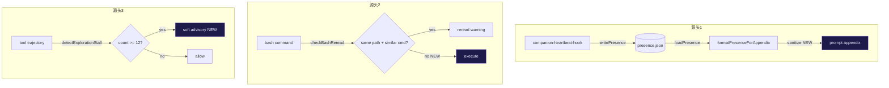

# 噪音信号三源头修复 实现计划

> **面向 AI 代理：** 使用 subagent-driven-development（推荐）或 executing-plans 逐任务实现。

**目标：** 消除 companion-presence 跨会话碎片泄漏、bash-reread 误报、exploration-stall 误阻断这三个噪音源头的有害行为，同时保留它们各自的正当设计意图。

**架构：** 三处独立修复，互不依赖。源头 1（companion-presence）在注入点加 sanitizer，过滤 worker 内部碎片和可执行指令；源头 2（bash-reread）从"同路径即重复"改为"同路径+同命令前缀才重复"的更严格匹配；源头 3（exploration-stall）从硬阻断降级为软警告+提高阈值。

**技术栈：** TypeScript strict, node:test + assert/strict, 纯函数可测

---

## 背景

本会话期间诊断出三个误报型噪音信号源。它们的设计意图都合理（防止信息泄漏/防止重复读取/防止无限探索），但判断逻辑太粗糙，把正常行为误判为异常，在修复过程中反复干扰执行。

**实际发生的事件链**：
1. companion-presence 注入了 `"Repair the previous answer so it is exactly one valid WorkerResult JSON object."` — 这是另一个 worker 会话的内部协议碎片，格式上像系统指令
2. bash-reread 把 `find ... -name "1acdf939*"` 和 `find ... -name "*1acdf939*"` 判定为"重读同一文件"，但这是两个不同的 find 命令查不同路径
3. exploration-stall 在系统性阅读 6 个文件的调用链（plan-trace-coordinator → replan-loop → detectDeviation → correctPlan → injectReplanContext）时触发硬阻断，阻止了继续读代码

## 架构层次分析

```
源头 1: companion-presence（跨会话感知）
  层次: 信息注入层 — 把其他会话的状态写入 prompt appendix
  问题: objective 字段原样透传，不区分"用户可见任务描述"和"worker 内部协议碎片"
  修复层: formatPresenceForAppendix 注入点（输出端过滤，不改存储）

源头 2: bash-reread（重复读取检测）
  层次: 工具执行层 — bash 工具的前置检查
  问题: 只看文件路径匹配，不看命令差异。find/grep/ls 针对同一路径的不同参数都是合法新查询
  修复层: checkBashReread 匹配逻辑（增加命令差异判断）

源头 3: exploration-stall（探索停滞检测）
  层次: 工具流水线门控 — 硬阻断探索工具调用
  问题: 纯计数器，不区分"有序逐文件阅读"和"漫无目的循环 grep"；硬阻断比软警告更激进
  修复层: detectExplorationStall 返回值 + tool-pipeline 消费方式
```



---

## 安全不变量

- companion-presence: sanitizer 不得输出包含 `<` 或 `>` 的 objective 文本（防 XML 注入）；不得输出以 `Repair`、`WorkerResult`、`Error:` 等协议关键字开头的碎片
- bash-reread: 不得对包含 `&&`（命令链）、`>`（重定向）、`$()`（子命令）的复合命令触发误报
- exploration-stall: 软警告模式不得阻止工具执行（只追加到输出末尾，返回 is_error=false）

## 触发路径清单

| 源头 | 触发条件 | 当前行为 | 目标行为 |
|------|---------|---------|---------|
| companion-presence | 其他活跃会话的 objective 含协议碎片 | 原样注入 | 过滤后注入 |
| bash-reread | 同一路径在两次不同 bash 调用中出现 | 警告 | 仅当命令前缀也匹配时警告 |
| exploration-stall | 连续 8 次探索工具 | 硬阻断（is_error=true） | 12 次后软警告（is_error=false），15 次后硬阻断 |

---

## Task 1: companion-presence objective sanitizer

**文件：**
- 修改：`src/agent/companion-presence.ts`（`formatPresenceForAppendix` 函数）
- 测试：`src/agent/__tests__/companion-presence.test.ts`

**问题根因：**

`formatPresenceForAppendix`（companion-presence.ts:71-82）把 `e.objective` 原样插入 `<m>` 标签。objective 来自 `loop-factory.ts:271` 的 `getObjective()`，它取 `self.taskContract?.objective ?? self.initialUserMessage?.slice(0, 120)`。对于 worker 会话，initialUserMessage 可能是内部协议文本（如 `"Repair the previous answer so it is exactly one valid WorkerResult JSON object."`），而非用户可见的任务描述。

**步骤 1.1：写失败测试**

在 `src/agent/__tests__/companion-presence.test.ts` 的 `describe('formatPresenceForAppendix')` 块末尾追加：

```typescript
  it('filters out worker protocol fragments from objective', () => {
    const now = Date.now()
    const entries: CompanionPresenceEntry[] = [
      { sessionId: 'worker-1', starDomain: '天梁', objective: 'Repair the previous answer so it is exactly one valid WorkerResult JSON object.', updatedAt: now - 60_000 },
    ]
    const result = formatPresenceForAppendix(entries)
    assert.ok(!result.includes('Repair'), 'worker protocol keyword should be filtered')
    assert.ok(!result.includes('WorkerResult'), 'protocol type name should be filtered')
  })

  it('strips angle brackets from objective to prevent XML injection', () => {
    const now = Date.now()
    const entries: CompanionPresenceEntry[] = [
      { sessionId: 's1', starDomain: '天枢', objective: 'Fix <script>alert(1)</script> bug', updatedAt: now },
    ]
    const result = formatPresenceForAppendix(entries)
    assert.ok(!result.includes('<script>'), 'angle brackets must be escaped or stripped')
  })

  it('preserves normal human-readable objectives', () => {
    const now = Date.now()
    const entries: CompanionPresenceEntry[] = [
      { sessionId: 's1', starDomain: '天枢', objective: '修复 trace 收敛误触发 bug', updatedAt: now },
    ]
    const result = formatPresenceForAppendix(entries)
    assert.ok(result.includes('修复 trace 收敛误触发 bug'))
  })
```

运行确认失败：
```bash
node --import tsx --test src/agent/__tests__/companion-presence.test.ts 2>&1 | grep -E "filters out|strips angle|preserves normal"
```
预期：3 个 fail（当前实现不做过滤）。

**步骤 1.2：实现 sanitizer**

在 `src/agent/companion-presence.ts` 的 `formatPresenceForAppendix` 函数中，在 `e.objective` 使用前加 sanitizer：

```typescript
// Worker 内部协议碎片前缀 — 这些不是用户可见的任务描述
const PROTOCOL_PREFIXES = [
  'Repair the previous',
  'WorkerResult',
  'Error:',
  'TypeError:',
  'ReferenceError:',
  'SyntaxError:',
]

function sanitizeObjective(raw: string): string {
  let s = raw.replace(/[<>]/g, '')  // 防 XML 注入
  for (const prefix of PROTOCOL_PREFIXES) {
    if (s.startsWith(prefix)) {
      return '(internal)'
    }
  }
  return s.slice(0, 120)
}
```

在 `formatPresenceForAppendix` 的 map 回调里，把 `e.objective` 替换为 `sanitizeObjective(e.objective)`。

**步骤 1.3：验证通过**

```bash
node --import tsx --test src/agent/__tests__/companion-presence.test.ts 2>&1 | grep -E "ℹ (tests|pass|fail)"
```
预期：tests 增加 3，fail 0。

**步骤 1.4：typecheck + commit**

```bash
npx tsc --noEmit
```
预期：exit 0。

```bash
git add src/agent/companion-presence.ts src/agent/__tests__/companion-presence.test.ts
git commit -m "fix(presence): sanitize worker protocol fragments from companion objective

formatPresenceForAppendix now strips angle brackets (XML injection guard)
and replaces worker-internal protocol fragments (e.g. 'Repair the previous
answer...', 'WorkerResult...') with '(internal)'. Prevents cross-session
noise from leaking into the active session's prompt as misleading text."
```

---

## Task 2: bash-reread 精准化匹配

**文件：**
- 修改：`src/tools/bash.ts`（`checkBashReread` 函数，约 L96-L118）
- 测试：`src/tools/__tests__/bash-reread.test.ts`（新建）

**问题根因：**

`checkBashReread`（bash.ts:103-118）用文件路径做唯一 key（`const key = filePath`）。两次完全不同的命令只要碰巧访问同一路径就触发警告。典型场景：

- `head -3 ~/.rivet/sessions/xxx.jsonl` 和 `tail -20 ~/.rivet/sessions/xxx.jsonl` — 读文件的不同部分
- `find . -name "1acdf939*"` 和 `find . -name "*1acdf939*"` — 不同 glob 模式
- `cat file | grep foo` 和 `cat file | grep bar` — 过滤不同内容

**步骤 2.1：写失败测试**

新建 `src/tools/__tests__/bash-reread.test.ts`：

```typescript
import { describe, it, beforeEach } from 'node:test'
import assert from 'node:assert/strict'

// checkBashReread 是模块内部函数，通过 BASH_TOOL execute 间接测试
// 或导出后直接测试
import { checkBashReread } from '../bash.ts'

describe('checkBashReread', () => {
  it('does NOT warn when same file is read with different commands', () => {
    // 第一次：head 读文件头部
    const w1 = checkBashReread("head -3 ~/.rivet/sessions/test.jsonl", 'id-1')
    assert.equal(w1, null)
    // 第二次：tail 读文件尾部 — 不同命令，不应触发
    const w2 = checkBashReread("tail -20 ~/.rivet/sessions/test.jsonl", 'id-2')
    assert.equal(w2, null, 'different command on same path should not trigger reread')
  })

  it('does NOT warn when same file is read with different grep patterns', () => {
    checkBashReread("grep 'foo' /tmp/test.txt", 'id-1')
    const w2 = checkBashReread("grep 'bar' /tmp/test.txt", 'id-2')
    assert.equal(w2, null, 'different grep pattern should not trigger reread')
  })

  it('warns when identical command is repeated on same file', () => {
    checkBashReread("cat /etc/hosts", 'id-1')
    const w2 = checkBashReread("cat /etc/hosts", 'id-2')
    assert.ok(w2 !== null, 'identical command repetition should trigger warning')
    assert.ok(w2!.includes('bash-reread'))
  })

  it('does not track /tmp or /dev paths', () => {
    const w1 = checkBashReread("cat /tmp/foo.txt", 'id-1')
    const w2 = checkBashReread("cat /tmp/foo.txt", 'id-2')
    assert.equal(w2, null, '/tmp paths should not be tracked')
  })
})
```

> **注意：** `checkBashReread` 当前未导出。步骤 2.2 需要添加 `export` 关键字。

运行确认失败：
```bash
node --import tsx --test src/tools/__tests__/bash-reread.test.ts 2>&1 | grep -E "ℹ (pass|fail)"
```
预期：前两个 test fail（当前只按路径匹配），后两个可能 pass。

**步骤 2.2：改 checkBashReread 匹配逻辑**

在 `src/tools/bash.ts` 中：

1. 导出函数：把 `function checkBashReread` 改为 `export function checkBashReread`

2. 把 key 从纯路径改为路径+命令签名的组合：

```typescript
// 提取命令动词（cat/grep/head/tail）+第一个 flag 或 pattern，忽略行号/偏移量差异
function commandSignature(command: string, filePath: string): string {
  const verbMatch = command.match(/^\s*(cat|grep|head|tail)\b/)
  const verb = verbMatch ? verbMatch[1]! : ''
  // 对 grep：提取 pattern（-e 后的值或第一个非 flag 参数）
  // 对 head/tail：忽略行数差异（-N）
  if (verb === 'grep') {
    const patternMatch = command.match(/grep\s+(?:-[a-zA-Z]+\s+)*['"]?([^'"\s]+)['"]?/)
    return `${verb}:${filePath}:${patternMatch ? patternMatch[1] : ''}`
  }
  if (verb === 'head' || verb === 'tail') {
    // head/tail 不同行数视为不同操作 — 不追加 pattern
    return `${verb}:${filePath}:${command.includes('-') ? command.match(/-\d+/)?.[0] ?? '' : ''}`
  }
  // cat 或其他：纯路径匹配
  return `${verb}:${filePath}`
}
```

3. 在 `checkBashReread` 里把 `const key = filePath` 改为 `const key = commandSignature(command, filePath)`

**步骤 2.3：验证通过**

```bash
node --import tsx --test src/tools/__tests__/bash-reread.test.ts 2>&1 | grep -E "ℹ (tests|pass|fail)"
```
预期：tests 4, pass 4, fail 0。

**步骤 2.4：typecheck + commit**

```bash
npx tsc --noEmit
```

```bash
git add src/tools/bash.ts src/tools/__tests__/bash-reread.test.ts
git commit -m "fix(bash): refine reread detection to require command similarity

checkBashReread now uses a path+command-verb+pattern signature as the
dedup key instead of path alone. Different commands on the same file
(head vs tail, grep with different patterns) no longer trigger false
reread warnings. Only near-identical command repetition triggers."
```

---

## Task 3: exploration-stall 软警告 + 阈值提升

**文件：**
- 修改：`src/agent/exploration-stall.ts`（`detectExplorationStall` 返回值）
- 修改：`src/agent/tool-pipeline.ts`（L650-660 消费方式）
- 测试：`src/agent/__tests__/exploration-stall.test.ts`

**问题根因：**

`detectExplorationStall`（exploration-stall.ts:43-66）在 `count >= threshold`（默认 8）时返回 `blocked: true`。`tool-pipeline.ts:654-659` 把这个 blocked 当硬门控——直接返回 `is_error: true`，阻止工具执行。

问题在于 8 次连续探索工具是一个很容易在正常诊断中达到的数字——读 6 个文件 + 2 次 grep 就到了。硬阻断阻止了合法的代码理解工作。

**步骤 3.1：写失败测试**

在 `src/agent/__tests__/exploration-stall.test.ts` 末尾追加：

```typescript
  it('returns soft advisory (not blocked) at threshold 12-14', () => {
    const trajectory = Array.from({ length: 11 }, () => ({ tool: 'read_file', status: 'done' }))
    const result = detectExplorationStall(trajectory, 'read_file')
    assert.equal(result.blocked, false, 'should not hard-block at advisory level')
    assert.ok(result.advisory !== null, 'should have advisory message')
    assert.ok(result.message!.includes('exploration'))
  })

  it('hard-blocks only at threshold 15+', () => {
    const trajectory = Array.from({ length: 14 }, () => ({ tool: 'read_file', status: 'done' }))
    const result = detectExplorationStall(trajectory, 'read_file')
    assert.equal(result.blocked, true, 'should hard-block at 15+')
  })

  it('does not trigger advisory before threshold 12', () => {
    const trajectory = Array.from({ length: 8 }, () => ({ tool: 'read_file', status: 'done' }))
    const result = detectExplorationStall(trajectory, 'read_file')
    assert.equal(result.blocked, false)
    assert.equal(result.advisory, null)
    assert.equal(result.message, null)
  })
```

运行确认失败：
```bash
node --import tsx --test src/agent/__tests__/exploration-stall.test.ts 2>&1 | grep -E "soft advisory|hard-blocks|before threshold"
```
预期：3 个 fail（`advisory` 字段不存在 + threshold 未改）。

**步骤 3.2：改 detectExplorationStall 返回值**

在 `src/agent/exploration-stall.ts` 中：

1. `ExplorationStallResult` 接口加字段：

```typescript
export interface ExplorationStallResult {
  blocked: boolean
  consecutiveExploreCount: number
  message: string | null
  /** 软警告：不阻断工具，只在输出末尾追加提示 */
  advisory: string | null
}
```

2. 所有不阻断的返回路径加 `advisory: null`

3. 主体逻辑改为三档：

```typescript
const ADVISORY_THRESHOLD = 12
const HARD_BLOCK_THRESHOLD = 15

if (count < ADVISORY_THRESHOLD) {
  return { blocked: false, consecutiveExploreCount: count, message: null, advisory: null }
}

if (count < HARD_BLOCK_THRESHOLD) {
  return {
    blocked: false,
    consecutiveExploreCount: count,
    message: null,
    advisory: `ℹ Exploration stall advisory: ${count} consecutive exploration tools. Consider acting on your findings soon.`,
  }
}

return {
  blocked: true,
  consecutiveExploreCount: count,
  message: [
    `Exploration stall: ${count} consecutive exploration tools without any code changes.`,
    'You have enough context. Write the test or implementation now.',
  ].join('\n'),
  advisory: null,
}
```

> **注意：** `threshold` 参数保留但不作为主阈值——它覆盖 HARD_BLOCK_THRESHOLD（向后兼容已有调用方 `detectExplorationStall(trajectory, tool, 8)`，但 tool-pipeline 的调用改为不传 threshold，使用默认 15）。

**步骤 3.3：改 tool-pipeline 消费方式**

在 `src/agent/tool-pipeline.ts` 的 L650-660 区段：

把当前的硬阻断：
```typescript
const stall = detectExplorationStall(trajectorySummary, tu.name)
if (stall.blocked) {
  const msg = stall.message!
  callbacks.onToolResult(tu.id, tu.name, msg, true)
  return { toolResult: { type: 'tool_result', tool_use_id: tu.id, content: ..., is_error: true }, ... }
}
```

改为：
```typescript
const stall = detectExplorationStall(trajectorySummary, tu.name)
if (stall.blocked) {
  const msg = stall.message!
  callbacks.onToolResult(tu.id, tu.name, msg, true)
  return { toolResult: { type: 'tool_result', tool_use_id: tu.id, content: ..., is_error: true }, ... }
}
// Soft advisory: allow execution, append hint to result afterward
const stallAdvisory = stall.advisory
```

然后在工具执行结果组装时，如果有 `stallAdvisory`，把它追加到 content 末尾（不设 is_error）。具体位置是 tool-pipeline.ts 中组装 `toolResult.content` 的三个分支（L229, L261, L276 附近），参照 bash-reread 的追加模式。

> **实现注意：** advisory 需要在工具执行完成后追加。如果 tool-pipeline 的结构是先检查门控→再执行→再组装结果，那 advisory 变量需要在闭包里传递到结果组装点。检查 `stallAdvisory` 变量在结果组装分支中是否可见——可能需要提升到外层作用域。

**步骤 3.4：验证通过**

```bash
node --import tsx --test src/agent/__tests__/exploration-stall.test.ts 2>&1 | grep -E "ℹ (tests|pass|fail)"
```
预期：tests 增加 3，fail 0。

**步骤 3.5：typecheck + commit**

```bash
npx tsc --noEmit
```

```bash
git add src/agent/exploration-stall.ts src/agent/__tests__/exploration-stall.test.ts src/agent/tool-pipeline.ts
git commit -m "fix(stall): soften exploration stall from hard-block to advisory at 12-14

exploration-stall now has three tiers: allow (<12), soft advisory
(12-14, non-blocking hint appended to output), hard-block (15+).
The previous threshold of 8 with immediate hard-block was too aggressive
for legitimate code-reading sessions that naturally span 6+ files."
```

---

## 验证计划

### 单元测试

每个 Task 各自的测试文件，验证修复前后的行为差异。

### 集成验证

```bash
# 全部相关测试
node --import tsx --test src/agent/__tests__/companion-presence.test.ts src/tools/__tests__/bash-reread.test.ts src/agent/__tests__/exploration-stall.test.ts 2>&1 | tail -10

# typecheck
npx tsc --noEmit
```

### 反证测试覆盖

| 修复点 | 反证测试（打红错误实现才证明 spec 覆盖） |
|--------|---------------------------------------|
| companion-presence | worker 协议碎片不被注入 + 正常 objective 保留 |
| bash-reread | 不同命令同路径不警告 + 相同命令重复才警告 |
| exploration-stall | 8-11 次不触发 + 12-14 次软警告不阻断 + 15 次才硬阻断 |

---

## 风险与缓解

**风险 1：companion-presence sanitizer 过度过滤**
- 正常 objective 碰巧以 "Error:" 开头（如 "修复 Error: 重复出现的 bug"）
- 缓解：PROTOCOL_PREFIXES 只匹配精确前缀（startsWith），且列表保守（只列确定的 worker 协议碎片）

**风险 2：bash-reread 签名碰撞**
- 两个不同 grep 命令提取到相同 pattern
- 缓解：signature 包含 verb+pattern+path 三元组，碰撞概率低；最坏情况只是漏报（不警告），不是误报

**风险 3：exploration-stall 阈值太高，错过真正的无限探索**
- 缓解：15 次硬阻断仍然兜底；软警告在 12 次就开始提示

---

## 完成检查清单

- [ ] companion-presence sanitizer 过滤协议碎片 + XML 注入防护
- [ ] bash-reread 使用路径+命令签名而非纯路径
- [ ] exploration-stall 三档阈值（allow < 12, advisory 12-14, block 15+）
- [ ] 所有新测试 RED → GREEN
- [ ] `npx tsc --noEmit` 通过
- [ ] 三个独立 commit，每个一个逻辑单元
