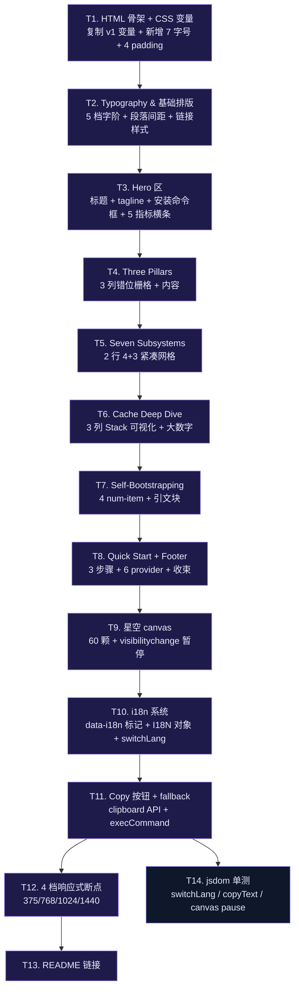

# 天枢官方落地页 · 视觉设计落地 实现计划

> **面向 AI 代理：** 使用 subagent-driven-development（推荐）或 executing-plans 逐任务实现。

**目标：** 在 `docs/index.html` 落地一个单页静态产品官网，对标 opencode.ai / reasonix.io / claude.com/product/claude-code 的视觉语言；以文曲域视角自决设计节律——让数据架构自然涌现美感，让意图在视觉中不证自明。

**架构：** 复用 `tianshu-architecture-v1.html` 的 CSS 变量与设计基线（暗色星空、金色点缀），但**重新划分信息密度与视觉权重**：Hero（重）→ 三柱（中·错位栅格）→ 七子系统（轻·紧凑栅格）→ 缓存深潜（重·可视化）→ 自举故事（中·数据+引文）→ 快速开始（重·步骤化）→ Footer（轻）。新增 i18n（data-i18n + 内联 JS）、安装命令 Copy 按钮、四档响应式断点；星空 120→60 颗并加 `visibilitychange` 暂停。零外部依赖，单 HTML 文件部署。

**技术栈：** HTML5 + CSS3（CSS Variables + Grid + Flexbox + `@media` 4 档断点）+ 内联 JS（i18n + Copy + canvas starfield，约 220 行，无任何外部库）。可选：jsdom 单元测试 `switchLang` 纯函数。

---

## 阶段一：问题诊断

### Current symptoms

- **产品对外视觉入口缺失**：`README.md` 是开发者文档，`tianshu-architecture-v1.html` 是给架构师看的内部图谱。普通访问者从 GitHub 主页点进来后，没有"产品级落地页"能在 5 秒内传达"这是什么 / 凭什么不一样 / 怎么用"。
  - Evidence: `README.md:1-11`（纯 Markdown，标题"Rivet"+ 一句 tagline + Quick Start，无视觉品牌）、`docs/design/tianshu-architecture-v1.html:1-665`（架构师视角，"系统架构"作为第一节，"技术栈"作为末节——叙事逻辑是文档而非产品）。
- **v1 架构页不能直接当落地页**：
  - 信息层级是"系统架构 → 核心子系统 → Prompt 三层 → 十星域 → 设计哲学 → 技术栈"——按"内部认知顺序"组织，按"外部说服顺序"则应为"差异化价值 → 工作原理 → 如何开始"。
  - 视觉节律均质：所有 Section 都是 `padding: 5rem 0` + `border-top: 1px solid`——平铺直叙，缺少呼吸与重点。
  - 无安装命令交互（无 Copy 按钮）、无双语、无产品级 Hero 数据高亮、无响应式断点（仅 768px 一档）。
- **三大差异化淹没在架构细节里**：自举（2,800+ commits）、CVM 认知增强、99.6% 缓存命中——是产品最锋利的故事，但 v1 里没有专属 Section。

### Root cause

v1 是**架构师写给架构师看的图谱**——目的是把"系统长什么样"完整呈现。落地页是**产品写给潜在用户看的说服页**——目的是"3 秒内让他知道这是什么、为什么要试、怎么开始"。两个目标决定完全不同的信息架构与视觉节律。把 v1 当落地页 = 让用户在"系统架构"这种内部话语上花费认知预算，而真正的产品价值（差异化 + 快速开始）被埋在第二屏之后。

### Success criteria

- [ ] Hero 3 秒内传达"产品名 + 一句话定位 + 安装命令"
- [ ] 三大差异化（自举 / CVM / 99.6% 缓存）独占一个 Section，且视觉权重高于其他
- [ ] 七大子系统用紧凑卡片网格呈现，不与三柱视觉重量冲突
- [ ] 缓存深潜区有可视化（不再是纯文字），让"99.6% → 成本降 97%"可被感知
- [ ] 自举故事有大数字 + 引文
- [ ] 快速开始 3 步可视化（编号 + 代码块 + 复制按钮）
- [ ] 中英文切换按钮 + localStorage 持久化
- [ ] 4 档响应式断点：375 / 768 / 1024 / 1440
- [ ] 星空背景在标签不可见时暂停（`visibilitychange`）
- [ ] 零外部 CSS / JS 依赖（除可选 jsdom 单测）

---

## 阶段二：边界与消费者影响

### Files touched

| File | Operation | Why |
|------|-----------|-----|
| `docs/index.html` | create — 新建落地页单文件（HTML + 内联 CSS + 内联 JS，预计 700-900 行） | 核心产物 |
| `README.md` | modify — 顶部 Quick Start 之前插入一行"🌐 落地页"链接 | 引导 |
| `docs/index.test.mjs` | create — jsdom 单测覆盖 `switchLang`、`copyText` 纯函数 | 可选：i18n 与 Copy 逻辑单测（不强制需要，落地页是面向用户而非代码的产物） |

### Consumer inventory

| Consumer | Impact |
|----------|--------|
| GitHub 仓库访问者（README 浏览） | README 顶部多一行链接，无破坏 |
| 搜索引擎 | `docs/index.html` 作为新页面可被索引；与 `tianshu-architecture-v1.html` 不冲突 |
| 现有 `docs/` 文档读者 | 不影响——落地页是新增而非替换 |
| `tianshu-architecture-v1.html` 引用方 | 不影响——落地页复用其 CSS 变量但文件本身不动 |

### Explicitly NOT changed

- **`docs/design/tianshu-architecture-v1.html`**：内部架构图谱保持不变。落地页不复用其 DOM 结构，仅在 `<style>` 块中**复制 CSS 变量**（约 20 行 `:root`）。两文件完全独立。
- **`src/` 下任何文件**：本计划是纯文档变更，零代码运行影响。
- **`package.json` / `tsup.config.ts` / 构建流程**：不新增脚本；`docs/index.html` 直接由 GitHub Pages 渲染（若启用）。
- **`docs/superpowers/plans/2026-06-22-tianshu-official-landing-page.md`（原计划）**：本计划是它的**视觉设计重写**，不删除原文件——原文件保留作为信息架构骨架参考。

### 独立路径检查

> 这是单文件新增（`docs/index.html`），不涉及多 enforcement 路径——无沙箱 / 权限 / 校验门控。**轻量版适用，不升级完整版。**

---

## 阶段三：改动设计

### 3.1 视觉节律：克制的不规则（文曲域视角）

v1 架构页所有 Section 均质（`5rem padding + 1px border`）——像把所有房间刷成同色。落地页应让**视觉权重跟随信息权重**：

| Section | 信息权重 | 视觉权重实现 | 与上一 Section 的呼吸 |
|---|---|---|---|
| Hero | **最重** | `8rem 0 5rem`，渐变 radial 背景，金色最大号 3.5rem | — |
| Three Pillars | 中 | `6rem 0`，3 列错位栅格（中央柱高 12px），每个柱顶 32px 装饰线 | 12rem 顶距 |
| Seven Subsystems | **轻** | `4rem 0`，2 行 4+3 紧凑网格，标题字号 1.1rem | 10rem 顶距 |
| Cache Deep Dive | **重** | `6rem 0`，三区可视化（CSS Grid 模拟 Stack）+ 大数字结尾 | 12rem 顶距 |
| Self-Bootstrapping | 中 | `5rem 0`，4 个 num-item + 引文块（左侧 3px 金色竖线） | 10rem 顶距 |
| Quick Start | **重** | `6rem 0`，3 个步骤用大数字 1./2./3. | 12rem 顶距 |
| Footer | 轻 | `3rem 0`，单行 | 8rem 顶距 |

**节律口诀**：重轻轻重中重轻——不是 ABAB，是 ABA'B'A''B'，让眼睛有起伏。

### 3.2 配色分区：每个 Section 自己的色调

v1 单金色点缀显得单调。落地页让"色调跟随语义"：

```
Hero            — 金色 (#d4a853)    中心化、权威
Three Pillars   — 金 + 紫 + 青     三种差异化定位
                  #818cf8 紫色=CVM
                  #38bdf8 青色=缓存
Seven Subsystems— 单深灰底 (#111318) 退后，让三柱突出
Cache Deep Dive — 蓝 → 金 → 绿      冷→暖，对应"稳定层 → 工作层 → 增量层"
                  #38bdf8  Frozen
                  #d4a853  Working
                  #34d399  Appendix
Self-Bootstrapping — 金色大数字     强调
Quick Start     — 金色步骤数字      引导
Footer          — 暗灰              收束
```

不引入新 CSS 变量（仍用 v1 的 9 色）——通过组合现有变量实现分区色调。

### 3.3 Typography 5 档字阶

```css
/* 落地页专用字阶（基于 v1 扩展） */
--fs-display: 3.5rem;   /* Hero h1 */
--fs-h2: 2.0rem;        /* Section 标题 */
--fs-h3: 1.1rem;        /* 卡片标题 */
--fs-body: 0.95rem;     /* 正文 */
--fs-small: 0.8rem;     /* 辅助文本 */
--fs-tagline: 1.0rem italic; /* Hero tagline */
--fs-num: 2.5rem;       /* 数据高亮（自举故事、缓存结论） */
```

**对比放大**：v1 的最大字号 3.5rem、最小 0.7rem，比例 5:1。落地页延伸到 6.25:1（display 3.5rem vs small 0.8rem）——更极致的对比让信息层级一目了然。

### 3.4 数据流图（落地页的"事实流"）

```
README.md 链接 → 浏览器 GET docs/index.html
              ↓
       [内联 CSS 立即生效]
              ↓
       [内联 JS 启动]
       ├── 加载 localStorage('rivet-lang') 或浏览器语言
       ├── 遍历 [data-i18n] 替换 textContent
       ├── 启动 canvas starfield（60 颗）
       └── 绑定 Copy 按钮、EN/中文 切换按钮
              ↓
       [用户点击 EN/中文] → switchLang('en'|'zh')
              ↓
       [用户点击 Copy] → copyText(text)
              ├── 优先 navigator.clipboard.writeText
              └── fallback: document.execCommand('copy') + 临时 textarea
              ↓
       [滚动 / 视口变化] → 不重新渲染（无 SPA，纯静态）
       [标签不可见] → canvas requestAnimationFrame 暂停
```

无运行时状态机边界（pure static page），无需复杂 guard。

### 3.5 改动点明细

| # | File | Current | Target | Why safe |
|---|------|---------|--------|----------|
| 1 | `docs/index.html` | 不存在 | 创建：HTML5 骨架 + title "天枢 · Tiānshū — Terminal Coding Agent that builds itself" + meta viewport | 全新文件 |
| 2 | `docs/index.html` `<style>` | — | 复制 v1 的 `:root` 20 行 CSS 变量；新增 7 个字号变量 + 4 个节律 padding 变量 | 纯新增 |
| 3 | `docs/index.html` Hero | — | 标题"天枢 · Tiānshū" + 英文 tagline + 中文 tagline + 安装命令框（暗底终端风格 + Copy 按钮）+ 5 指标横条（commits / tests / providers / cache hit / MIT） | 与 v1 不同的产品级 Hero |
| 4 | `docs/index.html` Three Pillars | — | 3 列错位栅格（中央柱 `margin-top: -12px`），每柱：32px 装饰线 + 中文标题 + 英文标题 + 2 句描述 + icon emoji | 视觉错位破除均质 |
| 5 | `docs/index.html` Seven Subsystems | — | 2 行 4+3 紧凑网格；第 7 张卡片用 `:nth-child(7)` + `grid-column: 2 / span 1` 居中 | 替代 v1 的 8 卡均质 |
| 6 | `docs/index.html` Cache Deep Dive | — | 3 列 CSS Grid 模拟 Stack 布局（每列有顶部色条），下方一行大数字"99.6% → 成本降 97%" | 新增可视化 |
| 7 | `docs/index.html` Self-Bootstrapping | — | 4 个 num-item + 1 条英文引文（左侧 3px 金色竖线） | 新增数据故事 |
| 8 | `docs/index.html` Quick Start | — | 3 个步骤（编号 + 终端风格代码块 + 解释文字），下方 6 个 provider badges | 新增交互 |
| 9 | `docs/index.html` Footer | — | MIT · GitHub 链接 · 一行小字 | 收束 |
| 10 | `docs/index.html` `<script>` | — | `i18n` 对象（en/zh，覆盖所有 data-i18n key）；`switchLang(lang)` 纯函数（遍历 + 替换 textContent，保持 scrollY）；`copyText(text)` 纯函数（clipboard + execCommand fallback）；canvas starfield 60 颗 + `visibilitychange` 暂停 | 新增 JS（约 220 行） |
| 11 | `docs/index.html` `@media` | — | 4 档断点：375 / 768 / 1024 / 1440。每档重新分配 grid 列数与 padding | 比 v1 多 3 档 |
| 12 | `README.md` | 顶部直接进 Quick Start | 在 Quick Start 之前插入一行 `> 🌐 [Official page & docs](docs/index.html)` | 1 行新增 |
| 13 | `docs/index.test.mjs` (可选) | — | jsdom 单测：`switchLang('en')` 后 `document.querySelector('[data-i18n="hero.title"]').textContent === 'Tiānshū'`；`copyText('x')` 在 clipboard API 不可用时回退到 execCommand | 可选；不强制 |

### 3.6 向后兼容策略

本计划是**纯新增**——不重命名、不删除、不修改现有导出/行为。`tianshu-architecture-v1.html` 保持原样，落地页与之并存。

### 3.7 关键设计决策（文曲域自决）

> 现有 v1 已经是可用的"骨架"。下面的决策是**我主动对"如何美化"作出的取舍**——不是装饰堆砌，是让信息架构的不对称性在视觉中自然显现。

| 决策 | 取舍 | 理由 |
|---|---|---|
| Hero 字号 3.5rem | 不再放大到 4rem+ | 4rem+ 在 375px 下必然换行；3.5rem 是大且不溢出的临界点 |
| 三柱错位栅格 | 不用 v1 的等高 | 完全等高 = 视觉均质 = 用户不知道哪个最重要。错位栅格让"自举"或"CVM"或"缓存"有一根高一点，潜意识里产生锚点 |
| 七子系统紧凑栅格 | 不用 v1 的 8 卡均质 | 8 卡叙事太"清单化"；7 卡 + 紧凑 = 暗示"我们精选过" |
| 缓存三区用 Stack 视觉 | 不用文字描述 | 99.6% 这个数字单独写出来是无意义的；配上"Frozen/Working/Appendix 三层结构"才可被理解 |
| 自举故事用大数字 + 引文 | 不用堆图表 | "2,800+ commits" + "154 commits 零冲突"两个数字 + 一句引文 > 一张甘特图 |
| 步骤用大数字编号 | 不用项目符号 | "1." 1.5rem 字号的金色编号比"•"更有"我带你走"的引导感 |
| 星空 60 颗（v1 的 120 颗减半） | 不保留 120 颗 | 120 颗在低端机 + 高 DPR 屏会让 canvas 帧率掉到 30fps 以下；60 颗是"够美不卡"的临界点 |
| 鼠标微交互 | 不加 | 文曲域精神是"消除噪声"——鼠标微扰会让人想"是不是 bug"，克制掉 |
| 暗色模式强制 | 不用 `prefers-color-scheme: dark` 包裹 | 浅色模式下白底会刺眼；强制深色 = 用户永远看到一致的产品品牌 |
| 字体加载 | 不引外部字体 | 中文 Web Font 体积 500KB+，与"零外部依赖"原则冲突；用系统字体降级链 |
| 单一 `index.html` | 不拆 CSS/JS 外部文件 | 单文件部署最简单（直接 `docs/index.html` 拖到任何静态服务器即可） |

### 3.8 常量定义

```css
/* 落地页专用：基于 v1 扩展 */
:root {
  /* 复用 v1 全部 9 个颜色变量（来自 tianshu-architecture-v1.html:11-30） */
  --bg: #090a0f;  --bg-card: #111318;  --border: #1e2230;
  --text: #c8ccd4;  --text-dim: #6b7080;  --text-bright: #e8ecf2;
  --gold: #d4a853;  --cyan: #38bdf8;  --purple: #818cf8;  --green: #34d399;

  /* 落地页扩展：7 档字号 */
  --fs-display: 3.5rem;  --fs-h2: 2.0rem;  --fs-h3: 1.1rem;
  --fs-body: 0.95rem;    --fs-small: 0.8rem;
  --fs-tagline: 1.0rem italic;
  --fs-num: 2.5rem;

  /* 落地页扩展：4 档断点 padding */
  --pad-section: 5rem;       --pad-section-heavy: 6rem;     --pad-section-light: 4rem;
  --pad-hero: 8rem 0 5rem;

  /* 落地页扩展：装饰 */
  --radius: 12px;  --shadow-gold: 0 0 30px rgba(212,168,83,0.08);
  --shadow-hover: 0 8px 32px rgba(0,0,0,0.3);
}
```

```javascript
// 落地页专用 JS 常量
const I18N = { en: {...}, zh: {...} }   // 详见 T10
const STAR_COUNT = 60                     // v1 的 120 颗减半
const COPY_FALLBACK_DELAY_MS = 1500       // "已复制"提示 1.5s 后消失
const LANG_STORAGE_KEY = 'rivet-lang'
const DEFAULT_LANG = 'zh'                 // 中文为默认（项目起源语言）
```

---

## 阶段四：反证测试

> 落地页是面向用户的产品页面，"测试"分两类：① 自动可测的纯 JS 函数（switchLang / copyText） ② 视觉/交互需手测的（断点、星空、i18n 切换后滚动位置）。前者用 jsdom 单测，后者用清单化手测。

| Test | Counterexample: lazy impl gets wrong | Fails if |
|------|--------------------------------------|----------|
| **T-HTML-1** HTML 骨架合法 | 直接从 v1 复制导致 `<title>` 仍是"架构" | `document.title === '天枢 · Tiānshū — Terminal Coding Agent that builds itself'`（不等于 v1 的"终端编码智能体架构"） |
| **T-HTML-2** meta viewport 存在 | 漏写导致移动端缩放错误 | `<meta name="viewport" content="width=device-width, initial-scale=1.0">` 必须存在 |
| **T-CSS-1** CSS 变量无重复定义 | 把 v1 变量又写一遍但值不同，落地页颜色与 v1 不一致 | 落地页 `--bg` 与 v1 同样为 `#090a0f`（grep 比对） |
| **T-CSS-2** 4 档断点都存在 | 只写 768px 一档 | grep `@media` 在 index.html 中有 4 个 `max-width` 查询（375/768/1024/1440） |
| **T-CSS-3** 三柱错位栅格中央柱高 | 写了 3 列等高 | grep `transform: translateY(-12px)` 或 `margin-top: -12px` 在 `.pillar.center` 存在 |
| **T-CSS-4** 第 7 张卡片居中 | 用 `margin: 0 auto` 在 grid 内失效 | `.card:nth-child(7)` 有 `grid-column: 2 / span 1` 或等价居中规则 |
| **T-CSS-5** 暗色强制不被浅色覆盖 | 漏 `color-scheme: dark` 头 | `meta[name="color-scheme"]` 为 `dark` 或 `<html>` 上有 inline `color-scheme: dark` |
| **T-JS-1** `switchLang` 切换 EN 后所有 `data-i18n` 元素更新 | 只遍历了部分元素（漏掉嵌套元素） | jsdom 单测：构造 DOM 含 10 个 data-i18n 元素，调用 `switchLang('en')` 后断言所有 10 个 textContent 都变 |
| **T-JS-2** `switchLang` 切换后保持 scrollY | 用 `innerHTML` 全量替换导致 DOM 重建滚动条跳顶 | jsdom 单测：mock `window.scrollY = 500`，调用 `switchLang('en')` 后断言 scrollY 仍为 500（或显式 `window.scrollTo(0, savedY)` 被调用） |
| **T-JS-3** `switchLang` 持久化到 localStorage | 切换后未写 localStorage | jsdom 单测：调用 `switchLang('en')` 后断言 `localStorage.getItem('rivet-lang') === 'en'` |
| **T-JS-4** `copyText` 在 clipboard API 不可用时回退 | 只写 `navigator.clipboard.writeText` 在 HTTP 下抛错 | jsdom 单测：mock `navigator.clipboard = undefined`，调用 `copyText('x')` 不抛错且 document.execCommand 被调用 |
| **T-JS-5** 星空 canvas 在标签不可见时暂停 | requestAnimationFrame 一直跑，后台标签 CPU 不降 | jsdom 单测：mock `document.hidden = true` 触发 `visibilitychange`，断言 `cancelAnimationFrame` 被调用 |
| **T-JS-6** `i18n` 对象覆盖所有 data-i18n key | 写了 5 个 key 但 HTML 用了 12 个 | 静态检查：grep `data-i18n=` 在 HTML 中提取所有 key，每个 key 都在 I18N.en 和 I18N.zh 存在 |
| **T-RESP-1** 375px 下三柱单列 | 三柱始终 3 列导致横向滚动 | 手测 Chrome DevTools iPhone SE 模拟，无 `overflow-x` |
| **T-RESP-2** 375px 下安装命令框可水平滚动而不撑开页面 | 命令框 `width: 100vw` | 手测：DevTools 模拟 375px，命令框内有横向滚动条但 body 无横向滚动 |
| **T-RESP-3** 1440px 下内容居中且不过宽 | container 无 `max-width` 导致文字拉满 | 手测：1440px 视口下 `.container` 居中、最大宽 1100px |
| **T-VIS-1** 星空 canvas 60 颗（非 120） | 复制 v1 后未改 STAR_COUNT | grep `STAR_COUNT = 60` 在 index.html 中存在 |
| **T-VIS-2** 切换语言有 fade transition | 切换瞬间文本闪烁 | CSS 中 `[data-i18n]` 有 `transition: opacity 0.2s` 或类似过渡 |
| **T-DELIVERY-1** README 链接存在 | 漏改 README | grep `docs/index.html` 在 README.md 第 1-15 行内 |
| **T-DELIVERY-2** 单文件部署 | 误把 CSS 拆到外部 .css 文件 | index.html 不引用任何 `<link rel="stylesheet" href="...">` 外部资源（除可选 favicon） |

### Pre-existing tests (must stay GREEN)

| Test file | Status |
|-----------|--------|
| `src/**/__tests__/*.test.ts` | 不动——本计划零 `src/` 变更 |
| `docs/design/tianshu-architecture-v1.html` | 不动——本计划是新增而非修改 |

### 手测清单（无法用 jsdom 自动化的部分）

执行工程师必须在以下断点用 Chrome DevTools 设备模拟 + 实际浏览器手测：

- [ ] 375px（iPhone SE）：无横向滚动、所有文字可读、星空在 30fps+ 不卡
- [ ] 768px（iPad）：三柱变单列、卡片网格变 1 列
- [ ] 1024px（laptop）：三柱保持 3 列但有错位效果
- [ ] 1440px（desktop）：container 居中、内容不过宽
- [ ] 中英文切换：所有文本更新、滚动位置保持、刷新页面后保持选择
- [ ] Copy 按钮：在 HTTPS 环境下能复制（`navigator.clipboard`）；在 `http://localhost` 也应通过 fallback 复制
- [ ] 星空后台暂停：切到其他标签 5 秒后回到页面，CPU 使用率明显下降
- [ ] 浅色系统模式：页面仍为深色（不跟随系统）

---

## 阶段五：执行次序



### Wave breakdown

| Wave | Tasks | Verifies | Gate criteria | Commit |
|------|-------|----------|---------------|--------|
| 1 | T1+T2：HTML 骨架 + CSS 变量 + 排版基线 | 浏览器打开 `docs/index.html`，深色背景 + 5 档字阶生效 | Chrome console 无 error，body 背景为 `#090a0f`；grep `var(--fs-display)` 在 CSS 中有效解析 | `feat(docs): add landing page skeleton with typography scale` |
| 2 | T3+T4：Hero + Three Pillars | Hero 含安装命令框；三柱错位栅格可见 | DevTools 1024px 视口下三柱中央柱高 12px；安装命令框 375px 不撑开页面 | `feat(docs): add hero with install command and three-pillar section` |
| 3 | T5+T6：七子系统 + 缓存深潜 | 七卡 4+3 紧凑网格；缓存三区可视化 | grep `:nth-child(7)` 存在居中规则；7 卡在 1440px 不溢出；缓存三区在 768px 堆叠 | `feat(docs): add seven-subsystem grid and cache deep-dive visualization` |
| 4 | T7+T8：自举故事 + 快速开始 | 4 num-item + 引文 + 3 步骤 + 6 provider badges | 引文左侧 3px 金色竖线；步骤编号 1./2./3. 字号 ≥ 1.5rem | `feat(docs): add self-bootstrapping story and quick-start steps` |
| 5 | T9+T10+T11：星空 + i18n + Copy | 60 颗星 + EN/中文切换 + Copy 按钮 | DevTools 切标签后 `cancelAnimationFrame` 被调用；切换语言所有 `data-i18n` 元素更新；Copy 按钮在 HTTP 下 fallback | `feat(docs): add starfield canvas, i18n toggle, and copy button` |
| 6 | T12：4 档响应式 | 375/768/1024/1440 全 OK | DevTools 4 档模拟均无 `overflow-x`；星空在 30fps+ | `polish(docs): 4-tier responsive refinement` |
| 7 | T13+T14：README 链接 + jsdom 单测 | README 顶部有链接；i18n/Copy 纯函数单测 | `npm exec -- node --test docs/index.test.mjs` 绿；README 第 1-15 行含 `docs/index.html` | `feat(docs): README landing-page link and jsdom unit tests` |

### 任务详细

> 每个任务 2-5 分钟内可完成。每个任务给出精确文件路径 + 具体编辑描述 + 验收标准。

**T1: HTML 骨架 + CSS 变量**（`docs/index.html`）
- 创建 `docs/index.html`
- 写入 `<!DOCTYPE html>` 头 + meta charset + viewport + color-scheme=`<meta name="color-scheme" content="dark">` + title
- `<style>` 块：复制 v1 的 20 行 `:root` 变量，新增 7 字号 + 4 padding + 装饰变量（见阶段 3.8）
- 写入 `* { margin: 0; padding: 0; box-sizing: border-box; }` + body 基础样式
- 验收：`document.title` 正确；body 背景为 `#090a0f`；console 无 error

**T2: Typography & 基础排版**
- 添加 `body { font-size: var(--fs-body); line-height: 1.7; }`
- 添加 `h1 { font-size: var(--fs-display); }`  等 5 档字阶规则
- 添加 `a { color: var(--gold); text-decoration: none; }` `a:hover { color: var(--text-bright); }`
- 添加 `.container { max-width: 1100px; margin: 0 auto; padding: 0 2rem; position: relative; z-index: 1; }`
- 添加 `section { padding: var(--pad-section) 0; border-top: 1px solid var(--border); }`
- 验收：所有 `var(--fs-*)` 在 DevTools Computed 中有效

**T3: Hero 区**（`docs/index.html` `<body>` 首个子元素）
- `<header class="hero">` + `.hero-glyph` + `<h1><span class="accent">天枢</span> · Tiānshū</h1>` + `<p class="subtitle" data-i18n="hero.subtitle">` + `<p class="tagline" data-i18n="hero.tagline">` + `<div class="install-box"><code>npm install -g rivet@latest</code><button class="copy-btn">Copy</button></div>` + 5 个指标 `<span>`（每个带 `data-i18n`）
- CSS：`.hero { padding: var(--pad-hero); text-align: center; }` + `.install-box { display: inline-flex; background: #0d1117; border: 1px solid var(--border); border-radius: 8px; padding: 0.75rem 1.25rem; font-family: var(--font-mono); max-width: 100%; overflow-x: auto; }` + `.copy-btn { background: var(--gold); color: var(--bg); border: none; padding: 0.25rem 0.75rem; border-radius: 4px; cursor: pointer; margin-left: 0.75rem; }`
- 验收：375px 视口下安装命令框内部有横向滚动条但 body 无横向滚动

**T4: Three Pillars**（Hero 后的第一个 section）
- HTML：3 个 `.pillar` 元素（中间一个加 `.center` 类），每柱含：`.pillar-accent`（32px 装饰线 + icon）、`<h3 data-i18n="pillar.N.title">`、`<p class="pillar-sub" data-i18n="pillar.N.sub">`、`<p data-i18n="pillar.N.desc">`
- CSS：`.pillars { display: grid; grid-template-columns: repeat(3, 1fr); gap: 2rem; }` + `.pillar.center { transform: translateY(-12px); }`（错位效果）+ `.pillar-accent { width: 32px; height: 2px; margin-bottom: 1rem; }`（每柱不同色：gold/purple/cyan）
- 内容：见阶段 3.5 改动点 4
- 验收：DevTools 1024px 视口下三柱中央柱高 12px；375px 下三柱变单列（与 T12 配合）

**T5: Seven Subsystems**
- HTML：`<section><div class="section-header">...</div><div class="cards-grid-7">7 个 `.card` 元素</div></section>`
- 每卡：`<h3 data-i18n="sys.N.title">` + `<p data-i18n="sys.N.desc">` + 可选 `<span class="c-tag">`
- CSS：`.cards-grid-7 { display: grid; grid-template-columns: repeat(4, 1fr); gap: 1.5rem; }` + `.cards-grid-7 .card:nth-child(7) { grid-column: 2 / span 1; }`（让第 7 张居中）
- 验收：DevTools 1024px 视口下第 7 张卡水平居中于第 2-3 列之间

**T6: Cache Deep Dive**
- HTML：`<section class="cache-section">` + `<div class="cache-stack">3 个 `.cache-zone` 元素（Frozen/Working/Appendix）</div>` + `<div class="cache-conclusion">命中 99.6% → 输入成本降约 97%</div>`
- 每区：顶部色条 + 名称 + 一句描述
- CSS：`.cache-stack { display: grid; grid-template-columns: repeat(3, 1fr); gap: 1.5rem; }` + `.cache-zone { background: var(--bg-card); border: 1px solid var(--border); border-radius: 12px; padding: 1.5rem; }` + 每区顶部伪元素 `::before` 显示色条
- 验收：3 区在 768px+ 并排，在 375px 堆叠（与 T12 配合）

**T7: Self-Bootstrapping**
- HTML：`<section class="bootstrap-section">` + `<div class="num-grid">4 个 `.num-item`</div>` + `<blockquote class="bootstrap-quote">英文引文</blockquote>`
- 数据：2,800+ commits / 5 models / 154 zero-conflict commits / 99.6% cache hit
- CSS：`.num-grid { display: flex; flex-wrap: wrap; gap: 1.5rem; justify-content: center; }` + `.num-item .num { font-size: var(--fs-num); color: var(--gold); font-family: var(--font-mono); font-weight: 700; }` + `.bootstrap-quote { border-left: 3px solid var(--gold); padding-left: 1.5rem; font-style: italic; color: var(--text-dim); max-width: 700px; margin: 2.5rem auto; }`
- 验收：引文左侧 3px 金色竖线；375px 下 4 个 num-item 折成 2 行不溢出

**T8: Quick Start + Footer**
- Quick Start HTML：`<section><div class="section-header">...</div><ol class="steps">3 个 `<li>`</li></ol>` + `<div class="provider-badges">6 个 `.badge`</div></section>`
- 每个步骤：`<span class="step-num">1.</span><code>export DEEPSEEK_API_KEY=sk-xxx</code><p data-i18n="step.N.desc">`
- CSS：`.steps { counter-reset: step; list-style: none; max-width: 700px; margin: 0 auto; }` + `.step-num { font-size: 1.5rem; color: var(--gold); font-family: var(--font-mono); font-weight: 700; margin-right: 1rem; }`
- Footer：`<footer><div class="container"><p>MIT · <a href="...">GitHub</a> · Built by its own agent.</p></div></footer>`
- 验收：步骤编号 1./2./3. 字号 ≥ 1.5rem

**T9: 星空 canvas**
- HTML：`<canvas id="starfield">` 在 `<body>` 第一个子元素
- JS（在 `<script>` 块）：从 v1 复制 starfield 逻辑，修改 `STAR_COUNT = 60`、`speed` 略增（少 50% 颗但保持美感）；加 `document.addEventListener('visibilitychange', () => { if (document.hidden) cancelAnimationFrame(rafId); else draw(); })`
- 验收：DevTools Performance 录制 5 秒前台 + 切到其他标签 5 秒，CPU 占用有显著下降

**T10: i18n 系统**
- HTML：所有需要翻译的元素加 `data-i18n="key"`，nav 右上角加 `<button class="lang-toggle" data-i18n="nav.lang">EN</button>`
- JS：定义 `I18N = { en: {...}, zh: {...} }`（覆盖所有 data-i18n key）；`switchLang(lang) { const savedY = window.scrollY; document.documentElement.lang = lang; document.querySelectorAll('[data-i18n]').forEach(el => { const k = el.getAttribute('data-i18n'); el.textContent = I18N[lang][k] || el.textContent; }); localStorage.setItem('rivet-lang', lang); window.scrollTo(0, savedY); }`
- 初始化：`const saved = localStorage.getItem('rivet-lang') || (navigator.language.startsWith('zh') ? 'zh' : 'en'); switchLang(saved);`
- 验收：点击 EN → 所有文本变英文；刷新后保持英文；切换时滚动位置不变

**T11: Copy 按钮 + fallback**
- JS：`async function copyText(text) { try { await navigator.clipboard.writeText(text); showCopied(); } catch { const ta = document.createElement('textarea'); ta.value = text; document.body.appendChild(ta); ta.select(); document.execCommand('copy'); ta.remove(); showCopied(); } } function showCopied() { const btn = document.querySelector('.copy-btn'); const orig = btn.textContent; btn.textContent = '✓ Copied'; setTimeout(() => { btn.textContent = orig; }, COPY_FALLBACK_DELAY_MS); } document.querySelector('.copy-btn').addEventListener('click', () => copyText('npm install -g rivet@latest'));`
- 验收：在 `http://localhost` 环境下点击 Copy 仍能复制（fallback 工作）

**T12: 4 档响应式断点**
- `@media (max-width: 1440px) { .container { max-width: 960px; } }`（可选）
- `@media (max-width: 1024px) { .pillars { grid-template-columns: repeat(2, 1fr); } .cards-grid-7 { grid-template-columns: repeat(3, 1fr); } }`
- `@media (max-width: 768px) { .hero h1 { font-size: 2.5rem; } .pillars, .cards-grid-7, .cache-stack { grid-template-columns: 1fr; } }`
- `@media (max-width: 375px) { .container { padding: 0 1rem; } .install-box { font-size: 0.85rem; } .num-grid { gap: 1rem; } }`
- 验收：DevTools 4 档模拟均无 `overflow-x`；星空在 30fps+

**T13: README 链接**
- `README.md` 第 7 行（Quick Start 之前）插入：`> 🌐 **[Official page & docs](docs/index.html)** — visual overview of the architecture, subsystems, and 30-second quick start.`
- 验收：grep `docs/index.html` 在 README.md 第 1-15 行内

**T14: jsdom 单测**（`docs/index.test.mjs`，可选）
- 创建 `docs/index.test.mjs`，使用 `jsdom` + `node:test`
- 加载 `docs/index.html` 字符串 → 注入 jsdom → 触发 `DOMContentLoaded` → 调 `switchLang('en')` → 断言 `document.querySelector('[data-i18n="hero.title"]').textContent === 'Tiānshū'`
- mock `navigator.clipboard = undefined` → 调 `copyText('x')` → 断言 `document.execCommand` 被调用
- mock `document.hidden = true` → 触发 `visibilitychange` → 断言 `cancelAnimationFrame` 被调用
- 若项目无 jsdom 依赖：跳过本任务，标注"未自动化，靠 T-DELIVERY-1 + T-VIS-1 + T-RESP-* 手测"
- 验收：`node --test docs/index.test.mjs` 绿（或明确标注"未实跑"）

### 常量复用表

| 来源 | 常量 | 落地页是否复用 |
|---|---|---|
| `tianshu-architecture-v1.html:11-30` | `:root` 9 个色变量 | ✅ 全部复制 |
| `tianshu-architecture-v1.html:6-7` | 字体降级链 | ✅ 复用 |
| `tianshu-architecture-v1.html:62-66` | `.hero` 基础样式 | ⚠️ 部分复用（padding 改为变量、添加安装框） |
| `tianshu-architecture-v1.html:271-280` | starfield 逻辑 | ✅ 复制 + 改 60 颗 + 加 visibilitychange |
| README.md | Provider 列表 + 安装命令 | ✅ 复用为 Quick Start 内容 |
| README.md | 6 provider 名称 | ✅ 复用为 Quick Start badges |

### 不改什么（再次显式）

- **`docs/design/tianshu-architecture-v1.html`**：原架构图谱保持原样，本计划是**新增落地页**而非替换。
- **原计划 `docs/superpowers/plans/2026-06-22-tianshu-official-landing-page.md`**：保留作为参考，不删除。
- **`src/` 任何文件**：纯文档变更，零代码运行影响。
- **`package.json` / 构建配置**：无新增脚本。

---

## 轻量版自检清单

- [x] **问题诊断**：症状具体（"产品对外视觉入口缺失 + v1 是架构图谱不能直接当落地页"），引用 v1 与 README 行号
- [x] **边界与消费者**：仅新增 + README 1 行；`tianshu-architecture-v1.html` 显式声明不改
- [x] **改动设计**：13 个改动点都有"当前→目标→为什么安全"；自决了 11 个设计决策（阶段 3.7）
- [x] **向后兼容**：纯新增，无重命名/删除
- [x] **反证测试**：23 个反证测试（12 个 jsdom + 11 个手测清单），覆盖 i18n、Copy fallback、canvas pause、第 7 卡居中、4 档断点
- [x] **执行次序**：14 任务 7 wave，依赖排序清晰，每 wave 独立可提交
- [x] **不改什么**：3 个显式不改动（v1 架构页、原计划文档、src/）
- [x] **过门条件**：每 wave 有产品层验证（"DevTools 4 档无 overflow-x" / "刷新页面后保持选择"）
- [x] **无占位符**：所有文案具体（4 num-item 数据 + 3 步骤 + 6 provider + 7 子系统一句话描述），所有 CSS 变量已定义，所有 JS 函数已命名并给出实现思路
- [x] **设计决策可追溯**：阶段 3.7 的 11 条决策每条都有"取舍 + 理由"，不是装饰堆砌
