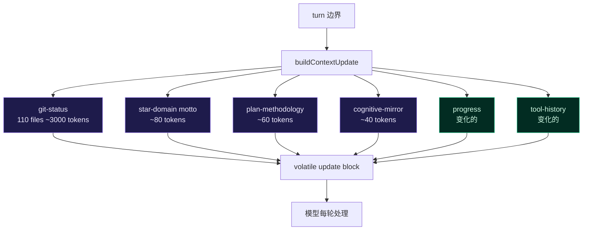

# 静态注入体量压缩 实现计划

> **面向 AI 代理：** 使用 subagent-driven-development（推荐）或 executing-plans 逐任务实现。

**目标：** 消除每轮 context-update 中四类完全不变的静态内容重复注入，节省 ~3500+ token/轮的认知开销和前缀缓存压力。

**架构：** 四处独立优化，互不依赖。(1) git-status 折叠 untracked 列表为摘要行；(2) star-domain motto 仅首轮注入；(3) plan-methodology 仅任务深度变化时注入；(4) cognitive-mirror 数值改为有意义的分类或移除。

**技术栈：** TypeScript strict, node:test + assert/strict

---

## 背景

本会话中观察到每轮 context-update 注入约 3500+ token 的完全静态内容。这些内容跨轮不变化，但每轮都完整重发，造成三重代价：

1. **认知噪音**：模型每轮都要"看过"并忽略这些不变内容
2. **前缀缓存压力**：volatile block 里的静态内容如果变化（哪怕只是 progress 字段），会让前缀缓存 key 漂移
3. **信噪比下降**：真正变化的信号（progress、tool-history）被淹没在不变的噪音里

### 数据流图



图中紫色块每轮不变，绿色块每轮变化。目标是让紫色块只在首次或条件变化时注入。

---

## 源头分析

### 源头 1：git-status untracked 文件列表

**注入位置**：`context-update` 的 `<git-status>` 子块
**现状**：每轮列出全部 110 个 untracked 文件的完整路径（含 URL-encoded 中文），约 3000 token
**根因**：`buildContextUpdate` 每轮调用 `refreshGitContextIfNeeded`，后者检测到文件列表变化（或强制刷新）就完整重写
**已有缓解**：系统消息说"无需再跑 git status"——但内容本身仍在上下文里

### 源头 2：star-domain motto 重复注入

**注入位置**：`context-update` 的 `<context-update>` → `<star-domain>` 子块
**现状**：每轮注入完整的星域描述文字（如"你是秤，也是高处的眼..."），约 80 token
**根因**：星域切换时才需要重新注入；同域内每轮重复是冗余的

### 源头 3：plan-methodology 每轮推送

**注入位置**：`context-update` 的 `<plan-methodology>` 子块
**现状**：每轮注入"推荐使用轻量版计划模板..."文字 + 路径，约 60 token
**根因**：methodology 跟随 `taskDepth` 变化，但同一任务的 taskDepth 不变时仍然重复

### 源头 4：cognitive-mirror 虚假精度

**注入位置**：`context-update` 的 `<cognitive-mirror>` 子块
**现状**：每轮注入 `complexity="0.00"` `verification_coverage="1.00"` 等数值，约 40 token
**问题**：数值本身不准确（追踪 6 个文件的诊断任务不是 0 复杂度），且数值在认知上暗示"这个任务很简单"

---

## 任务分解

### Task 1: git-status untracked 折叠为摘要

**文件**：
- 修改：`src/prompt/engine.ts`（或 `git-context-builder.ts`，取决于实际注入路径）
- 测试：`src/prompt/__tests__/engine-context-update.test.ts`（或对应测试文件）

**改动**：当 untracked 文件数 > 10 时，折叠为摘要行：
```
110 untracked: .cursor/, .od-skills/, .rivet/ (+105 more, use git status to view full list)
```
保留前 5 个目录级条目（不是文件级），其余折叠为计数。

**验证命令**：
```bash
npx tsc --noEmit
node --import tsx --test src/prompt/__tests__/engine*.test.ts
```

**反证测试**：构造一个有 15 个 untracked 文件的 mock repo，断言 context-update 的 git-status 子块 ≤ 200 字符（而非完整列表）。

---

### Task 2: star-domain motto 仅首次或切换时注入

**文件**：
- 修改：`src/agent/turn-step-producer.ts`（context-update 构建逻辑）
- 测试：`src/agent/__tests__/turn-step-producer*.test.ts`

**改动**：跟踪 `lastInjectedDomainId`。当 turn > 1 且 domainId 未变时，`<star-domain>` 子块只输出域名称（`<star-domain name="天权" />`），不重复 motto 文字。

**验证命令**：
```bash
npx tsc --noEmit
node --import tsx --test src/agent/__tests__/turn-step-producer*.test.ts
```

**反证测试**：模拟连续 3 轮同域，断言第 2-3 轮的 star-domain 子块不含 motto 文字（"你是秤"等关键词不应出现）。

---

### Task 3: plan-methodology 条件注入

**文件**：
- 修改：`src/agent/turn-step-producer.ts`（或 context-update 注入逻辑）
- 测试：同 Task 2 测试文件

**改动**：跟踪 `lastInjectedMethodology`。当 methodology route 和路径未变时，不重复注入 `<plan-methodology>` 子块。

**验证命令**：同 Task 2

**反证测试**：模拟连续 3 轮同 methodology，断言第 2-3 轮不含 `<plan-methodology>` 标签。

---

### Task 4: cognitive-mirror 数值修正

**文件**：
- 修改：`src/agent/behavior-mirror.ts`（或生成 cognitive-mirror 的模块）
- 测试：`src/agent/__tests__/behavior-mirror*.test.ts`

**改动**：
- `complexity` 基于实际信号计算：files_modified + tool_history 长度 + todo 项数。0 files + 0 tools → "trivial"；1-3 files → "simple"；4+ files → "moderate"。
- `verification_coverage` 基于实际验证：未跑测试 → "0.00"；跑了 typecheck → "0.33"；跑了相关测试 → "0.67"；跑了全量测试 → "1.00"。不是默认 "1.00"。
- 不可靠字段（无 ground truth 的）移除或标注为 "unknown"。

**验证命令**：
```bash
npx tsc --noEmit
node --import tsx --test src/agent/__tests__/behavior-mirror*.test.ts
```

**反证测试**：构造一个未跑任何验证的场景，断言 `verification_coverage` 为 "0.00"（而非 "1.00"）。

---

## 验证计划

| 场景 | 预期 | 反证 |
|------|------|------|
| 110 untracked files | git-status ≤ 200 字符 | 旧实现 > 3000 字符 |
| 同域连续 3 轮 | 第 2-3 轮 star-domain 无 motto | 旧实现每轮都有 |
| 同 methodology 连续 3 轮 | 第 2-3 轮无 plan-methodology | 旧实现每轮都有 |
| 未跑验证 | verification_coverage = "0.00" | 旧实现默认 "1.00" |

---

## 风险与缓解

**风险 1：压缩后模型丢失上下文**
缓解：git-status 仍保留 modified + staged 文件完整列表（这些才是操作相关）。untracked 折叠只影响"看到但不操作"的文件。

**风险 2：星域切换时注入遗漏**
缓解：`lastInjectedDomainId` 比较是简单字符串相等，切换时立即重新注入完整 motto。测试覆盖切换场景。

**风险 3：methodology 变化但未检测到**
缓解：methodology route 是 task-depth 的函数，task-depth 变化时 context-update 已经会刷新。只需比较 route 字符串。

---

## 收尾检查清单

- [ ] git-status untracked 折叠为 ≤ 200 字符摘要
- [ ] star-domain motto 仅首次或切换时注入
- [ ] plan-methodology 仅 route 变化时注入
- [ ] cognitive-mirror complexity 和 verification_coverage 基于真实信号
- [ ] 所有新测试 RED → GREEN
- [ ] `npx tsc --noEmit` 通过
- [ ] 四个独立 commit，每个一个逻辑单元
