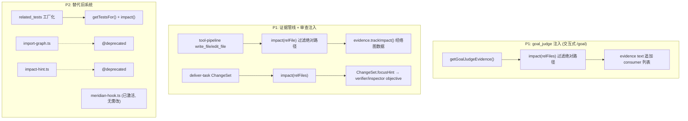
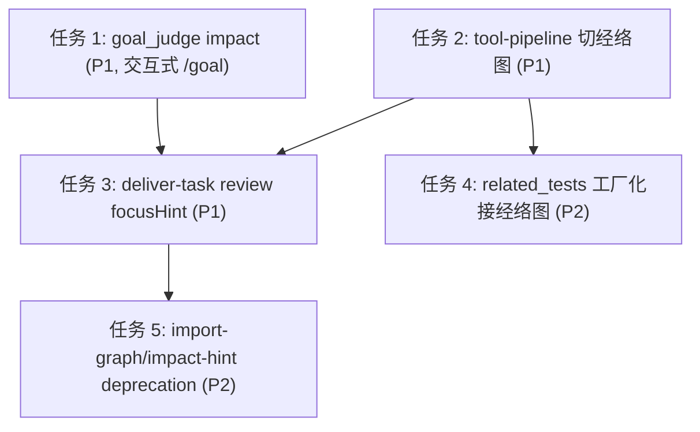

# 经络图全链路统一 —— 影响分析接入计划

> **面向 AI 代理：** 使用 subagent-driven-development（推荐）或 executing-plans 逐任务实现。

**目标：** 把经络图（meridian-indexer + analyzeImpact）从"repo_graph 专用 + 部分场景旁路"升级为全仓统一的影响分析数据源：tool-pipeline 写文件自动追踪、goal_judge 验证附带 consumer、L2/L3 审查注入 blast radius、related_tests 改接 SQL 查询。

**架构：** 当前 3 套不兼容的影响分析并存（meridian SQLite BFS、import-graph 内存正则、related_tests 硬编码路径试探）。本计划在不删除旧系统的前提下分优先级接入经络图，每步独立可测可提交。旧系统（import-graph / impact-hint）在 P2 标为 deprecated 但不删除——待所有消费者确认已迁移后另起清理 PR。

**技术栈：** TypeScript / node:test / SQLite (better-sqlite3) / MeridianIndexer / analyzeImpact

**与已有计划的联动：**
- `meridian_impact_review_d2e81c82.plan.md`（team 审查 advisory 接入）——已落地（commit `b4dbf5de`）。其 Part 1 修复了 import 边解析，本计划的 `analyzeImpact` 反向依赖据此才真正可用；Part 2 已在 `team-orchestrate.ts` 终波审查门注入 blast radius，本计划不重复，仅覆盖非 team 路径。
- `2026-06-24-goal-judge-followups.md`（goal judge 全链路实现）——其任务 1 已落地 headless Coordinator，但 headless `--goal` 路径**无 meridianIndexer**（见下「核查修订」），故任务 1 的 impact 注入在 headless 下是 no-op。

---

## 核查修订（2026-06-24，逐行核对代码后）

> 初稿部分现状判断有误，已逐行核实修正。**修订要点优先级高于下文初稿措辞**；初稿任务体保留，但按此节调整。

1. **`config.meridianIndexer` 不是死字段。** 初稿称「未被任何生产路径赋值，等于死字段」——错。它在交互式会话里是活的：[bootstrap.ts](src/bootstrap.ts):853 用 `new AgentLoop({ ...agentCfg, meridianIndexer: refs.meridianIndexer }, ...)` 在 `createAgentConfig` 之后**展开覆盖**了该字段（初稿只查了 `createAgentConfig` 本身，漏看 853）。准确状态：交互式 TUI = 真实实例、headless `--goal` = `undefined`（[main.ts](src/main.ts):229,242 经 `createMainAgentConfigInput`，不设）、server = `null`（[serve.ts](src/server/serve.ts):253）。

2. **meridian-hook 已激活，任务 5 的「激活」部分作废。** [create-runtime-hooks.ts](src/agent/create-runtime-hooks.ts):305-308 在 `deps.meridianIndexer !== undefined` 时即注册 `createMeridianHook`，而 deps 来自 [loop-factory.ts](src/agent/loop-factory.ts):321 ← `self.config.meridianIndexer` ← bootstrap:853 真实实例。**交互式会话里 meridian-hook 已带真实索引器在跑。** 任务 5 删去「激活 meridian-hook / 改 line 321 取值」，仅保留 `import-graph.ts`/`impact-hint.ts` 的 `@deprecated` 标记。

3. **不变量 4 未被强制，且很可能为假——所有 impact() 调用必须加绝对路径守卫。** `trackFileModified(tu.input.file_path)`（[tool-pipeline.ts](src/agent/tool-pipeline.ts):1259）存的是模型原样给的 `file_path`，未归一化；`filesModified` 可能含绝对路径。绝对路径喂进 `analyzeImpact` → `getReverseDependents` 的 repo-relative `LIKE` **静默返回空**（与已修的 import 边 bug 同类陷阱）。任务 1/2/3 均须先 `filter(f => !isAbsolute(f))`（空则跳过），与 `team-orchestrate.ts` 已落地的守卫一致。

4. **行号漂移 + focusHint 注入面。** review objective 实际位置：`verifierObjective` [review-coordinator-deps.ts](src/agent/review-coordinator-deps.ts):198、`patcherObjective`:216、`inspectorObjective`:284。**focusHint 只注入 verifier(:208) 和 inspector(:291)，patcher 不注入**——任务 3 在 deliver-task 设 `change.focusHint` 只会到达 verifier+inspector。tool-pipeline 旧块实际 1265-1274。

5. **任务 4 注入方式错。** `related_tests` 是静态常量 `RELATED_TESTS_TOOL`（[related-tests.ts](src/tools/related-tests.ts):83），`ToolCallParams` 无 `deps`。须**重构成工厂** `createRelatedTestsTool(() => indexer)`（仿 `createRepoGraphTool`）才能注入，伪代码 `params.deps?.meridianIndexer` 不成立。

6. **任务 1 价值定位修正。** headless `--goal`（主用例）无索引器 → 任务 1 impact 注入在 headless 是 no-op，只有交互式 `/goal` 受益。**降级为 P1**，定位「服务交互式 /goal」。另注：goal active 时 [deliver-task.ts](src/agent/deliver-task.ts):658 `skipAutoReview`，任务 3 的 focusHint 在 goal 模式可能不跑审查。

7. **「已接 meridian（1 处）」低估。** `config.meridianIndexer?.getDb()` 已在 [loop.ts](src/agent/loop.ts)(×4)、[turn-step-producer.ts](src/agent/turn-step-producer.ts):527、[tool-history-recorder.ts](src/agent/tool-history-recorder.ts):103、anchor-break hook 等处被消费（telemetry/锚点用途），只是没用于「impact→审查」。

---

## 现状基线

### 经络图实例可达性

`MeridianIndexer` 仅在 `bootstrapInteractiveSession()` 中构造（`src/bootstrap.ts:1308`）。`AgentConfig.meridianIndexer`（`loop-types.ts:131`）**在交互式 TUI 会话里被赋值**——经 `bootstrap.ts:853` 的 `new AgentLoop({ ...agentCfg, meridianIndexer: refs.meridianIndexer }, ...)` 展开覆盖（不是经 `createAgentConfig`，故初稿误判为死字段，见上「核查修订 §1」）。其余路径：headless `--goal` = `undefined`、server = `null`、worker = 无实例。**结论：交互式会话里经络图 + meridian-hook 已可用；headless/server/worker 才需要本计划的可选降级。**

### 三套并存的影响分析

| 系统 | 文件 | 机制 | 问题 |
|------|------|------|------|
| meridian | `src/repo/meridian-*.ts` | SQLite 持久化 + 反向 BFS | import 边存 raw 字符串已修（meridian-indexer.ts modified），反向依赖现可用 |
| import-graph | `src/agent/import-graph.ts` | `readdirSync` + 正则 + in-memory Map，上限 1000 文件 | 无持久化、每次重启重建、结果与 meridian 不一致 |
| 硬编码试探 | `src/tools/related-tests.ts`、`src/agent/dispatcher.ts` | 10 个 `existsSync` 路径候选、5 个 `path.startsWith` 前缀 | 无法发现跨目录依赖 |

### 消费面概况（5 子代理勘察结果）

- **已接 meridian（impact 用途）**（1 处）：`src/tools/repo-graph.ts` — `indexer.impact()` 的 graph/impact 两种模式
- **已接 meridian（其它用途）**：`loop.ts`(×4)、`turn-step-producer.ts:527`、`tool-history-recorder.ts:103`、anchor-break hook 等用 `getDb()` 做 telemetry/锚点（非 impact→审查）
- **meridian-hook 已激活**（非死代码）：`create-runtime-hooks.ts:305-308` 在交互式会话注册并带真实索引器运行（见「核查修订 §2」）
- **仍用旧系统**（4 处）：tool-pipeline → evidence 管线、impact-hint、related-tests、dispatcher
- **impact 未接入审查/取证**（2 处）：goal_judge scopeFiles、L2/L3 review focusHint（focusHint 通道已存在，仅数据源未喂 meridian）
- **team 审查**（1 处）：由 `meridian_impact_review_d2e81c82.plan.md` 的 Part 2 覆盖（已落地 `b4dbf5de`），本计划不重复

---

## 数据流改造



---

## 任务

### 任务 1（P1，原 P0）：goal_judge 注入 consumer impact

> 降级理由（核查修订 §6）：headless `--goal` 无 meridianIndexer → 此注入仅交互式 `/goal` 生效，headless 下静默 no-op。仍有价值，但非 P0。

- [ ] 修改 `src/agent/loop-factory.ts` — `getGoalJudgeEvidence`（:535）扩展
- [ ] 修改 `src/agent/__tests__/turn-orchestrator-goal.test.ts` — 新增 consumer 注入断言

**目标：** goal_judge 取证时附带修改文件的直接 consumer 列表，让 judge 能验证"下游调用者是否仍正常"，而不只检查被修改文件本身。

**实现：**

`loop-factory.ts:535 getGoalJudgeEvidence` 当前返回 `{ text, modifiedFiles }`。扩展为：取 `self.config.meridianIndexer?.getDb()`，**过滤绝对路径项**（核查修订 §3），非空则 `analyzeImpact(db, relFiles)` → 把 `direct` + `tests` 拼进 `text`。

```typescript
import { isAbsolute } from 'node:path'        // 文件顶部
import { analyzeImpact } from '../repo/meridian-impact.js'

getGoalJudgeEvidence: () => {
  // ... 现有逻辑不变，得到 text / modifiedFiles ...
  // 新增：经络图反向依赖（绝对路径会让 repo-relative LIKE 静默查空，先过滤）
  const db = self.config.meridianIndexer?.getDb()
  const relFiles = modifiedFiles.filter(f => !isAbsolute(f))
  if (db && relFiles.length > 0) {
    const impact = analyzeImpact(db, relFiles)
    const cap = (xs: string[]) => xs.length <= 10 ? xs.join(', ') : `${xs.slice(0, 10).join(', ')} (+${xs.length - 10} more)`
    const parts: string[] = []
    if (impact.direct.length > 0) parts.push(`Direct consumers (verify not broken): ${cap(impact.direct)}`)
    if (impact.tests.length > 0)  parts.push(`Related tests: ${cap(impact.tests)}`)
    if (parts.length > 0) text += '\n\nMeridian blast radius:\n' + parts.join('\n')
  }
  return { text, modifiedFiles }
}
```

`analyzeImpact` 是亚毫秒级 SQL 查询，不阻塞 judge 主路径。

**验证：**
```bash
npx tsc --noEmit
npm exec -- tsx --test src/agent/__tests__/turn-orchestrator-goal.test.ts  # 期望全绿，新增断言：evidence text 含 "Meridian blast radius"
```

**提交：**
```bash
git add src/agent/loop-factory.ts src/agent/__tests__/turn-orchestrator-goal.test.ts
git commit -m "feat(goal): inject meridian consumer impact into goal_judge evidence (任务 1/5)"
```

---

### 任务 2（P1）：tool-pipeline 影响分析切到经络图

- [ ] 修改 `src/agent/tool-pipeline.ts` — `ToolPipelineDeps` 新增 `meridianIndexer` 可选字段；`executeSingleTool` 内 `write_file`/`edit_file` 影响分析分支优先用 `meridianIndexer.getDb()` → `analyzeImpact()`，旧 `importGraph` 作为 fallback
- [ ] 修改 `src/agent/loop-factory.ts` — `createToolPipelineDeps` 传入 `meridianIndexer: self.config.meridianIndexer`
- [ ] 修改 `src/agent/__tests__/tool-pipeline-impact.test.ts`（如存在）或新建 — 验证 meridian 路径优先于 importGraph 路径

**目标：** 写文件时自动追踪的 `evidence.trackImpact()` 数据来自经络图而非旧 import-graph，与 `repo_graph impact` 模式结果一致。

**实现：**

`tool-pipeline.ts:1262-1274` 当前逻辑：

```typescript
if (!importGraph) {
  importGraph = buildImportGraph(deps.cwd)
}
if (importGraph) {
  importGraph = invalidateFile(importGraph, deps.cwd, tu.input.file_path as string)
  const hint = generateImpactHint(importGraph, tu.input.file_path as string, deps.cwd)
  if (hint) {
    deps.evidence.trackImpact(hint.impactedFiles, hint.relatedTests)
  }
}
```

改为优先经络图：

```typescript
// 优先用经络图（持久化 + 反向 BFS），旧 import-graph 作为 fallback
let impactedFiles: string[] = []
let relatedTests: string[] = []
const db = deps.meridianIndexer?.getDb()
const filePath = tu.input.file_path as string
// 绝对路径会让 repo-relative LIKE 静默查空（核查修订 §3）→ 仅相对路径才走 meridian
if (db && !isAbsolute(filePath)) {
  const impact = analyzeImpact(db, [filePath])
  impactedFiles = impact.direct
  relatedTests = impact.tests.map(t => t.startsWith('/') ? t : join(deps.cwd, t))
} else if (!importGraph) {
  importGraph = buildImportGraph(deps.cwd)
}
if (!db && importGraph) {
  importGraph = invalidateFile(importGraph, deps.cwd, tu.input.file_path as string)
  const hint = generateImpactHint(importGraph, tu.input.file_path as string, deps.cwd)
  if (hint) {
    impactedFiles = hint.impactedFiles
    relatedTests = hint.relatedTests
  }
}
if (impactedFiles.length > 0 || relatedTests.length > 0) {
  deps.evidence.trackImpact(impactedFiles, relatedTests)
}
```

`ToolPipelineDeps` 新增字段：
```typescript
meridianIndexer?: import('../repo/meridian-indexer.js').MeridianIndexer | null
```

`loop-factory.ts` 传给 tool-pipeline 的 deps 新增一行：
```typescript
meridianIndexer: self.config.meridianIndexer,
```

需新增 import：`import { analyzeImpact } from '../repo/meridian-impact.js'`、`import { isAbsolute } from 'node:path'`（确认 tool-pipeline.ts 是否已有 `node:path` 导入，无则补）。注：db 存在但路径为绝对时，应仍能回退 import-graph——fallback 条件相应改为 `if ((!db || isAbsolute(filePath)) && importGraph)`。

**验证：**
```bash
npx tsc --noEmit
npm exec -- tsx --test src/agent/__tests__/tool-pipeline.test.ts  # 期望全绿，新增断言：有 meridianIndexer 时走 analyzeImpact 路径
```

**提交：**
```bash
git add src/agent/tool-pipeline.ts src/agent/loop-factory.ts
git commit -m "feat(impact): route tool-pipeline edit tracking through meridian graph (任务 2/5)"
```

---

### 任务 3（P1）：L2/L3 审查注入 blast radius focusHint

- [ ] 修改 `src/agent/deliver-task.ts`（:647 构造 `ChangeSet` 后）— 从 `meridianIndexer` 取 `impact(change.files)`，拼入 `change.focusHint`（focusHint 通道已存在，自动流向 reviewer objective，无需改 review-coordinator-deps.ts）
- [ ] `DeliverTaskDeps` 新增 `meridianIndexer?`；bootstrap deliver_task 注册处注入 `refs.meridianIndexer`
- [ ] 测试 `src/agent/__tests__/deliver-task.test.ts` — 验证有 meridianIndexer 时 `focusHint` 含 blast radius、绝对路径被过滤、缺省不报错

**目标：** L2 verifier 和 L3 squadron inspector 的审查 objective 中包含修改文件的依赖者列表，审查员能精确定位需要验证的 downstream consumer。

> 核查修订 §4：focusHint 实际只注入 `verifierObjective`（[review-coordinator-deps.ts](src/agent/review-coordinator-deps.ts):208）和 `inspectorObjective`（:291），**`patcherObjective`(:216) 不注入**。所以经 `change.focusHint` 上游设置只覆盖 verifier+inspector（已够用；patcher 是修复角色，不需要 blast radius）。
> 核查修订 §6：goal active 时 [deliver-task.ts](src/agent/deliver-task.ts):658 走 `skipAutoReview`——goal 模式下此 focusHint 可能不触发审查；非 goal 的常规提交后审查（:660）才命中。

**实现：**

`ChangeSet`（[review-discipline.ts](src/agent/review-discipline.ts):154）已有 `focusHint?: string` 字段，且已流向 verifier/inspector objective。本任务在 `deliver-task.ts:647` 构造 `ChangeSet` 后，若 `meridianIndexer` 可用则调用 `analyzeImpact(db, relFiles)` 并将结果拼入 `focusHint`：

```typescript
// deliver-task.ts 构造 ChangeSet 后，追加（绝对路径先过滤，核查修订 §3）：
const db = ctx.meridianIndexer?.getDb()
const relFiles = change.files.filter(f => !isAbsolute(f))
if (db && relFiles.length > 0) {
  const impact = analyzeImpact(db, relFiles)
  const parts: string[] = []
  if (impact.direct.length > 0)
    parts.push(`downstream consumers: ${impact.direct.slice(0, 8).join(', ')}${impact.direct.length > 8 ? ` (+${impact.direct.length - 8} more)` : ''}`)
  if (impact.tests.length > 0)
    parts.push(`related tests: ${impact.tests.slice(0, 8).join(', ')}${impact.tests.length > 8 ? ` (+${impact.tests.length - 8} more)` : ''}`)
  if (parts.length > 0) {
    const blast = `Blast radius — ${parts.join('; ')}`
    change.focusHint = change.focusHint ? `${change.focusHint} | ${blast}` : blast
  }
}
```

`deliver-task.ts` 的 deps（`DeliverTaskDeps`）需新增 `meridianIndexer?: MeridianIndexer | null`。bootstrap 注入路径已存在（`refs.meridianIndexer`），加一行 adapter 调用即可。

**验证：**
```bash
npx tsc --noEmit
npm exec -- tsx --test src/agent/__tests__/deliver-task.test.ts  # 期望全绿，新增断言：有 meridianIndexer 时 focusHint 含 "Blast radius"
```

**提交：**
```bash
git add src/agent/deliver-task.ts src/agent/__tests__/deliver-task.test.ts
git commit -m "feat(review): inject meridian blast radius into L2/L3 review focusHint (任务 3/5)"
```

---

### 任务 4（P2）：related_tests 改接经络图

- [ ] 重构 `src/tools/related-tests.ts` — 从静态常量 `RELATED_TESTS_TOOL` 改为工厂 `createRelatedTestsTool(getIndexer)`（仿 `createRepoGraphTool`）；`findTestsForSource` 优先 `getDb().getTestsFor(filePath)` + `analyzeImpact([filePath]).tests`，硬编码试探保留为 fallback
- [ ] 修改 `src/bootstrap.ts` — `related_tests` 注册改为 `reg.register(createRelatedTestsTool(() => refs.meridianIndexer))`；保留一个无参/null 版本给 headless 默认注册表（fallback 到硬编码）
- [ ] 测试 `src/tools/__tests__/related-tests.test.ts` — 有 meridian 时返回 SQL 结果、无 meridian 时仍走硬编码试探（不回归）

**目标：** `related_tests` 工具在 meridian 可用时基于真实 import 关系推荐测试文件，而非纯命名约定试探。

**实现（核查修订 §5）：**

`related_tests` 当前是无 DI 的静态常量（[related-tests.ts](src/tools/related-tests.ts):83），`ToolCallParams` 无 `deps` 字段。须重构成工厂注入索引器：

```typescript
export function createRelatedTestsTool(getIndexer: () => MeridianIndexer | null | undefined): Tool {
  return {
    // ...definition 不变...
    async execute(params) {
      const sourceFile = params.input.file as string
      const db = getIndexer()?.getDb()
      if (db && !isAbsolute(sourceFile) && !isTestFile(sourceFile)) {
        const testedBy = db.getTestsFor(sourceFile)            // 命名约定推断的 tested_by 边
        const impact = analyzeImpact(db, [sourceFile])         // 反向 BFS 发现的测试
        const allTests = [...new Set([...testedBy, ...impact.tests])]
        if (allTests.length > 0) return { content: allTests.join('\n') }
      }
      // fallback: 现有硬编码路径试探（findTestsForSource / findSourceForTest）
    },
    // ...
  }
}
```

**验证：**
```bash
npx tsc --noEmit
npm exec -- tsx --test src/tools/__tests__/related-tests.test.ts  # 期望全绿
```

**提交：**
```bash
git add src/tools/related-tests.ts src/tools/__tests__/related-tests.test.ts src/bootstrap.ts
git commit -m "feat(related-tests): prefer meridian SQL over hardcoded path heuristics (任务 4/5)"
```

---

### 任务 5（P2）：import-graph / impact-hint deprecation 标记

> 核查修订 §2：初稿的「激活 meridian-hook / 改 line 321 取值」**已作废**——meridian-hook 在交互式会话已带真实索引器运行（`create-runtime-hooks.ts:305-308` ← `loop-factory.ts:321` ← `config.meridianIndexer` ← `bootstrap.ts:853`）。本任务只剩 deprecation 标记。headless/server/worker 无索引器是设计使然，不在此处补。

- [ ] 标记 `src/agent/import-graph.ts` 和 `src/agent/impact-hint.ts` 为 `@deprecated`（顶部 JSDoc），不删除任何代码
- [ ] （可选）确认 `meridian-hook.ts:createMeridianHook` 在 `getIndexer()` 返回 null（server 路径）时已有空值守卫；无则补
- [ ] 测试：现有 `import-graph.test.ts` / `meridian-hook.test.ts`（如存在）保持全绿

**目标：** 旧 import-graph / impact-hint 标为 deprecated 为后续清理 PR 做准备；meridian-hook 无需改动（已激活）。

**实现要点：**

**import-graph deprecation 标记：**

`src/agent/import-graph.ts` 文件头加：
```typescript
/**
 * @deprecated 经络图（src/repo/meridian-*.ts）已提供持久化 SQLite 反向 BFS 影响分析。
 * 本模块保留仅供 fallback（tool-pipeline 无 meridianIndexer 时），计划在确认全量迁移后移除。
 */
```

`src/agent/impact-hint.ts` 文件头加同样的 `@deprecated`。

**验证：**
```bash
npx tsc --noEmit
npm exec -- tsx --test src/agent/__tests__/import-graph.test.ts   # 期望全绿（旧测试不删）
```

**提交：**
```bash
git add src/agent/import-graph.ts src/agent/impact-hint.ts
git commit -m "deprecate(import-graph): mark old import-graph/impact-hint deprecated (任务 5/5)"
```

---

## 不变量

1. **不删旧代码**：`import-graph.ts`、`impact-hint.ts` 只标 `@deprecated`，不删除。确认全量迁移后由独立清理 PR 移除。
2. **meridianIndexer 始终可选**：所有新增字段均为 `?`（optional），缺失时退回到旧行为。headless `--goal`/server/worker 无 meridianIndexer → impact 相关功能静默跳过；交互式 TUI 有实例 → 功能生效。
3. **不阻断主路径**：所有 `analyzeImpact()` 调用包在 `if (db && relFiles.length>0)` 内，SQL 错误由 better-sqlite3 内置异常处理，不额外 try/catch（与现有 `repo-graph.ts` 做法一致）。
4. **repo-relative 必须强制（不是假设）**：传入 `impact()` 前必须 `filter(f => !isAbsolute(f))`，空则跳过。`trackFileModified`/`change.files`/`modifiedFiles` 存的是模型原样 `file_path`，可能为绝对路径；绝对路径会让 `getReverseDependents` 的 `LIKE` 静默查空（核查修订 §3）。

---

## 反证测试

| 偷懒实现 | 会红的测试 |
|---------|-----------|
| goal_judge 不改 evidence，consumer 列表不出现 | `turn-orchestrator-goal.test.ts` — evidence text 不含 "Meridian blast radius" |
| 不加绝对路径过滤，直接喂 impact() | 任一 impact 测试 — 传绝对路径时应跳过而非静默返回空集 |
| tool-pipeline 加了 meridianIndexer 字段但不走优先路径 | `tool-pipeline.test.ts` — `evidence.trackImpact` 收到的 impactedFiles 与 meridian BFS 结果不一致 |
| deliver_task 构造 focusHint 但 `meridianIndexer` 传 null | `deliver-task.test.ts` — focusHint 不含 "Blast radius" 但 change.files 非空 |
| related_tests 加了 meridian 路径但不 fallback | `related-tests.test.ts` — 无 meridian 时返回空 vs 应返回硬编码试探结果 |

---

## 执行次序



任务 1-3 有依赖：任务 2 改 tool-pipeline → 任务 3 的 evidence 数据源才准确。任务 4-5 完全独立。

| Wave | 任务 | 验证 | 提交 |
|------|------|------|------|
| 1 | 任务 1 | `turn-orchestrator-goal.test.ts` | `feat(goal): inject meridian consumer impact into goal_judge evidence` |
| 2 | 任务 2 | `tool-pipeline.test.ts` | `feat(impact): route tool-pipeline edit tracking through meridian graph` |
| 3 | 任务 3 | `deliver-task.test.ts` | `feat(review): inject meridian blast radius into deliver-task review focusHint` |
| 4 | 任务 4 | `related-tests.test.ts` | `feat(related-tests): prefer meridian SQL over hardcoded path heuristics` |
| 5 | 任务 5 | `import-graph.test.ts` | `deprecate(import-graph): mark old import-graph/impact-hint deprecated` |

---

## 自检

1. **规格覆盖**：P1(交互式 /goal)=任务1；P1(证据管线+审查)=任务2+3；P2(related_tests 工厂化+deprecation)=任务4+5。meridian-hook 已激活无需任务。team 审查（meridian_impact_review 计划，已落地 b4dbf5de）不重复。✅
2. **占位符扫描**：所有类型/函数名/路径均已精确指定，无 TODO/TBD/待定。✅
3. **类型一致性**：`MeridianIndexer` / `analyzeImpact` / `ImpactResult` 跨任务一致引用 `src/repo/meridian-*.ts`；`ChangeSet.focusHint` 在 `deliver-task.ts` 设置、`review-coordinator-deps.ts:208/291` 消费（patcher 不消费）。✅
4. **调研背书**：行号已逐行核对修正（见「核查修订」节），review objective=198/216/284、tool-pipeline=1265-1274、related-tests=83、deliver-task ChangeSet=647、bootstrap 赋值=853。✅
5. **不变量守护**：4 条不变量（含强制 repo-relative 过滤）均可在任务 1-4 的测试中验证。✅
6. **反证表**：6 条覆盖绝对路径过滤 + 4 个任务，每条有明确的"会红的测试"。✅

---

计划已保存到 `docs/superpowers/plans/2026-06-24-meridian-unify-impact-analysis.md`。两种执行方式：
1. 子代理驱动（推荐）—— 5 个任务独立，可并行 wave 1-3
2. 内联执行（使用 executing-plans）—— 逐任务在当前会话实现

选哪种方式？
