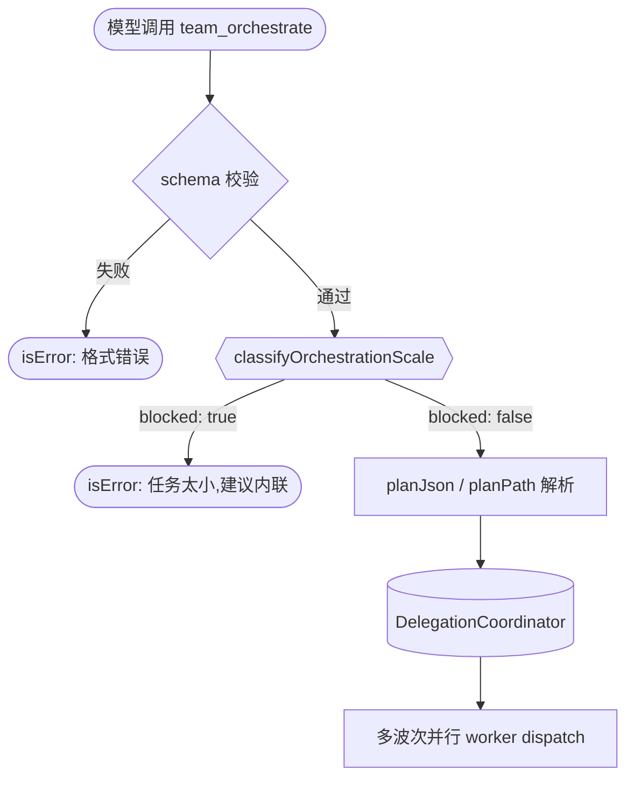

# 编排前置门控实现计划

> **面向 AI 代理：** 使用 `executing-plans` 逐任务实现。

**目标：** 在 `team_orchestrate` 和 `delegate_batch` 的入口处添加任务大小预分类门控，阻止小任务触发重型并行编排。

**架构：** 新建纯函数模块 `src/agent/task-size-gate.ts`，导出 `classifyOrchestrationScale(text)` 和 `shouldBlockOrchestration(text)`。`team_orchestrate.ts` 和 `delegate_batch.ts` 的 `execute()` 入口调用 `shouldBlockOrchestration`，若返回 true 则拒绝执行并建议内联处理。纯函数无副作用，不影响已有编排流程。

**技术栈：** TypeScript strict, node:test + assert/strict

---

## 背景：调研发现

分析 oh-my-claudecode (OMC) 的子代理系统后，三个方向中两个天枢已实现：

| OMC 能力 | 天枢等价 | 状态 |
|----------|---------|------|
| 子代理文件冲突检测 (`detectFileConflicts`) | `work-queue.ts:hasFileConflict` — dequeue() 中检查 scope.files 交集 | **已实现** |
| Worker 自动重启 + 指数退避 (`worker-restart.ts`) | `coordinator.ts:1289` — `maxRetries` + `retryBackoffMs * 2^(attempt-1)` capped at `maxRetryBackoffMs` | **已实现** |
| 任务大小预分类 (`task-size-detector`) | 无 — `team_orchestrate.execute()` 无前置 gate | **缺失** |

天枢已有的 `shouldDelegateObjective`（coordinator.ts:243）是单 request 级别的 gate（≥6 词或 ≥2 文件），但：
- 不用于 `team_orchestrate` 的整体 objective
- 不检测"小任务关键词"（typo、rename、single file）
- 不提供 escape hatch（OMC 的 `quick:` 前缀）

### OMC 的 task-size-detector 设计要点

- 词数阈值：small <50 词，large >200 词
- 信号 regex：SMALL_TASK_SIGNALS（typo/rename/single file/minor fix）vs LARGE_TASK_SIGNALS（architecture/refactor/migration）
- Escape hatch 前缀：`quick:` `simple:` `tiny:` 等
- 用途：阻止 small 任务触发 team/autopilot/ralph 重型编排模式

### 天枢现状

`team_orchestrate.execute()`（team-orchestrate.ts:229）的入口检查只有：
1. 输入 schema 校验
2. planJson 反序列化验证
3. planPath 文件读取

没有任何 objective 内容分析。模型可以用 `team_orchestrate({ objective: "fix a typo in config.ts" })` 启动完整的多波次并行编排。

---

## 任务

### 任务 1：创建 task-size-gate 纯函数模块

- [ ] 创建 `src/agent/task-size-gate.ts`
- [ ] 创建 `src/agent/__tests__/task-size-gate.test.ts`

**目标：** 实现任务大小分类和编排门控判断的纯函数。

**实现：**

`src/agent/task-size-gate.ts` 导出：

```typescript
export type OrchestrationScale = 'small' | 'medium' | 'large'

export interface ScaleResult {
  scale: OrchestrationScale
  reason: string
  wordCount: number
  blocked: boolean
}

const SMALL_WORD_LIMIT = 15
// 中文不分词——每 2 个中文字符算 1 个 word，避免中文短句被误判为 small
// 实现详见 classifyOrchestrationScale 的 wordCount 计算逻辑

const ESCAPE_HATCH_PREFIX = /^(force|quick|simple|tiny):\s*/i
const SMALL_TASK_SIGNALS: RegExp[] = [
  /\btypo\b/i,
  /\brename\b/i,
  /\bsingle\s+file\b/i,
  /\bone[\s-]liner?\b/i,
  /\bminor\s+(fix|change|update|tweak)\b/i,
  /\bspelling\b/i,
  /\bformat(ting)?\s+(this|the)\b/i,
  /\bquick\s+fix\b/i,
  /\bbump\s+version\b/i,
  /\badd\s+a?\s*comment\b/i,
  /\bwhitespace\b/i,
  /\bindentation\b/i,
]

const LARGE_TASK_SIGNALS: RegExp[] = [
  /\barchitect(ure|ural)?\b/i,
  /\brefactor\b/i,
  /\bmigrat(e|ion)\b/i,
  /\bcross[\s-]cutting\b/i,
  /\bentire\s+(codebase|project|system)\b/i,
  /\bmultiple\s+(files|modules|components)\b/i,
  /\bsystem[\s-]wide\b/i,
  /\bend[\s-]to[\s-]end\b/i,
  /\boverhaul\b/i,
  /\bcomprehensive\b/i,
]

export function classifyOrchestrationScale(text: string): ScaleResult
```

分类逻辑（按优先级）：
1. Escape hatch — objective 以 `force:` 前缀开头 → `scale: 'medium'`, `blocked: false`, `reason: 'force prefix — gate bypassed'`
2. 命中 `LARGE_TASK_SIGNALS` → `scale: 'large'`, `blocked: false`
3. 命中 `SMALL_TASK_SIGNALS` 且词数 < 50 → `scale: 'small'`, `blocked: true`
4. 词数 ≤ `SMALL_WORD_LIMIT` → `scale: 'small'`, `blocked: true`
5. 其他 → `scale: 'medium'`, `blocked: false`

> **优先级修正（审查发现）：** 当 objective 同时命中 large 和 small 信号时（如 "fix a typo in the refactor module"——refactor 是模块名），large 优先会导致误分类。但实际中 small 信号 + 短文本几乎总是表示小任务，large 信号在长文本中才可靠。上面的优先级顺序（large 先于 small）在"同时命中"场景下可能误判，但 escape hatch 可兜底。首版保持这个顺序，监控误判率后再调。

`blocked: true` 时 `reason` 包含建议信息：`"Task appears small (X words, signal: Y). Use inline execution instead of team_orchestrate."`

**反证测试表：**

| 测试用例 | 反证：偷懒实现会错 | 断言 |
|----------|-------------------|------|
| `"fix a typo in config.ts"` | 只查词数不查信号（6词 > 0 但应 blocked） | `blocked: true`, `scale: 'small'` |
| `"rename variable x to y"` | 不检测 rename 信号 | `blocked: true` |
| `"refactor the entire authentication system"` | small 信号优先于 large 信号（但 refactor 是 large） | `blocked: false`, `scale: 'large'` |
| `"implement a new state machine with persistence and web hooks"` | 只查信号不查词数 | `blocked: false`, `scale: 'medium'` |
| `"hi"` (2 词) | 词数阈值边界 | `blocked: true`, `scale: 'small'` |
| `"架构重构整个系统"` | 中文信号 | `blocked: false`（中文大型信号可选，不阻塞首版） |

**验证：**
```bash
npx tsc --noEmit
node --import tsx --test src/agent/__tests__/task-size-gate.test.ts
# 预期：全部通过，≥6 个测试
```

**提交：**
```
feat(agent): add task-size-gate — orchestration scale classifier with small-task blocking
```

---

### 任务 2：team_orchestrate 和 delegate_batch 入口集成

- [ ] 修改 `src/tools/team-orchestrate.ts:execute()`
- [ ] 修改 `src/tools/delegate-batch.ts:execute()`
- [ ] 修改 `src/agent/__tests__/task-size-gate.test.ts`（追加集成断言）

**目标：** 在两个编排工具的 execute 入口调用 `classifyOrchestrationScale`，blocked 时返回 isError 拒绝执行。

**调研背书：**

`team-orchestrate.ts:execute()` 当前入口（L229-L260）：
- L231: schema 校验 → 不变
- L234-247: planJson 解析 → 不变
- L248-258: planPath 读取 → 不变
- 新增：在 schema 校验之后、planJson 解析之前，检查 `objective` 字段

`delegate-batch.ts:execute()` 当前入口：
- schema 校验 → 不变
- **不集成 gate** — delegate_batch 的 schema 没有顶层 `objective`，每个 task 各有自己的 `objective`
- delegate_batch 本就是并行运行多个小粒度 worker（grep/read/summarize），用 small 信号检查每个 task 会误杀正常并行搜索
- 已有 `progressiveTaskCap`（L97-L101）控制 fan-out 粒度，不需要额外 gate

> **审查修正（delegate_batch 不集成）：** 原方案说"在 delegate_batch 中用 batch 的 objective 字段"——delegate_batch schema（L51-L53）是 `tasks: z.array(taskSchema)`，没有顶层 objective。对每个 task 检查 small 信号会误杀正常的并行搜索请求（"grep auth across modules" 是 small 词数但合理的并行任务）。delegate_batch 的粒度由 progressiveTaskCap 控制，不需要 task-size-gate。

**实现：**

在 `team-orchestrate.ts` 的 `execute()` 中，`parsed.data` 解构后（约 L231），插入：

```typescript
// 在 const { mode, objective, ... } = parsed.data 之后
if (objective) {
  const { classifyOrchestrationScale } = await import('../agent/task-size-gate.js')
  const scale = classifyOrchestrationScale(objective)
  if (scale.blocked) {
    return {
      content: `team_orchestrate blocked: ${scale.reason}\n\nDo this task inline instead — it doesn't need parallel orchestration.`,
      isError: true,
    }
  }
}
```

在 `delegate-batch.ts` 中**不集成 gate**（见上方审查修正说明）。

**反证测试表：**

| 测试用例 | 反证 | 断言 |
|----------|------|------|
| `team_orchestrate({ objective: "fix typo in config.ts" })` | 未接线 | `isError: true`, content 包含 `blocked` |
| `team_orchestrate({ objective: "refactor auth system across 5 modules" })` | 误杀 large 任务 | `isError` 为 undefined（正常执行） |
| `team_orchestrate({ objective: "force: fix typo" })` | escape hatch 未生效 | `isError` 为 undefined（force 绕过 gate） |

注意：集成测试需要 mock coordinator（team_orchestrate 依赖 DelegationCoordinator）。对于 blocked 路径的测试，不需要 mock——gate 在 coordinator 调用前就返回了。

**验证：**
```bash
npx tsc --noEmit
node --import tsx --test src/agent/__tests__/task-size-gate.test.ts
# delegate_batch 不集成 gate，不需要跑 delegate-batch 测试
```

**提交：**
```
feat(tools): wire task-size-gate into team_orchestrate entry point
```

---

## 状态转换图



---

## 自检清单

- [x] 规格覆盖："小任务不该触发重型编排" → 任务 1（分类器）+ 任务 2（入口集成）
- [x] 占位符扫描：无 TODO / TBD / 待定
- [x] 类型一致性：`OrchestrationScale`, `ScaleResult`, `classifyOrchestrationScale` 跨任务一致
- [x] 调研背书：文件冲突检测（work-queue.ts:hasFileConflict）和重试（coordinator.ts:1289）已存在，不需要重复实现
