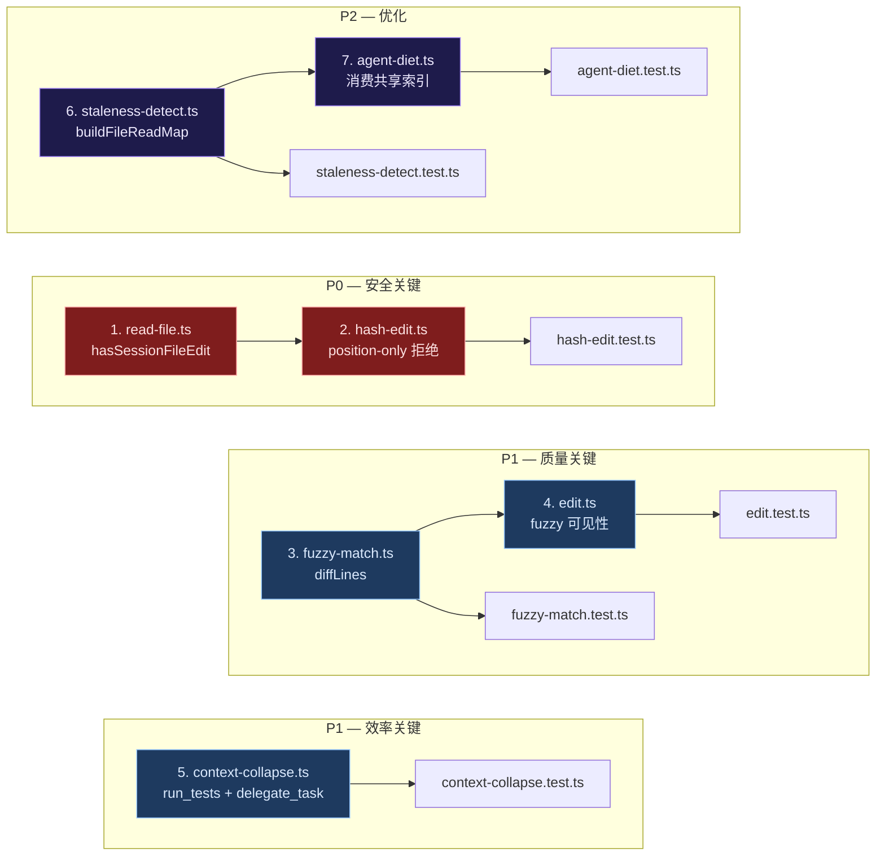

# 编辑工具与压缩工具优化设计

> **面向 AI 代理：** 使用 subagent-driven-development（推荐）或 executing-plans 逐任务实现。
> 四个独立优化，可并行执行。按优先级排序：P0 → P1 → P2。

**目标：** 消除编辑工具的静默风险，扩展压缩工具的信号覆盖。

**架构：** 四个改动彼此独立，共享跨模块的基础设施（`markSessionFileEdit`、`ToolResult.content` 格式约定）。每个改动限定在 1–2 个源文件 + 对应测试文件。

**技术栈：** TypeScript strict, node:test + assert/strict

---

## 一、hash_edit position-only 连续编辑拒绝 [P0 — 安全关键]

### 问题诊断

**症状**：`hash_edit` 的 `parseAnchor`（`src/tools/hash-edit.ts:29`）接受 `L<num>` 无哈希格式。连续两次 position-only hash_edit 对同一文件时，第一次编辑改变文件行号，第二次的 `L<num>` 锚点已漂移，但工具照常执行——静默破坏文件内容。

**根因**：`hash-edit.ts:175-180` 已有 `getFileReadMtime` 检查（文件 mtime 晚于最后读取时间 → 设置 `positionDriftWarning = true`），但仅是 warning，编辑仍然执行。系统提示词中的"position-only: never chain consecutive calls"是 prompt 级别的软约束，运行时无强制。

**证据**：
- `hash-edit.ts:148` — `parseAnchor` 接受 `L<num>` 返回 `{ line, hash: null }`
- `hash-edit.ts:175-180` — `posOnly` 检测 + `positionDriftWarning` 只追加警告文本，不阻止执行
- `read-file.ts` — `markSessionFileEdit(filePath)` 已被 edit_file 和 hash_edit 都调用，但缺少对应的读取接口

### 边界与消费者影响

| 文件 | 操作 | 原因 |
|------|------|------|
| `src/tools/read-file.ts` | 修改 — 新增 `hasSessionFileEdit(filePath): boolean` | 查询 session 内编辑记录 |
| `src/tools/hash-edit.ts` | 修改 — 执行前检查 + 拒绝 | 核心改动 |
| `src/tools/__tests__/hash-edit.test.ts` | 修改 — 新增反证测试 | 验证拒绝行为 |

**显式不改**：
- `parseAnchor` 签名和行为不变——position-only 格式仍合法
- 单次 position-only 编辑行为不变——只有"同一文件已被 session 内编辑过"时才拒绝
- `getFileReadMtime` 机制保留——覆盖非 session 内修改（如其他进程编辑）

### 改动设计

**Step A — `read-file.ts`：新增 `hasSessionFileEdit`**

```typescript
// 新增导出（与现有 markSessionFileEdit 同文件）
const _sessionEditedFiles = new Set<string>()

export function markSessionFileEdit(filePath: string): void {
  _sessionEditedFiles.add(filePath)  // 追加此行到现有函数体
  // ... 现有逻辑保留
}

export function hasSessionFileEdit(filePath: string): boolean {
  return _sessionEditedFiles.has(filePath)
}

export function __resetSessionFileEditsForTests(): void {
  _sessionEditedFiles.clear()
}
```

**Step B — `hash-edit.ts`：position-only 硬拒绝**

在 `hash-edit.ts:175-180`（`positionDriftWarning` 设置之后，anchor 验证之前）插入：

```typescript
// 新增 import
import { getFileReadMtime, refreshFileReadMtime, markSessionFileEdit, hasSessionFileEdit } from './read-file.js'

// 在 positionDriftWarning 设置之后、anchor 验证之前插入（约第 180 行之后）：
if (posOnly && hasSessionFileEdit(filePath)) {
  return {
    content: [
      `Error: position-only anchors blocked on ${filePath}`,
      `This file has been edited in the current session, so line numbers have shifted.`,
      `Re-read the file and use L<num>:<hash> anchors, or use edit_file instead.`,
    ].join('\n'),
    isError: true,
  }
}
```

**为什么安全**：position-only 的前提是"刚读过文件=行号准确"。session 内编辑打破这个前提。硬拒绝 fail-closed，模型收到 isError 后会重新 read_file 获取哈希锚点——多一轮 round-trip，但不会破坏文件。`hasSessionFileEdit` 基于绝对路径的 Set，O(1) 查询，不影响工具执行性能。

### 反证测试

| 测试文件 | 反证：偷懒实现会错 | 失败条件 |
|----------|-------------------|----------|
| `hash-edit.test.ts` | 只加 warning 不拒绝 | 连续两次 position-only hash_edit 同一文件 → 第二次返回 `isError: true` |
| `hash-edit.test.ts` | 未 reset 跨测试污染 | 测试 A 编辑文件 testA → 测试 B 对 testB 的首次 position-only 仍成功（不被误杀） |
| `hash-edit.test.ts` | 误杀全哈希 anchor | 带 `L<num>:<hex>` 的 hash_edit **不**触发拒绝，即使文件已被编辑过 |

### 验证命令

```bash
npx tsc --noEmit
npm exec -- tsx --test src/tools/__tests__/hash-edit.test.ts
```

---

## 二、edit_file fuzzy match 可见性 [P1 — 质量关键]

### 问题诊断

**症状**：当模型提供的 `old_string` 精确匹配失败时，`edit_file` 调用 `findFuzzyMatch` 做空白容错匹配。匹配成功后返回 `"Applied edit to ${filePath} (whitespace-tolerant match...)"`——模型不知道自己的 `old_string` 和文件实际内容差在哪里。在下一次连续编辑中，模型继续用错误的理解构造 `old_string`，偏差累积。

**根因**：`src/tools/edit.ts:188-196` 的 fuzzy match 分支只返回成功消息，不告诉模型"你给的和实际匹配到的有什么差异"。`fuzzy-match.ts` 的 `FuzzyMatch` 接口有 `matchedText` 字段（文件中的真实文本），但这个信息没有透传到 tool result 中。

**证据**：
- `edit.ts:188` — `const fuzzy = findFuzzyMatch(content, oldString)`
- `edit.ts:196` — 返回固定文案，不含 diff 信息
- `fuzzy-match.ts:35` — `findFuzzyMatch` 返回的 `FuzzyMatch.matchedText` 是文件中的实际匹配文本

### 边界与消费者影响

| 文件 | 操作 | 原因 |
|------|------|------|
| `src/tools/fuzzy-match.ts` | 修改 — 新增 `diffLines(oldStr, matched)` | 纯函数，生成差异对比 |
| `src/tools/edit.ts` | 修改 — fuzzy 分支返回中加入 `[fuzzy]` 标记 | 核心改动 |
| `src/tools/__tests__/fuzzy-match.test.ts` | 修改 — 新增 diffLines 测试 | 纯函数单测 |
| `src/tools/__tests__/edit.test.ts` | 修改 — 验证 fuzzy 命中时 content 包含 diff 信息 | 集成验证 |

**显式不改**：
- `findFuzzyMatch` 匹配逻辑不变——安全边界不变
- `applyFuzzyReplacement` 不变——文件写入行为不变
- 精确匹配路径不变

### 改动设计

**Step A — `fuzzy-match.ts`：新增 `diffLines`**

```typescript
/**
 * Compare two text blocks line-by-line, normalizing whitespace per line.
 * Returns a compact diff suitable for inclusion in tool result content.
 * Format: "+L3: <actual line>" for added, "-L2: <expected line>" for removed.
 */
export function diffLines(expected: string, actual: string, maxDiffs = 5): string {
  const expLines = expected.split('\n')
  const actLines = actual.split('\n')
  const diffs: string[] = []
  const maxLen = Math.max(expLines.length, actLines.length)

  for (let i = 0; i < maxLen && diffs.length < maxDiffs; i++) {
    const exp = expLines[i] ?? '<eof>'
    const act = actLines[i] ?? '<eof>'
    const normExp = exp.replace(/\s+/g, ' ').trim()
    const normAct = act.replace(/\s+/g, ' ').trim()
    if (normExp !== normAct) {
      diffs.push(`  L${i + 1}: expected "${exp.slice(0, 60)}"`)
      diffs.push(`  L${i + 1}: actual   "${act.slice(0, 60)}"`)
    }
  }

  if (diffs.length === 0) diffs.push('  (normalized content identical — whitespace-only difference)')
  const truncated = maxLen > maxDiffs ? `\n  … (+${maxLen - maxDiffs} more lines not shown)` : ''
  return diffs.join('\n') + truncated
}
```

**Step B — `edit.ts`：fuzzy 分支增强返回**

将 `edit.ts:188-196` 的 fuzzy 分支改为：

```typescript
if (fuzzy) {
  const recovered = applyFuzzyReplacement(content, fuzzy, newString)
  await writeFileAtomicAsync(filePath, recovered)
  refreshFileReadMtime(filePath, (await stat(filePath)).mtimeMs)
  markSessionFileEdit(filePath)
  const warn = syntaxCheck(filePath, recovered)

  // 构建 fuzzy 可见性标记
  const oldPreview = oldString.slice(0, 120)
  const matchedPreview = fuzzy.matchedText.slice(0, 120)
  const diff = diffLines(oldString, fuzzy.matchedText)

  const fuzzyReport = [
    `Applied edit to ${filePath} (whitespace-tolerant match)`,
    `[fuzzy] your old_string: ${oldPreview}${oldString.length > 120 ? '…' : ''}`,
    `[fuzzy] file matched: ${matchedPreview}${fuzzy.matchedText.length > 120 ? '…' : ''}`,
    `[fuzzy] diff:\n${diff}`,
  ].join('\n')

  return {
    content: fuzzyReport + (warn ? '\n\n' + warn : ''),
  }
}
```

**为什么安全**：不改变文件写入——`applyFuzzyReplacement` 调用的参数不变。只改变返回给模型的 `content` 字符串。`[fuzzy]` 前缀是约定标记，模型 prompt 中无需额外说明即可理解（自然语言已表达含义）。`diffLines` 是纯函数，无副作用。

### 反证测试

| 测试文件 | 反证：偷懒实现会错 | 失败条件 |
|----------|-------------------|----------|
| `fuzzy-match.test.ts` | `diffLines` 只 cover 首行差异 | 两段文本第 3 行 tab vs spaces 差异 → diff 输出包含 L3 |
| `edit.test.ts` | fuzzy 命中但 content 不含 diff | 用缩进差异的 old_string 调用 edit_file → content 包含 `[fuzzy] diff:` |
| `edit.test.ts` | 精确匹配路径也被改了 | 精确匹配 old_string → content 不含 `[fuzzy]` 前缀 |

### 验证命令

```bash
npx tsc --noEmit
npm exec -- tsx --test src/tools/__tests__/fuzzy-match.test.ts
npm exec -- tsx --test src/tools/__tests__/edit.test.ts
```

---

## 三、context-collapse 工具覆盖面扩展 [P1 — 效率关键]

### 问题诊断

**症状**：`collapseToolResult`（`src/compact/context-collapse.ts:31`）只处理 grep/search、read_file、bash、write_file/edit_file 五种工具。`run_tests` 的输出（经常 2000+ 字符，大量测试结果）和 `delegate_task`/`delegate_batch` 的 worker 返回只能走 `collapseGenericResult`——丢失可结构化的信号。

**根因**：`collapseToolResult` 的 if-else 链末尾是 `collapseGenericResult`，对未识别的工具只做行数和字符数统计。`run_tests` 输出格式高度结构化（`✓ N passed` / `✗ N failed` / exit code），`delegate_task` 返回包含 worker summary——都有可直接提取的高密度信号。

**证据**：
- `context-collapse.ts:31-56` — switch/if-else 链覆盖范围
- `context-collapse.ts:180-185` — `collapseGenericResult` 只提取行数+字符数+前 3 行预览

### 边界与消费者影响

| 文件 | 操作 | 原因 |
|------|------|------|
| `src/compact/context-collapse.ts` | 修改 — 新增两个 collapse 函数 + switch 分支 | 核心改动 |
| `src/compact/__tests__/context-collapse.test.ts` | 修改 — 新增 run_tests 和 delegate_task 的 collapse 测试 | 验证 |

**显式不改**：
- 已有 5 种工具的 collapse 逻辑不变
- `collapseGenericResult` 保留作为 fallback
- `preserveArtifactRef` 机制不变——artifact 引用继续保留

### 改动设计

**新增 `collapseRunTestsResult`**

```typescript
export function collapseRunTestsResult(content: string, originalTokens: number): CollapsedResult {
  // 提取通过/失败计数
  const passedMatch = content.match(/(\d+)\s*passed/)
  const failedMatch = content.match(/(\d+)\s*failed/)
  const exitMatch = content.match(/exit[=\s:]*(\d+)/i)

  const passed = passedMatch ? parseInt(passedMatch[1]!, 10) : null
  const failed = failedMatch ? parseInt(failedMatch[1]!, 10) : null
  const exitCode = exitMatch?.[1] ?? null

  // 提取失败测试名（匹配格式: "✗ test name" 或 "FAIL test name"）
  const failureLines = content.split('\n')
    .filter(l => /^\s*[✗✘❌]|^\s*FAIL\s/i.test(l))
    .map(l => l.replace(/^\s*[✗✘❌]\s*/, '').replace(/^\s*FAIL\s+/i, '').slice(0, 80))
    .slice(0, 5)

  const parts: string[] = []
  if (passed !== null || failed !== null) {
    parts.push(`${passed ?? '?'}/${(passed ?? 0) + (failed ?? 0)} passed`)
  }
  if (failed !== null && failed > 0) parts.push(`${failed} failed`)
  if (exitCode !== null) parts.push(`exit ${exitCode}`)
  if (failureLines.length > 0) {
    parts.push(`failures: ${failureLines.join(', ')}`)
  }

  const summary = `[collapsed run_tests: ${parts.join(' · ')}]`
  return { toolName: 'run_tests', summary, originalTokens, collapsedTokens: Math.ceil(summary.length / CHARS_PER_TOKEN) }
}
```

**新增 `collapseDelegateResult`**

```typescript
export function collapseDelegateResult(content: string, originalTokens: number): CollapsedResult {
  // delegate_task 返回通常以 "worker: <profile> — <summary>" 开头
  const firstLine = content.split('\n').find(l => l.trim().length > 0) ?? content.slice(0, 200)
  const profileMatch = firstLine.match(/(?:profile|worker)[:\s]*(\w+)/i)
  const profile = profileMatch?.[1] ?? 'worker'

  // 提取 summary 段落（第一个有意义的长句，最多 150 字符）
  const summaryMatch = content.match(/summary[:\s]+(.{20,150}?)(?:\.|$)/is)
  const snippet = summaryMatch?.[1]?.trim() ?? firstLine.slice(0, 150)

  const summary = `[collapsed delegate_task: ${profile} — ${snippet}${snippet.length >= 150 ? '…' : ''}]`
  return { toolName: 'delegate_task', summary, originalTokens, collapsedTokens: Math.ceil(summary.length / CHARS_PER_TOKEN) }
}
```

**修改 `collapseToolResult` switch**

在 `context-collapse.ts:31-56` 的 if-else 链中插入两个新分支：

```typescript
} else if (toolName === 'run_tests') {
  result = collapseRunTestsResult(content, originalTokens)
} else if (toolName === 'delegate_task' || toolName === 'delegate_batch') {
  result = collapseDelegateResult(content, originalTokens)
} else {
  result = collapseGenericResult(toolName, content, originalTokens)
}
```

**为什么安全**：collapse 是只读变换——不改原数据，只在发送给模型前压缩。`collapseRunTestsResult` 如果正则未匹配（非标准格式的输出），`passed`/`failed`/`exitCode` 均为 null，仍生成有意义的摘要。`collapseDelegateResult` 如果 summary 提取失败，fallback 到首行截断。不会丢失 artifact 引用（`preserveArtifactRef` 在调用方处理）。

### 反证测试

| 测试文件 | 反证：偷懒实现会错 | 失败条件 |
|----------|-------------------|----------|
| `context-collapse.test.ts` | run_tests 只用通用截断 | collapse 后 summary 包含 `passed` 和 `failed` 计数 |
| `context-collapse.test.ts` | 只有通过没有失败的 run_tests 误报失败 | 全部通过时 summary 包含 `3/3 passed`，不含 `failed` |
| `context-collapse.test.ts` | delegate_task collapse 丢失 worker profile | summary 包含 profile 名称（如 `code_scout`） |

### 验证命令

```bash
npx tsc --noEmit
npm exec -- tsx --test src/compact/__tests__/context-collapse.test.ts
```

---

## 四、staleness-detect 与 agent-diet 去重 [P2 — 优化]

### 问题诊断

**症状**：`staleness-detect.ts` 和 `agent-diet.ts` 都在做"检测被后续 read_file 覆盖的旧 tool result"——两个模块分别构建 `fileReads` Map（文件→读取记录列表），各自实现 `rangeContains`、`parseOptionalInt`，对同一批消息做重复扫描。压缩管线的 6 层中这两个相邻层消耗双倍 CPU 做相同工作。

**根因**：两个模块独立演化。staleness-detect 关注"内容是否过时"（superseded + unreferenced），agent-diet 关注"内容是否可以删"（redundant + expired + useless）。两者都需要的 `fileReads` 索引各自构建。

**证据**：
- `staleness-detect.ts:92-108` — 构建 `fileReads` Map（含 `rangeContains` 检查）
- `agent-diet.ts:88-120` — 构建自己的 `fileReads` Map（含 `rangeContains` 检查）
- 两个文件中 `rangeContains` 函数实现完全相同（逐字符比对）
- 两个文件中 `parseOptionalInt` 实现完全相同

### 边界与消费者影响

| 文件 | 操作 | 原因 |
|------|------|------|
| `src/compact/staleness-detect.ts` | 修改 — 导出 `buildFileReadMap`、`ReadEntry` 类型 | 提供共享索引 |
| `src/compact/agent-diet.ts` | 修改 — 删除本地索引构建，改为导入 | 消除重复 |
| `src/compact/__tests__/staleness-detect.test.ts` | 修改 — 新增 `buildFileReadMap` 单测 | 验证导出正确 |
| `src/compact/__tests__/agent-diet.test.ts` | 修改 — 验证去重后行为不变 | 回归测试 |

**显式不改**：
- staleness-detect 的 superseded/unreferenced 检测逻辑不变
- agent-diet 的 redundant/expired/useless 分类不变
- agent-diet 独有的 `wasTruncated`、supplementary read 判断保留——这些是 diet 特有策略
- 调用方（压缩管线入口）不变——两个模块的外部接口签名不变

### 改动设计

**Step A — `staleness-detect.ts`：导出共享索引**

```typescript
// 新增导出类型（与 agent-diet 的 ReadEntry 对齐）
export interface ReadEntry {
  index: number
  offset?: number
  limit?: number
  wasTruncated: boolean
}

// 新增导出函数：构建文件→读取记录 Map
export function buildFileReadMap(
  messages: OaiMessage[],
  anchorCount: number = CACHE_ANCHOR_MESSAGES,
): Map<string, ReadEntry[]> {
  const fileReads = new Map<string, ReadEntry[]>()

  for (let i = anchorCount; i < messages.length; i++) {
    const msg = messages[i]!
    if (msg.role !== 'assistant' || !(msg as any).tool_calls) continue
    for (const tc of (msg as any).tool_calls ?? []) {
      if (tc.function.name !== 'read_file' && tc.function.name !== 'grep' && tc.function.name !== 'glob') continue
      const ep = extractFileInfoForReadMap(tc.function.arguments)
      if (!ep) continue
      const reads = fileReads.get(ep.path) ?? []
      reads.push({ index: i + 1, offset: ep.offset, limit: ep.limit, wasTruncated: false })
      fileReads.set(ep.path, reads)
    }
  }
  return fileReads
}

// 内部辅助：从 tool call args 提取文件路径和范围
function extractFileInfoForReadMap(args: string): { path: string; offset?: number; limit?: number } | undefined {
  try {
    const parsed = JSON.parse(args)
    const path = parsed.file_path || parsed.path || parsed.file || parsed.pattern
    if (!path) return undefined
    return {
      path,
      offset: parseOptionalInt(parsed.offset),
      limit: parseOptionalInt(parsed.limit),
    }
  } catch { return undefined }
}
```

同时将 `parseOptionalInt` 和 `rangeContains` 从私有改为导出。

**Step B — `agent-diet.ts`：消费共享索引**

```typescript
// 新增 import
import { buildFileReadMap, rangeContains, parseOptionalInt, type ReadEntry } from './staleness-detect.js'

// 删除本地定义：
// - parseOptionalInt（约 10 行）
// - rangeContains（约 8 行）
// - ExtractedPath 接口中的 offset/limit 提取逻辑保持不变（agent-diet 的 extractPath 更复杂，需保留）
```

在 `applyAgentDiet` 的 Pass 1 中，将本地的 `fileReads` 构建替换为：

```typescript
// 替换前（agent-diet.ts:88-120 约 30 行）：
const fileReads = new Map<string, ReadEntry[]>()
// ... 手动构建循环

// 替换后：
const fileReads = buildFileReadMap(messages, ANCHOR_MESSAGES)
// 然后追加 agent-diet 独有的 wasTruncated 标记（因为 staleness 的 buildFileReadMap 默认 false）
for (const reads of fileReads.values()) {
  for (const entry of reads) {
    const msg = messages[entry.index]
    if (msg && msg.role === 'tool') {
      entry.wasTruncated = isResultTruncated(msg.content)
    }
  }
}
```

**为什么安全**：两个模块的 `fileReads` 构建逻辑语义相同（都是"找到所有 read_file/grep/glob 调用，记录文件路径和范围"）。`buildFileReadMap` 抽取的是两者的公共子集。agent-diet 独有的 `wasTruncated` 标记通过二次遍历补充。`rangeContains` 和 `parseOptionalInt` 在两个文件中实现完全一致，消除无歧义。

### 反证测试

| 测试文件 | 反证：偷懒实现会错 | 失败条件 |
|----------|-------------------|----------|
| `staleness-detect.test.ts` | `buildFileReadMap` 漏掉 grep | grep 调用后 `buildFileReadMap` 包含对应文件路径 |
| `agent-diet.test.ts` | 删除本地 `rangeContains` 后行为漂移 | 已有 superseded 检测的回归测试全部 GREEN |
| `agent-diet.test.ts` | agent-diet 仍定义自己的 `rangeContains`（旧代码未删） | grep `function rangeContains` in agent-diet.ts 返回空 |

### 验证命令

```bash
npx tsc --noEmit
npm exec -- tsx --test src/compact/__tests__/staleness-detect.test.ts
npm exec -- tsx --test src/compact/__tests__/agent-diet.test.ts
```

---

## 执行次序



### Wave 分解

| Wave | 任务 | 验证 | 过门条件 | Commit |
|------|------|------|----------|--------|
| P0 | T1 + T2 | typecheck + hash-edit 测试 | 连续两次 position-only hash_edit 同一文件 → 第二次 isError:true，文件内容未被第二次修改 | `fix(hash-edit): reject position-only anchors after session file edit` |
| P1a | T3 + T4 | typecheck + fuzzy-match + edit 测试 | fuzzy 命中时 content 包含 `[fuzzy] diff:` 且至少有一行差异描述 | `feat(edit): expose fuzzy-match diff in tool result content` |
| P1b | T5 | typecheck + context-collapse 测试 | run_tests collapse 输出包含 passed/failed 计数，delegate_task collapse 输出包含 worker profile | `feat(compact): collapse run_tests and delegate_task results` |
| P2 | T6 + T7 | typecheck + staleness-detect + agent-diet 测试 | agent-diet.ts 中不再定义 `rangeContains` 函数（grep 确认） | `refactor(compact): share file read index between staleness-detect and agent-diet` |

P0、P1a、P1b 三个 Wave 完全独立，无文件冲突，可并行执行。P2 依赖 P0/P1 完成后 staleness-detect 的导出接口稳定。

### 文件归属矩阵

```
P0: src/tools/read-file.ts, src/tools/hash-edit.ts, src/tools/__tests__/hash-edit.test.ts
P1a: src/tools/fuzzy-match.ts, src/tools/edit.ts, src/tools/__tests__/fuzzy-match.test.ts, src/tools/__tests__/edit.test.ts
P1b: src/compact/context-collapse.ts, src/compact/__tests__/context-collapse.test.ts
P2: src/compact/staleness-detect.ts, src/compact/agent-diet.ts, src/compact/__tests__/staleness-detect.test.ts, src/compact/__tests__/agent-diet.test.ts
```

---

## 自检清单

- [x] 问题诊断：引用了真实代码行号，症状有精确位置
- [x] 边界标定：每个改动显式列出"不改什么"
- [x] 注入点：每个改动有"当前→目标→为什么安全"
- [x] 反证测试：每个改动至少有一个"偷懒实现会红"的断言
- [x] 执行次序：按依赖排序，每 Wave 独立可提交，过门条件明确
- [x] 无占位符：无 TODO / TBD / 待定 / 补充细节
- [x] 文件路径：全为 `src/` 相对路径
- [x] 可执行指令：所有 grep/regex 已在真实代码库中验证
