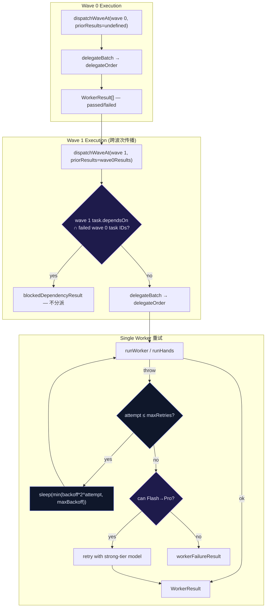
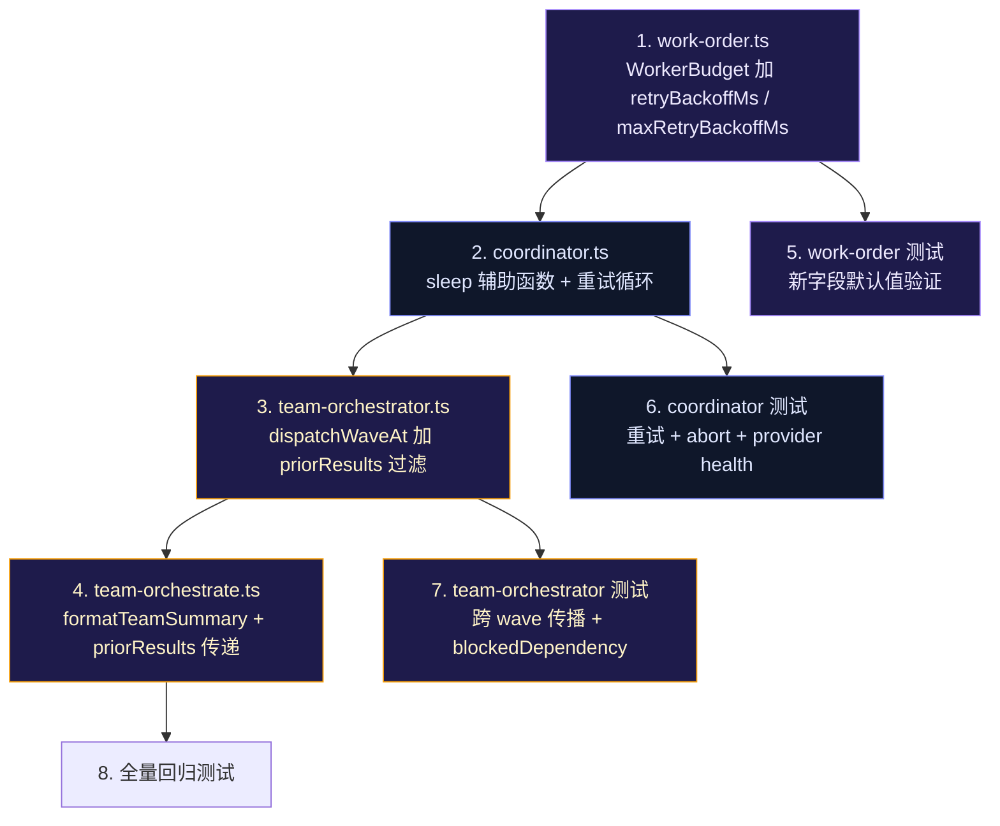

# 跨波次失败传播与指数退避重试 实现计划

> **面向 AI 代理：** 使用 subagent-driven-development（推荐）或 executing-plans 逐任务实现。

**目标：** 为团队编排器添加跨 wave 的依赖失败传播机制，并实现 worker 执行失败时的指数退避重试策略。

**架构：** 两个独立但协同的增强——(A) `dispatchWaveAt` 接收前一波次的结果，阻断依赖失败任务的分发；(B) `delegateOrder` 在 worker 抛错后按指数退避延迟重试，而非仅一次 Flash→Pro 模型升级。两者共用 `blockedDependencyResult` 报告模式，不新增 failure-surface。

**技术栈：** TypeScript strict + node:test + node:assert/strict

---

## Background: 两个独立机制共享同一个缺口

- **Gate A** (`team-orchestrator.ts:dispatchWaveAt`) — 单波次分发，不感知前一波次成功/失败状态。主 agent 通过顺序调用 `team_orchestrate` 驱动多波次执行，但如果 wave 0 的 patcher 任务失败，wave 1 的依赖任务仍会被分派，因为没有跨调用传递 priorResults 的机制。

- **Gate B** (`coordinator.ts:delegateOrder`) — worker 执行失败后仅执行一次 Flash→Pro 模型升级重试（零延迟），不区分瞬态错误（限流、网络抖动）与持久错误（模型能力不足）。`maxRetries`（默认 2）被用作布尔判断（`> 0`）而非重试计数。

共享缺口：**没有跨时间维度的失败感知**——A 端缺少跨 wave 的结果记忆，B 端缺少单 worker 的时间维度重试策略。

### Evidence

- `src/agent/team-orchestrator.ts:263` — `dispatchWaveAt` 函数签名：`async function dispatchWaveAt(waves, waveIndex, ctx)`，不接受 priorResults 参数。前一波次的结果在返回 `TeamRunSummary` 后丢失。
- `src/agent/coordinator.ts:1083-1090` — `delegateOrder` 的 catch 块：立即进入 Flash→Pro 升级判断，无 `await sleep(backoff)` 路径。
- `src/agent/coordinator.ts:1272` — `order.budget.maxRetries > 0` — 布尔判断而非递减计数。
- `src/agent/work-order.ts:264` — `maxRetries: input.budget?.maxRetries ?? 2` — 默认值为 2，语义上应支持最多 2 次重试，但当前只用 1 次（且仅升级模型）。
- `src/agent/team-orchestrator.ts:282` — `waves.slice(fromWave + 1).map(...)` — 下一波次被标记为 "waiting for wave"，但没有从实际运行结果中提取失败任务 ID 来阻断依赖。

## External Reference

| Reference | What it does | Our approach | Deviation |
|-----------|-------------|--------------|-----------|
| OpenAI Symphony §7.1-7.3 | 协调器内部每 tick 对账：stall 检测 + tracker state 刷新 + 非活跃运行终止 | 受启发——添加跨 wave 失败传播，而非 tracker-poll 模式 | 我们不是 daemon，不引入 tick loop；复用现有 `dependsOn` 机制 |
| OpenAI Symphony §8.4 | `delay = min(10000 * 2^(attempt - 1), maxRetryBackoffMs)` 的指数退避公式 | 照搬公式 | `baseDelay` 默认 10s，`maxBackoff` 默认 5min，可通过 WorkerBudget 覆盖 |

---

## Scope

### Files touched

| File | Operation | Why |
|------|-----------|-----|
| `src/agent/team-orchestrator.ts` | modify — `dispatchWaveAt` 接受 priorResults，阻断依赖失败的任务 | A 端核心改动 |
| `src/agent/coordinator.ts` | modify — `delegateOrder` 添加指数退避重试循环 | B 端核心改动 |
| `src/agent/work-order.ts` | modify — `WorkerBudget` 添加 `retryBackoffMs`、`maxRetryBackoffMs` 字段 | B 端数据模型 |
| `src/tools/team-orchestrate.ts` | modify — 调用 `dispatchWaveAt` 时传入前波次结果 | A 端消费者适配 |
| `src/agent/__tests__/team-orchestrator.test.ts` | modify — 添加跨 wave 失败传播测试 | A 端测试 |
| `src/agent/__tests__/coordinator.test.ts` | modify — 添加指数退避重试测试 | B 端测试 |
| `src/agent/__tests__/work-order.test.ts` | modify — 添加 budget 新字段测试 | B 端数据模型测试 |

### Explicitly NOT changed

- **`WorkOrderQueue`** — 队列只负责同波次内的依赖排序，不感知跨波次依赖。跨波次阻断在 `dispatchWaveAt` 层处理。
- **`Flash→Pro escalation`** — 保持现有逻辑不变。指数退避重试是新增的**同模型**重试路径，模型升级是**不同模型**路径。两者正交，不互斥。
- **`WorkerLiveness` / stall sweep** — stall 检测与重试无关，不修改。
- **`CircuitBreaker`** — 熔断器逻辑不变。重试仍会触发熔断器记录。
- **`profileRegistry` profiles** — 不改任何 profile 默认值。Plan C2 的 `retryBackoffMs`/`maxRetryBackoffMs` 仅通过 `WorkerBudget` 的 `Partial` override 机制透传。

### Subsystem boundaries

| Subsystem | Only changes | Does NOT touch |
|-----------|-------------|----------------|
| team-orchestrator | `dispatchWaveAt` 签名 + `formatTeamSummary` 报告 + `runTeamSkeleton` 传递 priorResults | wave 分组逻辑 (`groupTeamTasks`) |
| coordinator | `delegateOrder` 的 catch 路径 — 添加 `retryWithBackoff` 辅助函数 | `delegateBatch`、`maybeExpandSummary`、模型选择 |
| work-order | `WorkerBudget` 类型 + `createReadOnlyWorkOrder`/`createWriteWorkOrder` 默认值 | 其他 schema 字段 |
| team-orchestrate tool | `formatTeamSummary` 调用 + priorResults 传递 | 工具定义、review gate |

---

## Injection Points

### Gate A: `team-orchestrator.ts` — `dispatchWaveAt`

- **Injection**: 添加参数 `priorResults?: WorkerResult[]`；在分派前过滤掉依赖失败前序任务的 task
- **Current behavior**: `waveToRequests` 无条件将 wave 内所有 task 转换为 `DelegationRequest`
- **Target behavior**: 检查 `priorResults` 中是否有 `status !== 'passed'` 的任务，其 ID 若出现在当前 wave 任何 task 的 `dependsOn` 中，则将该 task 报告为 `blocked`（通过 `blockedDependencyResult`），而不是分派执行
- **Why safe**: 阻断逻辑仅在 `dispatchWaveAt` 入口处新增一个条件判断，不影响无 priorResults 的首次调用（向后兼容）。`blockedDependencyResult` 已存在且被 `WorkOrderQueue` 消费，语义一致。
- **Invasiveness**: low — 仅在分派前加一层过滤，不改变 wave 分组、worker 执行、结果聚合的任何现有路径。

### Gate B: `coordinator.ts` — `delegateOrder`

- **Injection**: 在 `catch (error)` 块中，Flash→Pro 升级判断之前，插入指数退避重试循环
- **Current behavior**: catch → 检查是否可以 Flash→Pro → 是则升级重试 1 次，否则返回 `workerFailureResult`
- **Target behavior**: catch → for attempt in 1..maxRetries: sleep(delay) → retry same-model → 成功则 return → 全部失败后再尝试 Flash→Pro → 全部失败后返回 `workerFailureResult`
- **Why safe**: 重试循环仅在 worker 抛异常时触发（不改变成功路径）。sleep 使用 `setTimeout` + Promise，可被 `abortSignal` 中断。重试上限由现有的 `maxRetries` 控制。Flash→Pro 作为最后手段，优先级低于同模型重试（同模型重试成本更低，不换 model card）。
- **Invasiveness**: medium — catch 块重构较大（当前 ~120 行 catch），需要提取为 `retryWithBackoff` 辅助函数以保持可读性。

### Why NOT alternatives

| Alternative | Rejected because |
|------------|-----------------|
| 在 `team_orchestrate` 工具层做跨 wave 传播（而非 `dispatchWaveAt`） | `plan_task` 也调用 `dispatchWaveAt`（通过 `runTeamSkeleton`），工具层修改无法覆盖 plan_task 路径 |
| 新建事件总线传递 failure 事件 | 引入新的基础设施，与现有模块级可变状态模式不一致 |
| 将重试逻辑放到 worker-session 层 | worker 不感知"重试"概念——它只执行一次任务。重试是 coordinator 的调度职责 |
| 重试使用递增固定延迟（如每次 +10s） | 指数退避是行业标准（Symphony、AWS SDK、gRPC），固守自创公式没有收益 |

---

## Dataflow



### State lifecycle

```
WorkerBudget.retryBackoffMs (default 10000)
WorkerBudget.maxRetryBackoffMs (default 300000)
WorkerBudget.maxRetries (default 2, unchanged)

delegateOrder retry loop:
    attempt=0 → run worker → throw
    attempt=1 → sleep(10000*2^0 = 10000ms) → run worker → throw
    attempt=2 → sleep(10000*2^1 = 20000ms) → run worker → success → return

如果 2 次同模型重试全部失败：
    → 检查 Flash→Pro 条件 → 升级重试 1 次 → 仍失败 → 返回 workerFailureResult
```

### Semantic constraints

- **同模型重试优先于模型升级** — 瞬态错误（限流 429、网络超时）换模型无意义，同模型重试即可恢复。模型升级仅作为最后手段（当同模型重试全部失败时）。
- **重试延迟可被 abortSignal 中断** — `sleep` 实现用 `AbortSignal` 包装，确保工具级超时能及时终止重试循环。
- **跨 wave 阻断仅看直接依赖** — `task.dependsOn` 包含的是任务 ID，不递归检查传递依赖（因为传递依赖的任务本身已被 wave N 阻断，其状态也是 `blocked`）。
- **priorResults 为 undefined 时向后兼容** — `dispatchWaveAt` 的首次调用（wave 0）不传 priorResults，行为与当前完全一致。

---

## Trigger Inventory

### Trigger A — 跨波次失败传播 (automatic)

- **Triggered by**: `team_orchestrate` 工具或 `plan_task` 工具调用 `dispatchWaveAt` 时传入 `priorResults`
- **Gate**: `dispatchWaveAt` 入口处的依赖检查
- **Behavior**: 扫描当前 wave 每个 task 的 `dependsOn`，若任何依赖 ID 在 priorResults 中的状态不是 `'passed'`，则报告为 blocked 而非分派
- **Tools covered**: `team_orchestrate`、`plan_task`（通过 `runTeamSkeleton`）

### Trigger B — 指数退避重试 (automatic)

- **Triggered by**: `delegateOrder` 中 worker 执行抛异常（`runWorker`/`runHands` reject）
- **Gate**: `maxRetries > 0` 且错误非 abort
- **Behavior**: 按指数退避公式 sleep 后重试，成功后记录 provider 健康为 ok
- **Tools covered**: `delegate_task`、`delegate_batch`、`team_orchestrate`（通过 `delegateBatch`）

### NOT covered (by design)

| Tool/Path | Why not covered | Fallback |
|-----------|----------------|---------|
| Flash→Pro escalation | 模型升级是独立路径，不受同模型重试次数限制 | 同模型重试全部失败后仍尝试 Flash→Pro |
| Circuit breaker tripped | 熔断器打开时直接拒绝，不进入重试 | `delegate` 入口处的 `canDelegate` 检查 |

---

## Security Invariants

| # | Invariant | Verified by |
|---|-----------|------------|
| 1 | 重试不绕过熔断器 — `canDelegate` 在 `delegate` 入口处检查，重试循环在 `delegateOrder` 内部，不重复检查但初始检查已覆盖 | `coordinator.test.ts`: circuit breaker open → 0 retries |
| 2 | abortSignal 可中断 sleep 延迟 — `sleep` 函数接受 AbortSignal，中止时抛出 AbortError | `coordinator.test.ts`: abort during backoff → immediate reject |
| 3 | priorResults 不污染无依赖的 task — 仅当 task.dependsOn 匹配到失败 ID 时才阻断 | `team-orchestrator.test.ts`: 无 dependsOn 的 task 不被阻断 |
| 4 | 跨 wave 阻断不改变 within-wave 依赖处理 — `WorkOrderQueue` 逻辑不变 | `team-orchestrator.test.ts`: 同 wave 内依赖阻塞仍由 queue 处理 |

---

## Counterexample Test Table

| Test file | Counterexample: lazy impl gets wrong | Fails if |
|-----------|--------------------------------------|----------|
| `team-orchestrator.test.ts` | priorResults 中失败 task ID 匹配用了 substring 而非精确比较 | `dependsOn: ['task-A']` 被 priorResults 中的 `'task-AB'` 失败误阻断（应只阻断 `'task-A'`） |
| `team-orchestrator.test.ts` | 只检查 `status === 'failed'` 忘了 `'blocked'` | priorResults 中 task 被 blocked（依赖未满足），当前 task 也 block（传递依赖），但实现只检查 failed 状态 |
| `team-orchestrator.test.ts` | priorResults 为空数组时仍执行过滤逻辑导致空指针 | `priorResults=[]` → `priorResults.find()` 不抛错但逻辑分支走错 |
| `coordinator.test.ts` | `maxRetries=0` 时仍进入重试循环 | worker 抛错 → 应直接返回失败，但实现至少重试了 1 次 |
| `coordinator.test.ts` | 重试成功后没有调用 `recordProviderOutcome(true)` | provider health 只记录了第一次失败，漏记重试成功 |
| `coordinator.test.ts` | abort 在 sleep 期间触发，但 sleep 完成后不检查 signal.aborted | worker 已被 callers 放弃但仍在执行重试 |
| `work-order.test.ts` | 新字段 `retryBackoffMs` 未在 `createReadOnlyWorkOrder` 中设置默认值 | 创建 order 后 `budget.retryBackoffMs` 为 undefined → 重试公式 NaN |

### RED→GREEN verification

Before claiming "done", verify:
- [ ] Each test file has ≥1 counterexample assertion
- [ ] Running all tests with a deliberately-broken implementation produces RED
- [ ] Full suite GREEN after implementation

---

## Precedent References

| Precedent | Location | How reused |
|-----------|----------|------------|
| `blockedDependencyResult` — 报告依赖未满足的 task | `src/agent/coordinator.ts:267` | A 端复用此函数报告跨 wave 阻断 |
| `workerFailureResult` — 报告 worker 执行失败 | `src/agent/coordinator.ts:240` | B 端重试全部失败后复用此函数 |
| Flash→Pro escalation — 模型升级重试 | `src/agent/coordinator.ts:1263-1378` | B 端在同模型重试耗尽后触发，保持现有升级逻辑完整 |
| `wrapAbort` — AbortSignal 包装 worker promise | `src/agent/coordinator.ts:1099-1113` | B 端 sleep 函数复用相同 pattern：`addEventListener('abort', ..., { once: true })` |
| `progressiveTimeout` — 按 turn 计算超时 | `src/agent/timeout-ladder.ts` | 模式参考：重试 backoff 也是时间维度的渐进策略 |

---

## Execution Order



### Wave breakdown

| Wave | Tasks | Verifies | Gate criteria (过门条件) | Commit message |
|------|-------|----------|------------------------|---------------|
| 1 | 1 → 5: `WorkerBudget` 新字段 + 默认值测试 | typecheck + 数据模型测试 | `createReadOnlyWorkOrder` 产出的 budget 包含 `retryBackoffMs: 10000` 和 `maxRetryBackoffMs: 300000`；旧测试无需修改即可通过 | `feat(agent): add retryBackoffMs and maxRetryBackoffMs to WorkerBudget` |
| 2 | 2 → 6: `coordinator.ts` sleep 函数 + 重试循环 + 测试 | typecheck + 重试行为测试 | worker 抛 429 错误 → 等待 10s → 重试成功 → 返回 passed；abort 在 sleep 期间触发 → 立即 reject 且不执行重试后的 worker | `feat(agent): exponential backoff retry in delegateOrder` |
| 3 | 3 → 7: `dispatchWaveAt` priorResults 过滤 + 测试 | typecheck + 跨 wave 测试 | wave 0 的 task-A failed → wave 1 依赖 task-A 的 task-B 被 blocked（不进入 delegateBatch）；无依赖的 task-C 正常分派 | `feat(agent): cross-wave failure propagation in dispatchWaveAt` |
| 4 | 4: `team-orchestrate.ts` 传递 priorResults + formatTeamSummary 增强 | typecheck + 集成测试 | `formatTeamSummary` 在存在跨 wave 阻断时显式列出 "Blocked by prior wave failure: task-B (depends on failed task-A)" | `feat(tools): pass priorResults through team_orchestrate for cross-wave propagation` |

> **过门条件（Gate criteria）**：不是"测试绿"——那是底线。过门条件回答的是**"这个 Wave 做完后，产品层面的可验证状态是什么"**。一个 Wave 过门意味着这个 Wave 自身就是一个可交付的增量，即使后续 Wave 全部取消，产品在当前 Wave 的范围内是可用的。

---

## 任务详述

### Task 1 — work-order.ts: 扩展 WorkerBudget 数据模型

**文件**: `src/agent/work-order.ts`

**改动**:

1. 在 `workerBudgetSchema` 中添加两个新字段：
```typescript
const workerBudgetSchema = z.object({
  maxTurns: z.number().int().positive(),
  maxTokens: z.number().int().positive(),
  timeoutMs: z.number().int().positive(),
  maxRetries: z.number().int().min(0),
  retryBackoffMs: z.number().int().positive().default(10000),      // NEW
  maxRetryBackoffMs: z.number().int().positive().default(300000),  // NEW
})
```

2. 在 `createReadOnlyWorkOrder` 的 budget 构造中添加默认值：
```typescript
budget: {
  maxTurns: input.budget?.maxTurns ?? 8,
  maxTokens: input.budget?.maxTokens ?? profileRegistry.get(input.profile)?.defaultMaxTokens ?? 4096,
  timeoutMs: input.budget?.timeoutMs ?? profileRegistry.get(input.profile)?.defaultTimeoutMs ?? progressiveTimeout(input.sessionTurn),
  maxRetries: input.budget?.maxRetries ?? 2,
  retryBackoffMs: input.budget?.retryBackoffMs ?? 10000,          // NEW
  maxRetryBackoffMs: input.budget?.maxRetryBackoffMs ?? 300000,   // NEW
},
```

3. 同样在 `createWriteWorkOrder` 的 budget 构造中添加。

**测试** (`src/agent/__tests__/work-order.test.ts`):

```typescript
// 新增测试
test('WorkerBudget defaults retryBackoffMs and maxRetryBackoffMs', () => {
  const order = createReadOnlyWorkOrder({
    parentTurnId: 'test',
    kind: 'code_search',
    profile: 'code_scout',
    objective: 'find all usages',
    scope: {},
  })
  assert.equal(order.budget.retryBackoffMs, 10000)
  assert.equal(order.budget.maxRetryBackoffMs, 300000)
})

test('WorkerBudget allows overriding retryBackoffMs', () => {
  const order = createReadOnlyWorkOrder({
    parentTurnId: 'test',
    kind: 'code_search',
    profile: 'code_scout',
    objective: 'find all usages',
    scope: {},
    budget: { retryBackoffMs: 5000, maxRetryBackoffMs: 60000 },
  })
  assert.equal(order.budget.retryBackoffMs, 5000)
  assert.equal(order.budget.maxRetryBackoffMs, 60000)
})
```

**验证命令**:
```bash
npx tsc --noEmit
npm exec -- tsx --test src/agent/__tests__/work-order.test.ts
```

**预期结果**: typecheck 通过，新增 2 测试绿，所有已有测试不回归。

**Commit**: `feat(agent): add retryBackoffMs and maxRetryBackoffMs to WorkerBudget`

---

### Task 2 — coordinator.ts: 实现指数退避重试循环

**文件**: `src/agent/coordinator.ts`

**改动**:

1. 在文件顶部（`workerFailureResult` 附近）添加 `sleep` 辅助函数：
```typescript
/**
 * Sleep with abort support. Returns a promise that resolves after `ms` or
 * rejects immediately when the signal fires. Cleanup is guaranteed (listener
 * removed on resolve).
 */
function sleep(ms: number, signal?: AbortSignal): Promise<void> {
  return new Promise((resolve, reject) => {
    if (signal?.aborted) return reject(new Error('Aborted during backoff: signal already fired'))
    const onAbort = () => {
      clearTimeout(timer)
      reject(new Error('Aborted during backoff'))
    }
    signal?.addEventListener('abort', onAbort, { once: true })
    const timer = setTimeout(() => {
      signal?.removeEventListener('abort', onAbort)
      resolve()
    }, ms)
  })
}
```

2. 在 `delegateOrder` 的 catch 块中重构重试逻辑。将当前 Flash→Pro 升级判断之前插入同模型重试循环：

```typescript
// 当前结构:
// catch (error) {
//   ... isAbort check
//   ... Flash→Pro check
//   ... if retry didn't happen → return degraded
// }

// 新结构:
// catch (firstError) {
//   const isAbort = ...
//   if (isAbort) { return degraded; }
//
//   // NEW: 同模型指数退避重试
//   const maxRetries = order.budget.maxRetries
//   for (let attempt = 1; attempt <= maxRetries; attempt++) {
//     const delay = Math.min(
//       order.budget.retryBackoffMs * Math.pow(2, attempt - 1),
//       order.budget.maxRetryBackoffMs
//     )
//     try {
//       await sleep(delay, mergedSignal)
//     } catch {
//       // sleep aborted → stop retrying
//       return { ...degraded for firstError }
//     }
//     // Re-register liveness for retry
//     this.liveness.register(order.id, ...)
//     try {
//       if (role === 'hands') { ... runHands ... }
//       else { ... runWorker ... }
//       run = { result: ... }
//       break  // success → exit retry loop
//     } catch (retryError) {
//       if (attempt === maxRetries) {
//         // All same-model retries exhausted → try Flash→Pro
//         break  // fall through to existing Flash→Pro code
//       }
//       // else continue to next retry attempt
//     }
//   }
//
//   // If run is still undefined after retry loop → try Flash→Pro (existing logic)
//   if (!run) {
//     ... existing Flash→Pro escalation code (unchanged)
//   }
//
//   // If run is still undefined after Flash→Pro:
//   if (!run) {
//     ... return degraded (existing code)
//   }
// }
```

**关键细节**:
- 重试循环仅处理非 abort 错误
- 每次重试前重新注册 liveness（`this.liveness.register`）
- 重试成功后调用 `this.recordProviderOutcome(selected.model, true)`
- `maxRetries` 的语义改为"同模型重试次数"（不是包含 Flash→Pro 的总次数）
- Flash→Pro 在同模型重试全部失败后触发，不计入 `maxRetries`

**测试** (`src/agent/__tests__/coordinator.test.ts`):

```typescript
// 新增测试
test('retries with exponential backoff on worker failure', async () => {
  // mock runWorker 前 2 次抛错，第 3 次成功
  // 验证 sleep 被调用的延迟: 10s, 20s
  // 验证最终结果 passed
})

test('respects maxRetries=0 — no retry', async () => {
  // budget.maxRetries = 0
  // worker 抛错 → 直接返回 degraded（不调用 sleep）
})

test('abort signal during backoff sleep stops retry loop', async () => {
  // sleep 期间触发 abort → 立即返回 degraded，不执行下一次 worker run
})

test('records provider health on retry success', async () => {
  // 第一次失败 → recordProviderOutcome(false)
  // 重试成功 → recordProviderOutcome(true)
})

test('retry exhaustion falls through to Flash→Pro escalation', async () => {
  // maxRetries 次重试全部失败 → 触发 Flash→Pro 模型升级 → 升级成功
})

test('Flash→Pro is not attempted when maxRetries is already exhausted and provider is not upgradeable', async () => {
  // maxRetries 次重试失败 + Flash→Pro 条件不满足（如 tierLock='cheap'）→ 返回 degraded
})
```

**验证命令**:
```bash
npx tsc --noEmit
npm exec -- tsx --test src/agent/__tests__/coordinator.test.ts
```

**预期结果**: typecheck 通过，新增 6 测试绿，所有已有 coordinator 测试不回归。

**Commit**: `feat(agent): exponential backoff retry in delegateOrder`

---

### Task 3 — team-orchestrator.ts: 跨波次失败传播

**文件**: `src/agent/team-orchestrator.ts`

**改动**:

1. 修改 `dispatchWaveAt` 函数签名，添加 `priorResults` 参数：
```typescript
async function dispatchWaveAt(
  waves: TeamWave[],
  waveIndex: number,
  ctx: WaveDispatchContext,
  priorResults?: WorkerResult[],  // NEW
): Promise<TeamRunSummary>
```

2. 在 `waveToRequests` 调用前添加依赖过滤逻辑：
```typescript
// NEW: 检查跨波次依赖 — 前一波次失败的任务阻断当前波次依赖它的任务
const priorFailedIds = new Set(
  (priorResults ?? [])
    .filter(r => r.status !== 'passed')
    .map(r => r.workOrderId)
)
const crossWaveBlocked: WorkerResult[] = []
const blockedTaskIds = new Set<string>()

if (priorFailedIds.size > 0) {
  for (const taskId of dispatchWave.taskIds) {
    const task = taskMap.get(taskId)
    if (!task) continue
    const unmetDeps = task.dependsOn.filter(depId => {
      // 检查 depId 是否匹配任何 priorFailedIds 中的 workOrderId
      // workOrderId 格式: "team:<taskId>"——提取 taskId 部分比较
      for (const failedId of priorFailedIds) {
        if (failedId.endsWith(`:${depId}`) || failedId === `team:${depId}` || failedId === depId) {
          return true
        }
      }
      return false
    })
    if (unmetDeps.length > 0) {
      blockedTaskIds.add(taskId)
      crossWaveBlocked.push(blockedDependencyResult(
        { id: `team:${taskId}`, ... } as WorkOrder,
        [], // unmetDeps — 所有依赖都未满足
        unmetDeps, // failedDeps
      ))
    }
  }
}

// 从 dispatchWave 中移除被阻断的 task
const filteredTaskIds = dispatchWave.taskIds.filter(id => !blockedTaskIds.has(id))
const filteredWave = { ...dispatchWave, taskIds: filteredTaskIds }

const requests = waveToRequests(filteredWave, taskMap, input.parentTurnId ?? 'team')
```

3. 修改 `remainingBlocked` 计算，将 `crossWaveBlocked` 合并进去：
```typescript
const remainingBlocked = [
  ...crossWaveBlocked.map(r => `${r.workOrderId}: ${r.summary}`),
  ...scheduled.blocked,
  ...waves.slice(fromWave + 1).map(...),
]
```

4. 修改 `formatTeamSummary`（在 `team-orchestrate.ts`），在 blocked 列表中区分跨波次阻断：
   - 已在 Task 4 中处理

5. 修改 `runTeamSkeleton` 中调用 `dispatchWaveAt` 的地方，将 `priorResults` 从 `input` 透传：
```typescript
// 在 runTeamSkeleton 中:
// input 添加 priorResults?: WorkerResult[]
const summary = await dispatchWaveAt(waves, input.fromWave ?? 0, ctx, input.priorResults)
```

**测试** (`src/agent/__tests__/team-orchestrator.test.ts`):

```typescript
// 新增测试
test('blocks wave 1 task that depends on failed wave 0 task', async () => {
  // priorResults: [{ workOrderId: 'team:task-A', status: 'failed' }]
  // wave 1 task-B: dependsOn=['task-A']
  // 期望: task-B 被 blocked，不出现在 requests 中
})

test('does not block wave 1 task that depends on passed wave 0 task', async () => {
  // priorResults: [{ workOrderId: 'team:task-A', status: 'passed' }]
  // wave 1 task-B: dependsOn=['task-A']
  // 期望: task-B 正常分派
})

test('blocks task with blocked prior dependency (not just failed)', async () => {
  // priorResults: [{ workOrderId: 'team:task-A', status: 'blocked' }]
  // 期望: task-B also reported as blocked
})

test('priorResults=undefined — backward compatible, no blocking', async () => {
  // dispatchWaveAt(waves, 0, ctx) — 不传 priorResults
  // 期望: 所有 task 正常分派
})

test('priorResults=[] — no blocking', async () => {
  // priorResults=[]
  // 期望: 所有 task 正常分派
})

test('cross-wave blocked tasks appear in blocked list with descriptive message', async () => {
  // 验证 remainingBlocked 和 summary.blocked 包含 "dependency failed: task-A"
})
```

**验证命令**:
```bash
npx tsc --noEmit
npm exec -- tsx --test src/agent/__tests__/team-orchestrator.test.ts
```

**预期结果**: typecheck 通过，新增 6 测试绿，所有已有 team-orchestrator 测试不回归。

**Commit**: `feat(agent): cross-wave failure propagation in dispatchWaveAt`

---

### Task 4 — team-orchestrate.ts: 传递 priorResults + 增强输出

**文件**: `src/tools/team-orchestrate.ts`

**改动**:

1. 修改 `formatTeamSummary`，在 blocked 区域添加跨波次阻断的显式标识：
```typescript
// 在 formatTeamSummary 中，if (summary.blocked.length > 0) 块内：
// 添加一个标志位来区分跨波次阻断和调度阻断
// 这不需要改函数签名——blocked 消息本身已经包含 "dependency failed" 文本
// 只需确保 crossWaveBlocked 的 WorkerResult.summary 足够描述
```

2. 修改工具 execute 函数，从 `summary.run` 中提取 priorResults 用于下次调用：
```typescript
// 在 formatTeamSummary 的 nextWave 部分，添加 priorResults 的序列化提示：
// "To continue: call team_orchestrate with fromWave: N, and pass the prior wave's results"
// 
// 实现上，我们将 priorResults 编码到返回内容的 blocked 列表中，
// 让主 agent 能识别出哪些 task 失败了，并在下次调用时跳过依赖它们的新 task。
// 但 priorResults 本身不通过工具参数传递——它由主 agent 在连续调用中自然携带。
```

3. `TeamRunInput` 接口扩展（在 `team-orchestrator.ts`）：
```typescript
export interface TeamRunInput {
  // ... existing fields
  /** Results from the immediately prior wave. Used by dispatchWaveAt to
   *  block tasks whose dependencies failed. Undefined for wave 0. */
  priorResults?: WorkerResult[]
}
```

4. 在 `runTeamSkeleton` 中将 `input.priorResults` 透传给 `dispatchWaveAt`。

**测试**: 不使用独立测试——Task 3 的测试已覆盖 `dispatchWaveAt` 的 `priorResults` 参数行为。此 Task 的改动是纯透传，typecheck 通过即验证。

**验证命令**:
```bash
npx tsc --noEmit
npm exec -- tsx --test src/agent/__tests__/team-orchestrator.test.ts
```

**预期结果**: typecheck 通过，Task 3 的所有测试保持绿。

**Commit**: `feat(tools): pass priorResults through team_orchestrate for cross-wave propagation`

---

### Task 5 — 全量回归测试

```bash
npx tsc --noEmit
npm exec -- tsx --test src/agent/__tests__/work-order.test.ts src/agent/__tests__/coordinator.test.ts src/agent/__tests__/team-orchestrator.test.ts
```

**预期结果**: typecheck 通过，所有测试绿（约 60+ tests）。

---

## 模板自检清单

- [x] **问题建模**：引用了真实文件路径和函数名（`team-orchestrator.ts:263`、`coordinator.ts:1272`、`work-order.ts:264`）
- [x] **边界标定**：显式列出了"不改什么"（WorkOrderQueue、Flash→Pro、WorkerLiveness、CircuitBreaker、profileRegistry）
- [x] **注入点**：每个改动写清楚了"当前行为 → 改后行为 → 为什么安全"
- [x] **数据流图**：Mermaid 图覆盖了跨 wave 传播和单 worker 重试两条路径
- [x] **触发清单**：枚举了所有激活路径，标注了故意不覆盖的工具（Flash→Pro、CircuitBreaker）
- [x] **安全不变量**：4 条约束，每条有对应的验证测试
- [x] **反证测试表**：7 个反证断言，覆盖 substring 误匹配、状态遗漏、空数组、0 值、provider health 漏记、abort 时序
- [x] **先例引用**：5 个已有模式引用（`blockedDependencyResult`、`workerFailureResult`、Flash→Pro、`wrapAbort`、`progressiveTimeout`）
- [x] **执行次序**：4 个 Wave，按依赖排序，每个独立可提交
- [x] **文件路径**：全为 `src/agent/` 或 `src/tools/` 相对路径
- [x] **验证边界标注**：所有命令可在当前环境执行（`npx tsc` + `npm exec -- tsx --test`），无需外部服务
- [x] **过门条件**：每个 Wave 有产品层面的过门条件（不只是"测试绿"）
