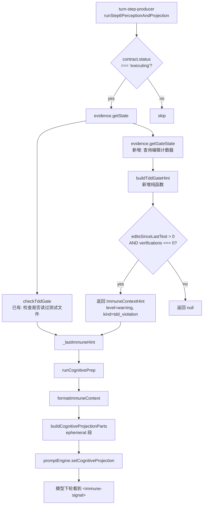

# L1 Suggest 消费端接入 — TDD 探针注入

> **面向 AI 代理：** 使用 `executing-plans` 逐任务实现。

**目标：** 将 `evaluateTddGate` 已产出的 L1 suggest 决策接入 immune → cognitive projection 通道，在 turn 边界向模型注入 TDD 提醒（零验证编辑累积时）。

**架构：** 在 turn-step-producer 的感知阶段（step 6），复用既有的 `checkTddGate` 调用点，新增 `buildTddGateHint` 查询 `EvidenceTracker.getGateState()` 产出 `ImmuneContextHint`，经 `formatImmuneContext → buildCognitiveProjectionParts → promptEngine` 链路注入 `<immune-signal>` 块。不新增注入通道，不改变 agent loop 结构。



**技术栈：** TypeScript strict, node:test + assert/strict, 复用现有 immune → cognitive 链路

---

## 任务

### 任务 1：新建 `buildTddGateHint` 纯函数 + 测试

- [ ] 修改 `src/agent/tdd-gate.ts`：新增 `buildTddGateHint` 导出函数
- [ ] 新建测试 `src/agent/__tests__/tdd-gate-hint.test.ts`

**目标：** 产出纯函数，输入 `TddGateState` + `TddGateConfig`，返回 `ImmuneContextHint | null`

**调研背书：**
- `evaluateTddGate`：已有纯决策函数，产出 L1 suggest 但未被消费。调用方 2 处：`tool-pipeline.ts:586`（只消费 action==='block'）、自身测试。修改不影响调用方。
- `checkTddGate`：已有函数，在 `turn-step-producer.ts:561` 被调用。检查"是否读过测试文件"，不查编辑计数器。不修改。
- `ImmuneContextHint` 类型：定义在 `immune-context.ts:13-17`，字段 `{ level, signalKinds, matchedMistakes, suggestion }`。`tdd_violation` 已是合法 `DangerSignalKind`。
- `formatImmuneContext`：`immune-context.ts:92`，将 hint 渲染为 `<immune-signal level="...">` XML 块。

**实现：**

在 `src/agent/tdd-gate.ts` 末尾追加：

```typescript
import type { ImmuneContextHint } from './immune-context.js'

/**
 * Build a TDD gate hint for the immune → cognitive projection channel.
 *
 * Queries {@link TddGateState} (from EvidenceTracker.getGateState()) and
 * produces an immune hint when edits are accumulating without verification.
 * Pure: no I/O, no state, no side effects.
 *
 * Called from turn-step-producer at turn boundaries; the hint flows through
 * formatImmuneContext → buildCognitiveProjectionParts → promptEngine, appearing
 * as an <immune-signal> block in the next provider request.
 *
 * @returns hint when edits > 0 and verifications === 0, or tests are failing;
 *          null when the gate is disabled or everything is fine.
 */
export function buildTddGateHint(
  state: TddGateState,
  config: TddGateConfig,
): ImmuneContextHint | null {
  if (!config.enabled) return null
  if (state.filesModified === 0) return null

  // Zero verifications: edits accumulating without any test run.
  if (state.verifications === 0 && state.editsSinceLastTest > 0) {
    return {
      level: 'warning',
      signalKinds: ['tdd_violation'],
      matchedMistakes: [],
      suggestion: `${state.editsSinceLastTest} edit(s) without a test run. TDD discipline: run tests (run_tests) before more edits — the test should fail first (RED), then pass after implementation (GREEN).`,
    }
  }

  // Tests were run but failed: nudge to fix before piling on more edits.
  if (state.hasFailedTests) {
    return {
      level: 'warning',
      signalKinds: ['tdd_violation'],
      matchedMistakes: [],
      suggestion: `${state.verifications} verification(s) recorded with failures. Fix the failing tests before continuing to edit.`,
    }
  }

  return null
}
```

**验证：**

```bash
npx tsc --noEmit                                    # typecheck
node --import tsx --test --test-force-exit \
  src/agent/__tests__/tdd-gate-hint.test.ts         # 全部通过
```

**测试用例覆盖：**

| 用例 | state | config | 预期 |
|------|-------|--------|------|
| 门禁用 | any | `{ enabled: false }` | null |
| 无修改 | `filesModified=0` | enforce | null |
| 已通过验证 | `verifications=1, hasFailedTests=false` | enforce | null |
| 零验证编辑 | `editsSinceLastTest=2, verifications=0` | enforce | hint with "2 edit(s) without a test run" |
| 零验证编辑 suggest 模式 | `editsSinceLastTest=2, verifications=0` | suggest | hint |
| 测试失败 | `verifications=2, hasFailedTests=true` | enforce | hint with "verification(s) recorded with failures" |
| 零编辑零验证 | `editsSinceLastTest=0, verifications=0, filesModified=1` | enforce | null（尚未开始编辑累积） |

**提交：**

```bash
git add src/agent/tdd-gate.ts src/agent/__tests__/tdd-gate-hint.test.ts
git commit -m "feat(agent): buildTddGateHint — 编辑累积零验证时产出 immune hint"
```

### 任务 2：接线到 turn-step-producer

- [ ] 修改 `src/agent/turn-step-producer.ts`：在现有 `checkTddGate` 调用点追加 `buildTddGateHint` 调用

**目标：** TDD gate hint 在每次 executing turn 的感知阶段被查询，结果合并入 `_lastImmuneHint`

**调研背书：**
- `runStep6PerceptionAndProjection`：`turn-step-producer.ts:470`，感知阶段入口。在 `taskContract.status === 'executing'` 时（行 559）调用 `checkTddGate`。
- `this.self.evidence`：`EvidenceTracker` 实例，有 `getGateState()` 方法（`evidence.ts` 新增）。
- `this.self._lastImmuneHint`：`ImmuneContextHint | undefined`，被 `runCognitivePrep` 消费后清空（行 427）。
- 导入：`buildTddGateHint` 从 `./tdd-gate.js`，已在行 28 import `checkTddGate`。

**实现：**

在 `src/agent/turn-step-producer.ts`：

1. 修改第 28 行 import，追加 `buildTddGateHint`：

```typescript
import { checkTddGate, buildTddGateHint } from './tdd-gate.js'
```

2. 在第 559-567 行的 `checkTddGate` 调用块之后，追加 `buildTddGateHint` 调用：

```typescript
      if (this.self.taskContract.status === 'executing') {
        const es = this.self.evidence.getState()
        const tddHint = checkTddGate({
          filesRead: es.filesRead,
          filesModified: es.filesModified,
          isActionable: this.self.taskContract.isActionable,
        })
        if (tddHint) this.self._lastImmuneHint = tddHint

        // L1 suggest: edit streak without verification — produce a hint
        // even when test files were read (checkTddGate only checks that).
        const tddConfig = this.self.config.tddGate ?? { enabled: true, mode: 'enforce' as const, threshold: 3 }
        const gateHint = buildTddGateHint(this.self.evidence.getGateState(), tddConfig)
        if (gateHint && !this.self._lastImmuneHint) {
          this.self._lastImmuneHint = gateHint
        }
      }
```

关键设计决策：`gateHint` 只在 `_lastImmuneHint` 仍为空时设置，避免覆盖 `checkTddGate` 产出的更具体的 hint（如 "No test file touched yet" 优先于 "N edits without test run"）。当两个 hint 都产出时（既没读过测试文件、又在零验证编辑），`checkTddGate` 的 hint 更关键——它告诉模型"先找到测试文件"，而 `buildTddGateHint` 的 hint 是补充——"你已经在编辑但还没跑测试"。

**验证：**

```bash
npx tsc --noEmit                                    # typecheck
node --import tsx --test --test-force-exit \
  src/agent/__tests__/tdd-gate-hint.test.ts \
  src/agent/__tests__/tdd-gate.test.ts \
  src/agent/__tests__/cognitive-pipeline.test.ts    # 确认 cognitive 注入不被破坏
```

**提交：**

```bash
git add src/agent/turn-step-producer.ts
git commit -m "feat(agent): 接入 L1 suggest — turn 边界注入 TDD 编辑累积提醒"
```

### 任务 3：类型一致性 + 全量回归

- [ ] 运行全量 typecheck
- [ ] 运行 agent 目录全量测试

**目标：** 确认改动不破坏任何现有测试，类型系统一致

**验证：**

```bash
npx tsc --noEmit                                                           # typecheck
node --import tsx --test --test-force-exit \
  'src/agent/__tests__/tdd-gate*.test.ts' \
  'src/agent/__tests__/evidence*.test.ts' \
  'src/agent/__tests__/cognitive-pipeline.test.ts' \
  'src/agent/__tests__/sensorium.test.ts'                                  # 全部通过
```

**提交：**

```bash
git add -A
git commit -m "chore(agent): 全量回归验证 — TDD gate L1 suggest 接入完成"
```

---

## 自检

1. **规格覆盖**：
   - L1 suggest 消费端缺失 → 任务 2 接线
   - 纯函数可独立测试 → 任务 1 覆盖 7 个用例
   - 不破坏现有 `checkTddGate` 行为 → 追加而非替换，优先级 `checkTddGate` > `buildTddGateHint`
   - 不影响 L2 block → `tool-pipeline.ts` 不改动

2. **占位符扫描**：无 TODO/TBD/待定。所有函数签名、类型、消息字符串已定义。

3. **类型一致性**：
   - `buildTddGateHint(TddGateState, TddGateConfig): ImmuneContextHint | null` — 输入输出类型跨任务一致
   - `turn-step-producer.ts` 调用 `evidence.getGateState()` → 返回 `TddGateState`，与函数签名匹配
   - `ImmuneContextHint` 已在 `immune-context.ts` 定义，字段 `level/signalKinds/matchedMistakes/suggestion` 完整

4. **调研背书**：
   - `evaluateTddGate`：调用方 2 处，不修改
   - `checkTddGate`：调用方 1 处（turn-step-producer），不修改
   - `EvidenceTracker.getGateState()`：新增方法，调用方 2 处（tool-pipeline.ts + 本任务）
   - `buildCognitiveProjectionParts`：接受 `immuneHint` 参数，已在 `runCognitivePrep` 中接线

5. **指标选择自检**：
   - 效果判据：TDD gate hint 注入后，模型下一轮应看到 `<immune-signal level="warning">` 并包含编辑计数
   - 验证方式：集成测试确认 cognitive projection 包含 `tdd_violation` signal kind
