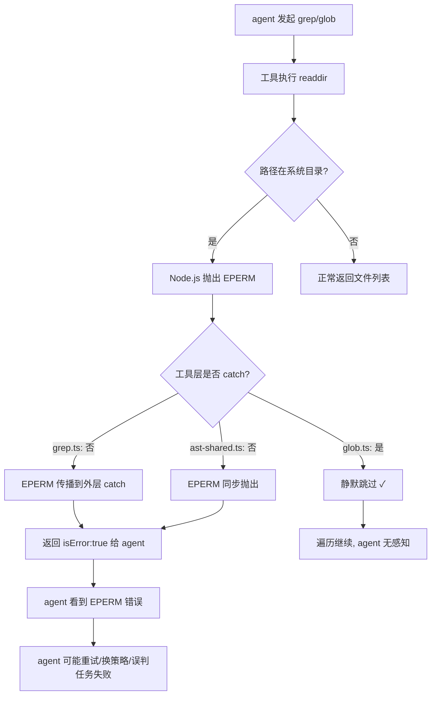

# Windows EPERM 根因修复 · 工具层静默跳过系统目录（修订版 v2）

> **面向 AI 代理：** 使用 subagent-driven-development（推荐）或 executing-plans 逐任务实现。
>
> **v2 修订说明（2026-07-02 评审后）：** ① 原任务 5（收紧 AppData 模式）合并进任务 1——地毯式 `AppData\Local\(?!Temp)` 从一开始就不进共享表，因为 Windows 上 `~/.rivet` 实际位于 `%LOCALAPPDATA%\.rivet`（见 AGENTS.md），按原顺序实施会有一个"grep 会话日志静默返回空"的缺陷窗口；② 所有模式加路径分隔符锚定，`code` 参数改必填（fail-closed）；③ grep/ast 只在**递归子目录**时静默跳过，搜索根本身受限仍返回错误——防止"有损观测推负向结论"；④ 集成测试改用真实文件系统 + chmod 000（ESM 模块 namespace 冻结，`mock.method(fs, ...)` 不可行）。

**目标：** 消除 agent 看到的 Windows 系统目录 EPERM 噪音，让 grep/ast_grep/ast_edit 等目录扫描工具在**递归遍历**遇到受保护系统目录时静默跳过，而非将 EPERM 作为工具错误返回给 agent。搜索根本身受限时仍然报错（agent 需要知道"目标不可达"与"无匹配"的区别）。

**架构：** 将 `eperm-filter.ts` 中的模式表提取为共享模块 `platform/restricted-paths.ts`（锚定收紧后的版本），供 `unhandledRejection` 过滤层和工具层的 `readdir` catch 块共用。`grep.ts` 和 `ast-shared.ts` 的目录遍历中，**非根目录**遇到匹配系统路径模式的 EPERM/EACCES 时静默跳过（不中断遍历、不返回错误给 agent）。

**技术栈：** Node.js fs/promises readdir、TypeScript strict

---

## 现状分析

### 问题链路



补充事实：`grep.ts` 优先走 ripgrep（rg 自身对权限错误只打 stderr、不中断），`nativeSearch` 仅在 rg 不可用时兜底——**"Windows 上没装 rg"恰好是最常见的受影响场景**，本修复打的正是这条兜底路径。

### 现状：各工具 EPERM 处理对比

| 工具 | 文件 | readdir 位置 | try/catch | agent 是否看到 EPERM |
|------|------|-------------|-----------|-------------------|
| glob | `src/tools/glob.ts:88` | `walkDir` 内 `readdir(dir)` | ✅ 有（catch-all，吞所有错误） | 否（静默跳过） |
| grep | `src/tools/grep.ts:426` | `walk` 内 `readdir(dir, {withFileTypes})` | ❌ 无 | **是** |
| ast_grep/ast_edit | `src/tools/ast-shared.ts:131` | `collectFiles` 内 `readdirSync(dir, {withFileTypes})` | ❌ 无 | **是** |
| inspect-project | `src/tools/inspect-project.ts:137` | `walk` 内 `readdir(dir)` | ✅ 有 | 否（静默跳过） |
| file-info | `src/tools/file-info.ts:155` | `scanDirectory` 内 `readdir(dir, {withFileTypes})` | ✅ 有 | 否（静默跳过） |
| import_resource | `src/tools/import-resource.ts:284` | `countFiles` 内 `readdir` | ✅ 有（整段 try/catch） | 否 |
| memory | `src/tools/memory.ts:57` | `searchKnowledgeFiles` 内 `readdir(dir)` | ❌ 无 | 否（只读 `.rivet/knowledge/`，不触系统目录） |

> **注意**：glob 的现状是 catch-all（吞**所有** readdir 错误，包括根目录）。本计划给 grep/ast 的是**更窄**的行为——仅"非根 + 受限路径 + EPERM/EACCES"静默，其他错误照常抛出。不要把 grep/ast 对齐成 glob 的 catch-all。

### 现状：eperm-filter.ts 覆盖范围

`eperm-filter.ts` 仅注册 `process.on('unhandledRejection')` 处理器，拦截**未被任何 catch 捕获**的 Promise rejection，且要求 `code === 'EPERM'` + `syscall ∈ {scandir, stat}`。工具层的 `try/catch` 已捕获 EPERM 并包装为 `ToolResult`，因此 `eperm-filter.ts` 对工具层无效——两条路径完全独立。

### 现状模式表的问题（v2 新增）

`eperm-filter.ts` 当前 `WINDOWS_NOISY_PATTERNS`（5 条）存在两类缺陷，提取共享时必须一并修复：

1. **地毯式误伤**：`/AppData[\\/]Local[\\/](?!Temp)/i` 会匹配 `%LOCALAPPDATA%\.rivet`（Windows 上的 Rivet 数据目录，见 AGENTS.md「Windows 注意」），一旦进入工具层静默跳过，agent 在 Windows 上排查会话日志会得到假的"无匹配"。
2. **裸子串过宽**：`/ElevatedDiagnostics/i` 等无分隔符锚定，用户项目里名为 `my-elevateddiagnostics-notes/` 的目录也会命中。unhandledRejection 降噪场景可容忍，工具层静默跳过场景不可容忍。

---

## 任务表

### 任务 1：新建共享模式表 `platform/restricted-paths.ts`（含收紧与锚定）

**文件：** 新建 `src/platform/restricted-paths.ts`

创建 `isRestrictedPath(path: string, code: string): boolean`，供 `eperm-filter.ts` 和工具层共用。**不照搬**现有模式——按下述锚定收紧版落地：

```typescript
// src/platform/restricted-paths.ts

/** 分隔符边界：模式统一用 [\\/] 锚定目录段，避免裸子串误伤用户路径。 */

/** Windows system directories that commonly cause EPERM on scandir/stat. */
const WINDOWS_RESTRICTED_PATTERNS: readonly RegExp[] = [
  // Known ACL-restricted subdirs under AppData\Local — exact match only.
  // 禁止使用地毯式 AppData\Local\(?!Temp)：会命中 %LOCALAPPDATA%\.rivet（Rivet 数据目录）。
  /AppData[\\/]Local[\\/]ElevatedDiagnostics([\\/]|$)/i,
  /AppData[\\/]Local[\\/]Packages([\\/]|$)/i,
  /AppData[\\/]Local[\\/]Microsoft[\\/]Windows[\\/]Notifications([\\/]|$)/i,
  /AppData[\\/]Local[\\/]Microsoft[\\/]Windows[\\/]INetCache([\\/]|$)/i,
  /AppData[\\/]Local[\\/]Microsoft[\\/]Windows[\\/]Temporary Internet Files([\\/]|$)/i,
  /AppData[\\/]Local[\\/]Microsoft[\\/]WindowsApps([\\/]|$)/i, // UWP 执行别名目录，锚定到 Microsoft\ 前缀
  /Windows[\\/]System32[\\/]config([\\/]|$)/i,
  /Windows[\\/]CSC([\\/]|$)/i,
  /(^|[\\/])System Volume Information([\\/]|$)/i,
  /(^|[\\/])\$Recycle\.?Bin([\\/]|$)/i, // 含无点号变体
  /(^|[\\/])Config\.Msi([\\/]|$)/i,     // Windows Installer 缓存（根目录级）
]

/** macOS system directories with restrictive ACLs (EPERM under SIP/TCC). */
const MACOS_RESTRICTED_PATTERNS: readonly RegExp[] = [
  /(^|\/)\.Spotlight-V100([\/]|$)/i,
  /(^|\/)\.fseventsd([\/]|$)/i,
  /(^|\/)\.TemporaryItems([\/]|$)/i,
  /(^|\/)\.DocumentRevisions-V100([\/]|$)/i,
  /(^|\/)\.Trashes([\/]|$)/i,
]

/** Linux system paths that commonly cause EACCES on readdir. */
const LINUX_RESTRICTED_PATTERNS: readonly RegExp[] = [
  /^\/proc\/\d+\/(fd|map_files|task\/\d+\/fd)([\/]|$)/,
  /^\/sys\/kernel\/debug([\/]|$)/,
  /^\/sys\/fs\/cgroup([\/]|$)/,
  /(^|\/)lost\+found([\/]|$)/,
]

const ALL_RESTRICTED = [
  ...WINDOWS_RESTRICTED_PATTERNS,
  ...MACOS_RESTRICTED_PATTERNS,
  ...LINUX_RESTRICTED_PATTERNS,
]

/**
 * Check if a filesystem permission error targets a known restricted/protected
 * system directory that should be silently skipped during directory traversal.
 *
 * Fail-closed 契约：
 * - `code` 必填。只有 EPERM / EACCES 视为可静默的权限噪音；
 *   code 缺失或为其他值（ENOENT/EIO/...）一律返回 false。
 * - 路径不匹配任何已知系统目录模式 → false（错误照常传播）。
 *
 * @param path - Node.js fs error 的 error.path（优先）或 error.message。
 * @param code - error.code，必填。
 */
export function isRestrictedPath(path: string, code: string): boolean {
  if (code !== 'EPERM' && code !== 'EACCES') return false
  if (!path) return false
  return ALL_RESTRICTED.some(re => re.test(path))
}
```

**测试文件：** 新建 `src/platform/__tests__/restricted-paths.test.ts`

测试用例（正反两面都要）：

匹配（code='EPERM' 或 'EACCES'）：
- `C:\Users\x\AppData\Local\ElevatedDiagnostics`
- `C:\Users\x\AppData\Local\Packages\SomeUwpApp`
- `C:\$RECYCLE.BIN` 与 `C:\$Recycle.Bin`（两种变体）
- `D:\System Volume Information`
- `/Volumes/ext/.Spotlight-V100`
- `/proc/1234/fd`

**不匹配**（这是本次收紧的核心，缺一不可）：
- `C:\Users\x\AppData\Local\.rivet\sessions\xxx.jsonl` —— **Rivet Windows 数据目录，绝不可静默**
- `C:\Users\x\AppData\Local\Temp\my-project`
- `C:\Users\x\AppData\Local\MyApp\data`（普通用户应用目录）
- `/home/user/project/my-elevateddiagnostics-notes/readme.md`（裸子串锚定回归）
- `/home/user/project/src`（普通项目路径）
- 任意路径 + `code='ENOENT'` → false（code 门槛）
- 任意路径 + code 为空串 → false

**验证命令：**
```bash
npx tsc --noEmit
node --import ./node_modules/tsx/dist/esm/index.mjs --test --test-reporter spec src/platform/__tests__/restricted-paths.test.ts
```

**Commit：** `feat(platform): shared restricted-path detection — anchored, fail-closed`

---

### 任务 2：更新 `eperm-filter.ts` 使用共享模块

**文件：** 修改 `src/platform/eperm-filter.ts`

- 删除文件内的 `WINDOWS_NOISY_PATTERNS` 常量
- `isWindowsScandirNoise` 保留函数壳（unhandledRejection 语义仍需 `syscall ∈ {scandir, stat}` 收窄——这层比工具层更宽松地吞错误，必须保住 syscall 门槛），内部改用共享模式：

```diff
- const WINDOWS_NOISY_PATTERNS: readonly RegExp[] = [ ... ]
+ import { isRestrictedPath } from './restricted-paths.js'

  function isWindowsScandirNoise(error: unknown): boolean {
    if (typeof error !== 'object' || error === null) return false
    const err = error as Record<string, unknown>
-   if (err.code !== 'EPERM') return false
+   if (err.code !== 'EPERM' && err.code !== 'EACCES') return false
    const syscall = err.syscall as string | undefined
    if (syscall !== 'scandir' && syscall !== 'stat') return false
    const path = typeof err.path === 'string' ? err.path : String(err.message ?? '')
-   return WINDOWS_NOISY_PATTERNS.some(re => re.test(path))
+   return isRestrictedPath(path, err.code as string)
  }
```

**行为变化说明（有意）：** 收紧后 `AppData\Local\<任意目录>` 不再被 unhandledRejection 层吞掉——只有精确列出的子目录才吞。如果实际运行中发现新的噪音子目录，加进 `restricted-paths.ts` 的精确列表，**不要恢复地毯模式**。

**测试文件：** 修改 `src/platform/__tests__/eperm-filter.test.ts`

- 删除测试内重复的模式定义，改从行为断言：受限路径 EPERM 的 rejection 被吞、`AppData\Local\.rivet` 的 EPERM **不**被吞、非 EPERM/EACCES 不被吞
- 新增 macOS / Linux 路径用例

**验证命令：**
```bash
npx tsc --noEmit
node --import ./node_modules/tsx/dist/esm/index.mjs --test --test-reporter spec src/platform/__tests__/eperm-filter.test.ts src/platform/__tests__/restricted-paths.test.ts
```

**Commit：** `refactor(platform): migrate eperm-filter to shared restricted-paths module`

---

### 任务 3：`grep.ts` readdir 加 EPERM 静默跳过（仅递归子目录）

**文件：** 修改 `src/tools/grep.ts`

在 `nativeSearch` 的 `walk` 函数中包 try/catch。**关键语义：根目录（agent 显式指定的搜索路径）受限时必须照常抛错**——否则 agent 得到 "No matches found." 会推出错误的负向结论（本仓库 lossy-observation 纪律防的就是这个）。只有递归进入的子目录才静默跳过。

修改范围（`src/tools/grep.ts` 约第 414-447 行）：
```diff
+ import type { Dirent } from 'node:fs'
+ import { isRestrictedPath } from '../platform/restricted-paths.js'

- async function walk(dir: string): Promise<void> {
+ async function walk(dir: string, isRoot: boolean): Promise<void> {
    if (results.length >= maxResults) return
    let real: string
    try { real = await realpath(dir) } catch { return }
    if (visited.has(real)) return
    visited.add(real)

-   const entries = await readdir(dir, { withFileTypes: true })
+   let entries: Dirent[]
+   try {
+     entries = await readdir(dir, { withFileTypes: true })
+   } catch (err) {
+     const e = err as NodeJS.ErrnoException
+     // 仅"非根 + 已知受限系统目录 + 权限错误"静默跳过；
+     // 根目录受限或其他错误照常抛出（外层 catch → isError:true）。
+     if (!isRoot && isRestrictedPath(String(e.path ?? e.message ?? ''), e.code ?? '')) return
+     throw err
+   }
    for (const entry of entries) {
      ...
      if (s.isDirectory()) {
-       await walk(fullPath)
+       await walk(fullPath, false)
      }
    }
  }

  // 调用点（约 L458）：
- await walk(absPath)
+ await walk(absPath, true)
```

> 类型注意：不要用 `Awaited<ReturnType<typeof readdir>>`——readdir 多重载会解析到错误签名，直接 `Dirent[]`。

**验证命令：**
```bash
npx tsc --noEmit
node --import ./node_modules/tsx/dist/esm/index.mjs --test --test-reporter spec src/tools/__tests__/grep*.test.ts
```

**Commit：** `fix(tools): silently skip restricted subdirs in grep — suppress EPERM noise`

---

### 任务 4：`ast-shared.ts` readdirSync 加 EPERM 静默跳过（仅递归子目录）

**文件：** 修改 `src/tools/ast-shared.ts`

`collectFiles` 的 `walk` 已有 `depth` 参数，可直接复用做根/子目录区分：`depth === 0` 是 agent 显式指定的搜索路径（受限 → 照常抛出），`depth > 0` 是递归子目录（受限 → 静默跳过）。

修改范围（`src/tools/ast-shared.ts` 约第 129-141 行）：
```diff
+ import type { Dirent } from 'node:fs'
+ import { isRestrictedPath } from '../platform/restricted-paths.js'

  const walk = (dir: string, depth: number): void => {
    if (files.length >= MAX_FILES || depth > MAX_DEPTH) return
-   for (const entry of readdirSync(dir, { withFileTypes: true })) {
+   let entries: Dirent[]
+   try {
+     entries = readdirSync(dir, { withFileTypes: true })
+   } catch (err) {
+     const e = err as NodeJS.ErrnoException
+     if (depth > 0 && isRestrictedPath(String(e.path ?? e.message ?? ''), e.code ?? '')) return
+     throw err
+   }
+   for (const entry of entries) {
```

**验证命令：**
```bash
npx tsc --noEmit
node --import ./node_modules/tsx/dist/esm/index.mjs --test --test-reporter spec src/tools/__tests__/ast_edit*.test.ts src/tools/__tests__/ast_grep*.test.ts
```

**Commit：** `fix(tools): silently skip restricted subdirs in ast_grep/ast_edit — suppress EPERM noise`

---

### 任务 5：集成测试 — 真实文件系统验证静默跳过与根路径报错

**文件：** 新建 `src/tools/__tests__/eperm-skip.test.ts`

**不要走 mock fs 路线**：项目是 ESM，`node:fs/promises` 的模块 namespace 冻结，`mock.method(fs, 'readdir')` 会抛错；且 `grep.ts` 用具名导入绑定，namespace 替换也影响不到。原计划的探针可以省略——结论已知。

**改用真实文件系统构造 EACCES（POSIX）：** 在 tmpdir 里创建名为 `.Spotlight-V100` 的目录并 `chmod 000`——真实触发 EACCES，且目录名命中共享表的 macOS 模式 `(^|\/)\.Spotlight-V100`（Windows 模式都带 `AppData`/盘符前缀锚定，在 tmpdir 里凑不出来，所以选无前缀锚定的 macOS 模式做测试载体）。Windows 上跳过该测试（`process.platform === 'win32'` → `t.skip()`；Windows 路径判定由任务 1 的模式表单测覆盖，无需真实 EPERM）。另外若测试以 root 运行 chmod 000 不生效，开头检测 `process.getuid?.() === 0` 时跳过。

```typescript
import { test } from 'node:test'
import assert from 'node:assert/strict'
import { mkdtempSync, mkdirSync, writeFileSync, chmodSync, rmSync } from 'node:fs'
import { tmpdir } from 'node:os'
import { join } from 'node:path'

// 布局：
//   <tmp>/src/hit.ts            ← 含匹配内容
//   <tmp>/.Spotlight-V100/      ← chmod 000，命中 macOS 受限模式
//   <tmp>/user-denied/          ← chmod 000，不命中任何模式
// 恢复：afterEach 里 chmod 755 后 rmSync，避免 tmp 残留不可删目录
```

**测试用例：**

1. **递归遇到受限目录 → 静默跳过**：grep 整个 `<tmp>`，断言返回 `src/hit.ts` 的匹配、结果不含 "EPERM"/"EACCES"、`isError` 不为 true。
2. **递归遇到非受限的权限错误 → 仍抛出**：grep 整个含 `user-denied/` 的树，断言 `isError: true` 且内容含权限错误（用户目录的权限问题不该被吞）。
3. **搜索根本身受限 → 报错而非空结果**：grep 直接指向 `.Spotlight-V100`，断言 `isError: true`（不得返回 "No matches found."）。
4. **ast_grep 同套布局**：用例 1 与 3 各跑一遍。
5. **glob 回归**：整树 glob 不返回 EPERM（已有 catch-all 行为，防未来退化）。

**验证命令：**
```bash
node --import ./node_modules/tsx/dist/esm/index.mjs --test --test-reporter spec src/tools/__tests__/eperm-skip.test.ts
```

**Commit：** `test(tools): verify restricted-dir silent-skip and root-error semantics`

---

## 执行顺序

```
P1(shared, 已含收紧) → P2(eperm-filter 迁移) → P3(grep) → P4(ast) → P5(集成测试)
  └─ P1+P2 可合并为一个 commit（提取+迁移）
  └─ P3+P4 依赖 P1，各自独立可并行
  └─ P5 依赖 P3+P4
```

## 回滚风险评估

- `restricted-paths.ts` 模式全部按目录段锚定 + 精确子目录列出，不存在地毯匹配；`AppData\Local\.rivet` 有显式反向测试钉住
- `grep.ts` / `ast-shared.ts` 的 catch 仅在"非根 + EPERM/EACCES + 匹配模式"三条件同时成立时静默，其余错误传播语义不变；根路径受限仍报错
- `eperm-filter.ts` 迁移后覆盖面**收窄**（地毯 AppData 模式移除）——若 Windows 实机出现新噪音子目录，往精确列表追加，禁止恢复地毯模式
- glob 的既有 catch-all 行为本次不动（改窄有回归风险），仅以集成测试钉住现状

## 验收标准

- [ ] `npx tsc --noEmit` 零错误
- [ ] 所有修改文件的已有测试通过
- [ ] `AppData\Local\.rivet\...` 在任何 code 下均不被判定为受限路径（专项反向测试）
- [ ] 裸子串锚定回归：`my-elevateddiagnostics-notes` 类用户路径不匹配
- [ ] 受限系统目录 EPERM/EACCES（Windows/macOS/Linux 模式各至少一例）→ 递归中静默跳过
- [ ] 非受限路径的权限错误 → 仍返回 isError:true
- [ ] 搜索根本身受限 → isError:true，不得返回 "No matches found."
- [ ] `code` 缺失/非 EPERM/EACCES → 不静默（fail-closed）
