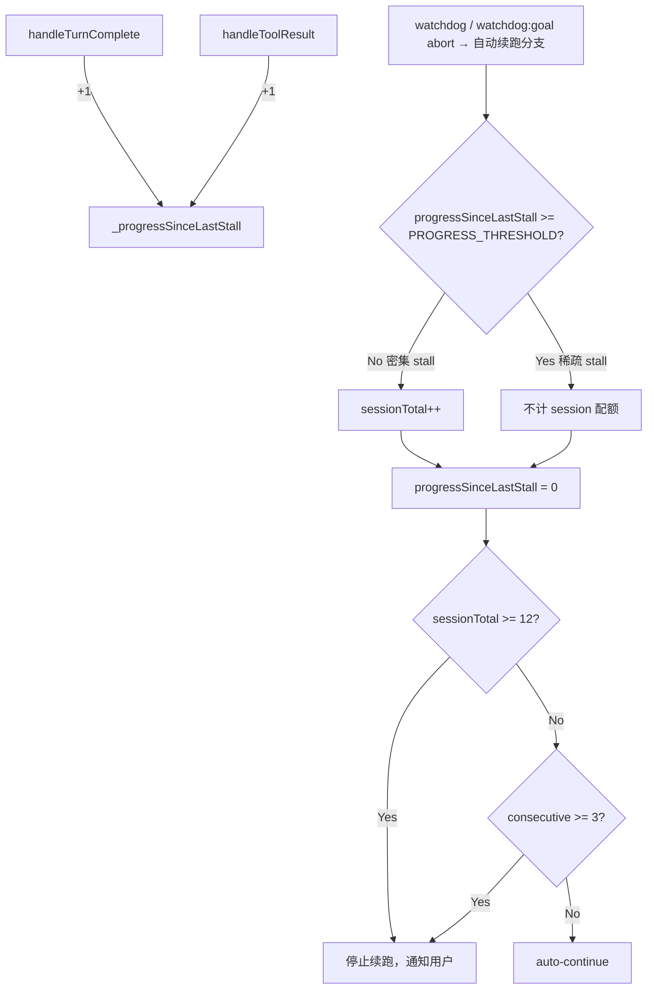

# Watchdog Stall 恢复：进度感知计数 + 通用场景覆盖（修订版 v3）

> **v3 修订说明（2026-07-02）：** 范围从 goal 模式扩展到 **watchdog 家族全体**（`'watchdog'` 与 `'watchdog:goal'`）。核实发现：①误报源（合法长静默边界：LLM compact、postTurn hook LLM 调用、冷前缀 prefill）与 goal 无关，任何 run 都会命中；②非 goal 场景开火后**零恢复**，run 直接终止等用户；③现存 UI 谎言——`app.ts:2491` 的消息分支用 `isWatchdog` 判定，行为分支（L2505）用 `isWatchdogGoal` 判定，普通 watchdog abort 显示"⟳ Auto-recovering"但实际不会恢复。v3 将恢复策略泛化到 watchdog 家族，同时修掉消息/行为守卫不一致。
>
> **v2 修订说明（2026-07-02 评审后）：** 原方案以 `state.turnNumber` 增量作为 stall 间隔度量，经代码核实该假设不成立——`turnNumber` 来自 `session.getTurnCount()`（`turn-completion.ts:62`），而 turnCount 只在 `addUserMessage` 时自增（`context.ts:142`），是 **user-role 消息计数**，不是工具循环轮数。工具批循环的中间 `onTurnComplete(isFinal:false)`（`turn-orchestrator.ts:816`）传入的 turnCount 在整个循环中几乎不变。后果：wedge 场景 gap≈1-2（'continue' 重提交 +1、retry reminder 偶尔 +1），而"stall→重活 40 个工具批→compact 边界再 stall"的合法场景 gap 同样 ≈1-2——**两类场景在 turnNumber 维度不可区分**，原方案修不掉它要修的假阳性。v2 改用 TUI 本地可观测的进度单元计数（turn completion 次数 + tool result 次数），无需跨层 plumbing。

## 问题

### 误报源（goal 与非 goal 共用）

心跳 tick 来自流式增量（text/thinking delta）、工具事件、turn 完成、phase change；边界步骤只在**开始时** tick 一次（`turn-orchestrator.ts:355` `tick('compaction')`、`:372` `tick('prewarm')` 等）。以下合法静默一旦超过 hardStallMs（默认 240s），watchdog 开火：

- LLM compact 调用本身耗时 >240s（tick 只打在调用前，调用中无 tick）
- postTurn hooks 里的 LLM 工作（dream/skill-distill、memory extraction）
- 冷前缀 prefill：headers 已到（fetch-timeout 已修复不管这段）但首 token 前的长静默
- prewarm 卡慢

这些与 goal 模式无关，**任何 run 都会命中**。

### goal 场景：cap 假阳性

提交 `9e4e5e42` 引入 `_watchdogSessionTotal` cap（MAX=12）堵 tiny-turn 重置漏洞。但它对所有 stall 恢复一律 +1，不区分"stall 之间干了实质工作"和"几乎没干活"——goal 长跑经历 12+ 次合法长停顿就被过早终止。

### 通用（非 goal）场景：零恢复 + UI 谎言

- 普通 `'watchdog'` abort 不走自动续跑分支（L2505 要求 `isWatchdogGoal`），run 直接终止等用户。交互在场可接受；用户发大任务走开的挂机场景 = 一次误报即提前死亡。
- **现存 bug**：消息分支（L2491）判定用 `isWatchdog`，行为分支（L2505）用 `isWatchdogGoal`，且 `autoContinueExhausted` 被 `isWatchdogGoal` gate 住对普通 watchdog 恒假——非 goal watchdog abort 显示 **"⟳ Auto-recovering (boundary stall)" 但实际永不恢复**。消息与行为的守卫不一致。

**约束**：方案必须模型无关——不只针对 DeepSeek，GPT、Claude、Gemini 等所有模型都要适用。因此不能依赖 output_tokens 阈值（不同模型 token 经济学差异巨大），也不能依赖 turnNumber（见 v2 修订说明——它度量的是 user 消息数，与工作量脱钩）。

## 根因分析

consecutive counter 的漏洞是：`handleTurnComplete` 无条件重置 `_watchdogAutoContinues = 0`（`app.ts:2305`）。tiny-turn（thinking-retry / phantom-continue）也触发 turn 完成，重置计数器。

session-total 的设计意图是兜底——它不重置，纯累计。但它把"正常的稀疏 stall"和"wedge 的密集 stall"一视同仁地计数，这是假阳性的来源。

**wedge 循环的核心特征**是 stall 之间**没有实质产出**：
- stall→recover→无任何 turn 完成→再 stall（0 completion，0 tool result）
- stall→recover→tiny-turn（thinking-retry / phantom-continue）→再 stall（1 completion，**0 tool result**——tiny-turn 不执行工具）

**正常 goal run 的 stall 之间有实质产出**：每个工具批迭代都触发一次中间 `onTurnComplete(isFinal:false)` 且产生 ≥1 个 `onToolResult`。stall→recover→干了哪怕 2-3 个工具批→合法 compact 卡顿再 stall，进度单元已经是 4-9 个。

## 方案：进度单元感知计数

模型无关的信号是 **stall 之间 TUI 观测到的进度单元数**：

```
progressUnits = (onTurnComplete 触发次数) + (onToolResult 触发次数)
```

两个事件都已流经 TuiApp 的现有回调（`app.ts:751-753`），零跨层改动。计数器在每次 watchdog 自动续跑时检查并清零：进度不足阈值 → 密集 stall，计 session 配额；达到阈值 → 稀疏 stall，不计。

**v3 泛化：恢复策略以 watchdog 家族为界，不再区分 goal。** `'watchdog'` 与 `'watchdog:goal'` 走同一套"自动续跑 + 两级 cap + 进度感知配额"；两级 cap 本来就是为防自动续跑烧预算设计的，泛化后照用。差异只在一处：非 goal 场景用户可能在场，加一个**让位守卫**——输入框有未提交草稿时不自动续跑（用户显然正要行动，注入 'continue' 会跟用户输入抢跑）。convergence 家族维持刻意不续跑（那是"模型可能在推理"的另一种守护，语义不同）。

### 数据流



### 不变量

- `consecutive` 只在 stall 恢复时 +1，turn 完成时归零（原有逻辑不变）
- `sessionTotal` 只在密集 stall 恢复时 +1（progress < 阈值），稀疏 stall 不计
- `sessionTotal` 上限 12，`consecutive` 上限 3（均不变）
- 只有 `consecutive >= 3 || sessionTotal >= 12` 才停止续跑
- `_progressSinceLastStall` 只在**自动续跑分支内**清零——审批挂起（suppressForApproval）、让位守卫（输入草稿非空）或配额耗尽的 stall 不清零、不计数，语义一致（这三种情况根本不发起续跑）
- 世代守卫（`bridge.ts` 的 `live()` 检查）保证旧 run 的迟到 onToolResult/onTurnComplete 不会污染计数器——回调在进入 TuiApp 前已被丢弃
- （v3）自动续跑对 `'watchdog'` 与 `'watchdog:goal'` 同等生效；`suppressForApproval` 的 gate 从 `isWatchdogGoal` 放宽为 `isWatchdog`（审批挂起时任何 watchdog 续跑都会成环）；UI 消息与行为共用同一判定，消灭"显示 Auto-recovering 但不恢复"的谎言

### 时序自检（手推，按真实回调语义）

| 场景 | stall 间事件 | progressUnits | sessionTotal |
|---|---|---|---|
| wedge：recover→无 turn 完成→stall | 无 | 0 | +1 |
| wedge：recover→tiny-turn（thinking-retry，无工具）→stall | 1 completion | 1 | +1 |
| wedge：recover→phantom-continue tiny-turn ×2→stall | 2 completion | 2 | +1 |
| 边界：recover→1 个工具批（1 completion + 2 tool results）→stall | 3 | +1（< 4，保守计入） |
| 正常：recover→2 个工具批（2 completion + 2+ tool results）→compact stall | ≥4 | 不计 |
| 正常：recover→重活 40 个工具批→compact stall | ~80+ | 不计 |

### 阈值选择

`PROGRESS_THRESHOLD = 4`。理由：
- wedge 的两种形态（无完成 / tiny-turn）产出 0-2 个单元；phantom-continue 连环 tiny-turn 也只有 1 completion/轮且 0 tool result
- 真实工作最小单位是"一个工具批"= 1 completion + ≥1 tool result = 2 单元起；连续两个工具批 ≥4
- 阈值 4 意味着"至少两个完整的工具批周期"才算实质进度，落在两类场景之间且偏保守（宁可多计配额也不放过 wedge——12 的 cap 本身留了余量）

## 改动范围

全部在 `src/tui/engine/app.ts`：

### 1. 新增字段和常量

```typescript
// 在 _watchdogSessionTotal 附近新增
/** Progress units (turn completions + tool results) observed since the last
 *  watchdog:goal auto-continue. Distinguishes dense wedge stalls (0-2 units:
 *  nothing or a toolless tiny-turn between stalls) from sparse legitimate
 *  stalls (>= 2 full tool batches of real work). Dense stalls consume the
 *  session-total quota; sparse ones don't. */
private _progressSinceLastStall = 0
private static readonly WATCHDOG_PROGRESS_THRESHOLD = 4
```

### 2. `handleTurnComplete` 计数（~L2300，现有重置逻辑旁）

```typescript
this._watchdogAutoContinues = 0
this._progressSinceLastStall++
```

### 3. `handleToolResult` 计数（方法入口处）

```typescript
this._progressSinceLastStall++
```

### 4. 泛化判定与 auto-continue 逻辑（当前 ~L2477-2509）

```typescript
// 判定（~L2477-2483）：goal gate 全部放宽为 watchdog 家族
const sessionTotalExhausted = this._watchdogSessionTotal >= TuiApp.MAX_WATCHDOG_SESSION_TOTAL
const autoContinueExhausted = isWatchdog          // 原 isWatchdogGoal
  && (this._watchdogAutoContinues >= TuiApp.MAX_WATCHDOG_AUTO_CONTINUES || sessionTotalExhausted)
const suppressForApproval = isWatchdog && approvalBlocked   // 原 isWatchdogGoal
// v3 让位守卫：用户输入框有未提交草稿 → 用户在场且正要行动，不抢跑
const yieldToUser = isWatchdog && this.getInput().trim().length > 0

// 行为分支（~L2505）：
if (isWatchdog && !autoContinueExhausted && !suppressForApproval && !yieldToUser) {
  this._watchdogAutoContinues++
  // Dense stall (little/no real output since the previous auto-continue)
  // consumes the session-total quota; a stall after real work doesn't.
  if (this._progressSinceLastStall < TuiApp.WATCHDOG_PROGRESS_THRESHOLD) {
    this._watchdogSessionTotal++
  }
  this._progressSinceLastStall = 0
  this.onSubmitCallback?.('continue')
}
```

消息分支（L2487-2501）同步调整：`yieldToUser` 时显示 `'⏹ Boundary stall — 检测到你正在输入，未自动恢复（回车提交或键入 continue）'`；其余消息判定改用与行为分支**完全相同**的布尔组合，杜绝再次分叉。

注意 `sessionTotalExhausted` 的读取点在行为分支**之前**——判定用的是上一次 stall 累计的值，本次是否 +1 影响的是下一次判定。语义正确：第 12 次密集 stall 递增到 12 后，第 13 次 stall 时 `autoContinueExhausted` 为 true，停止续跑。与现状一致，无需改动判定点。

实现注意：`getInput()` 若无现成访问器，用 `this.inputLine` 的现有读取方法；让位守卫只看**未提交草稿**，不看历史。

## 测试设计（TDD）

测试文件：`src/tui/engine/__tests__/abort-resubmit.test.ts`

现有测试的兼容性：L158「session 总量上限防止 tiny-turn 重置循环无限续跑」每周期只有 1 次 `onTurnComplete`（1 单元 < 4）→ 每次仍计配额 → 12 次后停手，**该测试无需改动即应继续通过**（它是 wedge 语义的守门员）。L87/L102 的 consecutive 测试不涉及 sessionTotal 路径，不受影响。

### 测试 A：wedge——纯 stall 无完成，cap 仍在 12 次后停手

```typescript
test('密集 stall（无任何进度）session-total cap 仍在 12 次后停手', async () => {
  const { app } = makeApp()
  const runs: string[] = []
  app.onSubmit((t) => { runs.push(t) })

  for (let i = 0; i < 15; i++) {
    wrapCallbacksWithTuiApp(app).onAbort('watchdog:goal')
    await tick()
  }

  // progress=0 每次 → 全部计配额，cap=12。
  // 注意 consecutive cap（3）不会先拦住：wedge 场景无 turn 完成，
  // consecutive 不重置，第 4 次起 autoContinueExhausted 已为 true——
  // 所以本测试要在每次 abort 前插入 onTurnComplete 重置 consecutive，
  // 只让 sessionTotal 起作用（同现有 L158 测试的做法）。
  const continues = runs.filter((r) => r === 'continue').length
  assert.equal(continues, 12)
})
```

（实现时按现有 L158 测试的结构：每周期 abort + tiny onTurnComplete，那个测试本身就是本用例——**保留即可，不必重写**。测试 A 的真正增量是下面的 A2。）

### 测试 A2：tiny-turn + 零星单工具批仍算密集（阈值下界）

```typescript
test('stall 间仅 1 个工具批（3 单元 < 阈值 4）仍计配额', async () => {
  const { app } = makeApp()
  const runs: string[] = []
  app.onSubmit((t) => { runs.push(t) })

  for (let i = 0; i < 15; i++) {
    const cb = wrapCallbacksWithTuiApp(app)
    // 1 completion + 2 tool results = 3 单元，仍低于阈值
    cb.onToolResult(`t${i}a`, 'read_file', 'ok', false)
    cb.onToolResult(`t${i}b`, 'grep', 'ok', false)
    cb.onTurnComplete({ output_tokens: 10 }, 1, false)
    await tick()
    cb.onAbort('watchdog:goal')
    await tick()
  }

  const continues = runs.filter((r) => r === 'continue').length
  assert.equal(continues, 12, `3 单元/周期应计配额并在 12 次后停手，实得 ${continues}`)
})
```

### 测试 B：正常场景——stall 间有实质工作，不消耗配额

```typescript
test('稀疏 stall（每次间隔 2+ 工具批）不触发 session-total cap', async () => {
  const { app } = makeApp()
  const runs: string[] = []
  app.onSubmit((t) => { runs.push(t) })

  for (let i = 0; i < 20; i++) {
    const cb = wrapCallbacksWithTuiApp(app)
    // 2 个工具批：2 completion + 2 tool results = 4 单元 = 阈值
    for (let j = 0; j < 2; j++) {
      cb.onToolResult(`t${i}-${j}`, 'read_file', 'ok', false)
      cb.onTurnComplete({ output_tokens: 10 }, 1, false)
      await tick()
    }
    cb.onAbort('watchdog:goal')
    await tick()
  }

  // 每周期 4 单元 >= 阈值 → sessionTotal 从不增长 → 20 次全部续跑
  const continues = runs.filter((r) => r === 'continue').length
  assert.equal(continues, 20, `稀疏 stall 应持续续跑 20 次，实得 ${continues}`)
})
```

### 测试 C：混合场景——密集段消耗配额跨越稀疏段累计

```typescript
test('sessionTotal 跨稀疏段累计：密集 11 次→稀疏 5 次→密集第 12 次后停手', async () => {
  const { app } = makeApp()
  const runs: string[] = []
  app.onSubmit((t) => { runs.push(t) })

  const dense = async () => {
    const cb = wrapCallbacksWithTuiApp(app)
    cb.onTurnComplete({ output_tokens: 10 }, 1, false)  // tiny-turn 重置 consecutive
    await tick()
    cb.onAbort('watchdog:goal')
    await tick()
  }
  const sparse = async () => {
    const cb = wrapCallbacksWithTuiApp(app)
    for (let j = 0; j < 3; j++) {
      cb.onToolResult(`s${j}`, 'bash', 'ok', false)
      cb.onTurnComplete({ output_tokens: 10 }, 1, false)
      await tick()
    }
    cb.onAbort('watchdog:goal')
    await tick()
  }

  for (let i = 0; i < 11; i++) await dense()   // sessionTotal: 11
  for (let i = 0; i < 5; i++) await sparse()   // sessionTotal: 不变（11）
  await dense()                                 // sessionTotal: 12
  await dense()                                 // exhausted → 不续跑

  const continues = runs.filter((r) => r === 'continue').length
  assert.equal(continues, 17, `11 密 + 5 疏 + 1 密 = 17 次续跑，第 18 次停手，实得 ${continues}`)
})
```

### 测试 D：审批挂起的 stall 不重置进度计数器

```typescript
test('suppressForApproval 的 stall 不清零进度计数（不发起续跑也不计配额）', async () => {
  // 场景：审批挂起时 watchdog 开火（不续跑，进度计数保留），
  // 用户批准后正常工作又 stall——此时进度计数应包含审批前积累的单元。
  // 断言：审批 stall 前积累 4 单元 → 审批 stall（不续跑）→ 随后正常 stall
  // → 判定为稀疏（不计配额）。防止实现把清零写到分支外。
})
```

### 测试 E（v3）：非 goal watchdog abort 也自动续跑

```typescript
test('普通 watchdog abort（非 goal）自动续跑，受同一套 cap 约束', async () => {
  const { app } = makeApp()
  const runs: string[] = []
  app.onSubmit((t) => { runs.push(t) })

  wrapCallbacksWithTuiApp(app).onAbort('watchdog')   // 注意：不是 watchdog:goal
  await tick()
  assert.equal(runs.filter((r) => r === 'continue').length, 1, '非 goal watchdog 也应自动续跑')

  // 密集 stall 下 cap 同样生效（复用 A2 结构跑到 12 次停手即可）
})
```

### 测试 F（v3）：输入草稿让位守卫

```typescript
test('输入框有未提交草稿时 watchdog abort 不自动续跑', async () => {
  const { app } = makeApp()
  const runs: string[] = []
  app.onSubmit((t) => { runs.push(t) })

  app.setInput('用户打了一半的字')          // 未回车
  wrapCallbacksWithTuiApp(app).onAbort('watchdog')
  await tick()

  assert.equal(runs.filter((r) => r === 'continue').length, 0, '有草稿时必须让位给用户')
  // 且进度计数器未被清零（补充断言可通过后续 stall 的配额判定间接验证）
})
```

### 测试 G（v3）：convergence 家族维持不续跑（防泛化误伤）

```typescript
test('convergence abort 不受 watchdog 泛化影响，仍不自动续跑', async () => {
  const { app } = makeApp()
  const runs: string[] = []
  app.onSubmit((t) => { runs.push(t) })

  wrapCallbacksWithTuiApp(app).onAbort('convergence:no-tool')
  await tick()
  assert.equal(runs.length, 0, 'convergence 中断不得自动续跑')
})
```

已核实：现有测试没有钉住"普通 `'watchdog'` 不续跑"的断言（`src/tui` 下无 `onAbort('watchdog')` 用例），泛化不会打红存量用例。

### 瑶光反证清单

- [ ] 测试 A2 能否打红"无进度判断、全部 +1"的错误实现？→ 不能（该实现下 A2 同样 12 次停手）。真正打红它的是**测试 B**：错误实现下 20 次循环第 13 次起停手，continues=12 ≠ 20。
- [ ] 测试 B 能否打红"进度计数器忘记清零"的错误实现？→ 能补强：不清零则计数器只增不减，永远 >= 阈值，测试 A2 会 fail（15 次全续跑 ≠ 12）。A2 + B 双向夹逼。
- [ ] 测试 C 打红"稀疏段错误重置 sessionTotal"的实现（cap 语义仍是不重置的纯累计）。
- [ ] 测试 D 打红"清零写在自动续跑分支外"的实现。
- [ ] 现有 L158 测试继续通过 = tiny-turn 漏洞防护未回退。

## 桌面端（sidecar server）覆盖

### 现状：桌面端整条恢复链不存在

watchdog 本体在 agent 层（`turn-step-producer.ts` 创建 `TurnHeartbeat`，hardStall 时 abort 并由 `loop.abortReason()` 打 `'watchdog:goal'` 标签），sidecar 里照常开火。但恢复策略全部在 `TuiApp.handleAbort`——桌面端链路（Tauri shell → `rivet serve` → `session-manager.ts`）的 onAbort 连 reason 参数都没接：

```typescript
// session-manager.ts:2061 — 'watchdog:goal' 标签被丢弃
onAbort: () => {
  if (session.record.status === 'running') session.record.status = 'aborted'
},
```

后果：桌面端 goal 长跑在**第一次** watchdog stall 就终止为 `aborted`，无自动恢复。没有假阳性问题（没有 cap），但可用性比 TUI 差一截——本计划修完 TUI 后两端行为进一步分叉。

### 方案：策略下沉为共享模块，两端装配

**任务 D1：提取 `src/agent/watchdog-recovery-policy.ts`（纯状态机，无 UI 依赖）**

把 TuiApp 里的三件套（consecutive cap / session-total cap / v2 进度单元计数）收进一个类：

```typescript
export class WatchdogRecoveryPolicy {
  recordProgress(units?: number): void          // onTurnComplete / onToolResult 时调用
  recordUserSubmit(): void                      // 重置 consecutive
  /** watchdog 家族 stall 时调用（v3：不区分 goal）。返回是否应自动续跑。
   *  suppressed=true（审批挂起 / 让位守卫）时不消耗任何状态直接 false。 */
  onStall(opts?: { suppressed?: boolean }): { autoContinue: boolean; reason?: 'consecutive' | 'session-total' }
}
```

TuiApp 改为委托该类（字段 `_watchdogAutoContinues`/`_watchdogSessionTotal`/`_progressSinceLastStall` 迁入），现有 abort-resubmit 测试全部保持绿色——这是提取正确性的守门员。

**任务 D2：session-manager 接住 reason 并装配同一策略**

- `onAbort: (reason) => { ... }` 接收 reason；`reason?.startsWith('watchdog')`（v3：家族判定，非仅 goal）且策略判定可续跑时，安排自动续跑，否则维持现状置 `aborted`。桌面端无"输入草稿"概念，让位守卫的对应物是"abort 后用户已提交新 prompt 则不重入"（见下方警告）
- 进度计数挂在已有的 `onTurnComplete` / `onToolResult` append 处理器上（session-manager 已接收这两个回调）
- 每个 session 一个 policy 实例（挂在 session 对象上，随 session 生命周期）
- 向 thread 事件流 append 一条 `watchdog_recovery` 事件（含 consecutive/sessionTotal/进度判定），桌面 UI 可渲染"⟳ 自动恢复中"，并让 stop 原因可观测

**实现警告（重入时序）**：onAbort 触发时 run() 尚未 settle，`s.running` 仍为 true，直接 `this.run(id, 'continue')` 会被 busy 守卫拒绝。续跑必须安排在 run 终态之后（在 run().finally 后驱动，或复用 runAndWait 的终态回调路径），并在续跑前复核 `record.status === 'aborted'` 且无用户新输入插队——用户 abort 后立刻手动输入时，自动续跑必须让位。

**任务 D3：桌面端测试**

文件：`src/server/__tests__/session-manager.test.ts`（已有 FakeAgent 骨架，其 `abort()` 需扩展为可传 reason）：

1. `onAbort('watchdog:goal')` / `onAbort('watchdog')` 且策略允许 → session 自动续跑（FakeAgent 收到第二次 run，prompt 为 'continue'），status 不落 `aborted`（v3：两种 reason 各一例）
2. 密集 stall（FakeAgent 每次 run 立即 abort，无进度回调）→ 12 次后停止续跑，status = `aborted`，事件流含 stop 原因
3. `onAbort()`（用户 abort）/ `onAbort('convergence:no-tool')` → 不续跑，现状语义不变
4. 审批挂起时 stall → 不续跑（与 TUI 的 suppressForApproval 对齐；桌面审批路径确认后接线）
5. abort 后用户已提交新 prompt → 自动续跑让位，不重入

**依赖关系**：D1 依赖 TUI 侧 v2 实现完成（先在 TuiApp 内做对，再提取）；D2/D3 依赖 D1。TUI 修复可先行合入，桌面覆盖作为第二个 PR。

## 验证命令

```bash
npx tsc --noEmit
export TMPDIR=/tmp/rivet-test && npm exec -- tsx --test src/tui/engine/__tests__/abort-resubmit.test.ts
# 同模块全量（sibling coverage）
export TMPDIR=/tmp/rivet-test && npm exec -- tsx --test src/tui/engine/__tests__/*.test.ts
# 桌面端覆盖（D1-D3 阶段）
export TMPDIR=/tmp/rivet-test && npm exec -- tsx --test src/agent/__tests__/watchdog-recovery-policy.test.ts src/server/__tests__/session-manager.test.ts
```

## 已知风险与边界

1. **低工具量工作流**：纯推理/长文写作型 goal run 每周期可能只有 1 completion + 1 write（3 单元 < 4）→ 其间的合法 stall 仍计配额。这是有意的保守取舍：12 次 cap 对这类工作流仍然宽裕，且宁可保守也不放过 wedge。若实测误伤，优先把 threshold 降到 3，而不是给 completion 加权。
2. **世代守卫交互**：`bridge.ts` 的 `live()` 检查在回调进入 TuiApp 前丢弃旧 run 的迟到事件，计数器天然不被污染。但注意测试里每次 `wrapCallbacksWithTuiApp(app)` 要在 abort 之后重新 wrap（abort 自增 runGen），否则事件被守卫吞掉——现有测试已有此惯例（L92-95 注释）。
3. **user submit 不清零进度计数**：user submit 重置 consecutive（现状），进度计数器保持累积。下次 stall 时若 submit 前后合计已有实质工作 → 稀疏，语义正确。无需在 submit 路径加代码。
4. **turnNumber 彻底退出判定**（v2）：不再读取 `state.turnNumber` 做 gap，原方案的 `-1` 初始化、compact/rewind 后 turnCount 重算（`context.ts:240` 可能回退变小、产生负 gap）等边界问题全部消失。
5. **非 goal 自动续跑是行为变更**（v3）：此前普通 watchdog abort 直接停（且 UI 谎报"Auto-recovering"）。变更后有三重约束兜底：两级 cap（consecutive 3 / session 12）+ 进度感知配额 + 输入草稿让位守卫。用户 Esc/Ctrl+C 的 abort 无 reason，完全不受影响。watchdog 只在 run 进行中开火，不存在"用户没在跑任务却被注入 continue"的场景。
6. **UI 消息与行为守卫合一**（v3）：消息分支必须复用行为分支的同一布尔组合。这次的"显示 Auto-recovering 但不恢复"就是两处判定各写一份漂移出来的——实现时提取公共局部变量，不允许消息分支单独判定。
