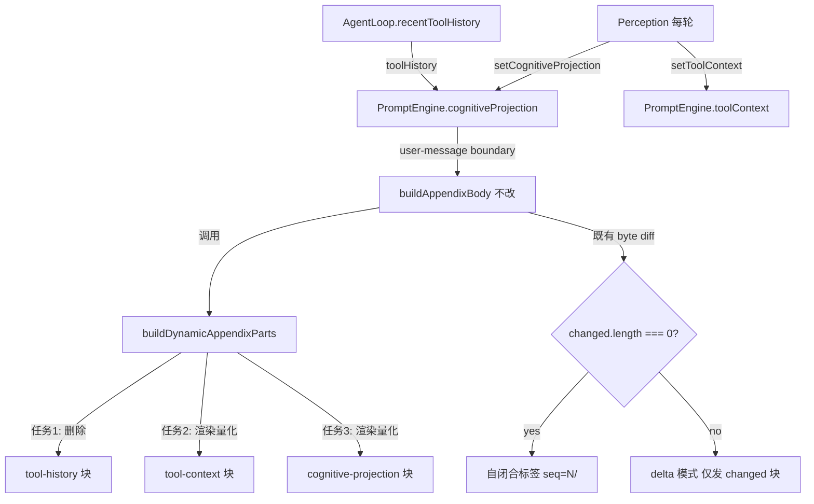

# Appendix Delta 自闭合优化 实现计划（修订版）

> **状态：已执行完成（2026-07-06）** — 提交：`f3ab9785`（任务1）、`52f88dc0`（任务2）、
> `db96e409`（任务3）。回归清单五项逐一核验通过。额外发现并更新了计划未列出的
> `cognitive-mirror.test.ts`（锁定旧浮点格式的断言）。
> **面向 AI 代理：** 使用 `executing-plans` 逐任务实现。
> 步骤使用复选框（`- [ ]`）语法来跟踪进度。
> **修订记录（2026-07-06）：** 原版任务 1 的 `deltaStable` 方案有语义硬伤（baseline 在首边界发送、
> 早于任何工具运行 → 块永不可见，仅压缩后诈尸一次）；原版任务 2②/3② 的引擎侧语义哈希层
> 依赖错误的块名判断（projection 是四段拼接，首标签多为 contract 而非 'projection'），且引入
> 第二套 diff 语义 + 正则解析自渲染 XML 的脆弱层。修订版全部收敛到**渲染层字节稳定化**：
> `buildAppendixBody` 一行不动，让既有 byte-diff 自然工作。

**目标：** 消除 appendix delta 中三类"字节变了但信息没变"的噪音源，使稳态边界的 delta 字节量可测量地下降。

**架构：** 三个独立改动，全部在渲染层（`volatile.ts` + `affordance.ts` + `cognitive-ledger.ts`）。
**`engine.ts` 一行不动**——既避开另一会话未提交的 prefix-divergence 探针改动和已提交的
`a3eee256`（plan-mode 恒定块）的会合冲突，也保持 delta diff 语义单一（纯字节比较）。

**现状数据：** `appendixDelta` 默认开启（`create-agent-config.ts:159`），但以下三项每轮字节漂移使 delta 永不安静。

---

## 数据流



---

## 任务

### 任务 1：删除 tool-history 块（替代原 deltaStable 方案）

- [ ] 修改 `src/prompt/volatile.ts` — 删除 `buildDynamicAppendixParts` 中 tool-history 渲染
- [ ] 修改 `src/prompt/volatile.ts` — `assignSalience` 删除 `<tool-history>` 条目与注释
- [ ] 更新 `src/prompt/__tests__/volatile.test.ts` — tool-history 断言改为"不渲染"
- [ ] 更新 `src/prompt/__tests__/engine-cache-stability.test.ts` — 换 appendix 存在性标记物
- [ ] 运行两个测试文件

**目标：** tool-history 块从 appendix 中移除。信息冗余：消息历史本身有完整的 assistant
tool_calls + tool result 对，最近 8 个工具远在 observation-mask 的 10 用户边界窗口内，
模型随时可见原始信息。

**为什么不用原版的 `deltaStable`（重要，勿回退到原方案）：** baseline（seq=1）在会话
**第一个用户边界**发送，此时尚无任何工具运行，tool-history 块不渲染。`deltaStable` 使它
永不进 `changed` 集 → 模型整个会话看不到该块，直到压缩触发 baseline 重发时闪现一次
陈旧快照后再次冻结。名为"仅 baseline 发送"，实为"移除 + 压缩后随机诈尸"。既然结论
是信息冗余，直接删除才语义诚实。

**调研背书：**
- 渲染点：`volatile.ts:483-495`（`<tool-history recent="N">` + `<tool-summary/>` 列表）
- **保留** 紧随其后的 `read-file-dedup-hint`（`volatile.ts:498-510`）——同样从 `ctx.toolHistory`
  派生但是独立块，去重提示仍有价值，不受本任务影响
- **保留** `toolHistory` 全部管道（`VolatileContext.toolHistory`、`ToolHistoryEntry`、recorder）——
  read-file-dedup-hint 和 historical-lessons 打分（`recentToolTargets`）仍在消费
- salience 条目：`volatile.ts:755`（`<tool-history>` → 0.5）及 `:668` 的注释行
- 仓库内 `<tool-history` 的非测试消费方仅 `volatile.ts` 自身（已 grep 确认）

**测试更新细节（不是简单删断言）：**
- `volatile.test.ts:185-263`（tool-history describe 组）：改为断言提供 `toolHistory` 时
  **不**渲染 `<tool-history`；`:407/419`（stable 排除 / latest 包含的标记断言）同步调整
- `volatile.test.ts:636-637`（salience 测试）：删除该条目
- `engine-cache-stability.test.ts:88-94、793-795`：这些测试拿 `<tool-history` 当
  "appendix 存在于 user trailer"的**标记物**——不能删断言，要换标记物：给测试的
  engine 设置 `taskProgress`（或 `sessionState`）后断言 `<progress>` 出现在 trailer

**验证：**
```bash
npx tsc --noEmit
npm exec -- tsx --test src/prompt/__tests__/volatile.test.ts
npm exec -- tsx --test src/prompt/__tests__/engine-cache-stability.test.ts
```

**提交：**
```bash
git add src/prompt/volatile.ts src/prompt/__tests__/volatile.test.ts src/prompt/__tests__/engine-cache-stability.test.ts
git commit -m "refactor(prompt): drop tool-history appendix block — redundant with message history (任务 1/3)"
```

---

### 任务 2：tool-context 渲染层字节稳定化（只动 affordance.ts）

- [ ] 修改 `src/agent/affordance.ts` — `renderToolContext`：EFE 量化到 1 位小数
- [ ] 修改 `src/agent/affordance.ts` — 排名百分比量化到 10% 桶
- [ ] 新增契约测试：数值微抖动下渲染字节不变
- [ ] 运行 `src/agent/__tests__/affordance.test.ts`

**目标：** 数值微抖动（EFE 第 2 位小数、概率 <5% 波动）不再产生字节变化；工具集或
粗粒度概率带真实变化时照常重发。**不在 engine 侧做任何语义哈希**——渲染稳定后
既有 byte-diff 天然给出正确行为。

**调研背书：**
- `renderToolContext` 在 `affordance.ts:366-392`；EFE 行在 `:382`（`.toFixed(2)`）；
  排名在 `:385-389`（`${i+1}. ${name} (${(p*100).toFixed(0)}%)`，单行 join）
- 调用方：`turn-step-producer.ts:653` → `setToolContext` → engine dynamicCtx → appendix
- `affordance.test.ts` 无 EFE/百分比格式锁定断言（已 grep 确认），改格式不破坏现有测试
- theta/direction 是真实相位转换信号，保留原样——它们变化时重发是正确行为

**实现：**

```typescript
// EFE 行（affordance.ts:382）：
lines.push(
  `EFE: epistemic=${efe.epistemicValue.toFixed(1)} pragmatic=${efe.pragmaticValue.toFixed(1)} precision=${efe.precision.toFixed(1)}`,
)

// 排名：百分比量化到 10% 桶（85% → 90%, 82% → 80%）——
// 排序本身保留（名次是信息），但相邻工具 <5% 的概率差抖动不再引起字节变化
const ranking = top3
  .map((p, i) => `${i + 1}. ${escapeXml(p.toolName)} (~${Math.round(p.probability * 10) * 10}%)`)
  .join('  ')
```

注：量化后仍可能因排序翻转（两工具概率桶相同但名次互换）产生字节变化——低频且
名次翻转本身是信息，接受。若实测仍频繁，跟进项：桶相同时按工具名字典序稳定排序。

**契约测试（新增到 affordance.test.ts）：**
```typescript
it('renderToolContext is byte-stable under sub-bucket numeric jitter', () => {
  // 同 theta/工具集/名次，概率 0.84 vs 0.849、EFE 0.23 vs 0.24 → 渲染字节相同
})
```

**验证：**
```bash
npx tsc --noEmit
npm exec -- tsx --test src/agent/__tests__/affordance.test.ts
npm exec -- tsx --test src/prompt/__tests__/engine-cache-stability.test.ts
```

**提交：**
```bash
git add src/agent/affordance.ts src/agent/__tests__/affordance.test.ts
git commit -m "fix(prompt): quantize tool-context rendering for delta byte stability (任务 2/3)"
```

---

### 任务 3：cognitive mirror 全浮点字段 coarse-grain（只动 cognitive-ledger.ts）

- [ ] 修改 `src/context/cognitive-ledger.ts` — `buildCognitiveMirror` **全部** formatDim 调用改 coarseLabel
- [ ] 新增契约测试：sensorium 微抖动下 mirror 字节不变；跨 low/mid/high 带时变化
- [ ] 运行 `src/context/__tests__/cognitive-ledger.test.ts`
- [ ] 运行 `src/agent/__tests__/cognitive-projection-wiring.test.ts`
- [ ] 运行 `src/prompt/__tests__/engine-cache-stability.test.ts`

**目标：** mirror 的所有连续值维度改用 low/mid/high 三档。字节只在**跨档**时变化——
跨档恰好是模型该感知的状态转换，byte-diff 天然等价于"状态转换才通知"，不需要
原版任务 3② 的语义键 gating。

**为什么砍掉原版 3②（引擎侧 projection 语义 diff）：** projection 块是四段拼接
（contract + verification-gap + mirror + uncertainty，`cognitive-ledger.ts:199-204`），
`appendixBlockName` 取**首个标签名**——有任务契约时是 contract 的标签而非 `projection`，
`startsWith('<cognitive-mirror')` 仅在前两段为空时命中 → 原版 gating 大部分会话时间
静默不生效。且语义键只含 season/coverage/contract-status，会把契约进度、verification-gap
的真实变化也压掉。渲染层全字段量化后此层完全多余。

**调研背书：**
- `buildCognitiveMirror` 在 `cognitive-ledger.ts:105-162`；`coarseLabel` 已存在于 `:170`
- **原版遗漏的漂移字段（必须全覆盖，否则自闭合仍到不了）：**
  - `verification_coverage`：runs>0 且 files>0 时 `formatDim(s.confidence)`（`:118`）
  - `complexity`：hasEvidence 时 `formatDim`（`:130`）
  - `seasonIntensity`：`autumn:0.43` 形态（`:153`）
  - `convergence_precision`（`:158`）、`output_efficiency`（`:159`）
- `cognitive-ledger.test.ts` 无 `stability="0.xx"` 格式锁定断言（已 grep 确认）
- momentum/freshness/pressure 是 routing-only，不进 mirror，不受影响

**实现（`buildCognitiveMirror` 内，逐字段）：**

```typescript
// 特殊字面量保持不变（本就恒定，且语义精确）：
//   verification_coverage="none"（无验证且无改动）、"0.00"（有改动零验证——诚实告警）、
//   "1.00"（有验证且无待验改动）
// 连续值全部三档化：
confLabel = filesModifiedCount === 0 ? '1.00' : coarseLabel(s.confidence)   // :118
const cxLabel = coarseLabel(s.complexity)                                    // :130，删 hasEvidence 分支
parts.push(`stability="${coarseLabel(s.stability)}"`)                        // :134
parts.push(`exploration="${coarseLabel(st.explorationBreadth)}"`)            // :139
parts.push(`caution="${coarseLabel(st.commitThreshold)}"`)                   // :140，>0.7 门槛保留
parts.push(`vigor="${coarseLabel(v.vigor)}"`)                                // :146
parts.push(`curiosity="${coarseLabel(v.curiosity)}"`)                        // :147，>0.3 门槛保留
const seasonVal = intensity !== undefined && intensity < 1.0
  ? `${ledger.season}:${coarseLabel(intensity)}`                             // :153
  : ledger.season
parts.push(`convergence_precision="${coarseLabel(...)}"`)                    // :158
parts.push(`output_efficiency="${coarseLabel(...)}"`)                        // :159
```

`formatDim` 若无剩余调用方则一并删除。

**带边抖动（0.66↔0.68 反复跨 mid/high）：** 不预防。先落地观察 cache-log；若实测
某维度频繁翻带，再加滞回（进带/出带阈值错开 0.05）。避免为未证实的场景加状态。

**契约测试（新增）：**
```typescript
it('mirror is byte-stable under sub-band sensorium jitter', () => {
  // stability 0.40 vs 0.45（同 mid 带）→ 渲染字节相同
})
it('mirror changes bytes only on band transition', () => {
  // stability 0.60 → 0.70（mid → high）→ 字节变化
})
```

**验证：**
```bash
npx tsc --noEmit
npm exec -- tsx --test src/context/__tests__/cognitive-ledger.test.ts
npm exec -- tsx --test src/agent/__tests__/cognitive-projection-wiring.test.ts
npm exec -- tsx --test src/prompt/__tests__/engine-cache-stability.test.ts
```

**提交：**
```bash
git add src/context/cognitive-ledger.ts src/context/__tests__/cognitive-ledger.test.ts
git commit -m "fix(prompt): coarse-grain all cognitive mirror float dims for delta byte stability (任务 3/3)"
```

---

## 自检

1. **规格覆盖**：三个噪音源（tool-history / toolContext / projection）→ 三个任务，一一对应 ✓
2. **占位符扫描**：无 TODO/TBD/待定 ✓
3. **engine.ts 零改动**：delta diff 语义保持单一字节比较；与 `a3eee256`（已提交）和
   prefix-divergence 探针（另一会话未提交）无会合冲突 ✓
4. **调研背书**：每个改动附调用链、行号和"为什么不用原方案"的否决理由 ✓
5. **指标选择自检**：native 维度是稳态边界 delta changed 字节量，自闭合比例为副产品 ✓

## 预期效果（已校准）

- 稳态下（同任务内多轮工具调用）：tool-history 归零（块已删）、tool-context 仅在
  theta/direction/工具集/概率带变化时发、projection 仅在档位跃迁时发
- **自闭合标签不会"成为常态"**——progress、git-status（每 3 边界刷新）、
  historical-lessons（每边界按 recentQuery 重排，独立问题）等块仍在变。本计划的
  正确指标是**稳态边界 delta 字节量下降**，用 cache-log 的 `appendixChars` 变化量对比验证
- 认知影响：模型不再看到每轮微调的浮点数值——低/中/高三档 + 跨档重发，恰好等价于
  "状态转换才通知"的语义

## 回归清单（交付前逐项 grep 核验）

- [ ] `<read-file-dedup-hint>` 仍在 appendix 渲染路径（任务 1 不得误删）
- [ ] `toolHistory` 管道（recorder → VolatileContext → lessons 打分）完整保留
- [ ] `<tool-context>` 块的 theta/direction/排名行仍存在（只改数值格式）
- [ ] `<cognitive-mirror>` 的 verification_coverage 三个特殊字面量（none/0.00/1.00）语义不变
- [ ] `buildAppendixBody`（engine.ts:1047-1069）与 git HEAD 逐字节一致
