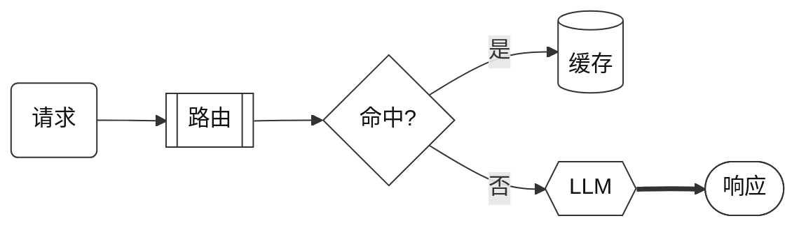
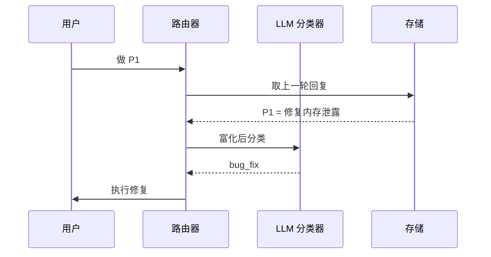
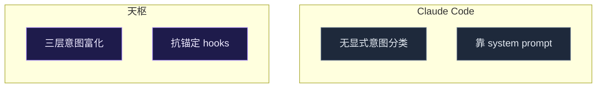

# Mermaid 模板库 — 兼容性实测样图

> 用途：在 **VSCode（Markdown Preview）/ GitHub / Obsidian** 三处分别打开本文件，对照下方「实测记录」勾选每张图的渲染结果。
> 目的：确认语义词汇（形状）与 classDef 调色板的**可移植基线**——哪些三处都渲染、哪些某处退化。**这一步定模板库第 2 层能做多少。**
> 题材：天枢意图路由流（真实子系统，兼作可用样例）。

---

## 图 1 · 全语义词汇 + dark 调色板（架构图）

测试点：7 种语义形状 + 4 种边类型 + classDef 着色 + `%%{init}%%` 主题 + subgraph 分层。

---

## 图 2 · 极简黑白调色板（mono，无主题依赖）

测试点：不依赖 `%%{init}%%`，纯 classDef 扁平描边——验证**最保守基线**是否三处都稳。

---

## 图 3 · 时序图（sequenceDiagram，不同图型语法）

测试点：flowchart 之外的图型在三处是否都支持。

---

## 图 4 · 对比图（并列 subgraph）

测试点：subgraph 并列布局 + 跨组无连线时的排版。

---

## 实测记录（请在三处查看后填写）

| 测试点                          | VSCode Preview | GitHub | Obsidian |
| ---------------------------- | :------------: | :----: | :------: |
| 图1 七种形状正确                    |      推定        |  推定    |    ✅     |
| 图1 classDef 着色生效             |      推定        |  ✅†    |    ✅     |
| 图1 `%%{init}%%` 主题/字体生效      |      推定        |  ⚠️‡   |    ✅     |
| 图1 四种边（实/粗/虚/标签）区分           |      推定        |  推定    |    ✅     |
| 图1 subgraph 分层正确             |      推定        |  ✅     |    ✅     |
| 图2 mono 纯 classDef（无 init）生效 |      推定        |  ✅     |    推定    |
| 图3 sequenceDiagram 渲染        |      推定        |  ✅     |    推定    |
| 图4 并列 subgraph 布局正确          |      推定        |  推定    |    推定    |

> 记号：✅=实测看到（截图证据）/ 推定=同引擎或低风险推断、未单独验证 / ⚠️=渲染但样式退化 / ❌=破图。
> † GitHub 图1 classDef 未单独看，但图2(纯 classDef)在 GitHub 实测✅，classDef 是引擎级机制，故推 GitHub 支持 classDef。
> ‡ GitHub 出于安全会剥离 `%%{init}%%` 指令——这是已知风险，故图1 的 init 主题在 GitHub 推定退化。图2 正是为此设计的"无 init"基线，已实测通过。

> 填写规则：✅ 完美 / ⚠️ 渲染但样式退化（注明：如"classDef 忽略"）/ ❌ 破图或不渲染。
>
> **校准结论**：三处都 ✅ 的进模板库基线；某处 ⚠️ 的标注"该查看器降级"；任何 ❌ 的从词汇里剔除或换写法。
> 这张表的结果直接决定 `2026-06-07-mermaid-diagram-template-library.md` 第 2 层（调色板）和第 1 层（形状）能承诺多少。
>
> **实测后的校准（2026-06-07）**：
> - **第 1 层 形状/边/subgraph**：进基线 ✅。Obsidian 全部实测通过，GitHub 经图2/图3 实测 + 同引擎推定，VSCode（更新引擎）低风险推定。
> - **第 2 层 调色板**：**以「纯 classDef、不依赖 `%%{init}%%`」形式进基线** ✅。关键证据=GitHub 图2(无 init 纯 classDef)实测通过；GitHub 是历史风险点，已证伪。
> - **`%%{init}%%` 主题/字体**：降级为**可选增强**，非基线。原因=GitHub 剥离 init 指令（图1 在 GitHub 推定退化）。Obsidian/VSCode 可享，GitHub 用户回退到 classDef 默认主题，语义不丢。
> - 待补：VSCode 三格、GitHub 图1/图4 仍是推定，有空可补一眼转实测，但不阻塞——真风险(GitHub classDef)已定。
