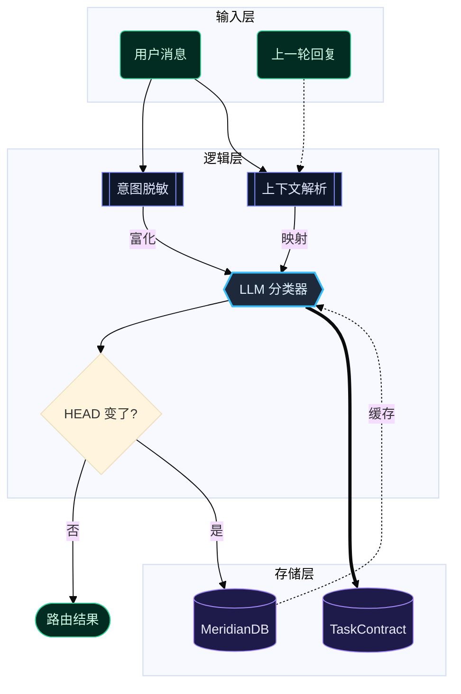
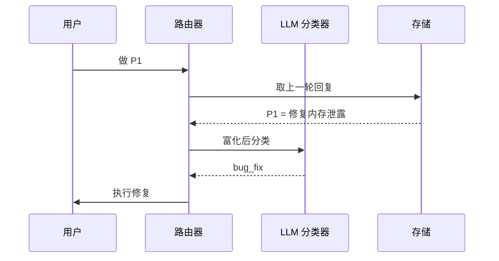
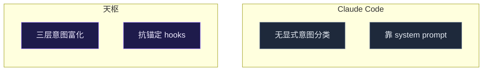

# Mermaid 模板库 — 兼容性实测样图

> 用途：在 **VSCode（Markdown Preview）/ GitHub / Obsidian** 三处分别打开本文件，对照下方「实测记录」勾选每张图的渲染结果。
> 目的：确认语义词汇（形状）与 classDef 调色板的**可移植基线**——哪些三处都渲染、哪些某处退化。**这一步定模板库第 2 层能做多少。**
> 题材：天枢意图路由流（真实子系统，兼作可用样例）。

---

## 图 1 · 全语义词汇 + dark 调色板（架构图）

测试点：7 种语义形状 + 4 种边类型 + classDef 着色 + `%%{init}%%` 主题 + subgraph 分层。

---

## 图 2 · 极简黑白调色板（mono，无主题依赖）

测试点：不依赖 `%%{init}%%`，纯 classDef 扁平描边——验证**最保守基线**是否三处都稳。

---

## 图 3 · 时序图（sequenceDiagram，不同图型语法）

测试点：flowchart 之外的图型在三处是否都支持。

---

## 图 4 · 对比图（并列 subgraph）

测试点：subgraph 并列布局 + 跨组无连线时的排版。

---

## 实测记录（请在三处查看后填写）

| 测试点 | VSCode Preview | GitHub | Obsidian |
|--------|:---:|:---:|:---:|
| 图1 七种形状正确 | ☐ | ☐ | ☐ |
| 图1 classDef 着色生效 | ☐ | ☐ | ☐ |
| 图1 `%%{init}%%` 主题/字体生效 | ☐ | ☐ | ☐ |
| 图1 四种边（实/粗/虚/标签）区分 | ☐ | ☐ | ☐ |
| 图1 subgraph 分层正确 | ☐ | ☐ | ☐ |
| 图2 mono 纯 classDef（无 init）生效 | ☐ | ☐ | ☐ |
| 图3 sequenceDiagram 渲染 | ☐ | ☐ | ☐ |
| 图4 并列 subgraph 布局正确 | ☐ | ☐ | ☐ |

> 填写规则：✅ 完美 / ⚠️ 渲染但样式退化（注明：如"classDef 忽略"）/ ❌ 破图或不渲染。
>
> **校准结论**：三处都 ✅ 的进模板库基线；某处 ⚠️ 的标注"该查看器降级"；任何 ❌ 的从词汇里剔除或换写法。
> 这张表的结果直接决定 `2026-06-07-mermaid-diagram-template-library.md` 第 2 层（调色板）和第 1 层（形状）能承诺多少。
