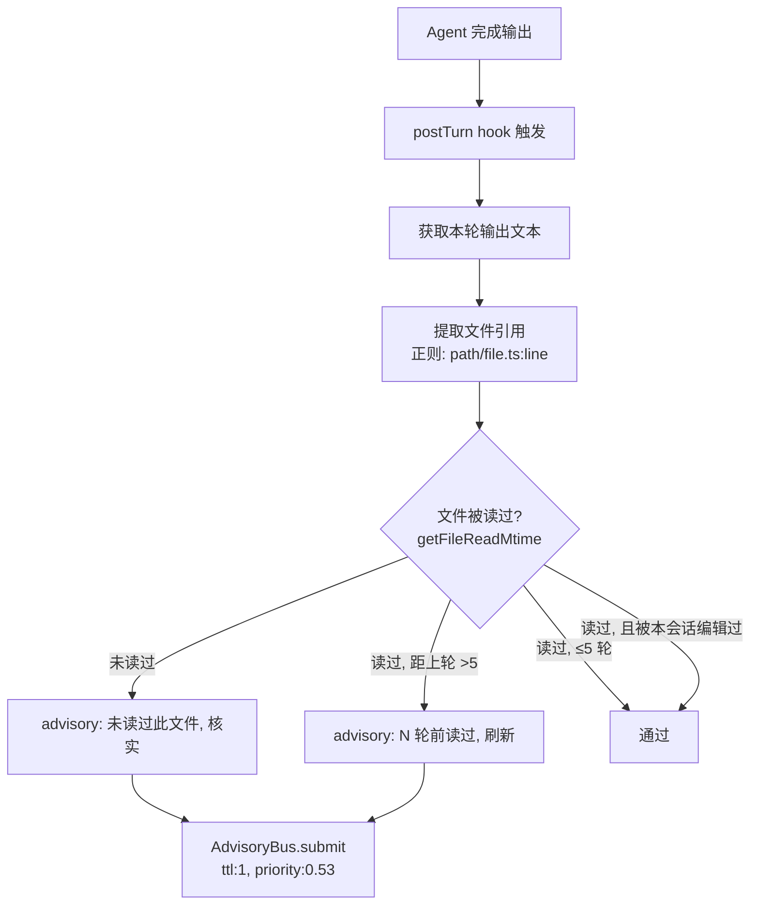

# 代码断言记忆衰减自检 — 调研与设计方案

> **文档类型：** 调研（非执行计划）。探索问题空间、对比方案、交付设计选项供人工决策。
> **产出日期：** 2026-07-04
> **触发事件：** 天枢审查星域提醒智能化三阶段计划时，输出中对 `vigorRecoveryEntry`（声称 constitutional，实际 encouragement）和 reasoning spiral 触发条件（声称 momentum 低，实际是 thinking length）两条断言发生事实错误。根因不是 grep 看错——是没有 grep。

---

## 1. 问题空间

### 1.1 失效模式分类

对本次会话的诊断表明，agent 在输出"关于代码库状态的断言"时，存在三类可区分的认知漏洞：

| 类别 | 描述 | 本次实例 | 可自动检测？ |
|------|------|---------|------------|
| **A · 读后遗忘** | agent 在会话早期读过某文件，多轮后在输出中引用该文件的字段/值，但记忆已衰减或与其他文件混淆。工具确已读过，但"上次读"距"现在断言"跨度过大。 | `vigorRecoveryEntry` 的 `category` 记成 `constitutional`。advisory-bus.ts 在 turn 8 读过，断言发生在 turn 20+ | 部分可检测（文件级读时间 vs 断言时间） |
| **B · 未经读的推断** | agent 输出对某文件/函数的断言，但该文件在**本会话中从未被 read/grep**。agent 完全依赖训练记忆做推断。 | 未发生（本次所有断言都有过工具读） | **可检测**——lastKnownFileState oracle |
| **C · 概念混淆** | agent 读对了文件也记住了字段值，但在推理中将两个不同概念等同或粘合。文本层面没有错误，但语义层面错误。 | `noToolTurnCount`（连续无工具轮数）与 `momentum`（编辑产出惯性）被等同 | 不可自动检测——需要语义理解 |

### 1.2 现有静态约束的覆盖缺口

系统提示词已有两条相关规则：

- **`evidence-scope` 规则**：「默认：涉及代码库状态的断言——无论产出是代码还是文档——先读相关代码、调用方和测试核实。不确定时 grep 或问，不猜。」
- **`external-source-verification` 规则**：「worker 返回的 findings 是待核验假设……引用 worker 发现到具体文件前，必须用 read_file / grep 独立核验」

这两条覆盖了类别 B（从未读过的文件）和外部来源的信任问题。**不覆盖类别 A**——"读过但很久以前"。当 agent 在 turn 8 读了 `advisory-bus.ts`、turn 22 对其内容做断言时，`evidence-scope` 规则在逻辑上仍然满足（"我读过"），但物理上记忆已不可靠。

### 1.3 为什么类别 A 无法被 prompt 独自防御

`evidence-scope` 规则的语义是二元的：读过 / 没读过。agent 的自我感知也是二元的——"我读过这个文件"。没有时间维度。agent 不会自发地检查"上次读这个文件是 14 轮之前，那之后我处理了 5 个不同的任务，我的记忆可能已经模糊了"。

这需要一个**运行时信号**——一个把"读的 recency"从不可见变成可见的机制。

---

## 2. 现有相关基础设施审计

### 2.1 `lastKnownFileState` oracle

`b984b532`（2026-07-04）修复了 `read-file.ts` 的双表缓存：`readRecords`（`sessionId → { mtime, size, readAt }`，本会话读过）和 `grepHits`（grep 命中的文件）。提供 `getFileReadMtime(path, sessionId)` 接口返回最近一次读/命中的时间戳（mtime）。

**接口可用性**：`getFileReadMtime` 接受 `sessionId` 参数，返回 `number | undefined`（Unix mtime）。可以直接计算"距上次读过去了多少轮"。

**局限性**：只记录 read_file 和 grep。lsp_goto_definition / lsp_find_references 不被记录（这些是 LSP 调用，不走 read-file.ts）。这意味着如果 agent 通过 LSP 导航到一个函数，oracle 不知道。

### 2.2 `self-verify-hook`

postTurn hook。检测模式：最近几步全是 read/write 操作，没有任何 ground-truth 验证（run_tests / bash test / typecheck / build）。触发后注入 advisory："请先确认结论有 ground truth 支撑"。

**设计模式**：scan `recentToolHistory`（滑动窗口 ~5 条）→ 判断模式 → advisory。**与我们需求的差异**：它检测的是"验证行为缺失"，不是"断言 fresness 缺失"。一个 agent 可以在自我验证后仍然做出基于过时记忆的断言。

### 2.3 `external-claim-tracking-hook`

postTool hook。检测 delegate 报告中的 file:line 路径 → 跟踪后续写操作 → 若中间无独立 read/grep → advisory。

**设计模式**：提取外部来源中的路径 → 跟踪 agent 对这些路径的操作 → 检查是否有独立核验。**与我们需求的相似性最高**——区别只在于"外部来源" vs "agent 自己的输出"。

### 2.4 `dedup-guard-hook`

postTurn hook。检测 agent 输出中的文本重复（trigram 重叠 > 60%）。**设计模式**：扫描 agent 的输出文本 → 模式匹配 → advisory。这是唯一的"分析 agent 输出内容"的 hook。

### 2.5 `RuntimeHookSnapshot` 当前字段

```
turn, cwd, recentToolHistory, sensorium, strategy, vigor, gitChangeRate, season,
thetaTelemetry, touchedTsFiles, sawTypecheckThisTask, lastThinkingLength, lastTurnHadTools
```

**缺少的字段**：并无"agent 本轮输出文本"。dedup-guard 通过注入 `getStreamedText()` 依赖而不是走 snapshot。这意味着任何"分析 agent 输出"的 hook 都需要类似的自定义依赖注入。

---

## 3. 设计选项

### 3.1 选项 P：Prompt 校准 — 审查特化纪律

**方案**：在 `delivery-contract` 或 `calibration` 块中追加一条规则：

> 当你的输出中包含关于代码库状态的断言（如"X 的 Y 字段是 Z"、"某函数的触发条件是…"）时，若你最近一次 read_file/grep 该文件距今超过 3 轮，先回读确认再下结论。记忆是模糊的——只有最近一次工具输出是物理事实。

**优势**：零代码、零复杂度、立即可用。针对的就是本次的失效模式。

**劣势**：纯靠 prompt 维持，无运行时强制执行。与 `evidence-scope` 的同款局限——agent 可能"觉得"自己读过（实际是 14 轮前）。

**成本**：约 3 行 prompt 文本。

**适用场景**：类别 A 的轻量防御。作为其他方案的前置补丁。

### 3.2 选项 H：postTurn 输出断言扫描 Hook

**方案**：创建一个 postTurn hook，在 agent 完成输出后扫描其回复文本，提取所有文件引用（`src/.*\.ts` 或 `file:line` 格式），对每个引用调用 `getFileReadMtime`。如果某文件的上次读时间距今超过阈值（默认 5 轮），注入 advisory。

**与现有基础设施的集成**：
- 文件引用提取：复用 `external-claim-tracking-hook.ts` 的 `FILE_LINE_RE` 正则（调整为不限于 `src|test|tests|scripts|docs|config` 前缀，覆盖更广泛的路径格式）
- 读 recency 检查：复用 `lastKnownFileState` oracle 的 `getFileReadMtime`
- 通道：AdvisoryBus.submit，ttl: 1，category: discipline，priority 0.53

**触发条件矩阵**：

| 条件 | 动作 |
|------|------|
| 文件从未被读过 | advisory："你引用了 X 但本会话未读过此文件。若信息来自训练记忆，用 read_file 核实。" |
| 文件被读过，距今 > 5 轮 | advisory："你在引用 X，但你上次读它是 N 轮前。若信息对当前任务关键，用 grep/read_file 刷新。" |
| 文件被读过，距今 ≤ 5 轮 | 无动作 |
| 文件在上次读后被本会话编辑过 | 无动作（agent 自己的编辑通常记忆 fresh） |

**误报控制**：
- 排除 agent 自己写的文件（`wasFileEditedBySession`）
- 排除测试文件（`*.test.ts`）
- 排除当前轮刚读过的文件
- cooldown：同一文件每 3 轮最多提醒一次

**优势**：运行时执行，不依赖 agent 的自我感知。精准匹配类别 A。

**劣势**：
- 无法检测类别 C（概念混淆）—— agent 读了正确的文件但仍做了错误的语义关联
- 需要注入 `getFileReadMtime` 依赖（类似 dedup-guard 的 `getStreamedText`）
- `getFileReadMtime` 需要 `sessionId` 参数——当前 hook 的 RuntimeHookSnapshot 没有 sessionId。需要扩展 snapshot 或通过 deps 注入
- LSP 导航不被追踪——agent 可能通过 lsp_goto_definition 理解了代码但 oracle 不知道

**实现量估算**：~120 行 hook + ~150 行测试 + snapshot 扩展 5 行 + loop-factory 注入 5 行。复杂度与 external-claim-tracking-hook 相当。

### 3.3 选项 E：`evidence-scope` 运行时增强（扩展 self-verify）

**方案**：扩展现有 `self-verify-hook`，不仅在"无验证行为"时提醒，也在"断言基于过时读"时提醒。将 hook 从"检查验证行为缺失"升级为"检查证据新鲜度不足"。

**与选项 H 的区别**：不扫描 agent 输出文本。而是检测 `recentToolHistory` 中读类操作的时间戳（如果 ToolHistoryEntry 包含 timestamp）。判断：如果最近几步的操作都基于 >N 轮前的读结果，触发 advisory。

**优势**：不依赖输出文本解析。实现简单——只需要 ToolHistoryEntry 包含读的时间戳。

**劣势**：
- 需要扩展 ToolHistoryEntry（当前无 timestamp 字段）→ 影响面大（volatile.ts 的接口变更）
- 精度低于选项 H——它只知道"有旧读"，不知道 agent 正在引用哪个旧读

### 3.4 选项 R：Reviewer 角色独立验证（外部方案）

**方案**：不修改天枢自身的检测能力。而是建立一个独立的"reviewer"子代理（或外部审查流程），在 agent 输出审查意见后，对其中每条关于代码的断言独立核验。

**优势**：完全解耦。reviewer 可以专门做"验证 agent 的声称"这件事。

**劣势**：
- 成本高——每轮审查都要额外调一次模型
- 延迟——异步验证可能赶不上下一轮
- 这是组织流程方案，不是天枢自我保护方案

---

## 4. 推荐路径

```
P（prompt 校准）→ H（输出断言扫描 Hook）→ 观察效果 → 决定是否需要 E（self-verify 增强）
```

**理由**：

1. **P 立即生效**，成本为零。为后续的 H 提供 prompt 层面的"地面引导"——当 hook 提醒 agent 回读时，prompt 中的纪律让 agent 知道"为什么要回读"。

2. **H 填补类别 A 的运行时缺口**。这是唯一能精准对应本次失败模式的方案。与 external-claim-tracking-hook 共享 `lastKnownFileState` oracle（已在 `b984b532` 修复），基建已就绪。

3. **类别 C 暂不处理**。概念混淆需要语义理解，hook 做不到。应该依赖外部审查（如本次的用户纠正）来捕捉。

4. **E 暂缓**。需要 ToolHistoryEntry 扩展，影响面大（volatile.ts 是 prompt engine 的核心接口），ROI 低于 H。

### 4.1 选项 H 需要解决的三个设计问题

**问题 1：`sessionId` 注入**

`getFileReadMtime(path, sessionId)` 需要 sessionId。当前 RuntimeHookSnapshot 没有 sessionId。解决方案：
- 通过 hook deps 注入 sessionId（类似 dedup-guard 注入 `getStreamedText`）
- 或在 RuntimeHookSnapshot 中增加 `sessionId` 字段（更干净，但需要更多文件修改）
- 推荐：deps 注入。影响面最小。

**问题 2：agent 输出文本获取**

选项 H 需要扫描 agent 的输出文本。dedup-guard-hook 通过 `deps.getStreamedText()` 获取。同理，本 hook 可以通过 `deps.getStreamedText()` 获取本轮输出，也可以考虑 `ctx.snapshot` 中的 `streamedText`（如果存在）。

**问题 3：文件引用提取的精确度**

`FILE_LINE_RE` 在 external-claim-hook 中限制为特定前缀（`src|test|tests|scripts|docs|config`）。对于 agent 输出，覆盖范围需要更宽——agent 可能在分析中提到 `node_modules/`、`dist/` 等路径。但扩大匹配范围会增加误报（匹配到输出中非文件引用的文本）。建议先使用较宽的正则，用白名单排除：

```
匹配：任意 `/path/file.ext` 格式，扩展名在 {ts, tsx, js, jsx, json, md, yaml, yml, py, rs, go}
排除：node_modules/, dist/, .git/, 测试文件的 assert 行（来自输出中的代码示例）
```

---

## 5. 数据流



---

## 6. 与已有 Hook 体系的关系

| hook | phase | 检测对象 | 信号 |
|------|-------|---------|------|
| self-verify | postTurn | recentToolHistory | 无 verify 行为 |
| external-claim | postTool | delegate 结果 | 无独立核验 |
| **claim-staleness（新）** | **postTurn** | **agent 输出文本** | **基于过时读的断言** |
| dedup-guard | postTurn | agent 输出文本 | 重复输出 |

四个 hook 形成一条完整的"证据纪律链"——从外部来源核验到自我断言刷新。

---

## 7. 不做的事

- **不实现自动证据刷新**：当 hook 检测到 stale 引用时，不自动触发 read_file（可能产生意外的工具调用）
- **不检测类别 C**：概念混淆需要语义理解，超出 hook 能力
- **不拦截 agent 输出**：advisory 是事后提醒，不阻止输出本身——因为无法在 postTurn 阶段修改已发送的回复
- **不要求每个断言都有引用**：agent 输出中许多关于架构/意图的断言不是"文件级"的，不应该强制要求引用

---

## 8. 交付建议

如果要落地，建议分两步：

**Step 1 — 立即**：选项 P。在 `static.ts` 的 `<calibration>` 或 `<delivery-contract>` 块追加审查纪律。3 行文本，零风险。作为本次会话的即时防御措施。

**Step 2 — 后续**：选项 H 的完整实现。等 Step 1 运行一段、观察 agent 是否在 prompt 层面感受到"回读压力"后，决定 H 的优先级和具体参数（阈值、覆盖模式）。

如果 Step 1 的 prompt 校准已经足够降低错误率，H 可以降为"nice to have"而非"must have"——因为 H 的实现成本（~250 行）不值得花在一个 prompt 已经解决的场景上。
