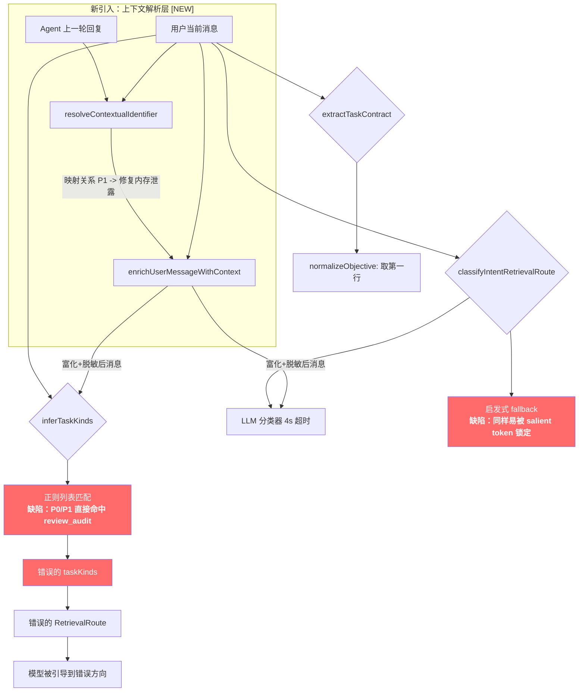

# 天枢意图识别抗锚定与上下文关联改造计划

## 问题描述

天枢在接收用户消息时，意图识别容易被两类信号误导或“劫持”：
1. **文档编号类 token 劫持**：消息中包含的 `P1`、`P2`、`T1`、`T2` 等编号，由于正则或 transformer attention 的高权重，导致：
   - 启发式正则匹配（`inferTaskKinds`）被误触发（如 `P0` 误分类为 `review_audit`）。
   - LLM 意图路由器在 4s 超时内被 salient token 锁定注意力。
   - 用户真实意图（如“帮我看看 P2 任务里那个 API 的用法”）被误读为“审查 P2 风险”。
2. **会话上下文断裂（新问题）**：当用户在会话中说“做 P1”、“执行 P2”时，这些编号其实是**基于 Agent 上一轮回复（如输出的任务计划/选项列表）**给出的反馈。如果意图识别没有引入上一轮的回复内容，就会丢失这个语义映射，从而：
   - 仅凭 `P1` 这类无实际语义的 token，意图被归类为错误的类型（如 `review_audit` 或 `new_feature`）。
   - 主模型忽略了上一轮自己发送的关联任务，在执行时跑到整个工作区去搜索带有 `P1` 的旧文档，被无关文件锁定。

### 根因分析



### 竞品对比

| 产品 | 意图识别策略 | 抗锚定机制 | 上下文关联机制 |
|------|-------------|-----------|--------------|
| **Claude Code** | 无显式意图分类；靠强 system prompt + thinking 推理 | 依赖模型自身能力 + "用户意图 > 用户指令" 原则 | 依靠完整的 Chat History 自动对齐上下文代词 |
| **OpenCode** | 无前置意图分类；直接将用户消息交给模型 | 依赖模型推理能力 | 依靠完整 Chat History |
| **天枢（目标）** | 三层：意图富化脱敏预处理 → LLM router + 上下文解析 → anti-anchoring hooks | 编号脱敏与高频动词去噪，全链路抗锚定，默认开启 | 动态解析上一轮回复中的选项/任务列表（如 P1/P2），生成意图富化提示，在分类与执行阶段双重提醒 |

---

## User Review Required

> [!IMPORTANT]
> **AntiAnchoring 默认开启**：改造后 `anti-anchoring-config.ts` 中 `enabled` 将改为 `true`。这会增加首 turn 约 0.5-2s 的延迟（LLM seed 调用），但显著提升意图准确性。如果延迟不可接受，可以只开启 `blindExploration` 而关闭 `mctsPlanning`。

> [!IMPORTANT]
> **会话上下文意图关联机制**：引入 `lastAssistantMessage` 解析机制。当用户回复包含 `P1`、`T2` 等编号且上一轮消息中存在对应的列表项时，我们会把它的实际含义（如 `P1: 修复 loop.ts 中的内存泄露`）提取出来加入意图分析，避免分类器及执行阶段发生偏移。

> [!WARNING]
> **LLM 路由器 prompt 重写**：`buildIntentRouterPrompt` 将被重写，包含显式的「编号脱敏」指令和「上下文关联任务」解析块。这会改变所有用户消息的首次分类行为。

---

## Open Questions

> [!IMPORTANT]
> 1. **解析规则是否足够通用？** 当前设计的正则主要匹配 Markdown 格式列表，如 `- P1:`、`1. P2:`、`**P1**:` 等。如果 Agent 回复的格式偏离这些（例如纯文本叙述），可能无法准确解析具体指向，此时会 fallback 到普通的编号脱敏处理。
> 2. **是否需要长期的计划缓存？** 仅对比上一轮 Assistant 消息（`lastAssistantMessage`）可能无法覆盖多轮对话之前的计划。若用户在几轮对话后突然说“做 P1”，目前设计将无法回溯到更早的回复。是否需要将生成的 Task List 缓存到 TaskContract 或 SessionStateManager 中进行多轮跟踪？

---

## Proposed Changes

### 1. 意图提取与上下文关联层 — 解析、丰富与脱敏

#### [NEW] [intent-sanitizer.ts](file:///Users/banxia/app/deepseek-tui/opencode-tui/src/agent/intent-sanitizer.ts)

新模块，负责处理编号脱敏、上下文关联任务解析以及语义动词提取：

```typescript
export interface SanitizeResult {
  sanitized: string        // 脱敏或丰富后的文本（编号替换为占位符/带上下文信息的文本）
  strippedTokens: string[] // 被剥离的原始编号 token
  semanticVerb: string | null  // 提取的核心动词
}

export interface ContextualTask {
  identifier: string       // 如 P1, T2
  resolvedContent: string  // 上一轮回复中的具体任务内容，如 "修复 loop.ts 中的内存泄露"
}

/**
 * 从上一轮 Assistant 回复中寻找用户当前提到的编号的定义。
 * 支持以下 Markdown 列表或标题模式的提取：
 * - P1: <任务> 
 * - **P1**: <任务>
 * - 1. P1: <任务>
 * - ### P1. <任务>
 */
export function resolveContextualIdentifier(
  userMessage: string,
  lastAssistantMessage?: string
): ContextualTask[]

/**
 * 将解析出的上下文任务具体含义富化到用户原始消息中，为分类器提供强语义信号。
 * 例如："执行 P1" -> "执行 P1 (上下文关联任务: 修复 loop.ts 中的内存泄露)"
 */
export function enrichUserMessageWithContext(
  userMessage: string,
  resolvedContexts: ContextualTask[]
): string

/**
 * 文档编号脱敏 — 将 P0/P1/T1/TASK-123 等 token 替换为通用占位符，
 * 避免它们被 transformer attention 锁定导致意图偏移。
 */
export function sanitizeForIntentClassification(text: string): SanitizeResult

/**
 * 提取用户消息中的核心动词。
 */
export function extractSemanticVerb(text: string): string | null

/**
 * 当正则匹配产生多个候选时，用动词语义来决定主要 taskKind。
 */
export function disambiguateByVerb(
  candidates: IntentTaskKind[],
  verb: string
): IntentTaskKind[]
```

**编号脱敏的正则模式**：
```typescript
const DOC_ID_PATTERNS = [
  /\b[PpTtSs]\d{1,3}\b/g,           // P0, P1, T1, S2 等
  /\b(?:TASK|Task|task)-?\d+\b/g,    // TASK-123, task1
  /\b(?:ISSUE|Issue|issue)-?\d+\b/g, // ISSUE-456
  /\b(?:BUG|Bug|bug)-?\d+\b/g,      // BUG-789
  /\b(?:REQ|Req|req)-?\d+\b/g,      // REQ-101
  /\b#\d{1,6}\b/g,                    // #123 (issue 引用)
  /\b[A-Z]{2,5}-\d{1,5}\b/g,        // JIRA-style: PROJ-123
]
```

---

#### [MODIFY] [intent-retrieval-route.ts](file:///Users/banxia/app/deepseek-tui/opencode-tui/src/agent/intent-retrieval-route.ts)

**核心改动：`inferTaskKinds` 支持 `lastAssistantMessage` 并进行关联和脱敏**

```diff
  export interface RetrievalRouteInput {
    userMessage: string
+   lastAssistantMessage?: string
    taskContract?: TaskContract
  }
```

```diff
- function inferTaskKinds(userMessage: string): IntentTaskKind[] {
+ function inferTaskKinds(userMessage: string, lastAssistantMessage?: string): IntentTaskKind[] {
+   // Step 1: 上下文关联解析
+   const resolvedContexts = resolveContextualIdentifier(userMessage, lastAssistantMessage)
+   // Step 2: 意图语义富化
+   const enriched = enrichUserMessageWithContext(userMessage, resolvedContexts)
+   // Step 3: 编号脱敏与核心动词提取
+   const { sanitized } = sanitizeForIntentClassification(enriched)
+   const verb = extractSemanticVerb(sanitized)
-   const text = userMessage.toLowerCase()
+   const text = sanitized.toLowerCase()
    const kinds: IntentTaskKind[] = []
    
    // ... 原有的正则匹配改为匹配 text (已脱敏与富化的内容) ...
    
+   // Step 4: 动词消歧 — 当多种匹配时，动词语义优先
+   if (kinds.length > 1 && verb) {
+     return disambiguateByVerb(kinds, verb)
+   }
    return kinds
  }
```

---

#### [MODIFY] [intent-extractor.ts](file:///Users/banxia/app/deepseek-tui/opencode-tui/src/agent/intent-extractor.ts)

- 在 `extractIntents` 提取文件前先过滤文档编号模式，避免把 `P1/task-1` 等误当成文件路径。

---

### 2. LLM 意图路由器 — 注入关联任务与脱敏 Prompt

#### [MODIFY] [intent-retrieval-router.ts](file:///Users/banxia/app/deepseek-tui/opencode-tui/src/agent/intent-retrieval-router.ts)

**改造 `buildIntentRouterPrompt`**：
1. 传入 `lastAssistantMessage`。
2. 解析上下文关联任务，若有则注入到 Prompt 顶层。
3. 提取脱敏后的 userMessageSnippet。

```diff
- export function buildIntentRouterPrompt(input: { userMessage: string, taskContract?: TaskContract }): string {
+ export function buildIntentRouterPrompt(input: {
+   userMessage: string,
+   lastAssistantMessage?: string,
+   taskContract?: TaskContract
+ }): string {
+   // 解析上下文并富化、脱敏
+   const resolvedContexts = resolveContextualIdentifier(input.userMessage, input.lastAssistantMessage)
+   const enriched = enrichUserMessageWithContext(input.userMessage, resolvedContexts)
+   const { sanitized, strippedTokens } = sanitizeForIntentClassification(enriched)
+
    const objective = input.taskContract?.objective || input.userMessage.split('\n')[0]?.slice(0, 240) || ''
-   const snippet = input.userMessage.replace(/\s+/g, ' ').slice(0, 500)
+   const snippet = sanitized.replace(/\s+/g, ' ').slice(0, 500)
+
+   const contextLines: string[] = []
+   if (resolvedContexts.length > 0) {
+     contextLines.push('## 上下文关联任务 (Contextual Resolved Tasks)')
+     for (const ctx of resolvedContexts) {
+       contextLines.push(`- 用户说的 ${ctx.identifier} 实际对应上一轮回复中的任务: "${ctx.resolvedContent}"`)
+     }
+   }

    return [
      '你是天枢的轻量意图检索路由器。不要回答用户任务，不要调用工具，不要输出解释。',
+     '',
+     '## 关键规则',
+     '1. 文档编号（P0/P1/T1/TASK-xxx/ISSUE-xxx/#123）是引用标签，本身不是任务分类信号。必须关注其指代的上下文任务。',
+     '2. 用户消息中的核心动词与关联上下文任务决定类型："做 P1 (上下文关联任务: 修复内存泄露)" → 真实任务是"修复"→ bug_fix，而非 review_audit。',
+     '',
      '目标：先归类任务真实类型，再列出该类型应该先查的信息源。用户关键词是线索不是边界。',
+     ...contextLines,
      `userMessageSnippet: ${snippet}`,
    ].join('\n')
  }
```

```diff
  export interface ClassifyIntentRetrievalRouteInput extends RetrievalRouteInput {
    config?: IntentRetrievalRouterConfigInput
    client: StreamClient
    model: string
    signal?: AbortSignal
    onTelemetry?: (telemetry: IntentRetrievalRouteTelemetry) => void
  }
```

---

### 3. Agent 运行循环 — 提取上一轮 Assistant 消息

#### [MODIFY] [loop.ts](file:///Users/banxia/app/deepseek-tui/opencode-tui/src/agent/loop.ts)

在 `buildIntentRetrievalRouteForTurn` 中获取上一轮回复内容：

```diff
+ function getLastAssistantMessageContent(messages: import('../api/oai-types.js').OaiMessage[]): string | null {
+   for (let i = messages.length - 1; i >= 0; i--) {
+     const msg = messages[i]
+     if (msg.role === 'assistant' && typeof msg.content === 'string') {
+       return msg.content
+     }
+   }
+   return null
+ }
```

```diff
   private async buildIntentRetrievalRouteForTurn(userInput: string, actionable: boolean): Promise<void> {
     if (!actionable || !this.taskContract) {
       this.config.promptEngine.setIntentRetrievalRoute(null)
       return
     }
 
     try {
+      const messages = this.session.getMessages()
+      const lastAssistant = getLastAssistantMessageContent(messages) || undefined
       const route = await classifyIntentRetrievalRoute({
         userMessage: userInput,
+        lastAssistantMessage: lastAssistant,
         taskContract: this.taskContract,
         config: this.config.intentRetrievalRouter,
         client: this.config.client,
         model: this.config.promptEngine.getModel(),
         signal: this.abortController?.signal,
         // ...
```

---

### 4. System Prompt — 注入关联规则提示

#### [MODIFY] [static.ts](file:///Users/banxia/app/deepseek-tui/opencode-tui/src/prompt/static.ts)

在 `<rules>` 节点下增加关于“上下文任务关联”的硬约束，提醒执行阶段的 Agent 主模型：

```diff
  <rules>
    <rule name="verify-first">
    ...
    </rule>
+
+   <rule name="context-intent-association">
+   当用户反馈或指令中包含 P1、P2、T1、T2 等编号，或者“刚才说的那个”、“你列的第一个”时，这通常是指代你在上一轮回复中提出的任务计划、选项或问题：
+   1. 你必须首先检索和回顾你上一轮回复的具体内容，找出该编号或代词所映射的具体任务或意图（例如 P1 指代“修复 loop.ts 中的内存泄露”）。
+   2. 将你的注意力和后续操作锁定在被指代的具体任务语义上，而不是在整个项目中随意搜索含有该编号的其他不相关文档（如项目历史中的旧 P1 文档）。
+   3. 编号只是一个上下文临时引用，不是任务类型，请用它解析出真正的任务语义。
+   </rule>
  </rules>
```

---

### 5. Anchor Vault & Projection Scorer — 其他抗锚定增强

#### [MODIFY] [anti-anchoring-config.ts](file:///Users/banxia/app/deepseek-tui/opencode-tui/src/agent/anti-anchoring-config.ts)

```diff
  export const DEFAULT_ANTI_ANCHORING_CONFIG: AntiAnchoringConfig = {
-   enabled: false,
+   enabled: true,
    blindExploration: true,
    mctsPlanning: true,
    // ...
```

#### [MODIFY] [anchor-vault.ts](file:///Users/banxia/app/deepseek-tui/opencode-tui/src/agent/anchor-vault.ts)

- 排除 P1/P2/T1 等标识符成为 anchor phrase，防止它们干扰主模型输出。

#### [MODIFY] [projection-scorer.ts](file:///Users/banxia/app/deepseek-tui/opencode-tui/src/agent/projection-scorer.ts)

- 基于 token 进行重叠度计算（特别是中文词组和英文 camelCase），剔除常见动词（如“修复”、“实现”）的重叠计算，防止中文场景下阈值被高频自然词误触发。

---

## 改造关联图

```mermaid
graph TB
    subgraph "用户与历史输入"
        U[用户当前消息<br/>"做 P1"]
        H[上一轮回复内容<br/>"- P1: 修复 loop.ts 内存泄露<br/>- P2: 重构..."]
    end
    
    subgraph "Phase 1: 上下文关联与脱敏 [NEW]"
        S[intent-sanitizer.ts]
        S -->|resolveContextualIdentifier| R["P1 -> 修复 loop.ts 内存泄露"]
        U --> S
        H --> S
        R -->|enrichUserMessageWithContext| E["做 P1 (上下文关联任务: 修复 loop.ts 内存泄露)"]
        E -->|sanitizeForIntentClassification| D["做 [REF] (上下文关联任务: 修复 [REF] 内存泄露)"]
    end
    
    subgraph "Phase 2: 意图分类器"
        T[inferTaskKinds<br/>使用脱敏文本]
        LLM[LLM Router<br/>注入 resolvedContexts + 脱敏文本]
        D --> T
        D --> LLM
        T -->|匹配到 修复| K[bug_fix]
        LLM -->|分析指代任务| K
    end
    
    subgraph "Phase 3: 路由与主模型执行"
        RR[RetrievalRoute]
        SP[static.ts<br/>context-intent-rule]
        K --> RR
        RR -->|Advisory Route| M[主模型]
        SP -->|System Prompt 约束| M
        U --> M
        H --> M
    end
```

---

## Verification Plan

### Automated Tests

编写测试用例 `intent-sanitizer.test.ts` 以验证列表提取及丰富逻辑：

```typescript
// 伪代码示例：
const mockLastAssistant = `
我设计了以下两个步骤：
- P1: 修复 src/agent/loop.ts 中的内存泄露
- P2: 重写 buildIntentRouterPrompt 单元测试
请确认我们先做哪一个？
`;

// 验证提取
const resolved = resolveContextualIdentifier("做 P1", mockLastAssistant);
assert.deepEqual(resolved, [{ identifier: "P1", resolvedContent: "修复 src/agent/loop.ts 中的内存泄露" }]);

// 验证丰富后匹配
const kinds = inferTaskKinds("做 P1", mockLastAssistant);
assert.ok(kinds.includes("bug_fix"));
```

运行回归测试：
```bash
# 1. 运行 sanitizer 测试
npx tsx --test src/agent/__tests__/intent-sanitizer.test.ts

# 2. 现有测试回归
npx tsx --test src/agent/__tests__/intent-retrieval-anti-anchor.test.ts
npx tsx --test src/agent/__tests__/intent-retrieval-route.test.ts
npx tsx --test src/context/__tests__/task-contract.test.ts
```

### Manual Verification

通过以下测试用例在真实命令行会话中回放验证：
1. **输入上一轮选项**：
   Assistant: "请问是需要：\n- P1: 修复报错\n- P2: 解释代码\n请选择。"
   User: "做 P1"
   -> **期望**：意图路由识别为 `bug_fix`，主模型执行定位并修复报错，而非被引导到 review 或 generic 代码解释。
2. **混合编号**：
   Assistant: "任务如下：\n- P1: 优化性能\n- P2: 审查风险"
   User: "做 P2 吧，看看 P1 是否也可以一起搞定"
   -> **期望**：解析出 P2 对应审查，P1 对应性能；路由分类结果为 `review_audit` 和 `performance_diagnosis`。
3. **无编号匹配**：
   Assistant: "请问需要做什么？"
   User: "做 P1"
   -> **期望**：脱敏为 "做 [REF]"，退化为普通意图（默认为 `new_feature` 或 `code_explanation`），不报错。
