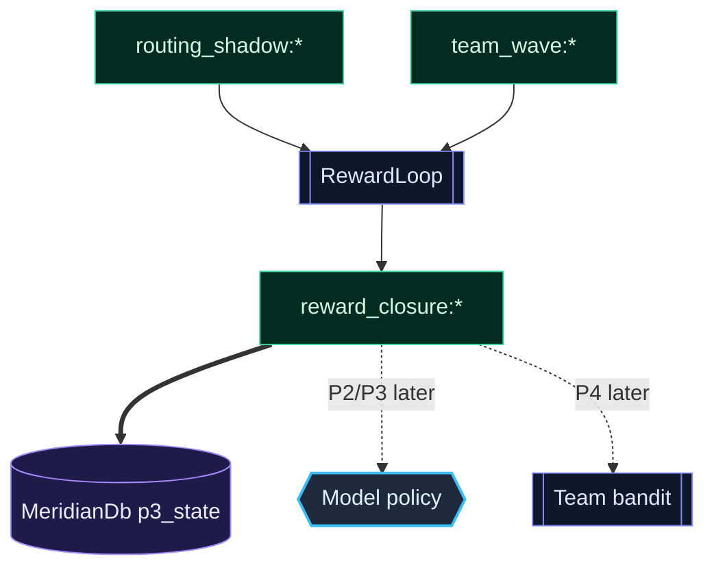

# T5×T2-03 P1 实施计划 · Reward Loop 骨架

> 日期：2026-06-08  
> 性质：P1 核心框架实施计划  
> 前置：P0 已交付 `ModelRoutingShadow` + `TeamWaveTelemetry`，append-only 落 MeridianDb，不改行为。  
> 目标：把两条影子线接成可计算、可回写、暂不影响行为的 reward loop。

---

## 0. 一句话

**P1 只做 reward closure：读取 P0 的 routing/team wave 事实，计算归一化 reward，写回 MeridianDb；不切模型、不改 team 调度、不改 prompt。**

P1 的价值不是“马上让系统更聪明”，而是让后续 P2/P3/P4 有同一个可审计的收益函数。

---

## 1. 当前代码锚点

P0 已经给 P1 留好了最小输入面：

| 输入 | 现状 | P1 用法 |
|---|---|---|
| Routing shadow | `src/agent/model-routing-shadow.ts:13` 定义 `ModelRoutingShadowEvent`；`src/agent/model-routing-shadow.ts:48` 生成 `routing_shadow:{sessionId}:{turn}:{timestamp}` | 读取“实际模型 vs legacy 推荐”的对照事实 |
| Team wave telemetry | `src/agent/team-wave-telemetry.ts:9` 定义 `TeamWaveTelemetry`；`src/agent/team-wave-telemetry.ts:60` 生成 `team_wave:{objectiveHash}:{sessionId}:{fromWave}:{timestamp}` | 读取 wave outcome / changedFiles / workerModels |
| Team 接线点 | `src/agent/team-orchestrator.ts:178`、`src/agent/team-orchestrator.ts:281` 已记录 wave telemetry | P1 不再改派发，只补 reward closure |
| Worker 模型元数据 | `src/agent/coordinator.ts:54`、`src/agent/coordinator.ts:504-542` 已有 `selectedModel` / `workerModels` | reward 可按 worker model 归因 |
| MeridianDb KV | `src/repo/meridian-db.ts:103` 是 `p3_state(kind, version, json)`；`src/repo/meridian-db.ts:569` `saveBanditState()` | P1 继续复用 KV，不新增 DDL |
| 既有 reward 模式 | `src/agent/p3-reward.ts:90` `computeEffortReward()`；`src/agent/p3-reward.ts:58` `isBanditGateOpen()` | 复用“归一化 + gate 后才影响行为”的语义 |

---

## 2. P1 范围

### 做

1. 新建 `src/agent/routing-reward.ts`
   - 定义 `RoutingRewardInput`、`RoutingRewardRecord`。
   - 实现 `computeRoutingReward(input): number`。
   - 输出范围固定 `[-1, 1]`。
   - false-green 权重必须压住 cost/latency。

2. 新建 `src/agent/team-reward.ts`
   - 定义 `TeamWaveRewardInput`、`TeamWaveRewardRecord`。
   - 实现 `computeTeamWaveReward(input): number`。
   - 从 `TeamWaveTelemetry` 派生 review / verification / conflict / scope / cost / latency 的归一化输入。

3. 新建 `src/agent/reward-loop.ts`
   - 组合 `routing_shadow:*` 与 `team_wave:*`。
   - 生成 append-only `reward_closure:*` 记录。
   - DB 不可用时 no-op。

4. 在 P0 接线点上补一个“闭环调用”
   - team wave 记录完成后可同步计算 team reward。
   - routing shadow 记录完成后可同步计算 routing reward。
   - 第一版不需要跨 session 扫描器；只处理“本次刚产生的 event”。

5. 补测试
   - `src/agent/__tests__/routing-reward.test.ts`
   - `src/agent/__tests__/team-reward.test.ts`
   - `src/agent/__tests__/reward-loop.test.ts`

### 不做

- 不改 `computeEFE()`。
- 不新增 DDL。
- 不接 PlanCache / Physarum / LinUCB。
- 不让 reward 影响模型选择。
- 不让 reward 影响 `groupTeamTasks()` 或 worker profile。
- 不引入跨 wave TeamEpisode 聚合；P1 仍按 `TeamWaveTelemetry` 做闭环。

---

## 3. 数据形状

### 3.1 Reward record

```ts
export interface RewardClosureRecord {
  schemaVersion: 1
  id: string
  sourceKind: 'routing_shadow' | 'team_wave'
  sourceKey: string
  objectiveHash?: string
  sessionId: string
  reward: number
  components: Record<string, number | boolean | string>
  timestamp: number
}
```

KV key：

```text
reward_closure:{sourceKind}:{sessionId}:{timestamp}:{shortHash}
```

保持 append-only，避免覆盖同 session 多次 reward。

### 3.2 Routing reward 输入

```ts
export interface RoutingRewardInput {
  currentModel: string
  recommendedModel?: string
  verificationPass?: boolean
  reviewPass?: boolean
  falseGreen?: boolean
  normalizedCostOverBudget?: number
  normalizedLatencySurprisal?: number
}
```

第一版允许 `verificationPass/reviewPass` 缺失；缺失时该项按 0 处理，不臆造成功。

### 3.3 Team wave reward 输入

```ts
export interface TeamWaveRewardInput {
  verificationPass?: boolean
  reviewPass?: boolean
  normalizedConflict: number
  normalizedRework: number
  normalizedScopeLeak: number
  normalizedCostOverBudget: number
  normalizedLatencySurprisal: number
  falseGreen: boolean
}
```

---

## 4. Reward 公式

P1 先用可解释的固定权重，不训练权重：

```ts
reward =
  + 0.30 * reviewPass
  + 0.30 * verificationPass
  - 0.15 * normalizedConflict
  - 0.15 * normalizedRework
  - 0.15 * normalizedScopeLeak
  - 0.10 * normalizedCostOverBudget
  - 0.10 * normalizedLatencySurprisal
  - 0.60 * falseGreen
```

硬约束：

```ts
falseGreenPenalty > maxCostPenalty + maxLatencyPenalty
```

即：省钱与低延迟不能抵消 false-green。审查 / verifier 的降级决策仍不进入 P1。

---

## 5. 实施步骤

### Step 1 — 纯函数 reward

文件：

- `src/agent/routing-reward.ts`
- `src/agent/team-reward.ts`

先只做纯函数和类型，不接运行时。

验收：

- 完美结果 reward > 0.5。
- worst case reward < -0.5。
- false-green 即使 cost/latency 很好也必须显著负分。
- 所有输入 clamp 到 `[0,1]` 或 `[-1,1]`。

### Step 2 — reward closure writer

文件：

- `src/agent/reward-loop.ts`

职责：

- `buildRewardClosureRecord(sourceKey, sourceEvent)`。
- `persistRewardClosure(store, record)`。
- store 缺失或 throw 时 no-op。

验收：

- key append-only。
- 同一个 sourceKey 重算不会覆盖旧记录，除非显式传相同 timestamp。
- DB 抛错不影响调用方。

### Step 3 — P0 telemetry 后接闭环

最小接线：

- `persistModelRoutingShadow()` 之后可调用 routing reward closure。
- `persistTeamWaveTelemetry()` 之后可调用 team wave reward closure。

建议第一版放在调用方接，不让 P0 recorder 直接依赖 reward 模块，避免 recorder 语义变重。

验收：

- 不改模型选择。
- 不改 team 派发。
- 不改 prompt 字节。
- telemetry 写失败不影响 reward；reward 写失败不影响 telemetry。

### Step 4 — 测试与回归

新增测试：

```bash
npm exec -- tsx --test src/agent/__tests__/routing-reward.test.ts
npm exec -- tsx --test src/agent/__tests__/team-reward.test.ts
npm exec -- tsx --test src/agent/__tests__/reward-loop.test.ts
npm exec -- tsx --test src/agent/__tests__/model-routing-shadow.test.ts src/agent/__tests__/team-wave-telemetry.test.ts
npx tsc --noEmit
```

---

## 6. 最小架构图



---

## 7. 交付边界

P1 完成的定义：

- 能从 P0 event 生成 reward closure。
- reward closure append-only 落 MeridianDb。
- reward 公式归一化且 false-green 权重有测试保护。
- 运行时行为不变。

P1 不负责证明权重最优；只负责让权重可解释、可测试、可替换。

后续：

- P2：`computeModelG()` / model-policy-selection，消费 reward，但不改 `computeEFE()`。
- P3：authority→model tier 先 shadow，再 gated 启用。
- P4：team_scheduler_bandit / model_tier_bandit / physarum / PlanCache advisory。

---

## 8. 天权称量

这版 P1 刻意保持薄：**只闭环，不学习；只记录，不影响；只归一化，不训练权重。**

这样细节可以留给天枢执行时发现，但主梁不能变：

1. reward 必须 append-only 可审计。
2. false-green 必须比成本更重。
3. P1 不能碰任何真实行为。
4. Team 事实仍以 wave 为单位，不假装已经有完整 episode。
