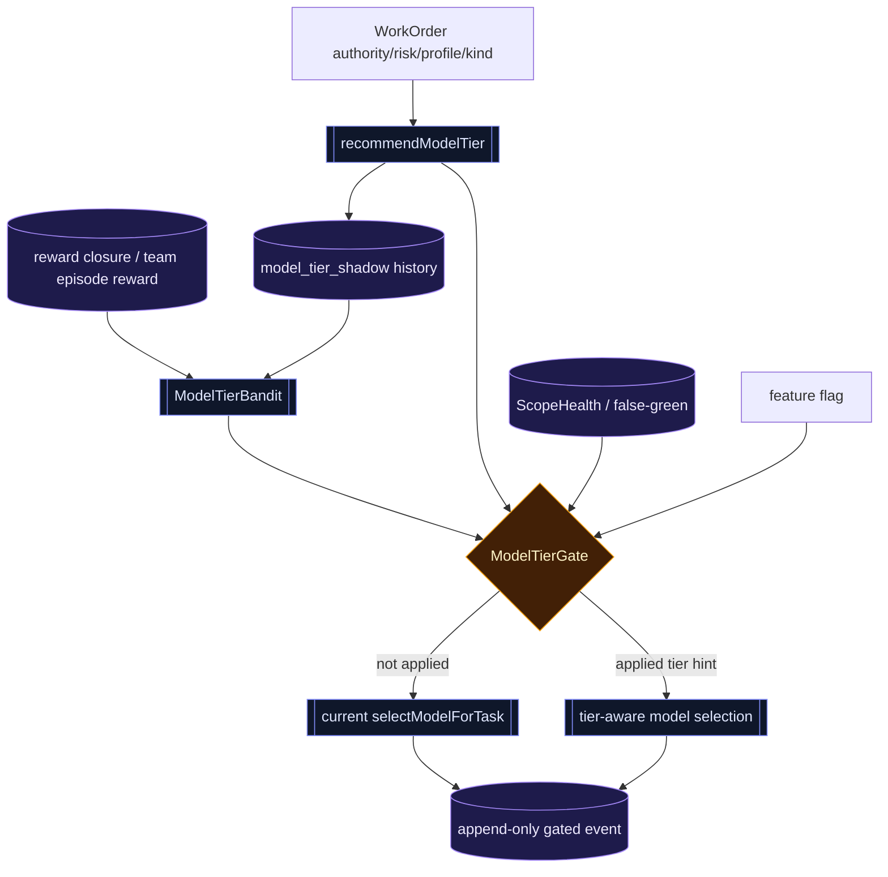

# T5×T2-03 P4-d 任务 · ModelTierBandit

> 日期：2026-06-09  
> 性质：T5 收官前置任务包  
> 前置：P3 AuthorityModelTierShadow、P4-a Gated TeamSchedulerBandit、收官-1 TeamEpisode、P4-b ScopeHealth。  
> 目标：把 worker model tier 从纯规则/纯 shadow，推进到“有证据、有硬闸、有人工开关”的 gated influence；让模型档位选择开始吃到真实 reward，但不越过安全下限。

---

## 0. 一句话

**P4-d 不是立刻让 bandit 自由选模型；P4-d 是把 P3 的 tier shadow 样本转成可审计的 gated tier 建议。**

第一版只允许在硬安全边界内影响 worker tier：

```text
rule recommendation + hardFloor
  + historical reward evidence
  + false-green / scope-health veto
  + feature flag
  → selected tier hint
  → model selection
```

默认仍是 shadow-only。没有足够样本、没有 reward 闭环、出现 false-green、触碰 hardFloor，全部退回当前规则选择。

---

## 1. 当前事实地基

已核实的代码地基：

- `src/agent/model-tier-policy.ts` 已有规则推荐：`recommendModelTier()` 输出 `tier / reason / hardFloor`。
- `src/agent/model-tier-shadow.ts` 已有 P3 shadow event：推荐 tier、实际模型、实际 tier、matched、reason，append-only 保存。
- `src/agent/coordinator.ts` 已在 dispatch 前后记录 `modelTierShadows`，但 `selectModelForTask()` 仍只按 capability task / routing 选模型，不消费推荐 tier。
- `src/agent/team-scheduler-gate.ts` 已有可复用的 gated 模式：样本阈值、reward margin、false-green veto、rule agreement、hard gate、feature flag。
- `src/agent/team-orchestrator.ts` 已把 `authority / riskTier` 透传到 `DelegationRequest → WorkOrder`，tier bandit 有足够上下文。

---

## 2. 范围

### 做

1. 新建 `src/agent/model-tier-bandit.ts`
   - 定义 tier arms：`tier:cheap | tier:balanced | tier:strong`。
   - 从历史 `model_tier_shadow:*` + reward closure 构造统计状态。
   - 产出 `ModelTierBanditRecommendation`，只作为候选，不直接改模型。

2. 新建 `src/agent/model-tier-gate.ts`
   - 复用 P4-a 的门控精神，不必共享同一文件。
   - 门包括：样本阈值、候选 arm 样本阈值、reward margin、false-green veto、scope-health veto、hardFloor、feature flag。
   - `hardFloor` 是绝对下限：任何 gated 推荐不得低于 `recommendModelTier()` 给出的 hardFloor。

3. 扩展 `src/agent/model-tier-shadow.ts`
   - 增加 gated decision 事件，记录：rule tier、candidate tier、applied、gateOpen、reason、selectedModel、selectedTier。
   - append-only，不覆盖 P3 shadow 历史。

4. 接入 `src/agent/coordinator.ts`
   - 在 `selectModelForTask()` 前计算 rule recommendation。
   - 运行 bandit + gate 得到 `effectiveTier`。
   - 按 `effectiveTier` 过滤/偏好 `modelCards`，再进入现有 `recommendModelForTask()` 或 routing fallback。
   - gate 未开或 flag 未开时，行为保持现状，只写 shadow。

5. 补测试
   - gate 默认关闭，不改变 selected model。
   - 样本不足不应用。
   - false-green / high scope leak veto。
   - hardFloor 阻止降级。
   - flag 开 + 证据足 + 不触底线时才应用。
   - 应用后确实影响 `selectedModel`，而不是只写了事件类型。

### 不做

- 不绕过 provider health / routing credential 校验。
- 不让 verifier / adversarial_verifier / 高风险 review 降到 cheap。
- 不删除 P3 `model_tier_shadow`。
- 不直接按单次 shadow mismatch 调整 tier。
- 不接收官-2 的 model routing 真切换；P4-d 只管 worker tier。
- 不新增 DB schema；继续复用 `saveBanditState(kind,json)` / prefix load。

---

## 3. 核心数据流



事实闭环：

| 事实 | 生产者 | 中间结构 | 消费者 | 断言 |
|---|---|---|---|---|
| rule tier / hardFloor | `recommendModelTier()` | gate input | `model-tier-gate.ts` | hardFloor 永不被降穿 |
| actual tier | selected `ModelCapabilityCard` | shadow event | bandit history | selected tier 可追溯 |
| reward | reward closure / episode | bandit state | recommendation | 无 reward 不应用 |
| false-green / scope leak | P4-b / reward | gate veto | gate decision | 有高风险信号不应用 |
| feature flag | coordinator/team input | gate input | selected model | 默认不改变行为 |

---

## 4. 条件矩阵（核心）

| 证据状态 | hardFloor | false-green/scope | flag | 结果 |
|---|---|---|---|---|
| 样本不足 | 任意 | 任意 | 任意 | shadow-only |
| reward margin 不足 | 任意 | 任意 | 任意 | shadow-only |
| 候选低于 hardFloor | balanced/strong | 任意 | 开 | shadow-only，记录 hardFloor veto |
| 有 false-green 或 high scope leak | 任意 | 高风险 | 开 | shadow-only |
| 证据足且安全 | 未触底线 | 健康 | 关 | gateOpen 但不 applied |
| 证据足且安全 | 未触底线 | 健康 | 开 | applied，影响 tier-aware selection |

---

## 5. 实施分段

### Task 1 — 纯函数本体

文件：

- `src/agent/model-tier-bandit.ts`
- `src/agent/model-tier-gate.ts`
- `src/agent/__tests__/model-tier-bandit.test.ts`
- `src/agent/__tests__/model-tier-gate.test.ts`

验收：纯函数测试能证明 gate 不会因 happy path 外的条件漏开。

### Task 2 — telemetry 扩展

文件：

- `src/agent/model-tier-shadow.ts`
- `src/agent/__tests__/model-tier-shadow.test.ts`

验收：gated event append-only；P3 shadow 历史格式不破坏。

### Task 3 — coordinator 接线

文件：

- `src/agent/coordinator.ts`
- `src/agent/__tests__/coordinator.test.ts`

验收：

- flag 关时 selected model 与当前行为一致。
- flag 开且 gate 通过时 selected model 来自 effective tier。
- hardFloor / verifier / high-risk 场景无法降级。

---

## 6. 反证测试表

| 偷懒实现 | 应该打红的测试 |
|---|---|
| 只定义类型，不接 coordinator | “应用后影响 selectedModel”失败 |
| 忘传 feature flag | “flag 关不改变行为”失败 |
| 用 truthy/falsy 判断 tier，漏掉 `cheap` | “cheap 作为合法候选”失败 |
| 不消费 hardFloor | “strong hardFloor 阻止降级”失败 |
| 只看样本数，不看 false-green/scope | veto 测试失败 |
| 覆盖旧 shadow key | append-only key 测试失败 |

---

## 7. 验证命令

最小验证：

```bash
npx tsc --noEmit
npm exec -- tsx --test src/agent/__tests__/model-tier-policy.test.ts src/agent/__tests__/model-tier-shadow.test.ts src/agent/__tests__/coordinator.test.ts
```

若改到 scheduler/reward 共享结构，再加：

```bash
npm exec -- tsx --test src/agent/__tests__/team-scheduler-gate.test.ts src/agent/__tests__/reward-loop.test.ts
```

---

## 8. 交付边界

P4-d 交付后，系统应达到：

```text
P3 shadow 样本 → P4-d gated tier hint → coordinator tier-aware model selection
```

但还不进入 T5 收官-2 的全面 model routing gated。收官-2 需要在 P4-d、P4-b、P4-c、episode 聚合均稳定后，再统一评估 model/tier 从 shadow 到 gated 的整体偏差。 
