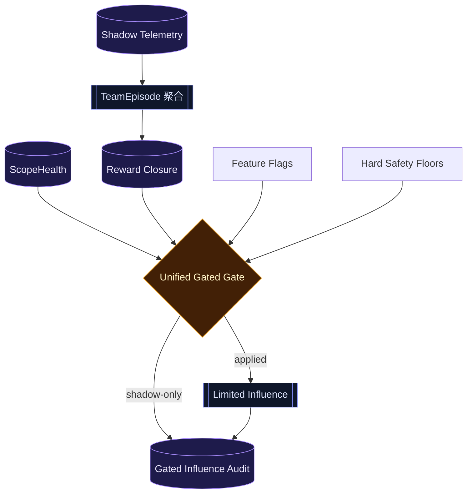

# T5×T2-03 收官-2 任务 · Shadow → Gated 真启用

> 日期：2026-06-09  
> 性质：T5 收官任务包  
> 前置：收官-1 TeamEpisode、P4-b ScopeHealth、P4-c Physarum 监督边、P4-d ModelTierBandit 修复完成。  
> 目标：把 T5 主线里已经积累的 shadow 信号，按统一证据门逐步转成 gated influence；不是扩大自治，而是把“可证明安全的建议”接入真实行为。

---

## 0. 一句话

**收官-2 不是打开所有学习器；收官-2 是建立统一的 Shadow→Gated 启用闸，并只放行证据闭环完整、风险下界清晰的那几条影响路径。**

第一批候选：

```text
TeamSchedulerBandit       已有 gated 模板，保持 down-only
ModelTierBandit           P4-d 修复后接入，守 hardFloor
ModelRouting / ModelG     继续 shadow，暂不切主模型
PlanCacheAdvisory         继续 advisory-only，不执行 cached steps
Physarum supervision      可写学习边，不反向影响 scheduler
```

---

## 1. 前置闸

进入收官-2 前必须确认：

1. **P4-d 修复完成**
   - reward closure 能生产 `workerTier / selectedTier` 或等价可关联字段。
   - ModelTierBandit 的 reward 样本不是靠测试假数据幻想出来。
   - hardFloor / verifier / high-risk review 不可降级。

2. **Episode 级 reward 可用**
   - 多 wave 不再被拆成多个独立样本。
   - incomplete episode 不进入正向 reward。

3. **ScopeHealth 是一等信号**
   - observed diff 优先于 worker reported files。
   - high scope leak 能 veto gated influence。

4. **所有 gated 路径默认关闭**
   - 无显式 feature flag，不改变行为。

---

## 2. 范围

### 做

1. 新建统一启用审计层
   - 建议文件：`src/agent/gated-influence-audit.ts`
   - 记录每条 influence 的：source、gateOpen、applied、reason、evidenceWindow、vetoSignals。
   - 只 append-only，不作为决策源。

2. 梳理并统一 feature flags
   - `teamSchedulerBanditEnabled`
   - `modelTierBanditEnabled`
   - 后续预留 `modelRoutingGatedEnabled`
   - 默认全 false。

3. 建立收官级 gate contract
   - 样本阈值。
   - reward margin。
   - false-green veto。
   - scope-health veto。
   - hard safety floor。
   - explicit flag。

4. 接入第一批允许真影响的路径
   - TeamScheduler：保持 down-only，不增加并行度。
   - ModelTier：只在 P4-d 修复后接入，不降穿 hardFloor。

5. 保持第二批路径 shadow-only
   - ModelRouting / ModelG：只记录推荐 vs 实际。
   - PlanCacheAdvisory：只提示，不 JIT、不执行。
   - Physarum：只学习文件边，不反向调度 team。

### 不做

- 不让 bandit 替代 `groupTeamTasks()`。
- 不让 model routing 直接切主控模型。
- 不让 PlanCache 执行缓存步骤。
- 不把 failed / blocked / incomplete episode 当 reward 正样本。
- 不用单次成功打开 gated。
- 不新增 DB schema。

---

## 3. 核心数据流



---

## 4. 启用矩阵

| 路径 | 当前状态 | 收官-2 目标 | 安全边界 |
|---|---|---|---|
| TeamSchedulerBandit | gated 已有 | 保持可启用 | down-only，不扩大并行度 |
| ModelTierBandit | P4-d 修复中 | 修复后可启用 | hardFloor，不降 verifier/high-risk |
| ModelRouting / ModelG | shadow | 保持 shadow | 不切主控模型 |
| PlanCacheAdvisory | advisory | 保持 advisory | 不执行 cached steps |
| Physarum supervision | 学习边 | 保持单向学习 | 不反向影响 scheduler |

---

## 5. 实施分段

### Task 1 — Gate contract 统一

产出统一类型与审计事件，不改变行为。

验收：所有 feature flag 默认 false；审计事件能解释为什么没应用。

### Task 2 — TeamScheduler / ModelTier 双路径复核

把两条允许 gated 的路径对齐到同一 gate 语义。

验收：

- scheduler 不能升并行。
- model tier 不能降穿 hardFloor。
- false-green / high scope leak 均 veto。

### Task 3 — Shadow-only 路径锁边界

为 ModelRouting、PlanCache、Physarum 写边界测试，证明它们没有越权影响行为。

验收：

- ModelG 不调用 model switch。
- PlanCacheAdvisory 不调用 JIT / execute。
- Physarum supervision 不改 team scheduler。

---

## 6. 反证测试表

| 偷懒实现 | 应该打红的测试 |
|---|---|
| 只加 flag，不接审计 | gate audit 缺事件失败 |
| flag 默认开 | 默认不改变行为失败 |
| scheduler 可升并行 | down-only 测试失败 |
| model tier 忽略 hardFloor | verifier/high-risk 降级测试失败 |
| ModelG 顺手切模型 | shadow-only 边界测试失败 |
| PlanCache 执行缓存步骤 | advisory-only 测试失败 |
| Physarum 反向调度 team | one-way learning 测试失败 |

---

## 7. 验证命令

最小验证：

```bash
npx tsc --noEmit
npm exec -- tsx --test src/agent/__tests__/team-scheduler-gate.test.ts src/agent/__tests__/model-tier-gate.test.ts src/agent/__tests__/model-tier-bandit.test.ts src/agent/__tests__/coordinator.test.ts
```

边界路径验证：

```bash
npm exec -- tsx --test src/agent/__tests__/model-policy-selection.test.ts src/agent/__tests__/reward-loop.test.ts src/agent/__tests__/team-physarum-supervision.test.ts
```

---

## 8. 交付定义

收官-2 完成后，T5 的状态应是：

```text
shadow telemetry → episode reward → gated decision → 有限行为影响 → append-only audit
```

并且每条路径都能回答：

1. 为什么允许影响？
2. 为什么这次没影响？
3. 哪个硬边界保证不会越权？
4. 哪条测试能打红越权实现？

只有这四个问题都能回答，才算从 shadow 进入 gated。
