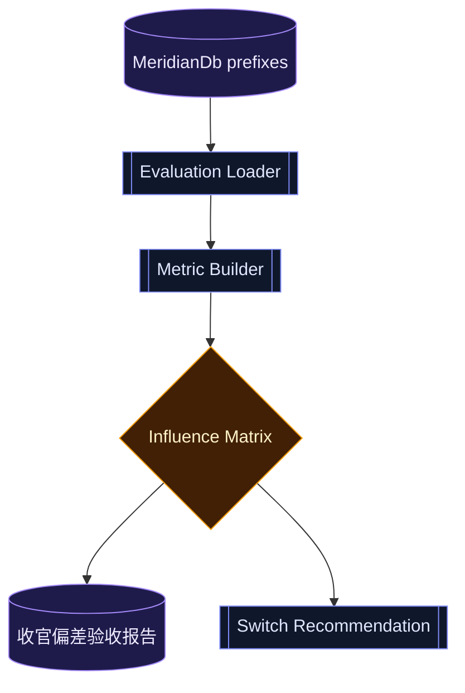

# T5×T2-03 收官-3 任务 · 偏差验收与开关策略

> 日期：2026-06-09  
> 性质：T5 收官验收任务包  
> 前置：P4-d 修复、收官-2 GatedInfluenceAudit、TeamScheduler/ModelTier 双路径 gated 审计均已接入。  
> 目标：用真实 shadow/gated/audit 历史验收 T5 的偏差分布，给出哪些开关可以保持关闭、哪些可以小范围开启、哪些必须继续 shadow-only。

---

## 0. 一句话

**收官-3 不是继续加影响力；收官-3 是验收“这些影响力到底准不准、安全不安全”。**

本任务只做三件事：

```text
读取历史 → 计算偏差 → 输出启用建议
```

不新增学习器，不扩大行为影响，不改变默认配置。

---

## 1. 当前事实地基

已落地能力：

- `model_tier_shadow:*`：P3/P4-d 的推荐 tier vs 实际 tier。
- `model_tier_gated_decision:*`：ModelTierBandit gateOpen/applied/selectedTier。
- `team_scheduler_shadow:*`：TeamScheduler 推荐与实际 rule parallelism。
- `team_scheduler_reward:*`：scheduler reward 历史。
- `gated_influence_audit:*`：统一记录 gateOpen/applied/reason/evidenceWindow/vetoSignals。
- `reward_closure:team_wave:* / reward_closure:team_episode:*`：reward 闭环。
- `team_scope_health:*`：scope leak / false-green 第二信号。

---

## 2. 范围

### 做

1. 新建偏差验收模块
   - 建议文件：`src/agent/gated-influence-evaluation.ts`
   - 输入：MeridianDb prefix rows。
   - 输出：`GatedInfluenceEvaluationReport`。

2. 统计每条 influence 的核心指标
   - `totalShadowSamples`
   - `gateOpenCount`
   - `appliedCount`
   - `vetoCounts`
   - `averageRewardByCandidate`
   - `falseGreenRate`
   - `scopeLeakRate / worstScopeSeverity`
   - `ruleAgreementRate`
   - `regretEstimate`：候选 reward - rule reward。

3. 输出开关建议
   - `keep_shadow_only`
   - `allow_manual_opt_in`
   - `allow_limited_default_on`（第一版原则上不要给 default-on，除非证据极强）
   - `disable_and_investigate`

4. 新增只读诊断入口
   - 优先做纯函数 + 测试。
   - 如需工具，后续单开；本任务不强制新增工具。

5. 写收官报告
   - 建议文档：`docs/teamtask/T5收官偏差验收报告.md`
   - 报告只记录事实、样本数、建议，不写“已经证明智能提升”这类过度结论。

### 不做

- 不开启任何 feature flag。
- 不把 `gated_influence_audit` 作为决策输入。
- 不根据单次成功调整阈值。
- 不删旧 telemetry。
- 不把 TeamScheduler、ModelTier、ModelRouting 混成一个总分。
- 不新增 DB schema。

---

## 3. 核心数据流



---

## 4. 验收矩阵

| 路径 | 最低样本 | 必看指标 | 合格条件 | 不合格处理 |
|---|---:|---|---|---|
| TeamSchedulerBandit | 30 | reward margin / false-green / scope leak / down-only | 只降并行且 reward 稳定正向 | 保持 shadow-only |
| ModelTierBandit | 30 | hardFloor veto / selectedTier reward / false-green / scope leak | 不降穿 floor，候选 reward 明显优于 rule | 保持 shadow-only 或提高阈值 |
| ModelRouting/ModelG | 30 | recommended vs actual reward / mismatch 分布 | 只出建议，不启用 | 继续 shadow-only |
| PlanCacheAdvisory | 20 | advisory 命中后是否减少 rework | 不执行，只提示 | 继续 advisory-only |
| Physarum supervision | 20 | 后续 predictNext 命中率 | 只学习，不调度 | 停止 apply，只保留 shadow |

---

## 5. 注意点

1. **样本不足时不写建议开启**
   - 样本不足不是“表现未知但可试试”，而是 `keep_shadow_only`。

2. **gateOpen 不等于 applied**
   - flag 关时 gateOpen 只能说明证据门可能通过；不能当真实影响结果。

3. **applied 样本要和 shadow 样本分开算**
   - applied 有选择偏差，不能直接代表全局效果。

4. **false-green 是一票否决信号**
   - 只要 gated 后出现 false-green，就优先调查，不靠平均 reward 掩盖。

5. **scope leak 不能用 worker 自报覆盖 observed diff**
   - 验收只信 ScopeHealth 的 observed-first 结果。

6. **不要把“强模型赢”误读成“bandit 赢”**
   - ModelTier 的评估对象是 tier 选择策略，不是模型能力排行榜。

7. **audit 只能验收，不能反哺决策**
   - `gated_influence_audit:*` 是证据账本，不是训练样本。

---

## 6. 实施分段

### Task 1 — Evaluation 纯函数

文件：

- `src/agent/gated-influence-evaluation.ts`
- `src/agent/__tests__/gated-influence-evaluation.test.ts`

验收：能从构造的 prefix rows 生成稳定报告；缺字段/坏 JSON 不崩溃、不发明样本。

### Task 2 — 分路径指标

覆盖：

- scheduler path
- model tier path
- shadow-only path

验收：各路径独立统计，不混成一个总分。

### Task 3 — 收官报告生成

文件：

- `docs/teamtask/T5收官偏差验收报告.md`

验收：报告列出样本数、结论、建议开关状态、继续观测项。

---

## 7. 反证测试表

| 偷懒实现 | 应该打红的测试 |
|---|---|
| 样本不足仍建议开启 | insufficient samples → keep_shadow_only 测试失败 |
| 把 gateOpen 当 applied | gateOpen-only 样本不计真实效果测试失败 |
| 混合不同 influence 总分 | per-source isolation 测试失败 |
| 坏 JSON 导致崩溃 | malformed rows ignored 测试失败 |
| false-green 被平均 reward 掩盖 | false-green veto recommendation 测试失败 |
| audit 被当训练样本 | audit-not-decision-source 测试失败 |
| scope leak 缺字段按 healthy | unknown scope 不猜测测试失败 |

---

## 8. 验证命令

最小验证：

```bash
npx tsc --noEmit
npm exec -- tsx --test src/agent/__tests__/gated-influence-evaluation.test.ts src/agent/__tests__/gated-influence-audit.test.ts
```

关联回归：

```bash
npm exec -- tsx --test src/agent/__tests__/team-scheduler-gate.test.ts src/agent/__tests__/model-tier-gate.test.ts src/agent/__tests__/model-tier-bandit.test.ts src/agent/__tests__/coordinator.test.ts
```

---

## 9. 交付定义

收官-3 完成后，需要能明确回答：

1. 哪些 gated influence 有足够样本？
2. 哪些只是 gateOpen，还没有真实 applied 证据？
3. 哪些路径出现过 false-green / scope leak veto？
4. 哪些开关建议继续关闭？
5. 哪些开关可以只允许人工 opt-in？

没有这份偏差验收，不进入默认开启讨论。
