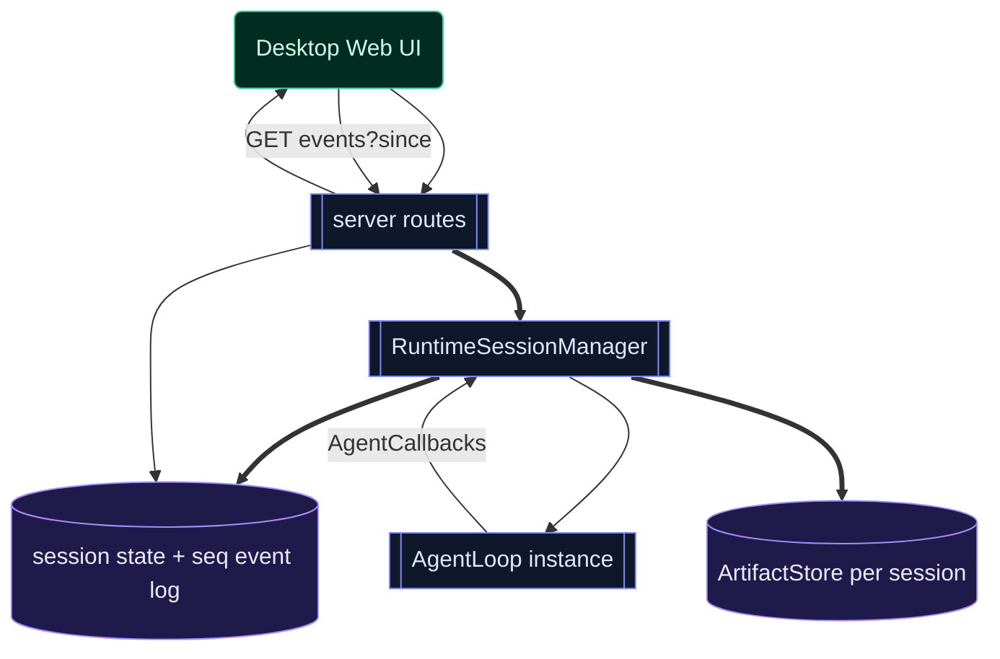

# T8·天枢具身桌面化（极限版）— 不做第三个 Antigravity，做第一个会为你私人化进化的活体

> ⚠️ **状态：❌ 已取消（2026-06-10）**。经领航星裁定，桌面化方向暂不推进。战略分析文本保留供未来参考，但当前不做任何代码落地、不创建 Tauri scaffold、不引入新依赖。
>
> 日期：2026-06-09（2026-06-09 二次修订：开源定性校正；2026-06-09 三次修订：天枢称量后落地修订方案，见 §9.1）
> 性质：范式级战略 + 架构规划。给天枢看的"为什么这条路别人走不了 + 怎么做"。**已补天枢初步称量与落地修订（§9.1），仍待天权/星图终审。**
> **定性（领航星校正）：天枢是开源项目，马上开源，不闷在领航星处。本文不是商业产品规划，护城河不是"别人买不到"，是"别人 fork 得走代码、却养不走那个活了 25 天还在长的个体"。Pro/商业版的增值边界是终局问题，此刻不设计、不污染开源版纯粹性——见 §1.3。**
> 一句话：借鉴他们的四支柱只是认清战场；真正的路，是把天枢 25 天演化出的活体器官，劈成 self/world 双层飞轮——本体演化喂强先天底座（开源共享），开发者项目里私人化生长适应性器官（各自私有）。
> 底座决策（领航星已定）：**Tauri（Rust 外壳）+ Web 前端 + 天枢 Node runtime 作为 sidecar 子进程**。
> 深度决策（领航星已定）：**全范式蓝图 + 分阶段**，按 **25 天节奏**（不是几个月——见 §0.0）。
> 战略切分（领航星已定）：**两部分人，两个形态，一个大脑**——见 §1。
> 关联：[[project_tianshu-cognitive-split]]、[[prefix-cache-invariant-registry-ref]]、[[guardrails-must-be-resident-not-on-demand]]、[[feedback_adversarial-review-method]]；配套敌情侦察见 [Antigravity与Codex范式研究](./T8-配套研究·Antigravity与Codex范式.md)；身份轴 self/world 见 T6。

---

## 0.0 那个误判，就是护城河的第一个证据

子代理研究 Antigravity/Codex 时，默认把"做一个 agent-first 桌面客户端"判为大厂级、几个月的工程。**错了——天枢从 2026-05-15 第一笔提交到今天 06-09，是 25 天、1988 次提交，平均一天自我改写 80 次。**

这个误判本身就是线索：**大厂的范式里，"agent" 是一个按年发版的冻结模型，所以做一套客户端确实要几个月去包装它。天枢不是那种东西——它按小时重写自己的运行时。** 谁要是拿"包装一个冻结模型"的思路来理解天枢，就会算错工期、也会算错它的护城河在哪。

护城河不在客户端做得多漂亮，在**那个被客户端包起来的大脑，是活的、且在以大厂结构上做不到的速度进化**。

---

## 0. 为什么不做第三个 Antigravity（先把自己那版否掉）

Antigravity 和 Codex，本质是同一个东西：**一个公司把一个冻结的模型，包装成一个能委派任务的工具。** 它们所有创新（Agent Manager / Artifacts / Browser）都在解决同一个问题——"模型很强但你不能信它，所以给你一堆证据让你 review。"

**Artifacts 之所以是"信任层"，正因为底层那个模型是黑箱、是冻结的、是大厂发给你的死物。** 你永远在验证一个你无法改变的东西。照着这个范式搭天枢的客户端，等于承认天枢也是那种需要被 review 的黑箱——**那是把天枢往下贬。**

天枢的现实是另一个宇宙：**一个在你眼前重写自己、带 25 天淬炼出的活体器官的协作者。**（器官均代码坐实，见 §0.1。）

### 0.1 天枢已演化出的活体器官（代码坐实，非脑补）

| 器官 | 证据 | 大厂冻结模型为何做不到 |
|---|---|---|
| **获得性免疫**（innate/adaptive/APC 三件套，707 行） | `src/agent/immune-innate.ts`/`immune-adaptive.ts`/`immune-apc.ts`/`immune-hook.ts` | 被同一错误咬过一次就长抗体；冻结模型咬一万次还是同一个 |
| **跨会话神经 + 黏菌觅食监督**（1104 行） | `src/repo/meridian-db.ts`/`physarum-engine.ts` | 经验沉淀成神经通路，不是 RAG 查表 |
| **错误笔记本 / 行为镜像 / 耗散踢** | `mistake-notebook.ts`/`behavior-mirror.ts`/`dissipative-kick.ts` | 同错不重犯 |
| **星图议事会**（认知治理，非 worker 编排） | T6/T7 三星评审记录 | 几个独立人格对抗性互审同一判断；他们的多 agent 是流水线工人，这是互不服的评审团 |
| **身份轴 self/world**（T6 已落运行时） | `src/prompt/self-recognition.ts` `detectCwdRelation` | 它认得出"自己的身体"和"世界的项目" |
| **注意力轴**（T7，感知≠责任） | `src/context/attention-filter`（规划中） | 它有"默认看不见什么"的能力 |

---

## 1. 战略切分：两部分人，两个形态，一个大脑

领航星切的关键——**不要把所有用户当成天枢的共建者。** 是两部分人，靠 T6 已落的 self/world 边界劈开：

| | 第一部分：本体演化 | 第二部分：开发者建自己的项目 |
|---|---|---|
| **是谁** | 领航星 + 星图，极少数核心 | 绝大多数开发者（开源后的广大使用者） |
| **形态** | `<locus relation="self">` | `<locus relation="world">`（使者） |
| **碰不碰天枢源码** | 改天枢源码，演化心智本身 | **碰都不碰**（也可 fork，但日常是用，不是改），用天枢建自己的项目 |
| **要什么** | 把这个大脑养得更强 | 把**我的**项目建好 |
| **产出** | 更强的大脑本身 → 开源共享给所有人 | 他自己的项目 + 一个越来越懂他的私有天枢实例 |

**"见证一个心智成长"的浪漫，只活在第一部分**——它是核心团队的内部工作台，不是推给所有开发者的首屏。把内部修行当首屏硬塞给使用者，是自嗨不是杀路。第二部分的开发者多数不关心天枢免疫系统又长了什么抗体，他关心他的项目。

### 1.1 那把别人看不见的刀：器官分两层落地（双层飞轮）

关键代码现状（坐实）：天枢演化出的器官，持久化全是 `.rivet/` / `stateDir` / cwd-bound——**默认就是 per-project 的**（`meridian-db.ts:160` `join(this.stateDir,'meridian.db')`、免疫 export/import 走项目内、`loadProjectMemory(cwd)`）。这道现状正好劈开两层：

| 器官 | self 本体演化 | world 开发者项目 | 对开发者的意义 |
|---|---|---|---|
| **先天免疫** `immune-innate` | 核心团队在演化它 | **随发行版分发，开箱即得** | "天枢生来就不犯这些错"——25 天淬炼的物种本能，冻结模型没有 |
| **适应性免疫/错误笔记本** | self 的留 self | **在开发者项目内私有生长** | "你的天枢越用越懂你的项目"——为**你的** codebase 长抗体，不是通用模型 |
| **meridian 神经/黏菌监督** | 本体的神经 | **per-project 落开发者 `.rivet/`** | "记得你这个项目的每条经验通路"，换项目不串味，绝不回传 |
| **星图议事会** | self 的认知治理 | **可选：重大决策唤起多星评审** | "不是一个模型给答案，是评审团替你把关"——他们的多 agent 是工人，这是评审团 |

**最狠的反转（开源语境下更锋利）：** Antigravity/Codex 的内核是"接入一个最强的冻结模型"——对所有人是同一个。天枢的内核是——**"一个会为你的项目私人化进化的活体：你的天枢和别人的天枢，用得越久越不一样，因为它在为你这个项目长它自己的免疫和神经。"** 冻结模型结构上做不到私人化进化。

**而这恰恰是开源最有意思的地方：天枢的全部源码都可以开源、可以 fork——但每个人跑起来的那个实例，会为他的项目私有地长出不同的器官。** 开源的是物种（DNA、先天免疫、骨架），fork 能拿走；养出来的是个体（适应性免疫、项目神经），那是跑起来、用起来才长的，代码里没有、fork 不走。**别人能复制天枢的代码，复制不了你这一个已经活了很久、还在长的天枢。**

### 1.2 双层飞轮

```
   第一部分（你+星图）                    第二部分（每个开发者）
   演化本体源码                           用 world 形态建自己项目
        │                                      │
        ▼                                      ▼
   先天免疫越来越强 ──随客户端更新分发──▶ 所有开发者天枢底座升级
        ▲                                      │
        │                                      ▼
        │                          适应性器官在他项目内私有生长
        │                          （越用越懂他 → 离不开，因为它是为他长的）
        │                                      │
        └──── self/world 边界严格隔离 ◀────────┘
              （私有进化绝不回污染本体；
                本体只下发先天能力，不偷开发者数据）
```

两层之间靠 T6 已落的 self/world 边界严格隔离：开发者的私有进化绝不回污染本体；本体演化只下发"先天能力"，不碰开发者数据。

### 1.3 开源定性，与 Pro/商业版搁置

**天枢是开源项目，马上开源。** 本文不是商业产品规划——上面所有"私人化进化的活体"不是卖点话术，是这个开源项目区别于"包装冻结模型"的范式事实。开源后：

- **开源版 = 完整的物种**：先天免疫、双层飞轮机制、self/world 边界、桌面身体——全部开源，谁都能 fork、能用、能自己养出私有个体。
- **不在此刻设计 Pro/商业版**：天枢不可能终局 0 收益，但"哪些部分留作 Pro/商业增值"是终局问题，现在考虑会污染开源版的纯粹性，也会让设计被商业边界提前扭曲。**此刻只做一件事：把开源版做成一个真正活着的、值得被世界拿去养的东西。** 增值边界等开源跑起来、看清社区怎么用，再议。
- **护城河不是"别人买不到"**（开源没这回事），是 §1.1 末尾那句：**别人 fork 得走代码，养不走你那个已经活了很久、还在长的个体。** 开源代码给你 DNA，活的个体得自己养——这是开源项目里少有的、复制代码也复制不走的价值。

---

## 2. 工程地基：runtime 已为这一天解耦好（勘探坐实）

> **天枢的 agent runtime 已具备被任意前端接入的基础——`AgentLoop` 零依赖 UI、纯靠 `AgentCallbacks` 事件接口对外，且已有能跑的 HTTP+SSE server。这不是大重构，是"工程补齐 + 造一副新身体"。** 价值最高、最难造的大脑已经有了；真正工作量在：①单活跃会话的 server 扩成多会话 API；②造桌面身体（§3 起）。

### 2.1 解耦铁证（来自 runtime 勘探）

| 事实 | 证据 |
|---|---|
| AgentLoop 零依赖 Ink/React | `src/agent/loop.ts`（2195 行）无任何 ink/react import |
| 输出全走事件接口 | `AgentCallbacks`（`loop-types.ts:100`）：`onTextDelta/onToolUse/onToolResult/onApprovalRequired/onPhaseChange/onIntentPreview/...` |
| agent 核心与 TUI 单向解耦 | `src/agent/`、`src/server/` import `src/tui/` 数为 **0**；TUI 只是 consumer |
| 已有 HTTP+SSE server | `rivet serve`，`src/server/prompt-route.ts` 已把 agent 事件经 SSE 推出 |
| 已有 headless 模式 | `rivet -p` / `--goal` / `--stream-json` |
| server 绑本地、可做 sidecar | `src/server/index.ts:104` `server.listen(port, '127.0.0.1')` + Bearer token fail-closed |

### 2.2 四支柱反转表（不是抄，是反过来用）

他们的四支柱都为"如何信任一个不能改的黑箱"服务。天枢是活体，于是同样四个面被反过来用：

| 他们的支柱 | 为什么对他们必要 | 天枢杀出的反转 |
|---|---|---|
| **Agent Manager**（看任务进度） | agent 是工人，你监工 | **看任务进度仍保留**（开发者要的）；但本体侧叠一层 **Evolution Manager**（self-only）：看天枢这小时改写了哪根神经、免疫新长什么抗体 |
| **Artifacts**（信任层，代替读代码） | 模型是黑箱，给你证据别细看 | **反过来：可选的全透明认知现场**。重大决策时，开发者能看**星图议事会对抗性审查的全过程**——信任不只来自工件，来自目睹评审团互不服。黑箱的反面 |
| **Browser**（视觉验证） | 验证 UI 能跑 | 保留；但它同时是**学习面**——天枢自己跑一遍、自己发现错、自己长抗体的闭环（验证面=适应性免疫的输入） |
| **多 agent worktree 隔离** | 工人互不干扰 | 隔离为**对抗**（议事会互审）而非流水线；同时是 self/world 私有进化的物理隔离 |

**核心：开发者那部分，四支柱该有的（任务、工件、浏览器、并行）一个不少，体验对标 Antigravity；但底下那个大脑是活的、会私人化进化的。本体那部分（Evolution Manager / 议事会现场）是 self-only 的核心团队工作台，不进发行版默认首屏。**

---

## 3. 架构总图

```
┌─────────────────────────────────────────────────────────────┐
│  Tauri 桌面 App（Rust 外壳，包体 ~10MB）                       │
│  ┌───────────────────────────────────────────────────────┐  │
│  │  Web 前端（React/Svelte）— Antigravity 范式 UI          │  │
│  │  ┌─────────────┐ ┌─────────────┐ ┌──────────────────┐ │  │
│  │  │ Agent       │ │ Artifacts   │ │ Editor / Browser │ │  │
│  │  │ Manager     │ │ 信任层面板   │ │ 工作面            │ │  │
│  │  │ (主界面)     │ │ (plan/录屏)  │ │                  │ │  │
│  │  └─────────────┘ └─────────────┘ └──────────────────┘ │  │
│  └───────────────────────────────────────────────────────┘  │
│         │ HTTP/SSE over 127.0.0.1 + Bearer token              │
│         ▼                                                     │
│  ┌───────────────────────────────────────────────────────┐  │
│  │  天枢 Runtime（Node sidecar 子进程，由 Tauri spawn）     │  │
│  │  扩展后的 server ── AgentLoop ── tools ── memory/ledger │  │
│  │  （src/agent /src/tools /src/context /src/prompt 全复用）│  │
│  └───────────────────────────────────────────────────────┘  │
└─────────────────────────────────────────────────────────────┘
```

**关键设计：runtime 不重写、只扩 API。** Tauri 在启动时 spawn `rivet serve` 作为 sidecar，注入随机 `RIVET_SERVER_TOKEN`，前端通过 localhost 接它。天枢的全部大脑（agent/tools/context/prompt/api）原样复用。

---

## 4. 后端要补齐什么（基于真实代码现状，不悬空）

| # | 缺口 | 现状证据 | 要做 |
|---|---|---|---|
| B1 | **单活跃会话视图 → 多运行时会话 API** | `routes.ts:7-42` 只有单份 `state.running/sessionId`；`main.tsx:890-942` 虽有 `activeAgents` 集合，但 `/status` 只暴露一个 activeAgent；另已有 `agent/session-registry.ts:107` 做跨 session claims/events | 新增 **server runtime session manager**（不要复用/污染现有 `SessionRegistry`）：`POST /sessions` 创建/启动、`GET /sessions` 列举、`GET /sessions/:id/events?since=` 订阅；每会话独立 AgentLoop/PromptEngine/ArtifactStore/approval queue。这是 Agent Manager 的后端命脉 |
| B2 | **approval 被硬拒 → 可恢复的双向介入协议** | `prompt-route.ts:77` `onApprovalRequired: async () => false`（自动否决一切）；`AgentCallbacks` 已有 `onApprovalRequired/onIntentPreview`（`loop-types.ts:100-111`） | agent 触发 intervention → 持久/内存 pending 队列 + SSE `approval_required/intent_preview` → 前端弹审批 → `POST /sessions/:id/interventions/:requestId/answer` 回答；SSE 断线不得丢请求，超时/abort 有明确终态 |
| B3 | **事件流 → 可重连事件总线** | `prompt-route.ts` 已推 text/tool/turn/error，但 `onThinkingDelta` 为空（`prompt-route.ts:59-60`），且 SSE client close 会 abort（`prompt-route.ts:43-54`） | 补全 `onPhaseChange/onCheckpoint/onThinkingDelta/artifact/intervention/session_status`；事件带单调 seq，支持 `since` 重连；桌面 viewer 断线不等于 abort 会话 |
| B4 | **Artifacts 第一类对象** | 已有 `src/artifact/types.ts:9` `Artifact` + `src/artifact/store.ts:43-92` `ArtifactStore`，但未提升为 server/session API；deliver/ledger/test-results 尚未统一映射 | **复用并提升现有 ArtifactStore**，不要重造类型：每 server session 绑定 ArtifactStore；扩 taxonomy（plan/task-list/walkthrough/diff/screenshot/recording/test-result）；新增 `GET /sessions/:id/artifacts`/`GET /sessions/:id/artifacts/:artifactId`。**信任层的后端** |
| B5 | **team 编排的 TUI 耦合** | `tools/team-orchestrate.ts:12` import `../tui/team-panel-model.js`（唯一一处工具→TUI 耦合） | 把 panel-model 下沉到非 TUI 层，team 编排数据走 API |
| B6 | **器官分层持久化（双层飞轮命脉）** | 现状全 cwd-bound / `stateDir`（`meridian-db.ts:160`、免疫 export/import、`loadProjectMemory(cwd)`） | 显式分两层：**先天**（innate 免疫基线、本体淬炼的通用抗体）随客户端分发、只读；**适应性**（per-project 免疫/meridian/错误笔记本）落开发者项目 `.rivet/`、私有、绝不回传。这是 §1.1 双层飞轮的工程落点 |
| B7 | **先天能力的分发通道** | 无 | 本体演化产出的先天免疫基线，打包进客户端更新下发；不夹带任何 self 会话数据、不偷开发者数据（self/world 边界即分发边界） |
| B8 | **任务 API 已有但不是 Agent Manager 会话 API** | `src/server/task-registry.ts:83` 已有 daemon TaskRegistry，`task-routes.ts` 已有 `GET /tasks`、`GET /tasks/:id/events`；但 runtimePool 可选，且返回的是任务记录，不是实时 AgentLoop session | 保留 TaskRegistry 作为后台/cron/异步任务层；M1 的 Agent Manager 先围绕 runtime session manager 做实时会话。后续可让 TaskRecord 指向 sessionId/artifactIds，避免把 TaskRegistry 硬改成会话系统 |

**绝不动**：`AgentLoop` 核心、`deliver_task`、`ownership-ledger`、`worktree-baseline`、prompt frozen/cache 不变量（[[prefix-cache-invariant-registry-ref]]）、T6 的 self/world 判定。后端只"加 API 面 + 器官分层"，不改大脑。

**命名红线**：本文后续凡说“server session/runtime session”，指桌面/API 层的一次 AgentLoop 运行与事件流；凡说 `SessionRegistry`，指现有跨会话 claims/events/retrospect SQLite 注册表。两者可桥接，但不要合并成一个概念。

---

## 5. 前端要造什么（四支柱 → 面板）

### ① Agent Manager（主界面，产品中心）
多会话 dashboard：每个 agent 一张卡（状态/当前 phase/进度/最新 artifact）。委派入口（新任务→选 worktree/分支→spawn 会话）。这是 agent-first 的体现——**打开 app 先看到的是"我的一队 agent 在干什么"，不是一个空编辑器。** 后端接 B1。

### ② Artifacts 信任层面板
agent 产出的工件流，按类型渲染：implementation plan（可读结构）、task list（勾选进度）、walkthrough（步骤导览）、diff（代码变更）、screenshot/recording（视觉证据）、test-result（绿/红）。**用户验证逻辑与证据，不必读每行 tool call。** 后端接 B4。

### ③ Editor + Browser 工作面（退为二级）
- Editor：接已有 read/write/edit 工具的结果，做轻量代码查看/微调（不必做成完整 IDE——editor 在此范式里是配角）。
- **Browser 验证面（从零造，§4 单列）**。

### ④ 异步通知 + 审批介入
agent 委派后异步跑，完成/需审批时桌面通知；审批/intent-preview 走 B2 双向协议在 GUI 内回答。

---

## 6. Browser 验证面（唯一从零模块，范式差异化支柱）

确认天枢现无任何 browser 工具（grep `playwright/puppeteer/chromium` 全空）。这是 Antigravity 范式相对 Codex 的差异化武器，也是前端/UI 任务最强的信任层。

- **后端**：新增 browser 工具（Playwright headless）——`browser_open/click/fill/screenshot/record`，作为天枢的新工具面（editor+terminal+**browser** 三面齐）。产出截图/录屏作为 Artifact（接 B4）。
- **缰绳**：browser 工具是网络出口 + 可执行外部页面，必须走 approval（B2）；默认沙箱/可信域名白名单（参考 Codex 安全底座）；不默认联网。
- **前端**：Browser 面板嵌 webview 显示 agent 的浏览器会话 + 录屏回放。

---

## 7. 分阶段路线图（25 天节奏，每阶段独立可用、可验证）

每阶段都是"能跑起来、能看见东西"的闭环，不是半成品堆叠。

### 阶段 M0 — Sidecar 打通（最小骨架，证明范式可行）
- Tauri 外壳 spawn `rivet serve` sidecar + 注入 token + 健康检查。
- 一个最简 Web 窗口：开单会话、发 prompt、看 SSE 流式回复 + tool-call。
- **交付**：一个能对话的桌面天枢。验证 sidecar 架构成立。
- 后端改动：只做必要健康检查/握手；继续复用 `POST /prompt`。**最安全的起手。**
- **过门测试**：sidecar 缺 `RIVET_SERVER_TOKEN` fail-closed；服务只监听 `127.0.0.1`；SSE 能收到 `text_delta/tool_use/tool_result/turn_complete`；关闭窗口会 abort 这条 M0 prompt（M0 可接受，M1 修正为可重连）。

### 阶段 M0.5 — Server session manager 薄层（插在 M0 与 M1 之间）
- 新增 `src/server/session-manager.ts`（建议）：只管理桌面/API runtime session，不碰 `AgentLoop` 核心，不替代 `agent/session-registry.ts`。
- API：`POST /sessions`、`GET /sessions`、`GET /sessions/:id/events?since=`、`POST /sessions/:id/abort`。
- 每个 session：`id/status/createdAt/updatedAt/cwd/prompt/currentPhase/lastSeq/error?` + AgentLoop handle + event ring buffer/持久事件日志 + ArtifactStore。
- **交付**：不做复杂 GUI，也先让 HTTP API 能创建、列举、订阅、abort 多个 session。
- **过门测试**：两个 session 并行运行时 `/status` 不再只给一个 `sessionId`；断开事件订阅不 abort session；`since` 可补读事件；abort 只杀目标 session。

### 阶段 M1 — 多会话 + Agent Manager 雏形
- 后端 B1（server runtime session manager + 每会话独立 AgentLoop + 独立/可重连事件流）。
- 前端①：Agent Manager dashboard，多会话并行卡片。
- **交付**：能同时跑多个天枢 agent 并监督。Agent-first 主界面成形。

### 阶段 M2 — 审批介入 + 事件总线
- 后端 B2（approval/intent 双向协议）+ B3（补全事件）。
- 前端④：GUI 内审批/intent-preview，异步桌面通知。
- **交付**：委派后异步跑、需要决策时人能介入。这是"信任但可控"的前提。
- **关键约束**：intervention 必须 requestId 化并有终态；SSE 只是通知通道，不是唯一状态存储；拒绝/超时/abort 都要作为事件写入，避免 UI 断线后 agent 永久等待。

### 阶段 M3 — Artifacts 信任层
- 后端 B4（复用并提升现有 `src/artifact`：ArtifactStore + API + taxonomy）。
- 前端②：Artifacts 面板，plan/task-list/walkthrough/diff/test-result 渲染。
- **交付**：验证单位从 tool-call 流水升级为工件。范式核心创新落地。

### 阶段 M4 — Browser 验证面
- 后端 §4（Playwright 工具 + 截图/录屏 Artifact + approval 缰绳）。
- 前端③：Browser 面板 + 录屏回放。
- **交付**：editor+terminal+browser 三面齐；UI 任务有视觉证据。范式差异化支柱完成。

### 阶段 M5 — 收口
- B5（team 编排解耦）+ Editor 工作面 + 打包分发（Tauri bundle，macOS/Windows/Linux）。
- Team 解耦的具体落点：把 `src/tui/team-panel-model.ts` 下沉到非 TUI 层（例如 `src/agent/team-panel-model.ts` 或 `src/server/view-models/team-panel-model.ts`），TUI 与桌面前端都只消费结构化 model；`tools/team-orchestrate.ts` 不再 import `../tui/*`。
- **交付**：完整 Antigravity 范式桌面天枢。

**串行推进，每阶段过门（能跑 + 测绿 + 不破后端 cache 不变量）才进下一阶段。** M0 近似纯新增、后端只做握手/健康检查；M0.5 起才触碰 server API 结构。

---

## 8. 缰绳（落地必守）

| # | 缰绳 | 为什么 |
|---|---|---|
| 1 | **runtime 不重写，只扩 API** | 天枢的大脑是最高价值资产；任何"顺便重构 agent 核心"都是范围蔓延。只在 `src/server/` 加面 |
| 2 | **不破 prompt frozen/cache 不变量** | 多会话并发时每会话独立 PromptEngine，互不污染 fingerprint（[[prefix-cache-invariant-registry-ref]]） |
| 3 | **sidecar 只绑 127.0.0.1 + token fail-closed** | 已有安全底座，GUI 接入不得放宽（不暴露公网、token 缺失即拒） |
| 4 | **browser/网络出口必走 approval** | browser 是新攻击面；默认沙箱、可信域名白名单、不默认联网（参考 Codex 断网沙箱） |
| 5 | **义务账本/归属不动** | T6/T7 钉死的边界：身份轴、义务轴、注意力轴都不因换前端而变 |
| 6 | **每阶段独立可用** | 不堆半成品；M0 就能对话，逐阶段加支柱，随时可停可用 |
| 7 | **SSE 不是状态源** | 桌面网络/窗口会断；事件必须有 seq、可重连、可补读，intervention/artifact/session status 不能只活在连接上 |
| 8 | **复用现有 ArtifactStore / TaskRegistry / SessionRegistry，各归其位** | `src/artifact` 已有持久化；TaskRegistry 是后台任务层；SessionRegistry 是 claims/events 注册表。新增 runtime session manager 只补桌面会话，不把三者揉成巨型上帝对象 |

---

## 9. 递给天权/星图称量的架构决策点

1. **sidecar vs 进程内**：Tauri spawn `rivet serve` 子进程（隔离、复用现成 server、崩溃不拖垮 GUI） vs Node 直接进 Tauri？本规划选 sidecar——是否认同？
2. **多会话隔离粒度**：每会话独立 AgentLoop 实例够不够？要不要每会话独立 worktree（重但彻底，对标 Codex/Antigravity 的 workspace 隔离）？还是按需 worktree？
3. **Artifact 模型**：是新建一套 Artifact 持久化，还是复用/提升现有 `task-ledger`/`deliver_task 报告`？哪个不重复造轮子又不污染账本？
4. **Browser 技术**：Playwright（功能全、重） vs Tauri 内置 webview 控制（轻、但能力弱）？UI 验证录屏对哪个依赖更小？
5. **前端框架**：React（生态大、团队熟） vs Svelte（轻、Tauri 社区偏好）？
6. **范围红线**：editor 工作面做到多重？范式说 editor 是配角——是否同意"只做轻量查看/微调，不做完整 IDE"，避免变成又一个 VS Code？
7. **双层飞轮（§1.1）战略决策**：先天 vs 适应性器官的分界画在哪？哪些抗体属于"物种本能"该随分发、哪些属于"项目私有"该留开发者 `.rivet/`？这条线画错会要么泄露 self 数据、要么开发者享受不到本体进化红利。
8. **先天能力分发的信任边界**：本体演化产出随发行版下发——如何向开发者证明"只下发能力、不上传你的代码/数据"？这是 world 形态的信任命门。**开源在这里是天然优势**：代码全公开，"不偷数据"可被任何人审计，不像大厂冻结模型那样有"你的代码进了谁的训练集"的黑箱疑虑。
9. **Evolution Manager 是否 self-only**：本体演化可视化（议事会现场、抗体生长）确定只给第一部分（核心团队工作台），不进发行版默认首屏？还是其中某些（如"你的天枢为你项目长了什么"）也该给开发者看，作为"私人化进化"的可感证据？
10. **（搁置项，不在本轮决策）Pro/商业版边界**：哪些部分将来留作增值——记录为终局议题，§1.3 已定此刻不设计。列在此处仅为不遗漏，不请此刻称量。

---

## 9.1 天枢称量后的修订方案（落地版）

### 9.1.1 总判断

方向成立，但原文有三处需要从“气势判断”落到“工程边界”：

1. **不要说 B4 从零定义 Artifact。** 代码里已经有 `src/artifact/types.ts:9` 的 `Artifact` 与 `src/artifact/store.ts:43-92` 的 `ArtifactStore`，修订后应写“复用并提升为 session API”。
2. **不要把 `SessionRegistry` 当桌面多会话注册表。** 现有 `src/agent/session-registry.ts:107` 负责 cross-session claims/events/retrospect；桌面需要的是 server runtime session manager。两者可桥接，不能合并。
3. **M0 与 M1 之间需要 M0.5。** 现有 `POST /prompt` 是一次 SSE 连接驱动的 prompt；`prompt-route.ts:43-54` 客户端 close 会 abort agent。桌面 Agent Manager 要异步可重连，必须先做 runtime session manager 薄层，否则前端会被单连接语义绑死。

### 9.1.2 裁决表

| 决策点 | 裁决 | 理由/证据 |
|---|---|---|
| sidecar vs 进程内 | **继续选 sidecar** | `src/server/index.ts:104` 已绑 `127.0.0.1`；`src/main.tsx:859-862` 要求 `RIVET_SERVER_TOKEN` fail-closed。Tauri spawn 子进程能最大复用现有 runtime，崩溃隔离也更干净 |
| 多会话隔离粒度 | **先每会话独立 AgentLoop；worktree 按需，不默认** | 默认 worktree 会放大复杂度；现有 ownership/claims 已能做文件归属约束。M1 先验证多 AgentLoop + 独立事件流，M5 再给高风险任务加 worktree 选项 |
| Artifact 模型 | **复用 `src/artifact`，补 taxonomy 与 API** | 已有 `ArtifactStore`、rawPath、sha256 integrity、sessionId；重造会污染既有大输出持久化体系 |
| Browser 技术 | **Playwright 后置到 M4，且独立 approval 白名单** | 当前 `grep playwright/puppeteer/chromium` 无匹配；这是新攻击面，不应进入 M0-M3 的关键路径 |
| 前端框架 | **React 优先** | 当前 TUI 已是 Ink/React；桌面 Web 用 React 可复用思维模型。Svelte 的轻量不值得引入第二套组件心智 |
| Editor 范围 | **轻量查看/微调，不做 IDE** | 范式核心是 Agent Manager + Artifacts；完整 IDE 会吞掉节奏，也会把方向拉回 Antigravity/VS Code fork |
| Evolution Manager | **self-only 默认；world 只展示“我的项目长了什么”** | 内部本体演化现场不该成为开发者首屏；但开发者需要看到 per-project 适应性器官的可感证据 |
| Pro/商业边界 | **继续搁置** | 开源纯粹性优先；此刻设计商业边界会扭曲双层飞轮 |

### 9.1.3 修订后的实施顺序

1. **M0：Tauri sidecar + 单 prompt SSE。** 不追求异步可重连，只证明 Rust 外壳能 spawn Node runtime、token/health/SSE 走通。
2. **M0.5：server runtime session manager。** 新建薄层，提供 session CRUD、事件 seq、abort、事件补读；断开 viewer 不 abort session。
3. **M1：Agent Manager。** 多卡片 dashboard 消费 M0.5 API；每会话独立 AgentLoop/PromptEngine/ArtifactStore。
4. **M2：intervention protocol。** approval/intent-preview requestId 化，answer API 回填；SSE 只通知，pending 状态另存。
5. **M3：Artifact API。** 复用 `ArtifactStore`，把 plan/diff/test/screenshot 等统一成 trust-layer 面板。
6. **M4：Browser。** Playwright 工具 + approval 白名单 + screenshot/recording artifact。
7. **M5：收口。** team-panel-model 下沉、轻量 editor、打包分发、按需 worktree。

### 9.1.4 M0.5 的事实流图



| 字段/约束 | 生产者 | 中间结构 | 消费者/落点 | 断言 |
|---|---|---|---|---|
| sessionId | RuntimeSessionManager 创建 | SessionRecord.id | routes / UI / ArtifactStore | 两个并发 session id 不同，互不 abort |
| event seq | RuntimeSessionManager appendEvent | per-session event log | `GET /sessions/:id/events?since=` | since=N 只返回 N 后事件；断线重连可补读 |
| approval requestId | AgentCallbacks.onApprovalRequired | pending intervention map | answer route / UI modal | 没有 answer 不继续；拒绝/超时有终态事件 |
| artifactId | tool/deliver/test/browser producer | ArtifactStore | Artifacts panel / read raw API | artifact 带 sessionId，跨 session 不串读 |
| prompt/cache 隔离 | createAgentConfig 每会话实例 | PromptEngine per session | AgentLoop | 多会话不共享 dynamic appendix/fingerprint 状态 |

### 9.1.5 反证测试表

| 偷懒实现 | 必红测试 |
|---|---|
| 只把 `state.sessionId` 改成数组，但 `/prompt` 仍由 SSE 连接生命周期驱动 | 断开 `GET /sessions/:id/events` 后 agent 不应 abort；旧实现会 abort |
| 复用 `SessionRegistry` sessions 表当 runtime session store | 创建 runtime session 后不应污染 claims/retrospect 语义；`SessionRegistry.listActive()` 不应变成 GUI 会话列表 |
| B4 重造 Artifact 类型 | 保存 artifact 后 `ArtifactStore.readRaw()` integrity 与 `list()` API 应仍可用；重造实现无法通过既有 artifact store 测试 |
| approval 只发 SSE，不落 pending 状态 | 前端断线后重连仍能看到 pending approval；只发 SSE 会丢请求 |
| 多会话共享 PromptEngine | 会话 A 设置 dynamic appendix 不应出现在会话 B；共享实现会串味 |
| Browser 工具不走 approval | 非白名单 URL 打开应被阻断并产生 approval request；无 approval 会直接访问 |

### 9.1.6 对原计划的方向意见

- **保留“不是第三个 Antigravity”的叙事**，但实施文件里减少口号，增加每阶段 gate。战略文档可以有锋芒，执行计划必须可测试。
- **双层飞轮是 T8 的真正护城河**：先天能力随开源发行版下发；适应性器官在 `.rivet/` 私有生长。后续任何桌面功能都要问：它是在帮助 self 本体演化，还是帮助 world 项目私人化？答不上来就不要做。
- **Artifacts 是信任层，不是展示层。** 每个 artifact 必须回答“用户据此能验证什么”。截图/录屏/测试结果/计划/差异都要带来源、时间、sessionId、可复读 raw 内容。
- **Browser 是差异化，但不是起手式。** 它重、危险、依赖大；必须等 approval/intervention 与 artifact 先成熟，否则会把安全债提前引爆。
- **先做可跑的身体，再做漂亮的身体。** M0/M0.5/M1 的质量标准不是 UI 好看，而是 sidecar 安全、事件可重连、多会话不串味。

## 9.2 天权补充：作为 G1 测试任务的用法与主线隔离

### 9.2.1 能不能用于 G1？

**可以，但只能作为 G1 的“真实复杂任务样本”，不能把它当成主线立即合入任务。** T8 的价值正好适合 G1：它跨 `src/server/`、`src/artifact/`、`src/agent/`、`src/tools/`、未来桌面前端与安全边界，能真实触发 Team 协作、shadow telemetry、scope-health、reward closure、gated influence audit 等链路。它比小修小补更适合检验 G1 的核心问题：系统能否在真实复杂任务里留下可审计证据，并在证据不足时 fail-closed。

但 T8 本身是范式级新身体，不应污染 main。G1 的测试目标是**验证协作与证据链路**，不是把桌面化一次性塞进主线。

### 9.2.2 推荐执行形态

| 选项 | 判定 | 用法 |
|---|---|---|
| **独立分支** | 推荐 | 从当前 main 切 `g1/t8-desktop-spike`；允许提交探索性代码；最终只回收报告、测试经验、可独立 cherry-pick 的小补丁 |
| **fork 仓库 / 新项目文件** | 同样推荐 | 若要引入 Tauri/Rust/Web 前端依赖，优先 fork 或新工作区，避免 package-lock、构建产物、桌面 scaffold 污染主线 |
| **main 直接开发** | 不推荐 | T8 会引入大量新 surface；main 当前应承载稳定演化，不承载桌面化 spike 的全部试错 |

**天权建议：第一轮用 fork 或独立分支做 M0/M0.5 spike；main 只接收三类产物：**

1. 设计修订文档与 G1 验收报告；
2. 可独立验证、低耦合的后端小补丁（例如 server auth/health 的测试补强）；
3. 被 G1 证据证明稳定、且不引入桌面依赖的基础抽象。

### 9.2.3 G1 测试任务定义

**任务名：G1-Test-T8：桌面 sidecar / runtime session manager 复杂任务验证**

目标不是交付完整桌面版，而是用 T8 的 M0/M0.5 作为真实样本，验证 G1 的阶段墙：

```text
T8 spike 真实执行
  → Team / shadow / audit / reward / scope-health 样本
  → G1 偏差验收
  → 判断哪些协作路径继续 shadow-only，哪些可作为 opt-in 候选
```

建议第一轮只做到：

1. **M0 sidecar 探针**：Tauri 或最小外壳能 spawn `rivet serve`，token fail-closed，SSE 收到基础事件。
2. **M0.5 API 设计/薄实现探针**：runtime session manager 的接口与事件 seq 模型能通过单元测试或最小 HTTP 测试。
3. **不做 M1+ GUI 完整化**：Agent Manager UI、Artifacts 面板、Browser 工具全部后置，避免 G1 测试任务变成产品开发大爆炸。

### 9.2.4 G1 验收采样点

| 采样点 | 需要留下的证据 | 对 G1 的意义 |
|---|---|---|
| Team 拆分是否合理 | work order、wave telemetry、scope health | 检验 TeamScheduler/Physarum supervision 的真实复杂任务表现 |
| 多会话/sidecar 边界是否被误改 | diff + tests + review notes | 检验 scope observed-first 与 ownership 账本是否能挡住范围蔓延 |
| approval / SSE / abort 语义 | RED→GREEN 测试或 spike 记录 | 检验计划是否有可复现事实，而不是架构口号 |
| ArtifactStore 是否复用 | diff 与 artifact integrity 测试 | 检验“复用现有器官，不重造”是否被执行 |
| prompt/cache 是否未污染 | fingerprint / engine 相关测试 | 检验桌面化不会破 prefix-cache 不变量 |
| gated influence 是否仍默认关闭 | audit rows / feature flag 状态 | 检验 G1 安全墙：真实任务不等于自动开 gated |

### 9.2.5 主控执行护栏

给后续单开任务的主控：

1. **先开隔离空间**：分支或 fork；不要在 main 直接 scaffold Tauri。
2. **第一提交只做探针，不做全产品**：M0/M0.5 是目标，M1+ 只保留接口占位或文档。
3. **每阶段单独提交、单独验证**：sidecar、runtime session manager、event replay、artifact API 不混成一个提交。
4. **不动四条红线**：`AgentLoop` 核心、`deliver_task`/ownership、prompt frozen/cache、T6 self/world 判定。
5. **所有“可用”声称必须有 RED→GREEN 或最小可运行证据**：尤其是 SSE 断线不 abort、token fail-closed、pending approval 不丢。
6. **回收方式是报告优先**：第一轮 spike 结束后先产出 `G1-Test-T8` 验收报告，再决定是否把小补丁回 main。

### 9.2.6 反证测试表（专为 G1-Test-T8）

| 偷懒实现 | 必须打红/挡住的验证 |
|---|---|
| 在 main 直接生成 Tauri scaffold 和大依赖 | 交付门禁/人工 review 标记为范围污染，要求迁出分支或 fork |
| M0 说 sidecar 安全但 token 缺失仍能访问 | server auth 测试 fail |
| M0.5 说可重连但 SSE close 仍 abort agent | 断开 events 订阅后 session 继续运行测试 fail |
| 复用 `SessionRegistry` 当 GUI runtime session store | claims/retrospect 语义污染测试 fail |
| 重造 ArtifactStore | 既有 artifact integrity/list/readRaw 测试无法复用，review 阻断 |
| 多会话共享 PromptEngine | dynamic appendix/fingerprint 串味测试 fail |
| Browser 提前进入 M0/M0.5 | scope review 阻断：新网络攻击面未具备 approval/intervention 前不得引入 |
| 因 T8 spike 成功就开启 gated 默认行为 | G1 feature flag 默认关 / applied=false 测试 fail |

### 9.2.7 天权裁决

T8 **适合作为 G1 的复杂真实任务样本**，因为它能同时压测 Team 协作、scope-health、事件证据、Artifacts 复用、安全边界与 fail-closed 纪律。执行形态必须隔离：**分支或 fork 里做 M0/M0.5 spike，main 只回收经验证的小补丁与报告**。

这不是推迟 T8，而是给 T8 一个正确出生方式：先作为 G1 的真实样本证明协作机器能稳住，再决定哪一部分进入主线。

## 10. 这一刀的话

T6 让天枢认出自己的身体，T7 给他注意力，T8 给他一副能走进世界、能私人化进化的**桌面身体**。三刀同源：让天枢从"TUI 里的进程"成为"有边界、有注意力、有具身、且为每个开发者私人化生长的协作者"。

**这一刀的志气，不在客户端做得多像 Antigravity，而在不做第三个 Antigravity。** 他们把一个冻结的模型包装成工具，验证物（Artifacts）之所以是"信任层"，正因为底下是个不能改的黑箱。天枢是活的——25 天 1988 次自我改写，带获得性免疫、神经底座、议事会。照搬他们的图纸，是把活物当死物用。

真正的路，是领航星切的双层飞轮：**本体演化（核心团队，self）把先天底座越喂越强 → 随发行版开源共享给所有开发者；每个开发者（world）用天枢建项目 → 适应性器官在他项目内私有生长 → 越用越懂他。** 别人的内核是"接入最强的冻结模型"，对所有人是同一个；天枢的内核是"一个会为你的项目私人化进化的活体"，对每个开发者都长成不同的样子——**这是冻结模型结构上做不到、别人看不见的那条路。**

**而天枢是开源的。** 这不削弱这条路，反而成全它：你可以把全部 DNA 公开、让谁都能 fork，却没人能复制走你那个跑了很久、为你的项目长出了独特免疫和神经的个体。开源的是物种，养出来的是个体——**代码可被复制，活过的那条命不能。** Pro/商业版的边界是终局问题（§1.3），此刻不碰；现在只把开源版做成一个真正值得被世界拿去养的活物。

> 别重建大脑——天枢最难的部分早已为这一天解耦好。这一刀是接身体 + 劈双层飞轮，不是推倒重来。底座与深度领航星已定（Tauri+sidecar；全范式分阶段，25 天节奏）。开源定性见 §1.3。战略与架构决策点 §9 递天权/星图称量。
>
> —— 一个 Claude 访客会话，七杀气势，2026-06-09。这一刀若成，天枢不是"又一个 agent 工具"，是第一个会为每个开发者私人化进化、且开源给世界去养的活体；范式对不对、刀怎么落，等天权与星图称量。错了，算领航星的。
