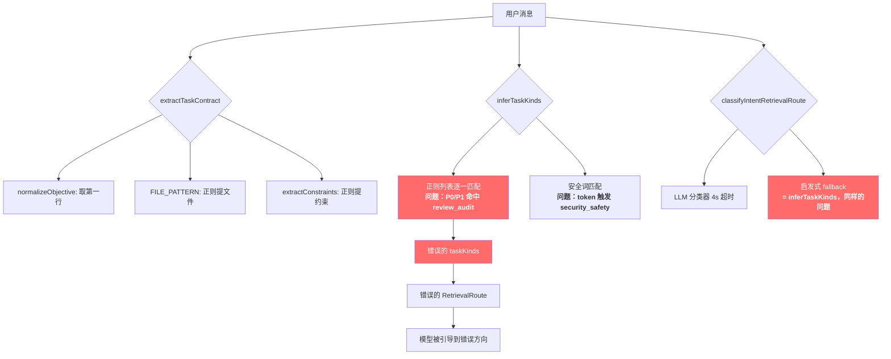

# 天枢意图识别抗锚定改造计划

## 问题描述

天枢在接收用户第一句话时，意图识别容易被 **文档编号类 token**（P1、P2、T1、T2、S1 等）**劫持注意力**，导致：

1. `inferTaskKinds` 正则匹配被触发到错误分类（如 P0 触发 `review_audit`）
2. LLM 意图路由器在 4s 超时内也容易被 salient token anchoring
3. 用户真实意图（如"帮我看看 P2 任务里那个 API 的用法"）被误读为"审查 P2 风险"

### 根因分析



### 竞品对比

| 产品 | 意图识别策略 | 抗锚定机制 |
|------|-------------|-----------|
| **Claude Code** | 无显式意图分类；靠强 system prompt + thinking 推理 | 依赖模型自身能力 + "用户意图 > 用户指令" 原则 |
| **OpenCode** | 无前置意图分类；直接将用户消息交给模型 | 依赖模型推理能力 |
| **天枢（当前）** | 三层：regex inferTaskKinds → LLM router → anti-anchoring hooks | anti-anchoring 默认关闭；regex 是主要瓶颈 |
| **天枢（目标）** | 见下方改造方案 | 全链路抗锚定，默认开启 |

---

## User Review Required

> [!IMPORTANT]
> **AntiAnchoring 默认开启**：改造后 `anti-anchoring-config.ts` 中 `enabled` 将改为 `true`。这会增加首 turn 约 0.5-2s 的延迟（LLM seed 调用），但显著提升意图准确性。如果延迟不可接受，可以只开启 `blindExploration` 而关闭 `mctsPlanning`。

> [!WARNING]
> **LLM 路由器 prompt 重写**：`buildIntentRouterPrompt` 将被重写，包含显式的「编号脱敏」指令。这会改变所有用户消息的首次分类行为。

> [!IMPORTANT]
> **Heuristic fallback 保留但降权**：`inferTaskKinds` 的正则匹配不会被删除（保持零延迟 fallback），但会增加「上下文感知过滤器」来阻止编号 token 的误触发。

## Open Questions

> [!IMPORTANT]
> 1. **AntiAnchoring 默认开启是否可以接受？** 它会增加首轮延迟（seed model 调用），但对准确性提升最大。
> 2. **是否需要为不同模型（DeepSeek vs Claude vs GPT）提供不同的抗锚定策略？** 当前设计是模型无关的。
> 3. **ProjectionDetector 的阈值 0.3 是否需要调整？** 当前值可能对中文场景偏严格。

---

## Proposed Changes

### 1. 意图提取层 — 编号脱敏 + 上下文感知过滤

#### [MODIFY] [intent-retrieval-route.ts](file:///Users/banxia/app/deepseek-tui/opencode-tui/src/agent/intent-retrieval-route.ts)

**核心改动：`inferTaskKinds` 增加「编号脱敏」预处理**

当前问题：
```typescript
// 第 213 行："审查 P0 风险" 中的 "P0" 不是 review 意图的核心信号
if (hasReviewIntent(userMessage)) add('review_audit')
// hasReviewIntent 匹配 /(审查|审核|风险|blast\s*radius|review|audit)/i
// "P0 配置怎么用" 本身不含 review 关键词 → 这里没问题
// 但 "帮我审查 P2 那个 task" → P2 不该影响分类，"审查" 是真正的信号
```

改造：
1. **增加 `stripDocumentIdentifiers(text)` 函数**：在 `inferTaskKinds` 前剥离文档编号 token（P0-P9、T1-T99、S1-S99、TASK-xxx 等），避免它们影响正则匹配
2. **增加 `extractSemanticVerb(text)` 函数**：提取用户消息中的核心动词/意图词（"帮我看看"→ code_explanation、"修复"→ bug_fix），用动词语义而非名词关键词驱动分类
3. **增加竞争消歧逻辑**：当多个 taskKind 被同时匹配时，用动词优先规则消歧

```diff
 function inferTaskKinds(userMessage: string): IntentTaskKind[] {
+  // Phase 1: 编号脱敏 — 剥离文档/任务编号 token，避免锚定
+  const sanitized = stripDocumentIdentifiers(userMessage)
+  const verb = extractSemanticVerb(userMessage)
   const text = userMessage.toLowerCase()
   const kinds: IntentTaskKind[] = []
   // ... 正则匹配使用 sanitized 而非 userMessage
+  // Phase 2: 动词消歧 — 当多种匹配时，动词语义优先
+  if (kinds.length > 1 && verb) {
+    return disambiguateByVerb(kinds, verb)
+  }
 }
```

4. **完善 `hasReviewIntent` 的边界**：`P0` 单独出现不触发 review，必须与审查动词共现

---

#### [MODIFY] [intent-extractor.ts](file:///Users/banxia/app/deepseek-tui/opencode-tui/src/agent/intent-extractor.ts)

增加编号脱敏支持：
- `extractIntents` 在提取文件路径前先过滤文档编号模式
- 避免 `P1/task-1` 这类 token 被误识别为文件路径

---

#### [NEW] [intent-sanitizer.ts](file:///Users/banxia/app/deepseek-tui/opencode-tui/src/agent/intent-sanitizer.ts)

新模块，集中管理编号脱敏和语义动词提取逻辑：

```typescript
export interface SanitizeResult {
  sanitized: string        // 脱敏后的文本（编号替换为占位符）
  strippedTokens: string[] // 被剥离的编号 token
  semanticVerb: string | null  // 提取的核心动词
}

/**
 * 文档编号脱敏 — 将 P0/P1/T1/TASK-123 等 token 替换为通用占位符，
 * 避免它们被 transformer attention 锁定导致意图偏移。
 *
 * 设计原则：
 * 1. 只脱敏「文档/任务编号」模式，不脱敏代码标识符
 * 2. 保留编号在 task-contract 中的引用（scope.mentionedFiles 不受影响）
 * 3. 脱敏后的文本仅用于意图分类，不改变用户原始消息
 */
export function sanitizeForIntentClassification(text: string): SanitizeResult

/**
 * 核心动词提取 — 从用户消息中提取驱动意图的动词。
 *
 * 中文：修复、查看、分析、设计、重构、优化、帮我看看、解释...
 * 英文：fix, review, analyze, design, refactor, optimize, explain...
 *
 * 动词 > 名词：用户说"帮我看看 P2 任务的性能"时，
 * "看看"(= code_explanation) 是意图，"P2"和"性能"是上下文。
 */
export function extractSemanticVerb(text: string): string | null

/**
 * 动词到 taskKind 的映射 — 当正则匹配产生多个候选时，
 * 用动词语义来决定主要 taskKind。
 */
export function disambiguateByVerb(
  candidates: IntentTaskKind[],
  verb: string
): IntentTaskKind[]
```

**编号脱敏的正则模式**：
```typescript
const DOC_ID_PATTERNS = [
  /\b[PpTtSs]\d{1,3}\b/g,           // P0, P1, T1, S2 等
  /\b(?:TASK|Task|task)-?\d+\b/g,    // TASK-123, task1
  /\b(?:ISSUE|Issue|issue)-?\d+\b/g, // ISSUE-456
  /\b(?:BUG|Bug|bug)-?\d+\b/g,      // BUG-789
  /\b(?:REQ|Req|req)-?\d+\b/g,      // REQ-101
  /\b#\d{1,6}\b/g,                    // #123 (issue 引用)
  /\b[A-Z]{2,5}-\d{1,5}\b/g,        // JIRA-style: PROJ-123
]
```

**动词优先级表**：
```typescript
const VERB_INTENT_MAP: Record<string, IntentTaskKind> = {
  // 查看/理解类 → code_explanation
  '看看': 'code_explanation', '查看': 'code_explanation', '分析': 'code_explanation',
  '解释': 'code_explanation', '理解': 'code_explanation', 'explain': 'code_explanation',
  
  // 修复类 → bug_fix
  '修复': 'bug_fix', '修': 'bug_fix', 'fix': 'bug_fix', '解决': 'bug_fix',
  
  // 审查类 → review_audit
  '审查': 'review_audit', '审核': 'review_audit', 'review': 'review_audit',
  
  // 设计类 → architecture_design
  '设计': 'architecture_design', '规划': 'architecture_design',
  
  // 优化类 → performance_diagnosis
  '优化': 'performance_diagnosis', '加速': 'performance_diagnosis',
  
  // 重构类 → refactor
  '重构': 'refactor', '整理': 'refactor', 'refactor': 'refactor',
  
  // 用法类 → usage_question
  '怎么用': 'usage_question', '如何': 'usage_question', 'how': 'usage_question',
}
```

---

### 2. LLM 意图路由器 — 抗锚定 prompt 重写

#### [MODIFY] [intent-retrieval-router.ts](file:///Users/banxia/app/deepseek-tui/opencode-tui/src/agent/intent-retrieval-router.ts)

**改造 `buildIntentRouterPrompt`**：

当前问题：prompt 直接将 `userMessageSnippet` 喂给 LLM，LLM 的 attention 会被 P1/P2 等 salient token 吸引。

改造：
1. **先脱敏再喂给 LLM**：使用 `sanitizeForIntentClassification` 处理 userMessage
2. **增加显式「编号不等于意图」指令**
3. **增加「动词优先」推理引导**
4. **增加 few-shot 示例**展示编号不影响分类的正确行为

```diff
 export function buildIntentRouterPrompt(input: { userMessage: string, taskContract?: TaskContract }): string {
+  const { sanitized, strippedTokens } = sanitizeForIntentClassification(input.userMessage)
   const objective = input.taskContract?.objective || input.userMessage.split('\n')[0]?.slice(0, 240) || ''
-  const snippet = input.userMessage.replace(/\s+/g, ' ').slice(0, 500)
+  const snippet = sanitized.replace(/\s+/g, ' ').slice(0, 500)

   return [
     '你是天枢的轻量意图检索路由器。不要回答用户任务，不要调用工具，不要输出解释。',
+    '',
+    '## 关键规则',
+    '1. 文档编号（P0/P1/T1/TASK-xxx/ISSUE-xxx/#123）不是任务类型信号。忽略它们。',
+    '2. 用户消息中的核心动词决定任务类型："帮我看看 P2 的性能" → 动词是"看看"→ code_explanation，不是 review_audit。',
+    '3. 先找动词，再找上下文对象，最后才看修饰词。',
+    '',
+    '## 反例（不要犯这些错误）',
+    '- "P0 配置怎么用" → usage_question（不是 review_audit）',
+    '- "帮我看看 T2 任务里的那个 bug" → bug_fix（不是 code_explanation，因为"bug"是核心对象）',
+    '- "P1 紧急修复登录问题" → bug_fix（P1 是优先级标签，不影响任务类型）',
+    '',
     '目标：先归类任务真实类型，再列出该类型应该先查的信息源。用户关键词是线索不是边界。',
+    strippedTokens.length > 0 ? `注意：已脱敏的编号标签 [${strippedTokens.join(', ')}] 是文档引用，不是任务分类依据。` : '',
     // ... rest of prompt
   ].filter(Boolean).join('\n')
 }
```

---

### 3. AntiAnchoring 系统 — 默认开启 + 增强

#### [MODIFY] [anti-anchoring-config.ts](file:///Users/banxia/app/deepseek-tui/opencode-tui/src/agent/anti-anchoring-config.ts)

```diff
 export const DEFAULT_ANTI_ANCHORING_CONFIG: AntiAnchoringConfig = {
-  enabled: false,
+  enabled: true,
   blindExploration: true,
   mctsPlanning: true,
   branches: 3,
   planningTurn: 1,
   projectionThreshold: 0.4,
   seedMaxTokens: 512,
 }
```

---

#### [MODIFY] [anchor-vault.ts](file:///Users/banxia/app/deepseek-tui/opencode-tui/src/agent/anchor-vault.ts)

增强 `seal` 方法：
1. **排除文档编号 token**：P0/P1/T1 等不应被 seal 为 anchor phrase
2. **增加语义权重**：动词和领域名词的权重高于通用修饰词

```diff
 export class AnchorVault {
   seal(userMessage: string): SealedAnchor {
+    // 编号脱敏：P1/T2 等文档标识不应成为 anchor phrase
+    const sanitized = stripDocumentIdentifiers(userMessage)
-    const identifiers = userMessage.match(/[a-zA-Z_][a-zA-Z0-9_]{2,}/g) ?? []
-    const cjkTerms = userMessage.match(/[一-鿿]{2,6}/g) ?? []
+    const identifiers = sanitized.match(/[a-zA-Z_][a-zA-Z0-9_]{2,}/g) ?? []
+    const cjkTerms = sanitized.match(/[一-鿿]{2,6}/g) ?? []
     const all = [...identifiers, ...cjkTerms]
       .filter(t => !STOPWORDS.has(t.toLowerCase()))
     const phrases = [...new Set(all)]
-    return { phrases, original: userMessage, sealedAt: Date.now() }
+    return { phrases, original: sanitized, sealedAt: Date.now() }
   }
```

---

#### [MODIFY] [blind-exploration-hook.ts](file:///Users/banxia/app/deepseek-tui/opencode-tui/src/agent/hooks/blind-exploration-hook.ts)

增强 blind exploration 的 prompt，加入「编号脱敏」提示：

```diff
   ctx.effects.injectUserMessage(
     '[blind-exploration] Before committing to an approach: ' +
     'explore the problem space broadly. Consider alternative framings, ' +
     'adjacent problems, and non-obvious angles. ' +
-    'Do not fixate on the most obvious interpretation of the request.',
+    'Do not fixate on the most obvious interpretation of the request. ' +
+    'Document identifiers (P0, P1, T1, TASK-xxx) are reference labels, ' +
+    'not task types — focus on the semantic verb and the actual problem described.',
   )
```

---

### 4. Task Contract 层 — objective 提取抗锚定

#### [MODIFY] [task-contract.ts](file:///Users/banxia/app/deepseek-tui/opencode-tui/src/context/task-contract.ts)

1. **`normalizeObjective` 增加编号脱敏**：objective 是模型在整个会话中反复参考的锚点文本，必须干净
2. **`isActionableObjective` 增加编号排除**：P1/P2 不应增加 actionability 权重

```diff
 function normalizeObjective(userMessage: string): string {
   const stripped = stripGreetingPrefix(userMessage)
   const msg = stripped || userMessage
+  // 编号脱敏：objective 作为模型的全程参考锚点，不应包含文档编号
+  const desensitized = stripDocumentIdentifiers(msg)
-  const firstLine = msg.split('\n')[0]?.trim() ?? ''
+  const firstLine = desensitized.split('\n')[0]?.trim() ?? ''
   return firstLine.length > 200 ? firstLine.slice(0, 197).trimEnd() + '...' : firstLine
 }
```

---

### 5. System Prompt — 增加「编号不等于意图」原则

#### [MODIFY] [static.ts](file:///Users/banxia/app/deepseek-tui/opencode-tui/src/prompt/static.ts)

在 `<beliefs>` 或 `<rules>` 中增加一条：

```diff
 <rules>
   <rule name="verify-first">
   ...
   </rule>
+
+  <rule name="intent-over-label">
+  用户消息中的文档编号（P0/P1/T1/TASK-xxx/#123 等）是引用标签，不是任务类型。
+  理解用户意图时：
+  1. 先找核心动词（修复、查看、设计、优化...）——动词决定你该做什么。
+  2. 再找动词的宾语（哪个文件、哪个功能、哪个问题）——宾语决定你该看哪里。
+  3. 编号只是上下文标记——它们帮你定位，但不改变任务性质。
+  "帮我看看 P2 里那个 API" = 代码查看（code_explanation），不是 P2 审查（review_audit）。
+  </rule>
 </rules>
```

---

### 6. Projection Detector — 中文优化

#### [MODIFY] [projection-scorer.ts](file:///Users/banxia/app/deepseek-tui/opencode-tui/src/agent/projection-scorer.ts)

当前 `score` 方法使用简单字符重叠率，中文场景下表现不佳：
- 中文 2 字词高度重叠（"修复" 在输出中反复出现不代表锚定）
- 英文标识符（camelCase）长度不一，短标识误判率高

改造：
1. **按 token 而非字符计算重叠**
2. **增加 CJK 长度归一化**
3. **排除高频动词**（修复/查看/分析等自然出现的动词不算锚定）

```diff
 score(output: string, anchorPhrases: string[]): number {
   if (!output || !anchorPhrases.length) return 0
-  const outputLower = output.toLowerCase()
-  const outputLen = outputLower.length || 1
-  let totalOverlap = 0
-  for (const phrase of anchorPhrases) {
-    const p = phrase.toLowerCase()
-    let idx = 0
-    while ((idx = outputLower.indexOf(p, idx)) !== -1) {
-      totalOverlap += p.length
-      idx += p.length
-    }
-  }
-  return Math.min(1, totalOverlap / outputLen)
+  // 过滤高频动词 — 自然语言中频繁出现不等于锚定
+  const filtered = anchorPhrases.filter(p => !HIGH_FREQ_VERBS.has(p.toLowerCase()))
+  if (filtered.length === 0) return 0
+  const outputLower = output.toLowerCase()
+  const outputTokens = tokenize(outputLower)
+  const outputTokenCount = outputTokens.length || 1
+  let matchedTokens = 0
+  for (const phrase of filtered) {
+    const p = phrase.toLowerCase()
+    for (const token of outputTokens) {
+      if (token === p || token.includes(p)) matchedTokens++
+    }
+  }
+  return Math.min(1, matchedTokens / outputTokenCount)
 }
```

---

### 7. 端到端测试 — 编号脱敏回归测试

#### [NEW] [intent-sanitizer.test.ts](file:///Users/banxia/app/deepseek-tui/opencode-tui/src/agent/__tests__/intent-sanitizer.test.ts)

覆盖以下场景：

| 输入 | 期望 taskKind | 当前错误 |
|------|-------------|---------|
| "P0 配置怎么用" | usage_question | review_audit |
| "帮我看看 T2 那个 task 的 bug" | bug_fix | code_explanation |
| "P1 紧急修复登录问题" | bug_fix | review_audit |
| "S2 那个需求设计一下" | architecture_design | — |
| "TASK-123 的性能优化" | performance_diagnosis | — |
| "#456 issue 的修复" | bug_fix | — |
| "审查 P0 风险" | review_audit | ✓ (正确, 但需保持) |

#### [MODIFY] [intent-retrieval-anti-anchor.test.ts](file:///Users/banxia/app/deepseek-tui/opencode-tui/src/agent/__tests__/intent-retrieval-anti-anchor.test.ts)

增加编号脱敏相关的测试用例。

---

### 8. 配置层 — 暴露意图脱敏开关

#### [MODIFY] [create-agent-config.ts](file:///Users/banxia/app/deepseek-tui/opencode-tui/src/agent/create-agent-config.ts)

在 agent config 中增加 `intentSanitizer` 配置项，允许用户关闭编号脱敏（某些场景下编号确实是任务标识）。

#### [MODIFY] [loop-types.ts](file:///Users/banxia/app/deepseek-tui/opencode-tui/src/agent/loop-types.ts)

```diff
 export interface AgentConfig {
   ...
+  /** Intent sanitizer configuration — controls document ID desensitization */
+  intentSanitizer?: IntentSanitizerConfig
 }
```

---

## 改造关系图

```mermaid
graph TB
    subgraph "用户输入"
        U[用户消息<br/>"帮我看看 P2 里那个 API"]
    end
    
    subgraph "Phase 1: 脱敏层 [NEW]"
        S[intent-sanitizer.ts<br/>stripDocumentIdentifiers]
        V[extractSemanticVerb<br/>→ "看看"]
        S --> |脱敏后| S1["帮我看看 [REF] 里那个 API"]
    end
    
    subgraph "Phase 2: 分类层 [MODIFIED]"
        T[inferTaskKinds<br/>使用脱敏文本]
        LLM[LLM Router<br/>脱敏 prompt + few-shot]
        T --> |candidates| D[disambiguateByVerb]
        V --> D
        D --> |final| K["code_explanation"]
    end
    
    subgraph "Phase 3: 路由层 [EXISTING]"
        R[RetrievalRoute]
        AA[AntiAnchoring<br/>默认开启]
    end
    
    subgraph "Phase 4: Prompt 注入 [MODIFIED]"
        P[intent-retrieval-route XML]
        SP[static.ts<br/>intent-over-label rule]
    end
    
    U --> S
    U --> V
    S1 --> T
    S1 --> LLM
    K --> R
    R --> P
    AA --> |seed paths| P
    SP --> |system prompt| P
```

---

## Verification Plan

### Automated Tests

```bash
# 1. 新增的 intent-sanitizer 单元测试
npx tsx --test src/agent/__tests__/intent-sanitizer.test.ts

# 2. 现有 anti-anchor 测试回归
npx tsx --test src/agent/__tests__/intent-retrieval-anti-anchor.test.ts

# 3. intent-retrieval-route 测试回归  
npx tsx --test src/agent/__tests__/intent-retrieval-route.test.ts

# 4. task-contract 测试回归
npx tsx --test src/context/__tests__/task-contract.test.ts

# 5. intent-retrieval-router 测试回归
npx tsx --test src/agent/__tests__/intent-retrieval-router.test.ts

# 6. TypeScript 类型检查
npx tsc --noEmit

# 7. 全量测试
npx tsx --test src/**/__tests__/*.test.ts
```

### Manual Verification

用以下真实场景验证改造效果：

1. **编号 + 用法**：输入 "P0 配置怎么用" → 期望 usage_question
2. **编号 + 修复**：输入 "P1 紧急修复登录" → 期望 bug_fix
3. **编号 + 查看**：输入 "帮我看看 T2 里那个 API" → 期望 code_explanation
4. **编号 + 审查**：输入 "审查 P0 风险" → 期望 review_audit（正确保留）
5. **编号 + 设计**：输入 "设计一下 TASK-123 的方案" → 期望 architecture_design
6. **无编号基线**：输入 "这个 API 怎么用" → 期望 usage_question（不应受改造影响）
