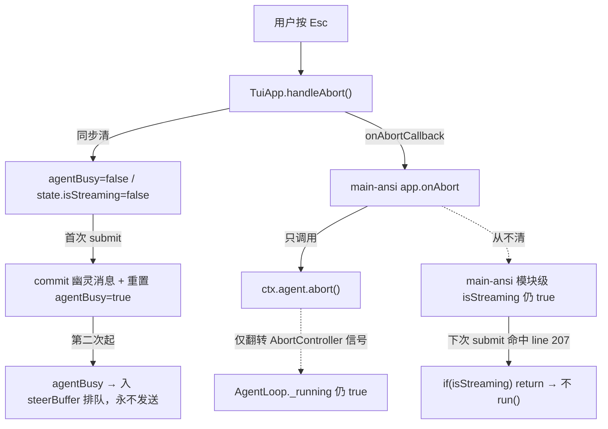

# Abort 交互与容错/SSE 韧性增强

## 根因（已由三路子代理证据定位）

调查记录：TUI 死会话 · AgentLoop abort · SSE 审计

T9 存在**两个独立的 streaming 闩**，清除时机不同 —— 这是 bug 的根：

- TuiApp 同步复位（app.ts:977-990），但 `main-ansi` 模块级 `isStreaming` 只在 loop 回调 `onAbort` 时清（main-ansi.ts:213-221），用户 Esc 路径不经桥接、永不清（main-ansi.ts:231-234）。
- 首次 submit：`agentBusy` 已被清→提交幽灵消息+重置 `agentBusy=true`，但 `main-ansi` `if(isStreaming) return`（main-ansi.ts:207）→ 不 `agent.run()`。
- 之后：`agentBusy===true`→输入进 `steerBuffer`（app.ts:252-256）→ 死。
- 更深一层：`AgentLoop._running` 在 `run()` settle 前一直 true（loop.ts:1133-1147）；而工具批 `executeBatch` **没有** `rejectOnAbort` 包裹（loop.ts:2163），mid-tool 卡住时 settle 最坏要等 240s 心跳看门狗；bash 完全忽略 `params.abortSignal`（bash.ts:100-223）。

SSE 层本身较健壮（abort 已穿透 fetch 与 reader、有多级 timeout 与重试），缺陷主要在 **TUI 状态双门** 与 **agent 工具 abort 覆盖**。

---

## Phase 0 — 根除卡死 bug（P0）

### 0A · TUI 统一 streaming 权威 + 世代守卫
- **目标**：以 `TuiApp.agentBusy` 为唯一权威，删除 `main-ansi` 模块级 `isStreaming`；加世代计数防 stale 回调。
- **改 src/main-ansi.ts**：删除 `let isStreaming` 及 :207 早退；`app.onSubmit` 仅在 TuiApp 判定 idle 时触发（app.ts:252 已是 busy→steer / idle→callback 的门），故回调里直接 `ctx.agent.run(text, callbacks)`，不再自管标志。`onTurnComplete(isFinal)/onError/onAbort` 不再清外部标志。
- **改 src/tui/engine/app.ts**：新增 `private runGen = 0`；`handleAbort()` 中 `this.runGen++` 并同步清 `agentBusy`（已有）。提交新 turn 时记录当前 gen。
- **改 src/tui/engine/bridge.ts**：`wrapCallbacksWithTuiApp` 接收一个 `gen` 与 `() => app.currentGen`；每个被包裹回调先 `if (gen !== currentGen()) return`，丢弃被中断旧 run 的迟到 `onTextDelta/onToolResult/onAbort`（消除反向竞态：旧 run 的 onAbort 清掉新 run 的 busy）。
- **验收（RED→GREEN, node:test）**：模拟"run 永不结束"→ `app` 注入 Esc → 再 submit 文本 → 断言 `agent.run` 以新文本被调用一次、无幽灵 commit、未走 steerBuffer；迟到旧回调被 gen 守卫丢弃。

### 0B · AgentLoop abort 可靠 settle
- **目标**：用户 abort 后 `run()` 在有界时间内 settle、`onAbort` 触发、`_running` 复位，即使工具忽略信号。
- **改 src/agent/loop.ts**：用 `rejectOnAbort(this.toolExecution.executeBatch(...), signal, 'tools')` 包裹 :2163；同样为最终 `turnCompletion.complete`（:2233）与 rate-limit sleep（:2100）补 abort-race。
- **改 src/agent/tool-pipeline.ts**：对 `withToolTimeout` 之前的阻塞 await（approval :551、checkpoint/fileHistory :570-585）补 `rejectOnAbort`，使审批/快照阶段卡住也能立即中断。
- **改 src/agent/tool-execution.ts**：`runPostTool` 循环（:441）补 abort-race。
- **验收**：工具 `execute` 永不 resolve 且忽略 signal → `agent.abort()` → 断言 `run()` 在 ~ms 级 settle、`onAbort` 触发、`_running===false`；审批阶段卡住同样可中断。

---

## Phase 1 — 工具协作式取消 + 中断恢复（P1）

### 1A · bash 响应 abortSignal
- **改 src/tools/bash.ts:100**：监听 `params.abortSignal`，abort 时 `killProcessTree(child, SIGTERM)`（已有 helper），短延迟后 SIGKILL，resolve 为"已中断"结果。验收：spawn 长命令→abort→进程树被杀、Promise settle。

### 1B · per-session 进程清理
- **改 src/agent/loop.ts:745** `abort()`：对**本实例**追踪的子进程做范围化 kill（不恢复被移除的全局 `killAll` 硬锤）。验收：两个 AgentLoop 实例，abort 其一不影响另一实例的子进程。

### 1C · 中断 UX 与队列策略
- **改 src/tui/engine/app.ts:977** `handleAbort()`：commit `⏹ Interrupted` 到 scrollback；steer 队列策略对齐 Ink（保留排队指引，app.ts:979 当前清空）改为可保留；并清 `approvalPending`（当前 abort 中途审批会残留审批态）。验收：abort 后有可见中断提示、审批态被复位、（按选择）steer 队列保留。

---

## Phase 2 — SSE 层韧性硬化（P2）

> SSE 已具备 abort 穿透 + 多级 timeout（首字节 45-180s / idle 120-300s / 硬顶 10min）+ 重试；以下为硬化，非补缺。

### 2A · keepalive 感知的 idle stall
- **改 src/api/openai-client.ts:363 / codex-client.ts:248 / anthropic-client.ts:330**：`resetIdleTimer()` 只在**解析出含模型内容的事件**时重置，而非任意 `value` 字节，防服务端心跳/空白填充使 stall 检测失效（最坏拖到 10min 硬顶）。
- **验收**：注入"只发 keepalive 注释、无内容"的 mock SSE → 断言 idle timeout 仍按期触发。

### 2B · 真实 thinking-stall（OpenAI）
- **改 src/api/openai-client.ts:63**：`THINKING_STALL_TIMEOUT_MS` 当前 = `SLOW_READ_TIMEOUT_MS`(300s) 实为禁用，但错误文案写"90s"。改为可配置（默认放宽但 < read），并修正文案。

### 2C · fetch+reader 共享 lifecycle controller
- **改各 client**：让 mid-body abort 不只 `reader.cancel()`（keep-alive 下 TCP 可能不拆），而是 abort 同一个传入 `fetch` 的 lifecycle controller，确保连接被拆。三个 client `stream()` 创建 `lifecycle = new AbortController()`、由外部 signal 联动、把 `lifecycle.signal` 传给 fetch；解析方法在 `finally` 中 `lifecycle.abort()`（覆盖正常结束 / idle 或硬顶超时 / 错误 / 用户 abort 所有退出路径）。验收：parse 在任意退出路径后 lifecycle 处于 aborted。

### 2D · agent 层重连（可选/受保护，默认关）
- **改 src/agent/loop.ts**：客户端重试耗尽后，依 `classifyApiError().shouldReconnect` 做**有界**重连；丢弃本轮 partial blocks 与 streamedText、用**相同 request**（消息历史不变）重发，严格守护 prefix cache 不污染。默认关，`agentReconnect.enabled` flag 开启；可配 `maxAttempts`、`backoffMs`。验收：默认不重连、透传 onError；开启后失败→相同 request 重连成功、不触发 onError；耗尽后透传 onError。

---

## 工程纪律
- 每项 RED→GREEN（`node:test` + `node:assert/strict`），`npm run typecheck` 零错，改动文件 `ReadLints` 无新增 lint。
- 不动 Ink 路径（`main.tsx`/`app.tsx`）；改动集中在 `main-ansi.ts` + `src/tui/engine/*` + `src/agent/*` + `src/api/*`。
- 全量 TUI + agent 测试无新增回归（已知的预存在失败除外）。
- 提交按 Phase 分组。

## 建议落地顺序
Phase 0（0A→0B，根除卡死）→ Phase 1（协作取消 + UX）→ Phase 2（SSE 硬化）。Phase 0 完成即解除用户撞到的死会话。

## 落地状态
全部 9 项（0A/0B/1A/1B/1C/2A/2B/2C/2D）已完成。新增测试套件：
`abort-resubmit` · `abort-tool-hang` · `agent-reconnect` · `bash-abort` · `abort-isolation` · `abort-interrupt-ux` · `sse-keepalive-stall` · `thinking-stall-config` · `fetch-lifecycle-abort`。
