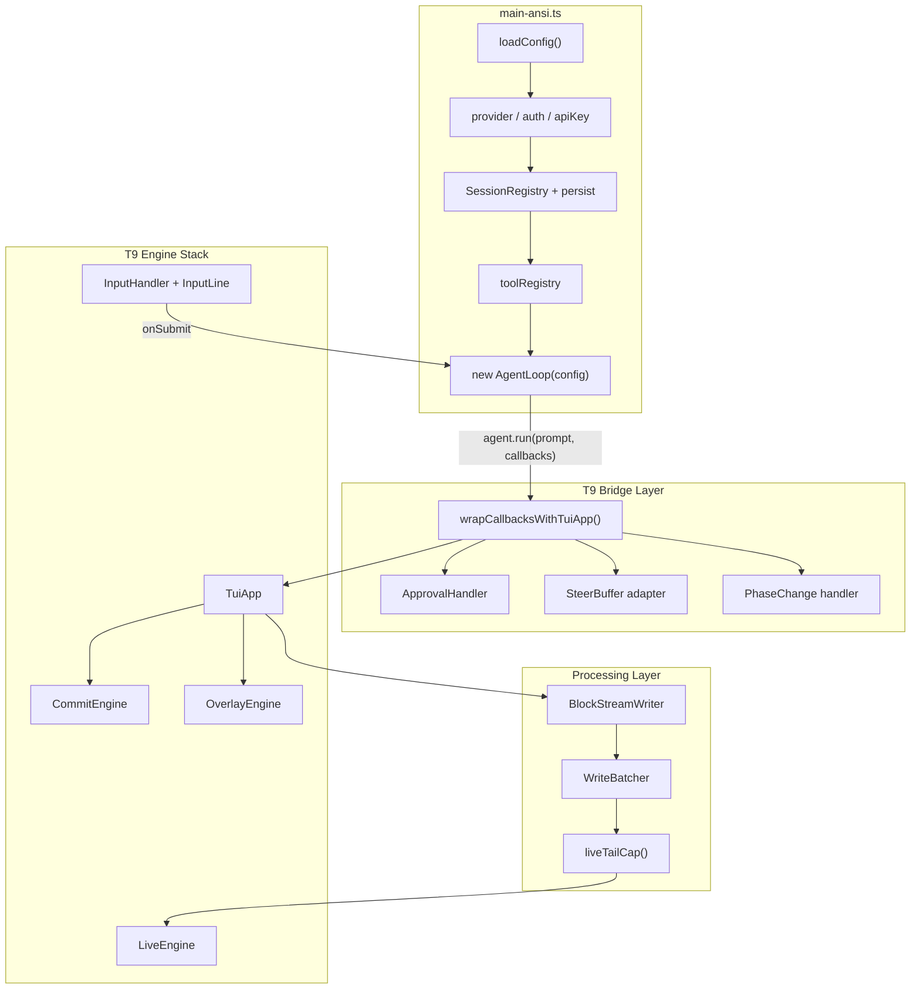

# T9 AgentLoop 接线方案

## 设计原则

不重复 `app.tsx` 的 1624 行巨型组件——T9 的优势是事件驱动，应把 app.tsx 中的纯逻辑层提取复用，只重写渲染通道。

## 架构总览



---

## Phase A：类型对齐 + 回调补齐

**目标**：让 `wrapCallbacksWithTuiApp()` 返回值满足 `loop-types.ts` 的 `AgentCallbacks` 类型。

**改动文件**：
- [src/tui/engine/app.ts](src/tui/engine/app.ts) — 扩展 `AgentCallbacks` 接口
- [src/tui/engine/bridge.ts](src/tui/engine/bridge.ts) — 补齐所有回调

**具体项**：

1. **`onApprovalRequired`（必需）** — TuiApp 新增审批状态 + 审批 UI 渲染
   - 在 live region 显示审批提示：工具名 + 输入摘要 + `[y/n/e]` 快捷键
   - `InputHandler` 注册 `overlay:y` / `overlay:n` / `overlay:e` 事件
   - 返回 `Promise<ApprovalResult | boolean>`，通过 resolve pending promise 机制
   - 参考 `app.tsx` 的 `pendingApproval` 状态

2. **`onToolResult` 第 6 参数 `uiContent`** — bridge 透传，TuiApp 优先显示 `uiContent`（如有）

3. **`onToolResult` 流式 chunk 模式（`isError === undefined`）** — TuiApp 新增 `toolAccumulator: Map<string, string>`
   - `isError === undefined` → 累加到 accumulator，更新 live tool card
   - `isError` 有值 → 终态，commit 到 scrollback

4. **`onSteerDrain`（可选）** — 复用现有 `SteerBuffer`（零依赖纯逻辑），bridge 中注入 `() => steerBuffer.drain()`

5. **`onPhaseChange`（可选）** — TuiApp 新增 `phase` 状态，GlanceBar 显示当前 phase

6. **`onIntentPreview`（可选）** — 类似审批，live region 显示意图摘要 + `[continue/veto]`

7. **`onTurnComplete` 的 `usage` 类型** — 从 `unknown` 改为 `Partial<Usage>`，TuiApp 解析并更新 GlanceBar 的 cost/token 显示

8. **中间 turn（`isFinal: false`）处理** — 归档当前 streamText 到 scrollback，清空 live buffers，但保持 "streaming" 状态不变

---

## Phase B：中间处理层

**目标**：在 AgentLoop 回调和 LiveEngine 之间加入与 Ink 版等效的缓冲层，防止高频 delta 导致渲染抖动。

**策略**：直接复用现有模块（它们都是零 React 依赖的纯逻辑）。

1. **BlockStreamWriter** — [src/tui/block-stream-writer.ts](src/tui/block-stream-writer.ts)，零改动直接复用
   - 每 turn 开始新建，`onBlock` 回调送入 TuiApp 的 `handleBlockEmit`
   - `handleTextDelta` 改为 `blockWriter.push(text)` 而非直接 `streamText +=`

2. **WriteBatcher** — 新建 `src/tui/engine/write-batcher.ts`，替代 RenderBatcher
   - 同样的 microtask 合并，但输出不走 React setState，而是调用 `LiveEngine.render()`
   - 比 RenderBatcher 更简单：不需要 React 调度语义

3. **liveTailCap** — 直接复用 [src/tui/live-tail-cap.ts](src/tui/live-tail-cap.ts) 的 `capLiveTailMarkdownSafe`
   - 在 `renderLive()` 中对 streamText 做 cap，确保 live region 不超过 `maxRows`

4. **SteerBuffer** — 直接复用 [src/tui/steer-buffer.ts](src/tui/steer-buffer.ts)
   - TuiApp 构造时创建，InputLine submit 时如果 `isStreaming` 则 `push` 而非 `onSubmit`

---

## Phase C：main-ansi.ts 完整化

**目标**：`main-ansi.ts` 成为可独立运行的完整入口，与 `main.tsx` 功能对等（交互 TUI 路径）。

**从 main.tsx 提取复用的初始化逻辑**（大部分是纯函数，不依赖 React）：

| 初始化步骤 | 来源 | 可复用性 |
|-----------|------|---------|
| `loadConfig()` | `src/config/` | 直接调用 |
| Provider / Auth / ApiKey | `main.tsx` 内联 | 提取为 `resolveProviderAuth()` |
| `SessionRegistry.create()` | `src/session/` | 直接调用 |
| `getOrCreateSessionId()` | `main.tsx` 内联 | 提取为共享函数 |
| `createDefaultTools()` | `src/tools/` | 直接调用 |
| `createAgentConfig()` | `src/agent/` | 直接调用 |
| `new AgentLoop(config)` | `src/agent/loop.ts` | 直接调用 |
| `SessionPersist` / `FileHistory` | `src/session/` | 直接调用 |
| MCP 初始化 | `src/tools/mcp/` | 直接调用 |
| `gracefulShutdown()` | `main.tsx` | 提取为共享函数 |

**main-ansi.ts 的完整流程**：

```
1. loadConfig + resolveProviderAuth
2. SessionRegistry + heartbeat
3. toolRegistry + MCP
4. new AgentLoop(createAgentConfig(...))
5. new TuiApp({ stdout, stdin, ... })
6. app.registerOverlays(realDataSources)
7. steerBuffer = new SteerBuffer()
8. app.onSubmit(text => {
     if (isStreaming) steerBuffer.push(text)
     else agent.run(text, wrapCallbacksWithTuiApp(app, { onSteerDrain: () => steerBuffer.drain() }))
   })
9. signal handlers + gracefulShutdown
10. welcome screen render
```

**提取策略**：不动 `main.tsx`，而是把可复用逻辑提取到 `src/bootstrap.ts`，两个入口都从中 import。这样 Ink 路径零回归风险。

---

## Phase D：slash 命令 + 全局快捷键

复用 [src/tui/slash-commands.ts](src/tui/slash-commands.ts)（纯逻辑），在 TuiApp 的 `onSubmit` 中增加 slash 路由：

- `/model` → 模型切换
- `/compact` → 手动压缩
- `/undo` → 回滚
- `/clear` → 清屏（`CommitEngine` 无需操作，`LiveEngine.reset()`）
- `/starmap` / `/chronicle` / `/cockpit` → 激活 overlay

全局快捷键（InputHandler 注册）：
- `Ctrl+C` / `Esc` → abort agent
- `Ctrl+L` → 清屏
- `Tab` → slash 补全

---

## 风险与策略

- **最大风险**：审批 UI。Ink 版用 React 组件管理异步 Promise，T9 需要用 `InputHandler` 的事件模式 + pending Promise 模拟。建议先实现 auto-approve 模式（`onApprovalRequired: async () => true`），后续迭代补充交互审批。
- **中间 turn 状态管理**：Ink 版有复杂的 `streamGenRef` 防 stale 逻辑。T9 用类属性 + 单线程特性天然避免此问题，但需确保 abort 时的清理顺序正确。
- **回归保护**：全程不修改 `main.tsx` 和 `app.tsx`，T9 路径通过 `main-ansi.ts` 独立启动。

## 建议实施顺序

Phase A → B → C → D，每个 phase 独立可验证。Phase A 完成后即可通过测试验证类型对齐；Phase C 完成后可首次端到端运行。
