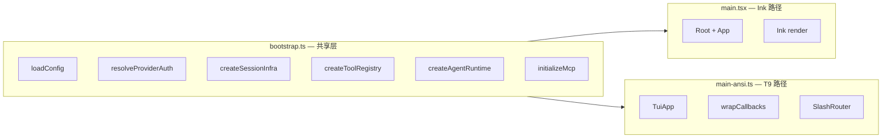

# T9 对标 Claude Code 完整方案

## 现状

T9 渲染引擎骨架就绪（14 commits），但入口是空壳（5%）、业务逻辑大量 stub（15-20%）。目标：让 `main-ansi.ts` 成为可完全替代 Ink 的生产入口。

## 架构策略



**核心原则**：提取 `bootstrap.ts` 共享初始化，`main.tsx` 零回归，T9 路径独立验证。

---

## M1：Bootstrap + 端到端对话（让 T9 "能说话"）

**目标**：`npx tsx src/main-ansi.ts` 能完成一轮完整对话。

**文件**：新建 [src/bootstrap.ts](src/bootstrap.ts)，改 [src/main-ansi.ts](src/main-ansi.ts)

**提取到 bootstrap.ts 的函数**（从 `main.tsx` + Root）：

- `setupHttpProxy()` — undici 代理
- `loadRivetConfig(cwd, args)` — `loadLayeredConfig` + approval overlay
- `resolveProviderAndAuth(config, args)` — provider/OAuth/apiKey 一站式
- `createSessionInfrastructure(config)` — SessionRegistry + heartbeat + crashedSession
- `createInteractiveToolRegistry(refs, deps)` — 默认工具 + delegate/team/deliver
- `createAgentRuntime(deps)` — AgentLoop + DelegationCoordinator
- `initializeMcp(config, registry, agent)` — McpManager async init
- `initializeLsp(cwd, registry, agent)` — LspManager async init
- `bootstrapInteractiveSession(opts)` — 聚合入口，返回 `BootstrapContext`
- `createShutdownHandler(ctx)` — session persist + MCP teardown + killAll

**main-ansi.ts 完整化**：

```
ctx = await bootstrapInteractiveSession()
app = new TuiApp({ stdout, stdin, cols, rows, modelName })
steerBuffer = new SteerBuffer()
app.onSubmit(text => {
  if (isStreaming) steerBuffer.push(text)
  else ctx.agent.run(text, wrapCallbacksWithTuiApp(app, {
    onSteerDrain: () => steerBuffer.drain()
  }))
})
app.onExit(() => createShutdownHandler(ctx)())
```

**同步改动**：
- `main.tsx` 的 Root 改为 import `bootstrap.ts`（行为不变，只是代码搬家）
- 消除 module-level `_xxxRef` 全局变量，改为 `RuntimeRefs` 对象

**验证**：`npx tsx src/main-ansi.ts` → 输入问题 → 收到流式回复 → Ctrl+C 退出

---

## M2：核心交互闭环（让 T9 "能用"）

**目标**：覆盖日常编码对话的完整交互需求。

### M2.1 用户消息 commit + 欢迎屏

- `handleSubmit` 中调用 `formatUserMessage` commit 到 scrollback（当前从未使用）
- 首次启动渲染欢迎信息（model name + cwd + 快捷键提示）

### M2.2 Live 工具卡渲染

- `renderLive()` 中增加 `toolAccumulator` 内容的工具卡显示
- 流式 chunk 在 live 区实时更新，终态 commit 到 scrollback
- `formatToolCard` 已有，只需接入 renderLive 管线

### M2.3 交互式审批

- 审批触发时切换 InputHandler 到 `approval` 模式
- Live region 显示：工具名 + 输入摘要 + `[y] approve  [n] deny  [e] edit`
- 用 pending Promise 阻塞 `onApprovalRequired` 直到用户按键
- 支持 `approvalMode` 配置（auto / auto-edit / manual）

### M2.4 SteerBuffer 实装

- 流式时 submit 走 `steerBuffer.push()`，live 区显示队列计数
- `onSteerDrain` 返回实际 buffer 内容
- 注入后 commit system 消息到 scrollback

### M2.5 Slash 命令复用

- 新建 `src/tui/engine/slash-router.ts`，桥接 `slash-commands.ts` 的 `SlashHandlerContext`
- 优先接入：`/help`、`/model`、`/compact`、`/verbose`、`/auto`、`/effort`、`/theme`、`/undo`、`/debug`、`/mcp`
- 未识别命令 → 透传给 agent（`/team`、`/review`、`/plan` 等）

### M2.6 GlanceBar 指标完善

- `handleTurnComplete` 解析 `Partial<Usage>` → cost、input/output tokens
- 从 session 读 cache hit rate
- 计算 context ratio（used / window）
- Git branch 名（`git rev-parse --abbrev-ref HEAD`）

### M2.7 capLiveTailMarkdownSafe

- 复用 [src/tui/live-tail-cap.ts](src/tui/live-tail-cap.ts) 限制 live 区高度
- `renderLive()` 中对 streamText 做 cap，确保不超过 `rows - chromeRows`

---

## M3：会话管理与安全（让 T9 "可靠"）

### M3.1 Session restore

- 启动时检测 `persist.loadOai()` 有消息 → 提示 `[r] restore  [n] new session`
- `/sessions` 列出历史、`/resume N` 恢复
- 回放消息到 scrollback（`replayMessagesToLogEntries`）

### M3.2 Intent preview UI

- 类似审批，live 区显示意图摘要 + confidence + `[y/n/a]`
- pending Promise 模式

### M3.3 Rollback + Checkpoint

- `/rollback` → 列出 checkpoint 列表 → 确认恢复
- Checkpoint commit 显示完善（当前仅一行文本）

### M3.4 Ctrl+C 完整行为

- 空闲 + 输入非空 → 清空输入（不退出）
- 空闲 + 输入为空 → 显示 `(Ctrl+C again to exit)`，2s 内再按 → 退出
- 流式 → abort + 保留 Steer 队列 + 显示 "Interrupted"
- 审批中 → deny

### M3.5 Overlay 键控

- Overlay 激活时 InputHandler 切换到 `overlay` 模式
- Esc → 关闭 overlay
- Pager：j/k 或方向键翻页，q 退出
- Palette：方向键选择，Enter 执行，q 退出
- Esc 双击 → 打开 rewind overlay

### M3.6 Turn summary + Evidence

- `handleTurnComplete(isFinal=true)` 后生成 turn summary（file count、verification count）
- 复用 `formatTurnSummary` commit 到 scrollback
- `/verify` 命令

---

## M4：体验打磨（让 T9 "好用"）

### M4.1 Welcome 屏 ANSI 版

- ASCII art logo + model info + cwd + 快捷键指南
- `formatWelcomeScreen(config, modelName, cwd, theme): string[]`

### M4.2 Team + Question 特殊 UI

- `team_orchestrate` → 多 agent 进度面板
- `ask_user_question` → live 区问答卡

### M4.3 Interview mode

- `/interview` 触发标记解析模式
- 独立问答流程

### M4.4 Plan mode

- `/plan-mode`、`/plan-list`、`/plan-approve`、`/plan-reject`

### M4.5 Context 管理

- `/context` 系列：pin/unpin、claims、antibodies、conflicts、reload、export/import

### M4.6 Cockpit overlay

- 6 面板：summary/trace/verify/context/safety/model
- 从 `agent.getEvidenceState()` 等读取实时数据

### M4.7 Starmap/Chronicle 真实数据

- Starmap：从 `starDomainRegistry` 读取星域列表
- Chronicle：从 `SessionPersist` 读取会话历史

---

## M5：切换与清理（让 T9 "上线"）

### M5.1 Feature flag 切换

- 环境变量 `RIVET_TUI=ansi` 在 `main.tsx` 中路由到 T9 路径
- 默认仍走 Ink，可选 T9

### M5.2 性能基准

- 帧率对比（Ink vs T9，100 行流式输出）
- 内存占用对比（1000 条 scrollback）
- CPU 对比（持续流式 10 分钟）

### M5.3 全量回归

- `npm test` 2340+ 测试通过
- E2E 手工测试清单：对话、工具、审批、session restore、rewind、overlay

### M5.4 删除旧代码

- 移除 36 个 `.tsx` 组件
- 移除 `ink`、`react`、`yoga-wasm-web` 依赖
- 移除 `patches/ink+6.8.0.patch`
- 更新 `tsup` 配置移除 JSX 支持

### M5.5 文档更新

- README 更新架构图
- CLAUDE.md 更新 TUI 层描述

---

## 里程碑工作量估算

| 里程碑 | 核心工作 | 预估行数 | 优先级 |
|--------|---------|---------|--------|
| M1 Bootstrap | bootstrap.ts + main-ansi.ts | ~500 新 + ~300 搬 | 最高 |
| M2 核心交互 | 审批/Steer/slash/GlanceBar/liveTool | ~600 新 | 高 |
| M3 会话安全 | session/rollback/Ctrl+C/overlay | ~400 新 | 高 |
| M4 体验打磨 | welcome/team/interview/cockpit | ~500 新 | 中 |
| M5 切换清理 | flag/benchmark/delete/doc | ~100 新 - 6500 删 | 中 |

**M1+M2 完成后即可日常使用，M3 后可替代 Ink 做主路径。**
