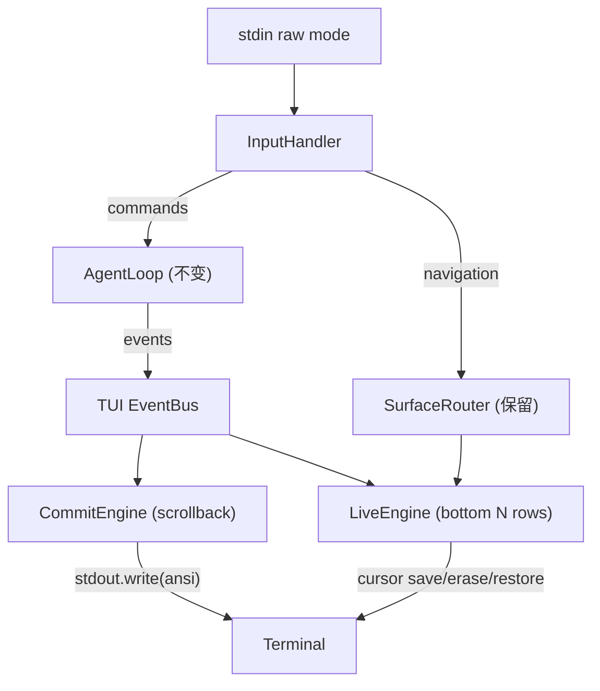

# T9 · 天枢 TUI 渲染引擎重写 — 方案 C: Drop React, Pure ANSI

> 日期：2026-06-10
> 性质：范式级 TUI 重写计划。去除 React / Ink / Yoga 全套依赖，自研纯 ANSI 渲染引擎。
> 前置分析：Ink 6.8 三大渲染缺陷已定性（全屏清屏炸弹、resize 鬼影、O(W*H) 帧分配），patch 只治标不治本。
> 参照系：Claude Code（raw ANSI + tree-sitter）、OpenCode（Go + Bubble Tea fullscreen TUI）。
> 关联：T8 Tauri 桌面化 — Web 前端的 TUI 形态对应本任务的终端形态，共用同一个 Agent Kernel。

---

## 0. 为什么必须是方案 C

### 0.1 Ink 的三个结构性缺陷（已代码坐实）

1. **全屏清屏炸弹** — `ink.js` 第 330-335 行：当 live region 高度 >= terminal rows 时，执行 `\x1B[2J\x1B[H`，摧毁整个 scrollback。天枢已 patch（`patches/ink+6.8.0.patch`）cap `fullStaticOutput` 到 2x terminal height，但根因未除——Ink 的架构必须在 static + live 超过一屏时做全屏重绘。

2. **Resize 鬼影** — `ink.js` 第 204-215 行：resize 事件同步调用 `log.clear()` + `onRender()`，宽度增大时旧帧的 wrap 行数与新帧不匹配，留下"鬼影"。天枢被迫在 `use-terminal-size.ts` 中实现 trailing-edge debounce + 从 main.tsx 注入 `inkInstance.clear()` 作为 workaround，增加了约 180 行防御代码。

3. **O(W*H) 帧分配** — `output.js` 第 71-86 行：每帧重建 `width x height` 的 2D 字符网格。对于 200 列 x 50 行的终端，每帧分配 10,000 个对象。streaming 时每秒 5-10 帧 = 每秒 50,000-100,000 次分配。

### 0.2 为什么 fork Ink（方案 A）不够

- Ink 的 React reconciler + Yoga layout 是为**声明式全屏重绘**设计的，不是为**增量 scrollback append** 设计的。
- `<Static>` 组件的 high-water index 机制（见 `committed-log.ts` 详细注释）与 scrollback append 的语义根本冲突。
- 天枢 `app.tsx`（1624 行）中约 40% 的代码是 Ink workaround（`capLiveTailMarkdownSafe`、`flushStaticBatch`、`resizeSettling`、`estimateLiveChromeRows`、`streamGenRef` 等）。fork Ink 只是把 workaround 从 app.tsx 挪到 fork 里，复杂度不减。

### 0.3 方案 C 的目标

- **零闪屏**：streaming 时终端不闪，resize 时终端不闪。
- **scrollback 不被破坏**：已 commit 的内容进入终端 scrollback，不被 `\x1B[2J` 擦除。
- **O(1) 增量渲染**：只重绘变化的 live region（底部 N 行），不重算整屏。
- **移除依赖**：去掉 `ink`、`react`、`react-reconciler`、`yoga-wasm-web`，减少约 2MB node_modules。
- **保留架构**：Agent Kernel（`src/agent/`）、API 层（`src/api/`）、Prompt Engine（`src/prompt/`）、Tool 系统（`src/tools/`）完全不动。TUI 层是唯一重写区域。

---

## 1. 渲染模型：Static-Scrollback + Live-Redraw

核心架构借鉴 Claude Code 的 raw ANSI 输出模型，但增加天枢特有的 overlay/surface 管理。

```
Terminal scrollback (infinite)
┌──────────────────────────────────┐
│ [committed] user message         │  ← 直接 stdout.write，进入 scrollback
│ [committed] assistant response   │     不可被擦除，不可被重绘
│ [committed] tool card            │
│ [committed] ...                  │
│ ...                              │
├──────────────────────────────────┤
│ [live region] streaming text     │  ← 用 ANSI cursor save/restore + erase 增量重绘
│ [live region] thinking indicator │     只占终端底部 N 行
│ [live region] glance bar         │     每帧只重写这 N 行
│ [live region] input bar          │
└──────────────────────────────────┘
```



### 1.1 CommitEngine（已确定内容 -> scrollback）

- 当 assistant 消息完成、tool 结果返回、用户消息提交时，将格式化后的 ANSI 字符串直接 `stdout.write()` 到终端。
- 进入 scrollback 后不再管理。不需要记住它们的位置。不需要重绘。
- 对应 Ink 的 `<Static>` 组件，但没有 high-water index 问题，因为只是 append-only 写入。
- **复用**: 现有的 `committed-log.ts` 的 `CommittedLog` 接口可保留，只是消费端从 React `<Static items={...}>` 变成 `commitEngine.write(formatEntry(entry))`。

### 1.2 LiveEngine（动态区域 -> 底部重绘）

- 管理终端底部的固定 N 行（streaming text + thinking + glance bar + input bar）。
- 每次更新：`\x1B[s`（save cursor）→ `\x1B[{N}A`（上移 N 行）→ `\x1B[2K`（逐行清除）→ 写入新内容 → `\x1B[u`（restore cursor）。
- **或者**用 alternate screen region 的简化版：记住 live region 起始行号，每次从该行开始重写。
- streaming 时的 live 区域只包含：最后一块 streaming text（由 `BlockStreamWriter` 控制大小，已有 `peek()` 方法限制为 maxChars=200）+ thinking indicator + glance bar + input bar。通常不超过 15-20 行。
- **关键优势**：live region 永远不会超过终端高度，因为 `BlockStreamWriter` 已经把未 commit 的 buffer 限制在 200 chars（约 5-8 行），超出的部分由 `flush()` commit 到 scrollback。

### 1.3 Overlay / Surface（全屏覆盖视图）

天枢有多个全屏 overlay（Starmap、Chronicle、Cockpit、Pager、CommandPalette）。这些需要真正的全屏渲染：

- 进入 overlay 时：`\x1B[?1049h`（进入 alternate screen buffer）。
- 在 overlay 中：全屏逐行渲染，用 `\x1B[H` 定位到顶部，逐行写入。
- 退出 overlay 时：`\x1B[?1049l`（退出 alternate screen buffer），恢复主屏。
- 主屏的 scrollback 完全不受影响。

现有的 `SurfaceRouter`（`src/tui/surface/router.ts`，149 行）是纯逻辑，不依赖 React/Ink，可以直接保留。

---

## 2. 模块拆解：保留什么 / 重写什么 / 新建什么

### 2.1 完全保留（纯逻辑，零 React/Ink 依赖）

| 模块 | 行数 | 说明 |
|------|------|------|
| `surface/router.ts` | 149 | Surface 路由逻辑，纯事件分发 |
| `surface/types.ts` | 57 | 类型定义 |
| `surface/glance-bus.ts` | ~30 | Glance 事件总线 |
| `surface/tool-domain.ts` | ~40 | 工具域映射 |
| `log-state.ts` | 104 | LogEntry 类型定义和 CRUD |
| `committed-log.ts` | 99 | 已提交日志管理 |
| `steer-buffer.ts` | 57 | 用户引导消息缓冲 |
| `render-batch.ts` | 41 | 微任务批处理 |
| `block-stream-writer.ts` | 136 | 流式文本分块（核心） |
| `live-tail-cap.ts` | 135 | 行尾裁切（display-width aware） |
| `activity-status.ts` | 261 | 活动状态机 |
| `fluency-policy.ts` | 165 | 流畅度策略 |
| `fluency-hook.ts` | 79 | 流畅度 hook |
| `team-panel-model.ts` | 133 | 团队面板数据模型 |
| `cockpit/state.ts` | 175 | Cockpit 快照构建 |
| `cockpit/types.ts` | 116 | Cockpit 类型 |
| `theme.ts` | 241 | 主题色彩定义 |
| `format-utils.ts` | 104 | 格式化工具函数 |
| `tool-label.ts` | 66 | 工具标签映射 |
| `phase-tracker.ts` | 66 | 阶段跟踪 |
| `history-replay.ts` | 81 | 历史回放 |
| `vim-mode.ts` | 79 | Vim 模式逻辑 |
| `avatar/*` | ~574 | 星君渲染器（纯函数） |
| `diagram-templates.ts` | 159 | 图表模板 |
| `external-editor.ts` | 32 | 外部编辑器调用 |
| `cache-telemetry.ts` | 53 | 缓存遥测 |
| `summary-state.ts` | ~20 | 摘要状态类型 |

**总计约 3,200 行完全保留**，占 TUI 逻辑代码（去除测试）的 ~30%。

### 2.2 需要重写的 React 组件 -> 纯 ANSI 格式化函数

每个 `.tsx` 组件拆为两部分：
1. **格式化函数**（纯函数，接收数据，返回 ANSI 字符串或 string[]）— 对应原组件的 JSX 渲染逻辑
2. **交互处理器**（如果有 useInput）— 移到中央 InputHandler

| 原组件 | 行数 | 重写策略 |
|--------|------|----------|
| `app.tsx` | 1624 | **拆解为事件驱动主循环**（~400 行），去掉 40% Ink workaround |
| `markdown-render.tsx` | 646 | 提取 `parseMarkdown()` + `highlightLine()` 为纯函数（约 500 行），去掉 Ink `<Text>` 包装，改为返回 ANSI 字符串 |
| `base-text-input.tsx` | 435 | 重写为 `InputLine` 类，管理光标位置、历史、补全（约 300 行） |
| `thinking.tsx` | 220 | 提取为 `formatThinking(text, elapsed, collapsed): string[]`（约 100 行） |
| `glance-bar.tsx` | 180 | 提取为 `formatGlanceBar(metrics, width): string`（约 120 行） |
| `tool-card.tsx` | 163 | 提取为 `formatToolCard(name, content, collapsed): string[]`（约 100 行） |
| `command-palette.tsx` | 137 | 重写为 overlay 格式化 + 输入处理（约 100 行） |
| `onboarding.tsx` | 124 | 提取为 `formatWelcome(width): string[]`（约 80 行） |
| `starmap-view.tsx` | 112 | 提取为 overlay 格式化（约 80 行） |
| `input.tsx` | 109 | 合并到 `InputLine` 类 |
| `pager.tsx` | 93 | 重写为 overlay（约 60 行） |
| `cockpit-view.tsx` + 子面板 | ~600 | 提取为 overlay 格式化函数族（约 400 行） |
| `team-panel.tsx` | 84 | **已经是纯字符串返回** `renderTeamPanelLines()`，只需去掉 Box/Text 外壳 |
| `diff-render.tsx` | 90 | 提取为 `formatDiff(content): string[]`（约 60 行） |
| `stream.tsx` | 49 | 合并到 LiveEngine |
| `assistant-message.tsx` | 56 | 提取为 `formatAssistantMessage(content): string[]`（约 30 行） |
| `user-message.tsx` | 30 | 提取为 `formatUserMessage(content): string`（约 15 行） |
| 其余小组件 | ~300 | 各自提取为格式化函数 |

### 2.3 需要新建的模块

| 新模块 | 职责 | 预估行数 |
|--------|------|----------|
| `src/tui/engine/commit-engine.ts` | 已确定内容写入 scrollback | ~120 |
| `src/tui/engine/live-engine.ts` | 底部 live region 增量重绘 | ~250 |
| `src/tui/engine/overlay-engine.ts` | Alternate screen buffer 管理 | ~150 |
| `src/tui/engine/ansi.ts` | ANSI 转义序列工具库 | ~200 |
| `src/tui/engine/layout.ts` | 单维布局计算（宽度分配、截断、对齐） | ~150 |
| `src/tui/engine/input-handler.ts` | 统一键盘输入处理（替代分散的 useInput） | ~300 |
| `src/tui/engine/resize-handler.ts` | 防抖 resize + live region 重算 | ~80 |
| `src/tui/engine/app.ts` | 主事件循环（替代 app.tsx） | ~400 |
| `src/tui/format/markdown.ts` | 纯 ANSI markdown 格式化 | ~500 |
| `src/tui/format/diff.ts` | 纯 ANSI diff 格式化 | ~60 |
| `src/tui/format/syntax.ts` | 语法高亮（可选 tree-sitter 升级） | ~200 |
| `src/tui/format/components.ts` | 通用组件格式化（box、table、progress） | ~200 |

---

## 3. 关键技术设计

### 3.1 主循环架构（替代 React 状态管理）

```typescript
// src/tui/engine/app.ts — 概念草案
export class TuiApp {
  private commitEngine: CommitEngine
  private liveEngine: LiveEngine
  private overlayEngine: OverlayEngine
  private inputHandler: InputHandler
  private surfaceRouter: SurfaceRouterApi  // 保留现有
  private agentLoop: AgentLoop             // 不变
  
  // 状态（替代 React useState）
  private streamText = ''
  private thinkingText = ''
  private isStreaming = false
  private glanceData: GlanceData = {}
  // ...
}
```

用事件驱动替代 React 的声明式渲染：
- AgentLoop 产出事件（text delta、tool result、turn complete 等）→ TUI EventBus 分发
- 各处理器更新内部状态 → 调用 commitEngine 或 liveEngine 的相应方法
- liveEngine 在 requestAnimationFrame / setInterval(16ms) 节拍上统一刷新 live region

### 3.2 ANSI 工具库

```typescript
// src/tui/engine/ansi.ts — 核心常量和工具
export const ANSI = {
  SAVE_CURSOR: '\x1B[s',
  RESTORE_CURSOR: '\x1B[u',
  ERASE_LINE: '\x1B[2K',
  MOVE_UP: (n: number) => `\x1B[${n}A`,
  MOVE_TO: (row: number, col: number) => `\x1B[${row};${col}H`,
  ALT_SCREEN_ON: '\x1B[?1049h',
  ALT_SCREEN_OFF: '\x1B[?1049l',
  HIDE_CURSOR: '\x1B[?25l',
  SHOW_CURSOR: '\x1B[?25h',
  // chalk-level-aware color helpers
  fg: (r: number, g: number, b: number) => `\x1B[38;2;${r};${g};${b}m`,
  bg: (r: number, g: number, b: number) => `\x1B[48;2;${r};${g};${b}m`,
  RESET: '\x1B[0m',
  BOLD: '\x1B[1m',
  DIM: '\x1B[2m',
  ITALIC: '\x1B[3m',
  UNDERLINE: '\x1B[4m',
} as const
```

### 3.3 输入处理

现有 `useInput`（来自 Ink）分散在 6 个组件中。统一为：

```typescript
// src/tui/engine/input-handler.ts
export class InputHandler {
  private mode: 'normal' | 'input' | 'overlay' = 'input'
  private inputLine: InputLine
  
  constructor(stdin: NodeJS.ReadStream) {
    stdin.setRawMode(true)
    stdin.resume()
    stdin.setEncoding('utf8')
    stdin.on('data', (data) => this.handleRawKey(data))
  }
  
  // 键码解析：UTF-8 字符 + ANSI escape sequences
  private handleRawKey(raw: string): void { ... }
}
```

键码解析参考 Ink 的 `patch-console.js` 和 Node.js `readline` 的 keypress 解析。

### 3.4 Resize 处理

```typescript
// src/tui/engine/resize-handler.ts
export class ResizeHandler {
  constructor(stdout: NodeJS.WriteStream, onResize: (cols: number, rows: number) => void) {
    let timer: NodeJS.Timeout | null = null
    stdout.on('resize', () => {
      if (timer) clearTimeout(timer)
      timer = setTimeout(() => {
        timer = null
        onResize(stdout.columns, stdout.rows)
      }, 150)  // trailing-edge debounce
    })
  }
}
```

只在 trailing edge 触发一次 live region 重绘。不清屏。live region 重绘只覆盖底部 N 行。Scrollback 不受影响。

### 3.5 Markdown 渲染

现有 `markdown-render.tsx` 的解析逻辑（blockParser、inlineTokenizer、highlightLine、guessLang）已经是纯函数，只有最外层的 `<Text>` / `<Box>` 包装是 Ink 依赖。重写策略：

1. 提取 `parseMarkdownToAnsi(text: string, width: number): string` — 返回带 ANSI 色彩的字符串
2. 内部的 block parser 和 inline tokenizer 逻辑基本不变
3. 将 `<Text color={...}>` 替换为 ANSI escape sequence
4. 保留 CJK 安全守卫和 `guessLang` 启发式

可选的第二阶段升级：用 `web-tree-sitter`（项目已有依赖）替代 keyword-based `highlightLine`，获得与 Claude Code 同级的语法高亮精度。

---

## 4. 分阶段实施（8 阶段，按风险递增排列）

### 阶段 0 — 渲染引擎骨架（纯新增，零破坏）

- 新建 `src/tui/engine/` 目录
- 实现 `ansi.ts`、`commit-engine.ts`、`live-engine.ts`、`overlay-engine.ts`、`resize-handler.ts`
- 实现 `input-handler.ts`（stdin raw mode + 键码解析）
- **独立可测**：写 node:test 测试，用 mock stdout 验证 ANSI 输出正确性
- 不动任何现有代码
- 门控：`npm run typecheck` + 新测试全绿

### 阶段 1 — 格式化函数提取（纯重构，不改行为）

- 从每个 `.tsx` 组件中提取纯格式化函数到 `src/tui/format/`
- `formatUserMessage()`、`formatAssistantMessage()`、`formatToolCard()`、`formatThinking()`、`formatGlanceBar()`、`formatDiff()`
- 原 `.tsx` 组件改为调用这些纯函数（暂时保持 React 包装）
- **验证**：现有 TUI 功能不变，视觉输出不变
- 门控：所有 2340 测试通过 + `tsc --noEmit`

### 阶段 2 — Markdown 渲染器迁移

- 将 `markdown-render.tsx` 拆为 `src/tui/format/markdown.ts`（纯 ANSI）
- 保留原组件作为 thin wrapper 调用新函数（渐进迁移）
- 可选：此阶段接入 tree-sitter 语法高亮
- 门控：markdown 渲染测试全绿 + 视觉回归验证

### 阶段 3 — InputLine 类实现

- 重写 `base-text-input.tsx` 为 `src/tui/engine/input-line.ts`
- 支持：光标移动、删除、历史、补全、Vim 模式
- 支持：CJK 宽字符、string-width 感知
- 将 `input.tsx`（InputBar）的 slash hint 逻辑合并
- 门控：input 交互测试全绿

### 阶段 4 — Overlay 系统

- 实现 Starmap、Chronicle、Cockpit、Pager、CommandPalette 的 overlay 渲染
- 每个 overlay 是一个 `renderOverlay(state, width, height): string[]` 纯函数
- `overlay-engine.ts` 负责 alternate screen buffer 切换和键盘路由
- `SurfaceRouter`（现有纯逻辑）直接复用
- 门控：overlay 进入/退出不影响 scrollback

### 阶段 5 — 主事件循环（核心切换点）

- 实现 `src/tui/engine/app.ts` — 替代 `app.tsx` 的 1624 行 React 组件
- 事件驱动：AgentLoop callback → EventBus → CommitEngine / LiveEngine
- 状态管理：普通 class properties 替代 useState
- 集成 SteerBuffer（现有纯逻辑直接复用）
- **这是最大的一步**——需要将 app.tsx 中所有 AgentLoop callback 的状态更新逻辑迁移过来
- 门控：完整 agent 交互流程可运行

### 阶段 6 — 入口点切换

- 修改 `src/main.tsx`：
  - 移除 `import { render } from 'ink'` 和 `import { createElement, useState, ... } from 'react'`
  - 替换为 `import { TuiApp } from './tui/engine/app.js'`
  - `const app = new TuiApp({ agentLoop, session, ... }); await app.run()`
- 移除 `ErrorBoundary`（改为 try/catch + 优雅降级）
- 移除 `registerResizeClear` 相关 workaround
- 移除 fullscreen debug instrumentation（不再需要，因为不再有 fullscreen clear）
- 门控：`rivet` CLI 可启动、可交互、可完成一个完整 agent 会话

### 阶段 7 — 清理与优化

- 删除所有 `.tsx` 文件（React 组件）
- 删除 `patches/ink+6.8.0.patch`
- 从 `package.json` 移除依赖：`ink`、`react`、`@types/react`、`react-devtools-core`（如有）
- 从 `tsconfig.json` 移除 `"jsx": "react-jsx"` 配置
- 性能基准测试：测量 streaming FPS、resize 响应时间、内存占用
- 回归测试：所有 2340 测试通过
- 门控：`npm install && npm run build && npm test` 全绿

---

## 5. 风险评估与缓解

| 风险 | 严重性 | 缓解策略 |
|------|--------|----------|
| 阶段 5 主循环迁移可能遗漏 app.tsx 中的边缘 case | 高 | app.tsx 的 40% 是 Ink workaround（可直接删除），真正需要迁移的业务逻辑约 60%（~970 行）；逐 callback 迁移，每个 callback 写对应测试 |
| 手动 ANSI 布局计算容易出错（宽字符、emoji、ANSI escape 序列中的不可见字符） | 中 | 复用现有 `string-width` 依赖（项目已有）；复用 `live-tail-cap.ts` 的 display-width-aware 裁切逻辑 |
| 键码解析跨平台差异（macOS/Linux/Windows Terminal/WSL） | 中 | 参考 Ink 的 keypress 解析 + Node.js readline 的 emitKeypressEvents；阶段 3 先覆盖 UTF-8 + 常见 ANSI escape |
| 阶段 6 切换后 agent 功能回归 | 高 | 阶段 0-5 期间 React 版本始终保持可运行；阶段 6 是"一刀切"但有全量测试保护 |
| tree-sitter 语法高亮集成复杂度 | 低 | 阶段 2 标记为"可选"；keyword-based 高亮已足够，tree-sitter 作为后续增量优化 |

---

## 6. 工作量估算

| 阶段 | 预估工时 | 关键路径 |
|------|----------|----------|
| 阶段 0 渲染引擎骨架 | 2-3 天 | 无前置 |
| 阶段 1 格式化函数提取 | 2-3 天 | 依赖阶段 0 |
| 阶段 2 Markdown 迁移 | 1-2 天 | 依赖阶段 1 |
| 阶段 3 InputLine | 2-3 天 | 依赖阶段 0 |
| 阶段 4 Overlay 系统 | 2-3 天 | 依赖阶段 0+1 |
| 阶段 5 主事件循环 | 3-5 天 | 依赖阶段 0-4 全部 |
| 阶段 6 入口切换 | 1 天 | 依赖阶段 5 |
| 阶段 7 清理优化 | 1-2 天 | 依赖阶段 6 |
| **总计** | **14-22 天** | |

阶段 0-4 可以部分并行（阶段 0 完成后，1/3/4 可并行推进）。

---

## 7. 依赖变更

### 移除

- `ink` (6.8.0)
- `react` (19.x)
- `@types/react`
- `react-devtools-core`（如存在）
- `react-reconciler`（ink 的间接依赖）
- `yoga-wasm-web`（ink 的间接依赖）
- `cli-boxes`（ink 的间接依赖）

### 保留

- `string-width` — 宽字符宽度计算（现有依赖）
- `strip-ansi` — ANSI 序列剥离（现有依赖）
- `chalk` — 可选保留为高级色彩 API，或用自研 `ansi.ts` 替代
- `web-tree-sitter` — 语法高亮（现有依赖，阶段 2 可选升级）
- `ansi-escapes` — 可选保留部分 utility，或用 `ansi.ts` 替代

### tsconfig.json 变更

```diff
- "jsx": "react-jsx",
+ // jsx removed — pure TypeScript, no React
```

所有 `.tsx` 文件重命名为 `.ts`，或在阶段 7 完全删除并重建为 `.ts`。

---

## 8. 验收标准

1. **零闪屏**：在 streaming 10,000 tokens 的过程中，终端不出现 `\x1B[2J`（用 `RIVET_DEBUG_FULLSCREEN=1` 验证）
2. **Scrollback 完整**：streaming 完成后向上滚动，所有 committed 内容可见且顺序正确
3. **Resize 无鬼影**：拖动终端边框 resize，不出现残留行或重复行
4. **功能对等**：所有 slash commands、overlay（Starmap/Cockpit/Chronicle/Pager）、Team Panel、tool card 折叠/展开、thinking 折叠、input 历史/Vim模式 均正常工作
5. **性能提升**：streaming 时 CPU 占用降低（不再有 React reconciliation + Yoga layout + O(W*H) grid）
6. **测试全绿**：`npm test` 2340+ 测试通过
7. **类型检查通过**：`tsc --noEmit` EXIT 0
8. **依赖缩减**：`node_modules` 体积显著减小（预计减少 ~2MB）

---

## 9. 与 T8 桌面化的关系

T8 决定了天枢的桌面形态是 **Tauri（Rust 外壳）+ Web 前端 + Node runtime 作为 sidecar**。T9 的终端形态和 T8 的桌面形态共用同一个 Agent Kernel（`src/agent/`）。

T9 完成后的架构：

```
Agent Kernel (不变)
├── Terminal 形态 (T9): stdin/stdout + ANSI engine
└── Desktop 形态 (T8): Tauri + Web frontend + sidecar
```

两个形态通过同一套 AgentLoop callback interface 接收事件，区别只在渲染端：T9 输出 ANSI 字符串到 stdout，T8 输出结构化数据到 Web frontend。这意味着 T9 的格式化函数（`src/tui/format/`）是终端专用的，但事件处理逻辑（`src/tui/engine/app.ts`）中的状态管理部分可以与 T8 共享。

---

## 10. Slash Commands 处理

现有 `slash-commands.ts`（1088 行）是纯逻辑，不依赖 React/Ink。它定义了命令解析和处理函数。需要调整的是：

- `SlashHandlerContext` 中引用的 React setState 类型签名 → 改为直接调用 TuiApp 的方法
- 命令处理结果的 UI 反馈 → 通过 CommitEngine 或 LiveEngine 渲染

---

## 11. 提交策略

每个阶段独立分支，独立 PR。阶段 0-4 可以并行开发，阶段 5 合并后是第一个可运行的纯 ANSI 版本，阶段 6-7 是切换和清理。

| 阶段 | 分支名 | 合并条件 |
|------|--------|----------|
| 0 | `feat/t9-ansi-engine-skeleton` | typecheck + 新测试全绿 |
| 1 | `feat/t9-format-extraction` | 全量测试通过 + 视觉不变 |
| 2 | `feat/t9-markdown-ansi` | markdown 测试全绿 |
| 3 | `feat/t9-input-line` | input 交互测试全绿 |
| 4 | `feat/t9-overlay-system` | overlay 测试全绿 |
| 5 | `feat/t9-main-loop` | 完整 agent 会话可运行 |
| 6 | `feat/t9-entry-switch` | CLI 启动 + 交互 + 全量测试 |
| 7 | `feat/t9-cleanup` | 依赖移除 + 全量测试 + 性能基准 |
